# Data Pipeline and Feature Generation

# Data Pipeline and Feature Generation

> **Relevant source files**
> - [README\.md](https://github.com/aqlaboratory/openfold/blob/56da08ec/README.md?plain=1)
> - [openfold/data/data\_pipeline\.py](https://github.com/aqlaboratory/openfold/blob/56da08ec/openfold/data/data_pipeline.py)
> - [openfold/data/templates\.py](https://github.com/aqlaboratory/openfold/blob/56da08ec/openfold/data/templates.py)
> - [run\_pretrained\_openfold\.py](https://github.com/aqlaboratory/openfold/blob/56da08ec/run_pretrained_openfold.py)
> - [scripts/generate\_mmcif\_cache\.py](https://github.com/aqlaboratory/openfold/blob/56da08ec/scripts/generate_mmcif_cache.py)
> - [scripts/precompute\_alignments\.py](https://github.com/aqlaboratory/openfold/blob/56da08ec/scripts/precompute_alignments.py)
> - [scripts/utils\.py](https://github.com/aqlaboratory/openfold/blob/56da08ec/scripts/utils.py)

## Purpose and Scope

 This page documents the data processing pipeline that converts raw biological inputs \(FASTA sequences, mmCIF/PDB structures\) into feature dictionaries suitable for model inference and training\. The pipeline orchestrates MSA generation, template search, and feature extraction through the `DataPipeline` and `AlignmentRunner` classes\.

 For information about data transformations applied after feature generation \(sampling, masking, cropping\), see [Data Transforms and Augmentation](https://deepwiki.com/aqlaboratory/openfold/6.2-data-transforms-and-augmentation)\. For details on MSA generation tools and template search, see [MSA and Template Processing](https://deepwiki.com/aqlaboratory/openfold/6.3-msa-and-template-processing)\. For multimer\-specific processing including chain pairing, see [Multimer\-Specific Processing](https://deepwiki.com/aqlaboratory/openfold/6.4-multimer-specific-processing)\.

---

## System Overview

 The data pipeline consists of three major stages:

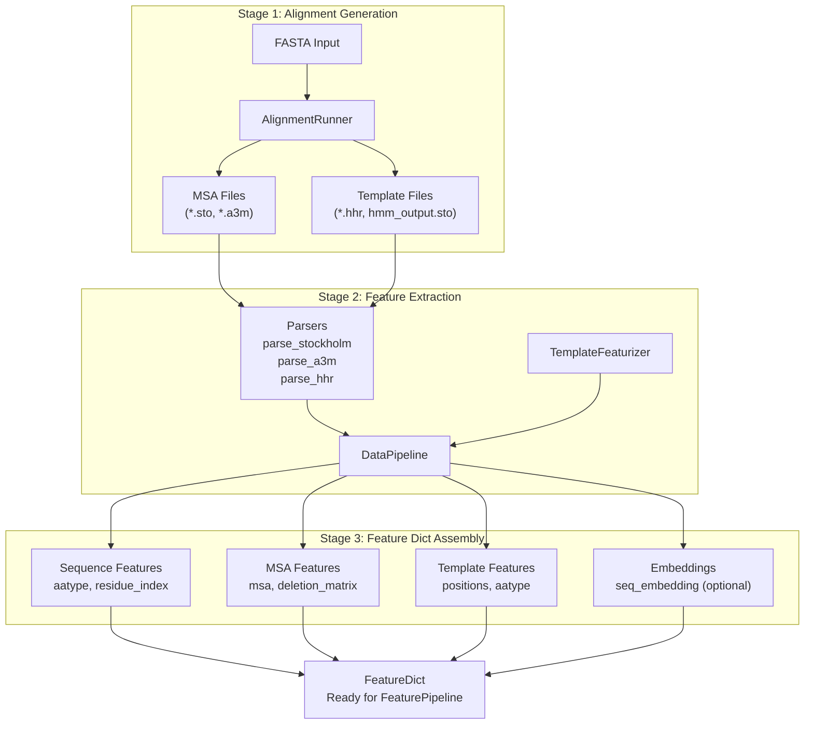

 **Sources**: [data\_pipeline\.py L1-L1161](https://github.com/aqlaboratory/openfold/blob/56da08ec/openfold/data/data_pipeline.py#L1-L1161) [run\_pretrained\_openfold\.py L63-L170](https://github.com/aqlaboratory/openfold/blob/56da08ec/run_pretrained_openfold.py#L63-L170)

---

## DataPipeline Class

 The `DataPipeline` class is the central orchestrator that converts alignment outputs and structural data into standardized feature dictionaries\.

### Class Structure

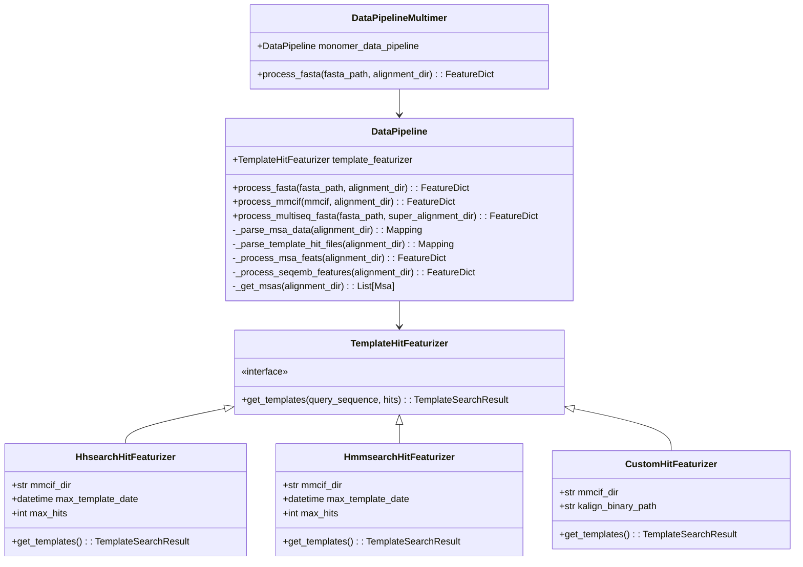

 **Sources**: [data\_pipeline\.py L706-L915](https://github.com/aqlaboratory/openfold/blob/56da08ec/openfold/data/data_pipeline.py#L706-L915) [data\_pipeline\.py L916-L1161](https://github.com/aqlaboratory/openfold/blob/56da08ec/openfold/data/data_pipeline.py#L916-L1161) [templates\.py L930-L1145](https://github.com/aqlaboratory/openfold/blob/56da08ec/openfold/data/templates.py#L930-L1145)

### Main Processing Methods

 The `DataPipeline` class provides three main entry points:

| Method | Input | Purpose | Used For |
| --- | --- | --- | --- |
| process\_fasta\(\) | FASTA file \+ alignment directory | Process single\-chain sequences | Monomer inference, SoloSeq mode |
| process\_mmcif\(\) | mmCIF object \+ alignment directory | Process structure with alignments | Training on PDB structures |
| process\_multiseq\_fasta\(\) | Multi\-sequence FASTA \+ alignments | Process multiple chains | Legacy multi\-chain \(pre\-multimer\) |

 **Sources**: [data\_pipeline\.py L864-L914](https://github.com/aqlaboratory/openfold/blob/56da08ec/openfold/data/data_pipeline.py#L864-L914) [data\_pipeline\.py L916-L999](https://github.com/aqlaboratory/openfold/blob/56da08ec/openfold/data/data_pipeline.py#L916-L999) [data\_pipeline\.py L1001-L1046](https://github.com/aqlaboratory/openfold/blob/56da08ec/openfold/data/data_pipeline.py#L1001-L1046)

---

## AlignmentRunner

 The `AlignmentRunner` class orchestrates external bioinformatics tools to generate MSAs and template search results\.

### Tool Configuration

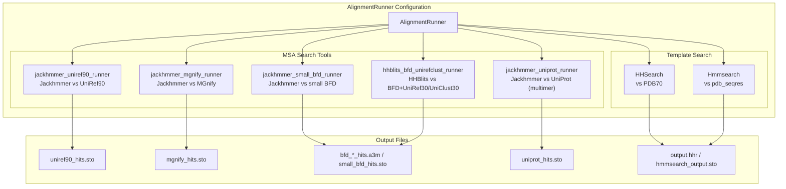

 **Sources**: [data\_pipeline\.py L334-L476](https://github.com/aqlaboratory/openfold/blob/56da08ec/openfold/data/data_pipeline.py#L334-L476)

### AlignmentRunner\.run\(\) Workflow

 The `run()` method executes the full alignment pipeline:

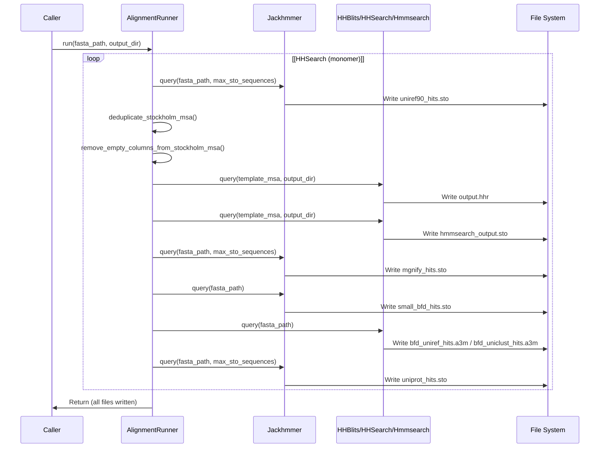

 **Sources**: [data\_pipeline\.py L477-L563](https://github.com/aqlaboratory/openfold/blob/56da08ec/openfold/data/data_pipeline.py#L477-L563)

### Integration with Inference

 In the inference script, alignment generation is handled by `precompute_alignments()`:

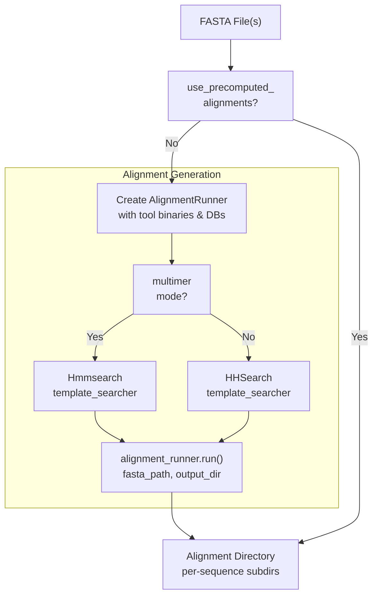

 **Sources**: [run\_pretrained\_openfold\.py L63-L123](https://github.com/aqlaboratory/openfold/blob/56da08ec/run_pretrained_openfold.py#L63-L123)

---

## Feature Generation Components

### Sequence Features

 Basic sequence\-level features are created by `make_sequence_features()`:

| Feature Name | Shape | Type | Description |
| --- | --- | --- | --- |
| aatype | \(num\_res, 21\) | float32 | One\-hot encoded amino acid types |
| residue\_index | \(num\_res,\) | int32 | Residue indices \(0 to num\_res\-1\) |
| seq\_length | \(num\_res,\) | int32 | Sequence length broadcast to all residues |
| sequence | \(1,\) | object | Raw amino acid sequence \(encoded bytes\) |
| domain\_name | \(1,\) | object | Sequence description/ID \(encoded bytes\) |
| between\_segment\_residues | \(num\_res,\) | int32 | Zeros \(used in multimer for chain breaks\) |

 **Sources**: [data\_pipeline\.py L111-L130](https://github.com/aqlaboratory/openfold/blob/56da08ec/openfold/data/data_pipeline.py#L111-L130)

### MSA Features

 MSA features are constructed by `make_msa_features()` from parsed MSA objects:

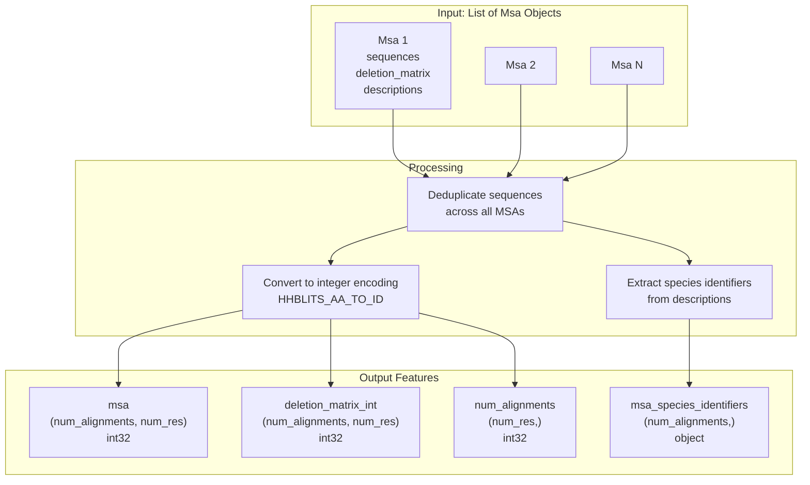

 **Sources**: [data\_pipeline\.py L224-L261](https://github.com/aqlaboratory/openfold/blob/56da08ec/openfold/data/data_pipeline.py#L224-L261)

### Template Features

 Template features are generated through a multi\-step process involving alignment to query and extraction of structural information:

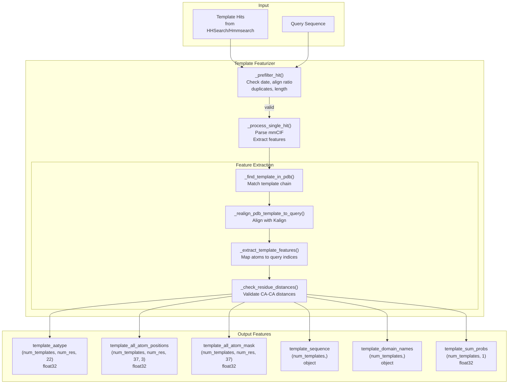

 **Sources**: [templates\.py L826-L930](https://github.com/aqlaboratory/openfold/blob/56da08ec/openfold/data/templates.py#L826-L930) [templates\.py L548-L706](https://github.com/aqlaboratory/openfold/blob/56da08ec/openfold/data/templates.py#L548-L706) [templates\.py L292-L364](https://github.com/aqlaboratory/openfold/blob/56da08ec/openfold/data/templates.py#L292-L364)

### Template Feature Details

 Templates contain structural information extracted from mmCIF files:

| Feature Name | Shape | Type | Description |
| --- | --- | --- | --- |
| template\_aatype | \(num\_templates, num\_res, 22\) | float32 | One\-hot amino acid types \(HHBLITS encoding\) |
| template\_all\_atom\_positions | \(num\_templates, num\_res, 37, 3\) | float32 | Atom37 coordinates, aligned to query |
| template\_all\_atom\_mask | \(num\_templates, num\_res, 37\) | float32 | Mask indicating which atoms are present |
| template\_domain\_names | \(num\_templates,\) | object | PDB\_ID \+ chain ID \(e\.g\., "4hhb\_a"\) |
| template\_sequence | \(num\_templates,\) | object | Aligned template sequence |
| template\_sum\_probs | \(num\_templates, 1\) | float32 | HHSearch sum of probabilities score |

 **Sources**: [templates\.py L83-L90](https://github.com/aqlaboratory/openfold/blob/56da08ec/openfold/data/templates.py#L83-L90) [templates\.py L93-L108](https://github.com/aqlaboratory/openfold/blob/56da08ec/openfold/data/templates.py#L93-L108)

### ESM\-1b Embeddings \(SoloSeq Mode\)

 When `seqemb_mode=True`, single\-sequence embeddings replace MSA features:

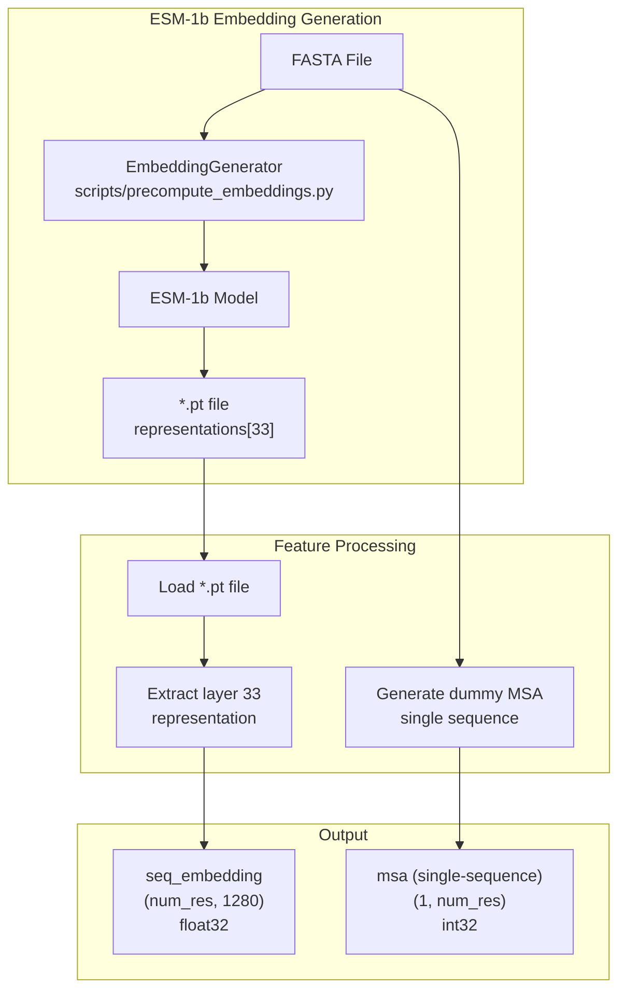

 **Sources**: [data\_pipeline\.py L849-L862](https://github.com/aqlaboratory/openfold/blob/56da08ec/openfold/data/data_pipeline.py#L849-L862) [data\_pipeline\.py L284-L294](https://github.com/aqlaboratory/openfold/blob/56da08ec/openfold/data/data_pipeline.py#L284-L294) [run\_pretrained\_openfold\.py L89-L97](https://github.com/aqlaboratory/openfold/blob/56da08ec/run_pretrained_openfold.py#L89-L97)

---

## Input Format Processing

### FASTA Processing

 The `process_fasta()` method handles single\-chain FASTA inputs:

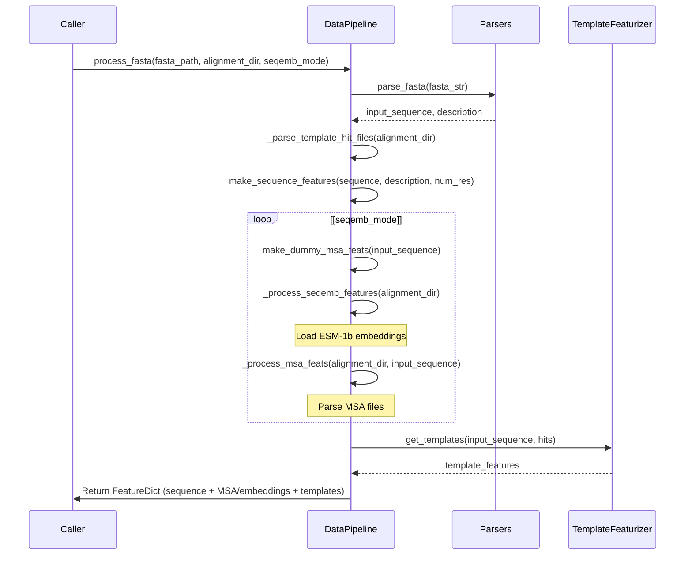

 **Sources**: [data\_pipeline\.py L864-L914](https://github.com/aqlaboratory/openfold/blob/56da08ec/openfold/data/data_pipeline.py#L864-L914)

### mmCIF Processing

 The `process_mmcif()` method processes structural data with alignments:

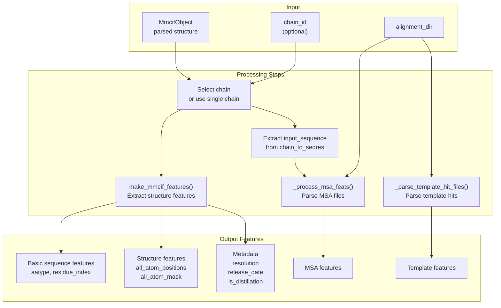

 **Sources**: [data\_pipeline\.py L916-L999](https://github.com/aqlaboratory/openfold/blob/56da08ec/openfold/data/data_pipeline.py#L916-L999) [data\_pipeline\.py L133-L166](https://github.com/aqlaboratory/openfold/blob/56da08ec/openfold/data/data_pipeline.py#L133-L166)

### Custom Template Processing

 For custom template inputs \(using `--use_custom_template`\), the pipeline uses `CustomHitFeaturizer`:

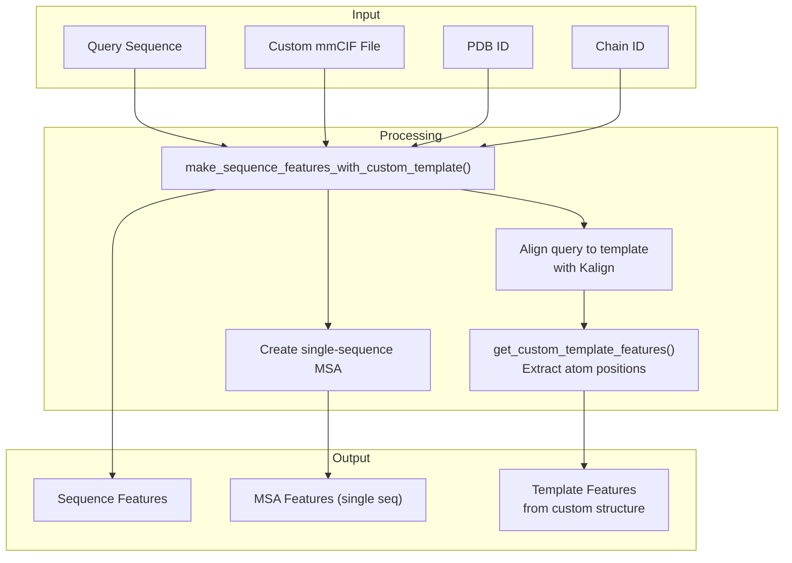

 **Sources**: [data\_pipeline\.py L297-L331](https://github.com/aqlaboratory/openfold/blob/56da08ec/openfold/data/data_pipeline.py#L297-L331) [templates\.py L1051-L1145](https://github.com/aqlaboratory/openfold/blob/56da08ec/openfold/data/templates.py#L1051-L1145) [run\_pretrained\_openfold\.py L210-L217](https://github.com/aqlaboratory/openfold/blob/56da08ec/run_pretrained_openfold.py#L210-L217)

---

## Feature Dictionary Structure

 The complete `FeatureDict` output contains the following feature groups:

### Complete Feature Set

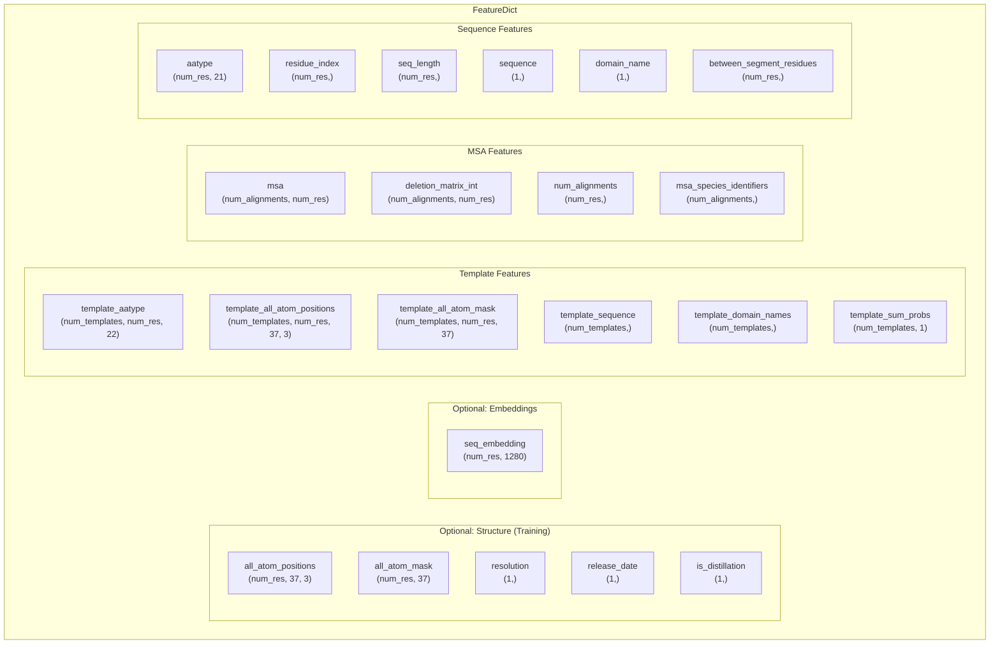

 **Sources**: [data\_pipeline\.py L111-L130](https://github.com/aqlaboratory/openfold/blob/56da08ec/openfold/data/data_pipeline.py#L111-L130) [data\_pipeline\.py L224-L261](https://github.com/aqlaboratory/openfold/blob/56da08ec/openfold/data/data_pipeline.py#L224-L261) [templates\.py L83-L108](https://github.com/aqlaboratory/openfold/blob/56da08ec/openfold/data/templates.py#L83-L108) [data\_pipeline\.py L133-L166](https://github.com/aqlaboratory/openfold/blob/56da08ec/openfold/data/data_pipeline.py#L133-L166)

### Feature Types by Use Case

| Use Case | Sequence | MSA | Templates | Embeddings | Structure |
| --- | --- | --- | --- | --- | --- |
| Standard Inference | ✓ | ✓ | ✓ | ✗ | ✗ |
| SoloSeq Inference | ✓ | ✓ \(dummy\) | ✓ | ✓ | ✗ |
| Custom Template | ✓ | ✓ \(dummy\) | ✓ | ✗ | ✗ |
| Training \(mmCIF\) | ✓ | ✓ | ✓ | ✗ | ✓ |
| Training \(PDB\) | ✓ | ✓ | ✓ | ✗ | ✓ |

---

## Monomer vs Multimer Pipeline

 The pipeline has different implementations for monomer and multimer predictions:

```mermaid
flowchart TD

MM_FASTA["Multi-chain FASTA"]
MM_ALIGN["Per-sequence alignment<br>directories"]
MM_DP["DataPipelineMultimer"]
MM_MONO["monomer_data_pipeline<br>DataPipeline"]
MM_PROC["Process each chain"]
MM_PAIR["Pair MSAs<br>add_assembly_features()"]
MM_FEAT["FeatureDict<br>multiple chains"]
M_FASTA["Single-chain FASTA"]
M_ALIGN["Per-sequence alignment<br>directories"]
M_DP["DataPipeline"]
M_FEAT["FeatureDict<br>single chain"]

subgraph subGraph1 ["Multimer Pipeline"]
    MM_FASTA
    MM_ALIGN
    MM_DP
    MM_MONO
    MM_PROC
    MM_PAIR
    MM_FEAT
    MM_FASTA --> MM_ALIGN
    MM_ALIGN --> MM_DP
    MM_DP --> MM_MONO
    MM_MONO --> MM_PROC
    MM_PROC --> MM_PAIR
    MM_PAIR --> MM_FEAT
end

subgraph subGraph0 ["Monomer Pipeline"]
    M_FASTA
    M_ALIGN
    M_DP
    M_FEAT
    M_FASTA --> M_ALIGN
    M_ALIGN --> M_DP
    M_DP --> M_FEAT
end
```

 **Sources**: [data\_pipeline\.py L706-L915](https://github.com/aqlaboratory/openfold/blob/56da08ec/openfold/data/data_pipeline.py#L706-L915) [data\_pipeline\.py L916-L1161](https://github.com/aqlaboratory/openfold/blob/56da08ec/openfold/data/data_pipeline.py#L916-L1161) [run\_pretrained\_openfold\.py L236-L242](https://github.com/aqlaboratory/openfold/blob/56da08ec/run_pretrained_openfold.py#L236-L242)

### Multimer\-Specific Processing

 The `DataPipelineMultimer` class extends the monomer pipeline:

 1. **Per\-Chain Processing**: Each chain is processed independently using `monomer_data_pipeline`
2. **Chain Feature Conversion**: `convert_monomer_features()` reshapes features for multimer models
3. **Assembly Features**: `add_assembly_features()` adds chain identity markers \(`asym_id`, `sym_id`, `entity_id`\)
4. **MSA Pairing**: Uses `pair_and_merge()` to create paired MSAs from UniProt hits

 See [Multimer\-Specific Processing](https://deepwiki.com/aqlaboratory/openfold/6.4-multimer-specific-processing) for detailed information\.

 **Sources**: [data\_pipeline\.py L1048-L1161](https://github.com/aqlaboratory/openfold/blob/56da08ec/openfold/data/data_pipeline.py#L1048-L1161) [data\_pipeline\.py L600-L624](https://github.com/aqlaboratory/openfold/blob/56da08ec/openfold/data/data_pipeline.py#L600-L624) [data\_pipeline\.py L649-L691](https://github.com/aqlaboratory/openfold/blob/56da08ec/openfold/data/data_pipeline.py#L649-L691)

---

## Integration with Inference Script

 The inference script \(`run_pretrained_openfold.py`\) orchestrates the data pipeline:

### Inference Workflow

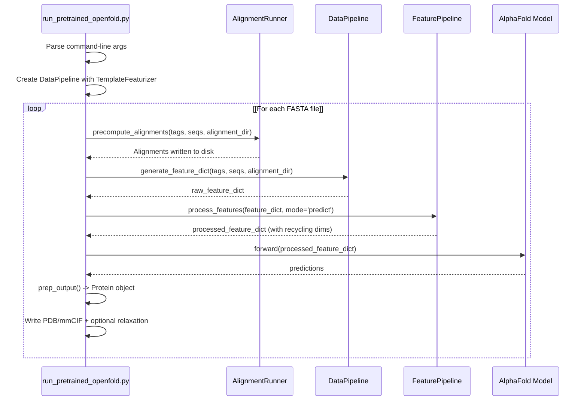

 **Sources**: [run\_pretrained\_openfold\.py L177-L395](https://github.com/aqlaboratory/openfold/blob/56da08ec/run_pretrained_openfold.py#L177-L395)

### Key Functions in Inference

| Function | Location | Purpose |
| --- | --- | --- |
| precompute\_alignments\(\) | run\_pretrained\_openfold\.py63\-123 | Create or load MSA/template alignments |
| generate\_feature\_dict\(\) | run\_pretrained\_openfold\.py129\-170 | Call DataPipeline to create FeatureDict |
| FeaturePipeline\.process\_features\(\) | Used via import | Apply data transforms and prepare for model |

---

## Parsing Infrastructure

 The pipeline relies on specialized parsers for different file formats:

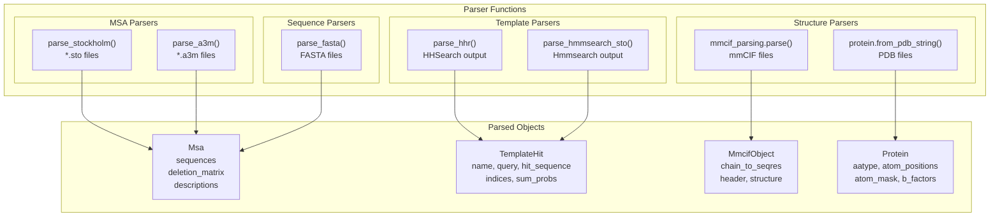

 **Sources**: [parsers\.py L1-L500](https://github.com/aqlaboratory/openfold/blob/56da08ec/openfold/data/parsers.py#L1-L500) [mmcif\_parsing\.py L1-L500](https://github.com/aqlaboratory/openfold/blob/56da08ec/openfold/data/mmcif_parsing.py#L1-L500)

---

## Helper Scripts

 Several utility scripts support the data pipeline:

### precompute\_alignments\.py

 Batch precomputation of alignments for datasets:

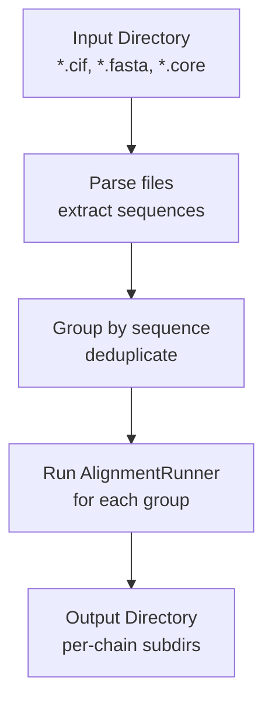

 **Usage**: Precompute alignments for training datasets to avoid redundant alignment searches\.

 **Sources**: [precompute\_alignments\.py L1-L268](https://github.com/aqlaboratory/openfold/blob/56da08ec/scripts/precompute_alignments.py#L1-L268)

### generate\_mmcif\_cache\.py

 Create metadata cache for mmCIF files:

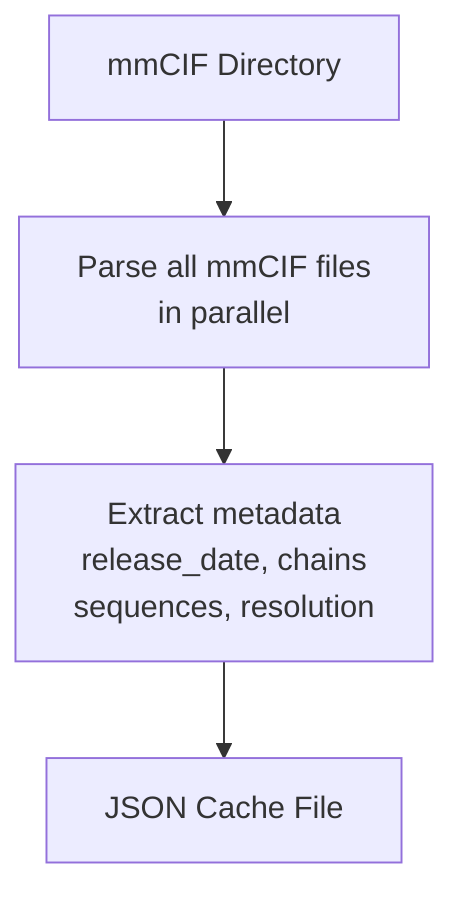

 **Usage**: Speed up dataset filtering by caching mmCIF metadata without parsing full structures every time\.

 **Sources**: [generate\_mmcif\_cache\.py L1-L108](https://github.com/aqlaboratory/openfold/blob/56da08ec/scripts/generate_mmcif_cache.py#L1-L108)

---

## Error Handling and Edge Cases

 The data pipeline includes extensive error handling:

### Template Processing Errors

| Error Class | Cause | Handling |
| --- | --- | --- |
| DateError | Template released after cutoff | Filtered in prefilter, logged |
| AlignRatioError | Insufficient alignment coverage | Filtered in prefilter, logged |
| DuplicateError | Template is subsequence of query | Filtered in prefilter, logged |
| LengthError | Template too short \(< 10 residues\) | Filtered in prefilter, logged |
| SequenceNotInTemplateError | Chain not found in mmCIF | Triggers realignment attempt |
| QueryToTemplateAlignError | Realignment failed or < 90% identity | Template skipped, warning logged |
| NoAtomDataInTemplateError | Missing atom coordinates | Template skipped, warning logged |
| TemplateAtomMaskAllZerosError | All atoms masked | Template skipped, warning logged |

 **Sources**: [templates\.py L62-L81](https://github.com/aqlaboratory/openfold/blob/56da08ec/openfold/data/templates.py#L62-L81) [templates\.py L220-L289](https://github.com/aqlaboratory/openfold/blob/56da08ec/openfold/data/templates.py#L220-L289) [templates\.py L780-L816](https://github.com/aqlaboratory/openfold/blob/56da08ec/openfold/data/templates.py#L780-L816)

### Empty MSA Handling

 When no MSA files are found, the pipeline creates a dummy single\-sequence MSA:

```
# If no MSAs found and input_sequence providedmsa_data["dummy"] = make_dummy_msa_obj(input_sequence)
```

 **Sources**: [data\_pipeline\.py L813-L830](https://github.com/aqlaboratory/openfold/blob/56da08ec/openfold/data/data_pipeline.py#L813-L830) [data\_pipeline\.py L284-L294](https://github.com/aqlaboratory/openfold/blob/56da08ec/openfold/data/data_pipeline.py#L284-L294)

---

## Performance Considerations

### MSA Size Limits

 The `AlignmentRunner` accepts parameters to limit MSA sizes:

 - `uniref_max_hits`: Default 10,000 sequences
- `mgnify_max_hits`: Default 5,000 sequences
- `uniprot_max_hits`: Default 50,000 sequences \(multimer\)

 These limits prevent excessive MSA sizes that would slow down downstream processing\.

 **Sources**: [data\_pipeline\.py L349-L351](https://github.com/aqlaboratory/openfold/blob/56da08ec/openfold/data/data_pipeline.py#L349-L351) [data\_pipeline\.py L413-L415](https://github.com/aqlaboratory/openfold/blob/56da08ec/openfold/data/data_pipeline.py#L413-L415)

### Parallelization

 The `AlignmentRunner` uses the `no_cpus` parameter to parallelize external tool execution \(jackhmmer, hhblits\)\. The `precompute_alignments.py` script further parallelizes across multiple sequences using threading\.

 **Sources**: [data\_pipeline\.py L418-L420](https://github.com/aqlaboratory/openfold/blob/56da08ec/openfold/data/data_pipeline.py#L418-L420) [precompute\_alignments\.py L223-L231](https://github.com/aqlaboratory/openfold/blob/56da08ec/scripts/precompute_alignments.py#L223-L231)

### File Caching

 The template extraction system uses `functools.lru_cache` on file reading operations to avoid redundant disk I/O when multiple hits reference the same mmCIF file:

```python
@functools.lru_cache(16, typed=False)def _read_file(path):    with open(path, 'r') as f:        file_data = f.read()    return file_data
```

 **Sources**: [templates\.py L818-L823](https://github.com/aqlaboratory/openfold/blob/56da08ec/openfold/data/templates.py#L818-L823)

---
*Source: [https://deepwiki.com/aqlaboratory/openfold/6.1-data-pipeline-and-feature-generation](https://deepwiki.com/aqlaboratory/openfold/6.1-data-pipeline-and-feature-generation) on DeepWiki*