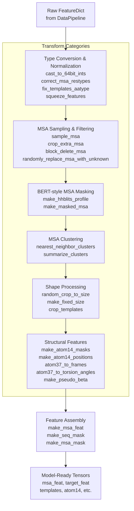
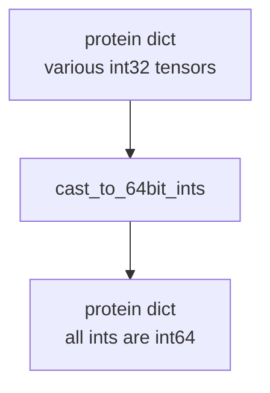
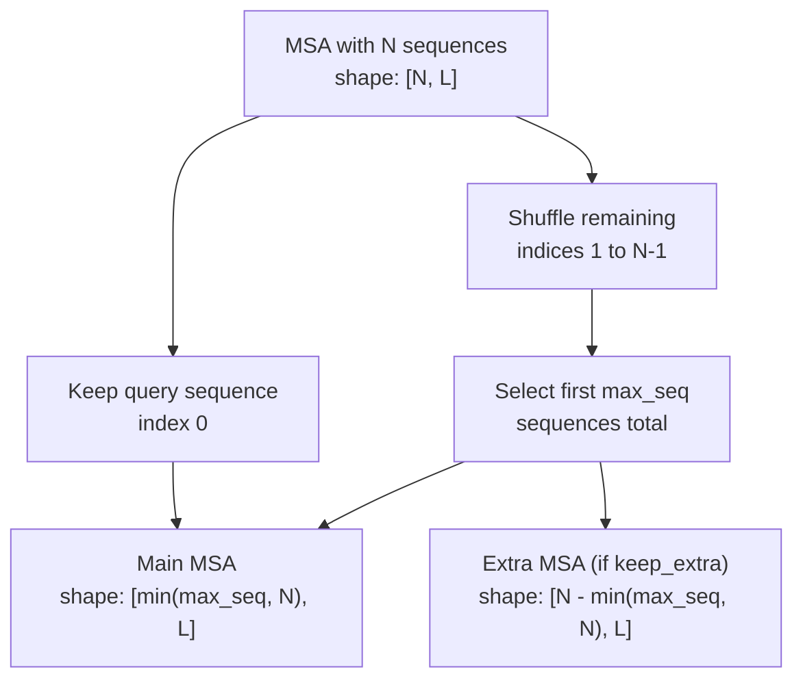
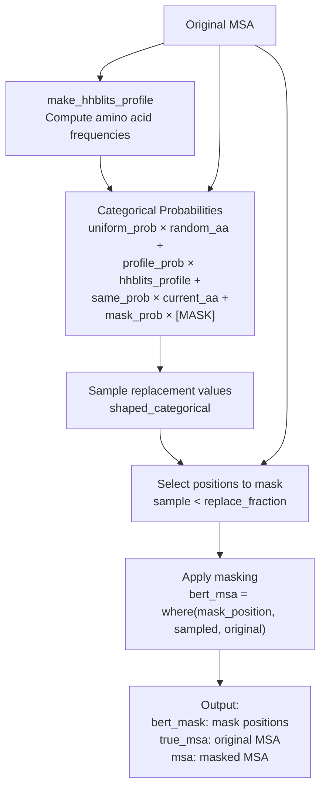
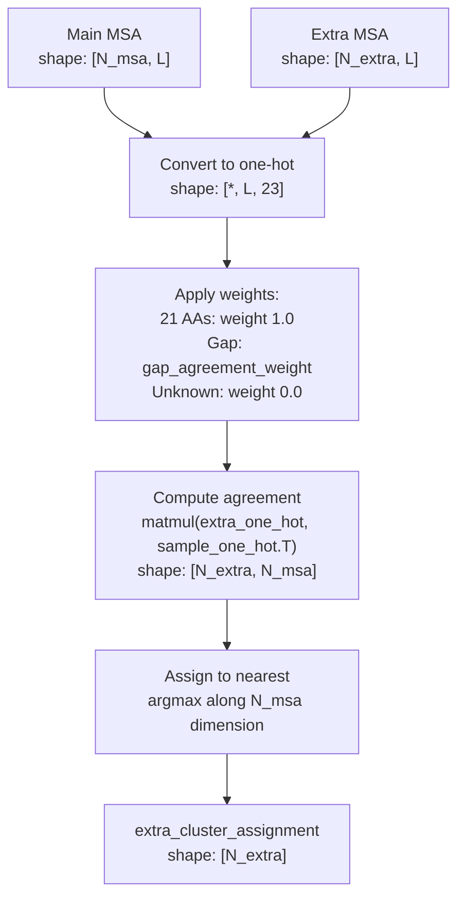
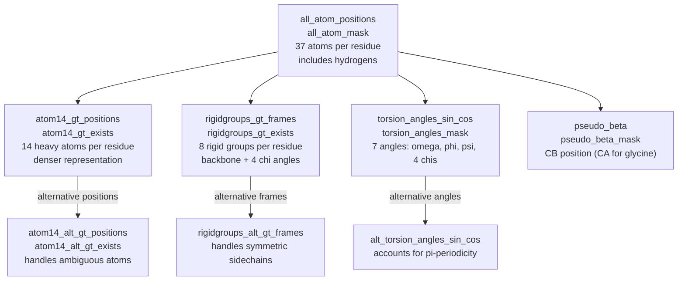
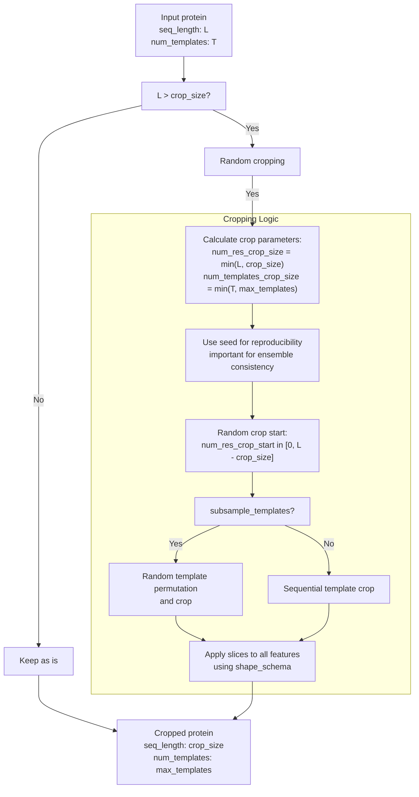
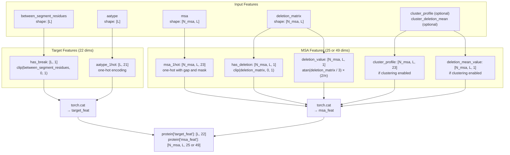

# Data Transforms and Augmentation

# Data Transforms and Augmentation

> **Relevant source files**
> - [openfold/data/data\_transforms\.py](https://github.com/aqlaboratory/openfold/blob/56da08ec/openfold/data/data_transforms.py)
> - [openfold/data/input\_pipeline\.py](https://github.com/aqlaboratory/openfold/blob/56da08ec/openfold/data/input_pipeline.py)
> - [tests/test\_data/features\.pkl](https://github.com/aqlaboratory/openfold/blob/56da08ec/tests/test_data/features.pkl)
> - [tests/test\_data\_transforms\.py](https://github.com/aqlaboratory/openfold/blob/56da08ec/tests/test_data_transforms.py)

## Purpose and Scope

 This page documents the data transformation system in OpenFold, which converts raw protein features into model\-ready tensors\. These transformations handle normalization, augmentation, masking, clustering, and structural feature extraction\. The transforms are applied after initial feature generation \(see [Data Pipeline and Feature Generation](https://deepwiki.com/aqlaboratory/openfold/6.1-data-pipeline-and-feature-generation)\) and before features are fed to the model\.

 The primary implementation is in [data\_transforms\.py L1-L1266](https://github.com/aqlaboratory/openfold/blob/56da08ec/openfold/data/data_transforms.py#L1-L1266) with pipeline composition logic in [input\_pipeline\.py L1-L213](https://github.com/aqlaboratory/openfold/blob/56da08ec/openfold/data/input_pipeline.py#L1-L213) For MSA\-specific processing, see [MSA and Template Processing](https://deepwiki.com/aqlaboratory/openfold/6.3-msa-and-template-processing)\.

---

## Transform Categories Overview

 Data transforms in OpenFold are organized into six functional categories:



 **Sources:** [data\_transforms\.py L1-L1266](https://github.com/aqlaboratory/openfold/blob/56da08ec/openfold/data/data_transforms.py#L1-L1266) [input\_pipeline\.py L23-L154](https://github.com/aqlaboratory/openfold/blob/56da08ec/openfold/data/input_pipeline.py#L23-L154)

---

## Type Conversion and Normalization

 These transforms ensure data types and residue encodings are consistent with OpenFold's internal representations\.

### cast\_to\_64bit\_ints

 Converts all `int32` tensors to `int64` to maintain consistency across the codebase\.



 **Implementation:** [data\_transforms\.py L46-L52](https://github.com/aqlaboratory/openfold/blob/56da08ec/openfold/data/data_transforms.py#L46-L52)

### correct\_msa\_restypes

 Maps MSA amino acid encodings from HHblits format to OpenFold's internal ordering using `rc.MAP_HHBLITS_AATYPE_TO_OUR_AATYPE`\.

| Input | Output |
| --- | --- |
| protein\["msa"\] \- MSA in HHblits encoding | protein\["msa"\] \- MSA in OpenFold encoding |
| Profile features \(if present\) | Reordered profile features |

 **Implementation:** [data\_transforms\.py L107-L129](https://github.com/aqlaboratory/openfold/blob/56da08ec/openfold/data/data_transforms.py#L107-L129)

### fix\_templates\_aatype

 Converts template amino acid types from one\-hot encoding to indices, then maps from HHblits to OpenFold ordering\.

 **Implementation:** [data\_transforms\.py L89-L104](https://github.com/aqlaboratory/openfold/blob/56da08ec/openfold/data/data_transforms.py#L89-L104)

### squeeze\_features

 Removes singleton dimensions from features like `domain_name`, `msa`, `num_alignments`, `seq_length`, and `sequence`\. Also converts one\-hot `aatype` to indices\.

 **Implementation:** [data\_transforms\.py L132-L160](https://github.com/aqlaboratory/openfold/blob/56da08ec/openfold/data/data_transforms.py#L132-L160)

 **Sources:** [data\_transforms\.py L46-L160](https://github.com/aqlaboratory/openfold/blob/56da08ec/openfold/data/data_transforms.py#L46-L160) [openfold/np/residue\_constants\.py](https://github.com/aqlaboratory/openfold/blob/56da08ec/openfold/np/residue_constants.py)

---

## MSA Sampling and Filtering

 These transforms control MSA size through sampling, cropping, and augmentation strategies\.

### sample\_msa

 Randomly samples up to `max_seq` sequences from the MSA while always keeping the query sequence \(index 0\) first\. Remaining sequences are optionally stored with `extra_` prefix\.



 **Function Signature:** `sample_msa(protein, max_seq, keep_extra, seed=None)`

 **Key Parameters:**

 - `max_seq`: Maximum number of sequences to retain
- `keep_extra`: If `True`, stores overflow in `extra_msa`, `extra_deletion_matrix`, etc\.
- `seed`: Random seed for reproducibility \(used in non\-resampling recycling mode\)

 **MSA Feature Names:** Defined in [data\_transforms\.py L36-L43](https://github.com/aqlaboratory/openfold/blob/56da08ec/openfold/data/data_transforms.py#L36-L43)

```
MSA_FEATURE_NAMES = [    "msa", "deletion_matrix", "msa_mask",     "msa_row_mask", "bert_mask", "true_msa",]
```

 **Implementation:** [data\_transforms\.py L185-L213](https://github.com/aqlaboratory/openfold/blob/56da08ec/openfold/data/data_transforms.py#L185-L213)

### crop\_extra\_msa

 Randomly crops `extra_msa` to a maximum size\. Used after clustering to limit memory usage\.

 **Implementation:** [data\_transforms\.py L228-L239](https://github.com/aqlaboratory/openfold/blob/56da08ec/openfold/data/data_transforms.py#L228-L239)

### delete\_extra\_msa

 Removes all `extra_*` features from the protein dictionary\. Used when extra MSA is not needed\.

 **Implementation:** [data\_transforms\.py L242-L246](https://github.com/aqlaboratory/openfold/blob/56da08ec/openfold/data/data_transforms.py#L242-L246)

### block\_delete\_msa

 Training\-only augmentation that randomly deletes contiguous blocks of MSA sequences to encourage robustness\.

 **Configuration Parameters:**

 - `msa_fraction_per_block`: Fraction of MSA sequences per block
- `num_blocks`: Number of blocks to delete
- `randomize_num_blocks`: Whether to randomize the number of blocks

 **Implementation:** [data\_transforms\.py L250-L286](https://github.com/aqlaboratory/openfold/blob/56da08ec/openfold/data/data_transforms.py#L250-L286)

### randomly\_replace\_msa\_with\_unknown

 Replaces a random fraction of MSA positions with the unknown amino acid token \('X', index 20\) for augmentation\. Skips gaps \(index 21\)\.

 **Implementation:** [data\_transforms\.py L163-L182](https://github.com/aqlaboratory/openfold/blob/56da08ec/openfold/data/data_transforms.py#L163-L182)

 **Sources:** [data\_transforms\.py L185-L286](https://github.com/aqlaboratory/openfold/blob/56da08ec/openfold/data/data_transforms.py#L185-L286) [test\_data\_transforms\.py L99-L138](https://github.com/aqlaboratory/openfold/blob/56da08ec/tests/test_data_transforms.py#L99-L138)

---

## BERT\-style MSA Masking

 OpenFold uses BERT\-style masking during training to predict masked positions, similar to masked language modeling\.

### Masking Pipeline



### make\_hhblits\_profile

 Computes per\-residue amino acid frequencies across all MSA sequences by averaging one\-hot encoded MSA\.

 **Output:** `protein["hhblits_profile"]` \- shape `[num_residues, 22]`

 **Implementation:** [data\_transforms\.py L439-L448](https://github.com/aqlaboratory/openfold/blob/56da08ec/openfold/data/data_transforms.py#L439-L448)

### make\_masked\_msa

 Creates BERT\-style masked MSA with configurable replacement strategy\.

 **Function Signature:** `make_masked_msa(protein, config, replace_fraction, seed)`

 **Configuration Parameters:**

| Parameter | Purpose | Typical Value |
| --- | --- | --- |
| uniform\_prob | Probability of replacing with random AA | 0\.1 |
| profile\_prob | Probability of sampling from profile | 0\.1 |
| same\_prob | Probability of keeping same AA | 0\.1 |
| Remaining probability | Replace with \[MASK\] token \(index 22\) | 0\.7 |

 **replace\_fraction:** Fraction of positions to mask \(typically 0\.15\)

 **Outputs:**

 - `protein["bert_mask"]`: Binary mask indicating masked positions
- `protein["true_msa"]`: Original unmasked MSA
- `protein["msa"]`: Masked MSA for input to model

 **Implementation:** [data\_transforms\.py L451-L501](https://github.com/aqlaboratory/openfold/blob/56da08ec/openfold/data/data_transforms.py#L451-L501)

 **Sources:** [data\_transforms\.py L439-L501](https://github.com/aqlaboratory/openfold/blob/56da08ec/openfold/data/data_transforms.py#L439-L501) [test\_data\_transforms\.py L170-L186](https://github.com/aqlaboratory/openfold/blob/56da08ec/tests/test_data_transforms.py#L170-L186)

---

## MSA Clustering

 Clustering reduces extra MSA sequences into summary statistics, improving computational efficiency\.

### nearest\_neighbor\_clusters

 Assigns each `extra_msa` sequence to its nearest neighbor in the main MSA using weighted Hamming distance\.



 **Key Parameter:** `gap_agreement_weight` \(default 0\.0\) \- weight given to gap positions in agreement calculation

 **Implementation:** [data\_transforms\.py L289-L323](https://github.com/aqlaboratory/openfold/blob/56da08ec/openfold/data/data_transforms.py#L289-L323)

### summarize\_clusters

 Computes cluster statistics: amino acid profile and average deletion values for each main MSA position\.

 **Algorithm:**

 1. Use `unsorted_segment_sum` to aggregate extra MSA sequences by cluster assignment
2. Compute `cluster_profile`: one\-hot frequencies including cluster center
3. Compute `cluster_deletion_mean`: average deletion matrix values

 **Outputs:**

 - `protein["cluster_profile"]`: shape `[N_msa, L, 23]`
- `protein["cluster_deletion_mean"]`: shape `[N_msa, L]`

 **Helper Function:** `unsorted_segment_sum` \- [data\_transforms\.py L326-L350](https://github.com/aqlaboratory/openfold/blob/56da08ec/openfold/data/data_transforms.py#L326-L350)

 **Implementation:** [data\_transforms\.py L353-L376](https://github.com/aqlaboratory/openfold/blob/56da08ec/openfold/data/data_transforms.py#L353-L376)

 **Sources:** [data\_transforms\.py L289-L376](https://github.com/aqlaboratory/openfold/blob/56da08ec/openfold/data/data_transforms.py#L289-L376) [test\_data\_transforms\.py L140-L149](https://github.com/aqlaboratory/openfold/blob/56da08ec/tests/test_data_transforms.py#L140-L149)

---

## Structural Feature Extraction

 These transforms convert atom37 coordinates into various geometric representations needed for training and loss computation\.

### Atom Representation Conversions



### make\_atom14\_masks

 Creates mapping tensors between atom37 and atom14 representations\.

 **Outputs:**

| Feature | Shape | Description |
| --- | --- | --- |
| atom14\_atom\_exists | \[N\_res, 14\] | Mask for which atom14 positions exist for each residue type |
| residx\_atom14\_to\_atom37 | \[N\_res, 14\] | Mapping from atom14 to atom37 indices |
| residx\_atom37\_to\_atom14 | \[N\_res, 37\] | Mapping from atom37 to atom14 indices |
| atom37\_atom\_exists | \[N\_res, 37\] | Mask for which atom37 positions exist for each residue type |

 **Implementation:** [data\_transforms\.py L607-L678](https://github.com/aqlaboratory/openfold/blob/56da08ec/openfold/data/data_transforms.py#L607-L678)

### make\_atom14\_positions

 Converts atom37 ground truth positions to atom14 representation using the mappings from `make_atom14_masks`\. Handles ambiguous atom naming for 7 residue types \(Arg, Asp, Glu, Leu, Phe, Tyr, Val\)\.

 **Key Features:**

 - Uses `batched_gather` to map atom37 positions to atom14
- Creates alternative positions for ambiguous atoms using renaming matrices
- Marks ambiguous atoms with `atom14_atom_is_ambiguous`

 **Outputs:**

 - `atom14_gt_positions`, `atom14_gt_exists`: Main ground truth
- `atom14_alt_gt_positions`, `atom14_alt_gt_exists`: Alternative ground truth for ambiguous atoms

 **Implementation:** [data\_transforms\.py L692-L792](https://github.com/aqlaboratory/openfold/blob/56da08ec/openfold/data/data_transforms.py#L692-L792)

### atom37\_to\_frames

 Computes rigid body frames for 8 rigid groups per residue: backbone, carbonyl, and up to 4 chi angle groups\.

 **Rigid Groups:**

 - Group 0: Backbone \(N\-CA\-C frame\)
- Group 3: Carbonyl \(CA\-C\-O frame\)
- Groups 4\-7: Chi angle frames \(when defined for the residue type\)

 **Algorithm:**

 1. Gather base atoms for each rigid group from atom37 positions
2. Use `Rigid.from_3_points` to construct frames from three points
3. Handle frame ambiguity for symmetric sidechains \(e\.g\., Asp, Glu\)

 **Outputs:**

 - `rigidgroups_gt_frames`: shape `[N_res, 8, 4, 4]` \(4x4 transformation matrices\)
- `rigidgroups_gt_exists`: frame validity mask
- `rigidgroups_group_exists`: group existence mask
- `rigidgroups_alt_gt_frames`: alternative frames for ambiguous groups

 **Implementation:** [data\_transforms\.py L795-L963](https://github.com/aqlaboratory/openfold/blob/56da08ec/openfold/data/data_transforms.py#L795-L963)

### atom37\_to\_torsion\_angles

 Computes backbone and sidechain torsion angles \(omega, phi, psi, chi1\-chi4\) from atom37 coordinates\.

 **Torsion Angles:**

 1. Pre\-omega: C\(i\-1\) \- CA\(i\-1\) \- C\(i\-1\) \- N\(i\)
2. Phi: C\(i\-1\) \- N\(i\) \- CA\(i\) \- C\(i\)
3. Psi: N\(i\) \- CA\(i\) \- C\(i\) \- N\(i\+1\)
4. Chi1\-4: Sidechain torsion angles \(residue\-dependent\)

 **Algorithm:**

 1. Gather atom positions for each torsion angle
2. Construct rigid frames from first three atoms
3. Transform fourth atom to frame coordinates
4. Extract sin/cos from transformed coordinates
5. Create alternative angles for symmetric groups

 **Outputs:**

 - `torsion_angles_sin_cos`: shape `[N_res, 7, 2]`
- `alt_torsion_angles_sin_cos`: alternative angles for pi\-periodic chis
- `torsion_angles_mask`: validity mask

 **Implementation:** [data\_transforms\.py L993-L1159](https://github.com/aqlaboratory/openfold/blob/56da08ec/openfold/data/data_transforms.py#L993-L1159)

### make\_pseudo\_beta

 Creates pseudo\-beta positions \(CB for all residues except glycine, which uses CA\)\.

 **Function Signature:** `make_pseudo_beta(protein, prefix="")`

 The `prefix` parameter allows this to work on either target features \(`prefix=""`\) or template features \(`prefix="template_"`\)\.

 **Implementation:** [data\_transforms\.py L408-L420](https://github.com/aqlaboratory/openfold/blob/56da08ec/openfold/data/data_transforms.py#L408-L420)

### Additional Structural Helpers

 **get\_backbone\_frames:** Extracts backbone frames from `rigidgroups_gt_frames[..., 0, :, :]`

 **get\_chi\_angles:** Extracts chi angles from `torsion_angles_sin_cos[..., 3:, :]`

 **Implementation:** [data\_transforms\.py L1162-L1179](https://github.com/aqlaboratory/openfold/blob/56da08ec/openfold/data/data_transforms.py#L1162-L1179)

 **Sources:** [data\_transforms\.py L388-L1179](https://github.com/aqlaboratory/openfold/blob/56da08ec/openfold/data/data_transforms.py#L388-L1179) [openfold/utils/rigid\_utils\.py](https://github.com/aqlaboratory/openfold/blob/56da08ec/openfold/utils/rigid_utils.py) [openfold/np/residue\_constants\.py](https://github.com/aqlaboratory/openfold/blob/56da08ec/openfold/np/residue_constants.py)

---

## Cropping and Padding

 These transforms adjust tensor sizes for batching and fixed\-size training\.

### random\_crop\_to\_size

 Randomly crops the protein to a specified size along the residue dimension\. Used during training to handle variable\-length proteins\.



 **Key Parameters:**

 - `crop_size`: Target number of residues
- `max_templates`: Maximum number of templates to keep
- `shape_schema`: Dictionary defining expected dimensions for each feature
- `subsample_templates`: Whether to randomly permute templates before cropping
- `seed`: Random seed for ensemble consistency

 **Special Handling:**

 - Always crops along `NUM_RES` dimension when present
- For template features, crops along template dimension \(axis 0\)
- Uses `use_clamped_fape` flag to control crop positioning \(for distillation\)

 **Implementation:** [data\_transforms\.py L1182-L1265](https://github.com/aqlaboratory/openfold/blob/56da08ec/openfold/data/data_transforms.py#L1182-L1265)

### make\_fixed\_size

 Pads features to fixed sizes for batching\. Uses `shape_schema` to determine which dimensions to pad\.

 **Pad Size Mapping:**

| Schema Dimension | Pad Size | Description |
| --- | --- | --- |
| NUM\_RES | num\_res | Number of residues |
| NUM\_MSA\_SEQ | msa\_cluster\_size | Number of MSA sequences |
| NUM\_EXTRA\_SEQ | extra\_msa\_size | Number of extra MSA sequences |
| NUM\_TEMPLATES | num\_templates | Number of templates |

 **Algorithm:**

 1. For each feature, match shape to schema
2. Compute padding needed: `pad_size[i] = pad_size_map[schema[i]] or original_size[i]`
3. Apply padding using `torch.nn.functional.pad`
4. Reshape to target size

 **Implementation:** [data\_transforms\.py L504-L540](https://github.com/aqlaboratory/openfold/blob/56da08ec/openfold/data/data_transforms.py#L504-L540)

### crop\_templates

 Simple template cropping to a maximum number, applied when not using fixed\-size mode\.

 **Implementation:** [data\_transforms\.py L599-L604](https://github.com/aqlaboratory/openfold/blob/56da08ec/openfold/data/data_transforms.py#L599-L604)

 **Sources:** [data\_transforms\.py L504-L1265](https://github.com/aqlaboratory/openfold/blob/56da08ec/openfold/data/data_transforms.py#L504-L1265) [openfold/config\.py](https://github.com/aqlaboratory/openfold/blob/56da08ec/openfold/config.py)

---

## Feature Assembly

 Final assembly transforms that create model\-ready feature tensors\.

### make\_msa\_feat

 Concatenates MSA\-related features into unified `msa_feat` and `target_feat` tensors\.



 **Feature Dimensions:**

 - **Without clustering:** `msa_feat` is 25\-dimensional \(23 \+ 1 \+ 1\)
- **With clustering:** `msa_feat` is 49\-dimensional \(23 \+ 1 \+ 1 \+ 23 \+ 1\)
- **target\_feat:** Always 22\-dimensional \(1 \+ 21\)

 **Extra MSA Features:** If `extra_deletion_matrix` is present, also creates:

 - `extra_has_deletion`
- `extra_deletion_value`

 **Implementation:** [data\_transforms\.py L543-L591](https://github.com/aqlaboratory/openfold/blob/56da08ec/openfold/data/data_transforms.py#L543-L591)

### Mask Creation Helpers

 **make\_seq\_mask:** Creates sequence mask \(all ones, later zero\-padded\)

 **make\_msa\_mask:** Creates MSA masks \(`msa_mask` and `msa_row_mask`\)

 **make\_template\_mask:** Creates template mask from template\_aatype shape

 **Implementation:** [data\_transforms\.py L61-L385](https://github.com/aqlaboratory/openfold/blob/56da08ec/openfold/data/data_transforms.py#L61-L385)

### select\_feat

 Filters protein dictionary to include only specified features, used before cropping\.

 **Implementation:** [data\_transforms\.py L594-L596](https://github.com/aqlaboratory/openfold/blob/56da08ec/openfold/data/data_transforms.py#L594-L596)

 **Sources:** [data\_transforms\.py L61-L596](https://github.com/aqlaboratory/openfold/blob/56da08ec/openfold/data/data_transforms.py#L61-L596)

---

## Transform Pipeline Composition

 Transforms are organized into two pipelines: non\-ensembled \(applied once\) and ensembled \(applied per recycling iteration\)\.

### Pipeline Architecture

```mermaid
flowchart TD

RAW["Raw FeatureDict"]
NE1["cast_to_64bit_ints"]
NE2["correct_msa_restypes"]
NE3["squeeze_features"]
NE4["make_seq_mask<br>make_msa_mask<br>make_hhblits_profile"]
NE5["Template processing<br>(if use_templates):<br>fix_templates_aatype<br>make_template_mask<br>make_pseudo_beta('template_')"]
NE6["make_atom14_masks"]
NE7["Supervised features<br>(if training):<br>make_atom14_positions<br>atom37_to_frames<br>atom37_to_torsion_angles<br>make_pseudo_beta('')<br>get_backbone_frames<br>get_chi_angles"]
E1["block_delete_msa<br>(training only)"]
E2["sample_msa<br>(keep_extra=True)"]
E3["make_masked_msa<br>(training only)"]
E4["nearest_neighbor_clusters<br>summarize_clusters<br>(if msa_cluster_features)"]
E5["crop_extra_msa or<br>delete_extra_msa"]
E6["make_msa_feat"]
E7["Fixed-size mode:<br>select_feat<br>random_crop_to_size<br>make_fixed_size"]
E8["Variable-size mode:<br>crop_templates"]
STACK["Stack along<br>recycling dimension"]
MODEL["Model Input Tensors<br>shape: [..., num_recycling + 1]"]

RAW --> NE1
NE7 --> E1
E8 --> STACK
STACK --> MODEL

subgraph subGraph1 ["Ensembled Pipeline (Per Recycling Iteration)"]
    E1
    E2
    E3
    E4
    E5
    E6
    E7
    E8
    E1 --> E2
    E2 --> E3
    E3 --> E4
    E4 --> E5
    E5 --> E6
    E6 --> E7
    E7 --> E8
end

subgraph subGraph0 ["Non-Ensembled Pipeline (Applied Once)"]
    NE1
    NE2
    NE3
    NE4
    NE5
    NE6
    NE7
    NE1 --> NE2
    NE2 --> NE3
    NE3 --> NE4
    NE4 --> NE5
    NE5 --> NE6
    NE6 --> NE7
end
```



### nonensembled\_transform\_fns

 Builds the non\-ensembled pipeline based on configuration\.

 **Function:** [input\_pipeline\.py L23-L67](https://github.com/aqlaboratory/openfold/blob/56da08ec/openfold/data/input_pipeline.py#L23-L67)

 **Pipeline Steps:**

 1. Type conversion and normalization
2. MSA masking setup
3. Template processing \(if enabled\)
4. Structural feature extraction \(if supervised\)

 **Configuration Dependencies:**

 - `common_cfg.use_templates`: Enable template processing
- `common_cfg.use_template_torsion_angles`: Add template torsion angles
- `mode_cfg.supervised`: Add ground truth structural features

### ensembled\_transform\_fns

 Builds the ensembled pipeline that is applied per recycling iteration\.

 **Function:** [input\_pipeline\.py L70-L154](https://github.com/aqlaboratory/openfold/blob/56da08ec/openfold/data/input_pipeline.py#L70-L154)

 **Pipeline Steps:**

| Step | Condition | Transforms |
| --- | --- | --- |
| MSA augmentation | mode\_cfg\.block\_delete\_msa | block\_delete\_msa |
| MSA sampling | Always | sample\_msa with seed control |
| BERT masking | "masked\_msa" in common\_cfg | make\_masked\_msa |
| Clustering | common\_cfg\.msa\_cluster\_features | nearest\_neighbor\_clusters, summarize\_clusters |
| Extra MSA cropping | Always | crop\_extra\_msa or delete\_extra\_msa |
| Feature assembly | Always | make\_msa\_feat |
| Shape processing | mode\_cfg\.fixed\_size | select\_feat, random\_crop\_to\_size, make\_fixed\_size |
| Template cropping | Not fixed\-size | crop\_templates |

 **Key Configuration Parameters:**

 - `max_msa_clusters`: Main MSA size
- `max_extra_msa`: Extra MSA size \(for clustering\)
- `max_templates`: Number of templates
- `crop_size`: Residue crop size \(fixed\-size mode\)
- `resample_msa_in_recycling`: Whether to resample MSA each iteration

### Ensemble Seed Control

 Ensemble seed determines randomness across recycling iterations:

```
ensemble_seed = random.randint(0, torch.iinfo(torch.int32).max) msa_seed = Noneif not common_cfg.resample_msa_in_recycling:    msa_seed = ensemble_seed
```

 If `resample_msa_in_recycling=False`, all recycling iterations see the same MSA sampling\. This is the typical setting\.

### process\_tensors\_from\_config

 Main entry point that composes both pipelines and applies them to create model inputs\.

 **Function:** [input\_pipeline\.py L157-L194](https://github.com/aqlaboratory/openfold/blob/56da08ec/openfold/data/input_pipeline.py#L157-L194)

 **Algorithm:**

 1. Generate ensemble seed
2. Apply non\-ensembled transforms once
3. Determine number of recycling iterations
4. Apply ensembled transforms for each iteration
5. Stack results along new ensemble dimension

 **Output:** Dictionary with all features stacked along final dimension `[..., num_recycling + 1]`

 **Sources:** [input\_pipeline\.py L23-L194](https://github.com/aqlaboratory/openfold/blob/56da08ec/openfold/data/input_pipeline.py#L23-L194)

---

## Utility Functions and Helpers

### curry1

 Decorator that enables partial function application, allowing transforms to be configured with parameters before being applied to data\.

```python
@curry1def sample_msa(protein, max_seq, keep_extra, seed=None):    # Function body    # Usage:transform = sample_msa(max_seq=512, keep_extra=True)protein = transform(protein)
```

 **Implementation:** [data\_transforms\.py L75-L81](https://github.com/aqlaboratory/openfold/blob/56da08ec/openfold/data/data_transforms.py#L75-L81)

### make\_one\_hot

 Converts integer tensor to one\-hot encoding\.

 **Implementation:** [data\_transforms\.py L55-L58](https://github.com/aqlaboratory/openfold/blob/56da08ec/openfold/data/data_transforms.py#L55-L58)

### shaped\_categorical

 Samples from categorical distribution while preserving tensor shape\.

 **Implementation:** [data\_transforms\.py L429-L436](https://github.com/aqlaboratory/openfold/blob/56da08ec/openfold/data/data_transforms.py#L429-L436)

### unsorted\_segment\_sum

 Aggregates tensor values by segment IDs, used in clustering\. Similar to TensorFlow's `tf.unsorted_segment_sum`\.

 **Implementation:** [data\_transforms\.py L326-L350](https://github.com/aqlaboratory/openfold/blob/56da08ec/openfold/data/data_transforms.py#L326-L350)

### compose

 Composes a list of functions into a single function, applying them sequentially\.

 **Implementation:** [input\_pipeline\.py L197-L201](https://github.com/aqlaboratory/openfold/blob/56da08ec/openfold/data/input_pipeline.py#L197-L201)

 **Sources:** [data\_transforms\.py L55-L436](https://github.com/aqlaboratory/openfold/blob/56da08ec/openfold/data/data_transforms.py#L55-L436) [input\_pipeline\.py L197-L201](https://github.com/aqlaboratory/openfold/blob/56da08ec/openfold/data/input_pipeline.py#L197-L201)

---

## Training vs\. Inference Differences

 Transforms are applied differently during training and inference based on configuration:

| Transform | Training | Inference | Controlled By |
| --- | --- | --- | --- |
| block\_delete\_msa | ✓ | ✗ | mode\_cfg\.block\_delete\_msa |
| make\_masked\_msa | ✓ | ✗ | "masked\_msa" in common\_cfg |
| Structural features | ✓ | ✗ | mode\_cfg\.supervised |
| Fixed\-size padding | ✓ | ✗ | mode\_cfg\.fixed\_size |
| Random cropping | ✓ | ✗ | mode\_cfg\.fixed\_size |
| MSA resampling | Configurable | ✗ | common\_cfg\.resample\_msa\_in\_recycling |

 **Training Mode:** [openfold/config\.py](https://github.com/aqlaboratory/openfold/blob/56da08ec/openfold/config.py) defines `train` mode configuration

 - Supervised features enabled
- Fixed\-size batching with random cropping
- MSA augmentation \(masking, block deletion\)
- Typically smaller `max_msa_clusters` \(128\-512\)

 **Inference Mode:** [openfold/config\.py](https://github.com/aqlaboratory/openfold/blob/56da08ec/openfold/config.py) defines `eval` mode configuration

 - No supervised features
- Variable\-size \(no cropping/padding\)
- No MSA augmentation
- Can use larger `max_msa_clusters` \(up to 5120\)

 **Sources:** [input\_pipeline\.py L23-L154](https://github.com/aqlaboratory/openfold/blob/56da08ec/openfold/data/input_pipeline.py#L23-L154) [openfold/config\.py](https://github.com/aqlaboratory/openfold/blob/56da08ec/openfold/config.py)

---

## Example Transform Sequences

### Training Transform Sequence

```
Raw Features
    ↓ cast_to_64bit_ints
    ↓ correct_msa_restypes
    ↓ squeeze_features
    ↓ make_seq_mask, make_msa_mask, make_hhblits_profile
    ↓ fix_templates_aatype (if templates)
    ↓ make_atom14_masks
    ↓ make_atom14_positions, atom37_to_frames, atom37_to_torsion_angles
    ↓ make_pseudo_beta, get_backbone_frames, get_chi_angles
── [Ensembled per iteration] ──
    ↓ block_delete_msa (stochastic)
    ↓ sample_msa (keep_extra=True)
    ↓ make_masked_msa (BERT masking)
    ↓ nearest_neighbor_clusters, summarize_clusters
    ↓ crop_extra_msa
    ↓ make_msa_feat
    ↓ select_feat, random_crop_to_size
    ↓ make_fixed_size (pad to batch size)
    ↓ [Stack along recycling dimension]
Model Input
```

### Inference Transform Sequence

```
Raw Features
    ↓ cast_to_64bit_ints
    ↓ correct_msa_restypes
    ↓ squeeze_features
    ↓ make_seq_mask, make_msa_mask, make_hhblits_profile
    ↓ fix_templates_aatype (if templates)
    ↓ make_atom14_masks
── [Ensembled per iteration] ──
    ↓ sample_msa (keep_extra=True, fixed seed)
    ↓ nearest_neighbor_clusters, summarize_clusters
    ↓ crop_extra_msa
    ↓ make_msa_feat
    ↓ crop_templates
    ↓ [Stack along recycling dimension]
Model Input
```

 **Sources:** [input\_pipeline\.py L23-L194](https://github.com/aqlaboratory/openfold/blob/56da08ec/openfold/data/input_pipeline.py#L23-L194) [data\_transforms\.py L1-L1266](https://github.com/aqlaboratory/openfold/blob/56da08ec/openfold/data/data_transforms.py#L1-L1266)

---
*Source: [https://deepwiki.com/aqlaboratory/openfold/6.2-data-transforms-and-augmentation](https://deepwiki.com/aqlaboratory/openfold/6.2-data-transforms-and-augmentation) on DeepWiki*