# Evoformer Stack

# Evoformer Stack

> **Relevant source files**
> - [openfold/config\.py](https://github.com/aqlaboratory/openfold/blob/56da08ec/openfold/config.py)
> - [openfold/model/dropout\.py](https://github.com/aqlaboratory/openfold/blob/56da08ec/openfold/model/dropout.py)
> - [openfold/model/evoformer\.py](https://github.com/aqlaboratory/openfold/blob/56da08ec/openfold/model/evoformer.py)
> - [openfold/model/model\.py](https://github.com/aqlaboratory/openfold/blob/56da08ec/openfold/model/model.py)
> - [openfold/model/template\.py](https://github.com/aqlaboratory/openfold/blob/56da08ec/openfold/model/template.py)
> - [openfold/model/triangular\_attention\.py](https://github.com/aqlaboratory/openfold/blob/56da08ec/openfold/model/triangular_attention.py)
> - [openfold/utils/tensor\_utils\.py](https://github.com/aqlaboratory/openfold/blob/56da08ec/openfold/utils/tensor_utils.py)

 The Evoformer Stack is the central neural network component of AlphaFold 2, responsible for jointly processing Multiple Sequence Alignment \(MSA\) and pair representations to extract evolutionary and structural information for protein structure prediction\. This page explains the architecture, components, and implementation details of the Evoformer Stack in the OpenFold codebase\.

 For information about the Structure Module that transforms the Evoformer outputs into 3D coordinates, see [Structure Module](https://deepwiki.com/aqlaboratory/openfold/5.2-alphafold-model-overview)\.

## Overview

 The Evoformer Stack processes two main tensor representations:

 - An MSA representation capturing evolutionary information \(shape: `[batch, N_seq, N_res, c_m]`\)
- A pair representation capturing residue\-pair interactions \(shape: `[batch, N_res, N_res, c_z]`\)

 Through a series of attention and transformation operations, the Evoformer iteratively refines these representations, enabling accurate protein structure prediction\.

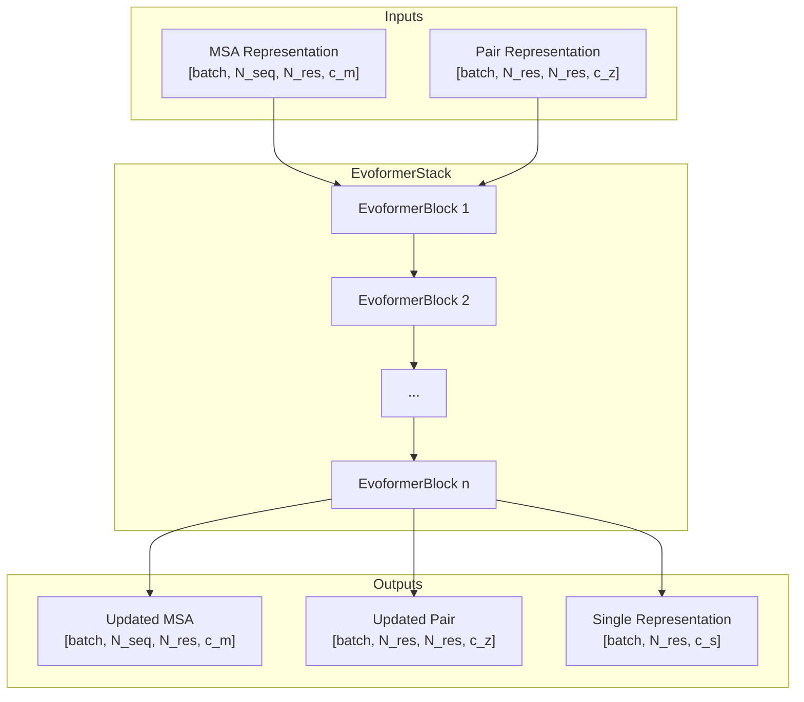

 Sources:

 - [evoformer\.py L124-L134](https://github.com/aqlaboratory/openfold/blob/56da08ec/openfold/model/evoformer.py#L124-L134)
- [model\.py L416-L434](https://github.com/aqlaboratory/openfold/blob/56da08ec/openfold/model/model.py#L416-L434)

## Evoformer Stack Architecture

 The Evoformer Stack consists of a series of identical EvoformerBlocks that process MSA and pair representations\. The stack architecture is defined in `EvoformerStack` class:

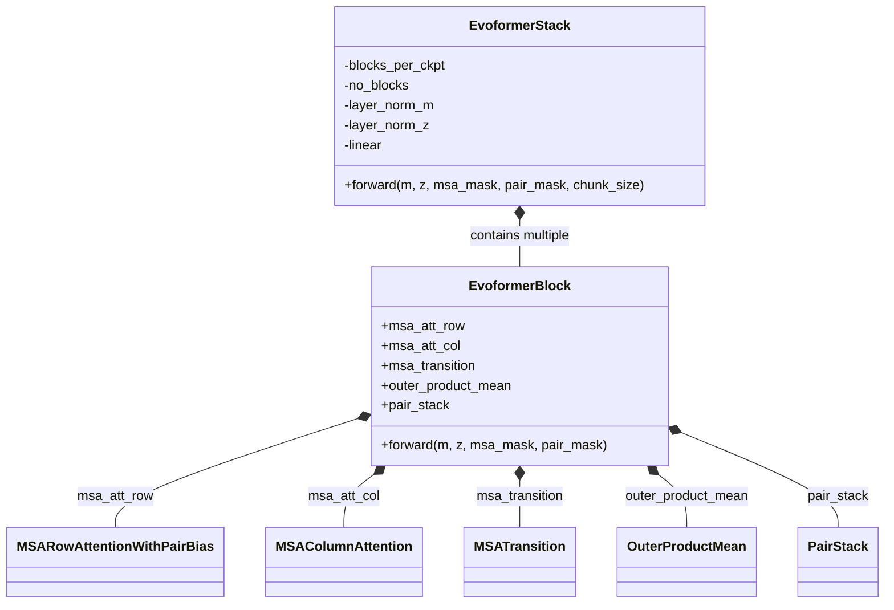

 Sources:

 - [evoformer\.py L377-L552](https://github.com/aqlaboratory/openfold/blob/56da08ec/openfold/model/evoformer.py#L377-L552)
- [model\.py L123-L134](https://github.com/aqlaboratory/openfold/blob/56da08ec/openfold/model/model.py#L123-L134)

### Key Parameters and Configuration

 The Evoformer Stack has several important parameters that control its size and behavior:

| Parameter | Description | Default Value |
| --- | --- | --- |
| c\_m | MSA channel dimension | 256 |
| c\_z | Pair channel dimension | 128 |
| c\_s | Single representation dimension | 384 |
| no\_heads\_msa | Number of MSA attention heads | 8 |
| no\_heads\_pair | Number of pair attention heads | 4 |
| no\_blocks | Number of Evoformer blocks | 48 |
| transition\_n | Multiplier for transition hidden dimension | 4 |
| blocks\_per\_ckpt | Number of blocks per activation checkpoint | Varies |
| clear\_cache\_between\_blocks | Whether to clear attention cache | False |

 Sources:

 - [config\.py L590-L611](https://github.com/aqlaboratory/openfold/blob/56da08ec/openfold/config.py#L590-L611)
- [evoformer\.py L257-L264](https://github.com/aqlaboratory/openfold/blob/56da08ec/openfold/model/evoformer.py#L257-L264)

## EvoformerBlock

 Each EvoformerBlock contains a series of operations that update the MSA and pair representations\. These operations include various forms of attention and information exchange between the representations\.

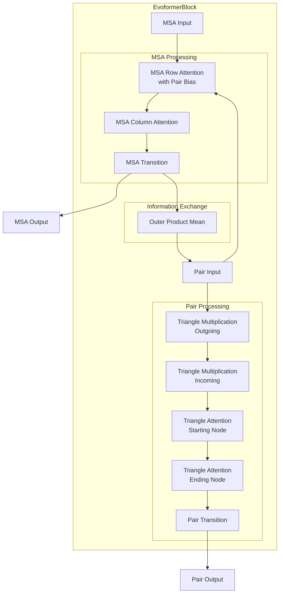

 Sources:

 - [evoformer\.py L397-L552](https://github.com/aqlaboratory/openfold/blob/56da08ec/openfold/model/evoformer.py#L397-L552)

### Processing Flow

 The EvoformerBlock combines several mechanisms to process the MSA and pair representations:

 1. **MSA Processing**:  - **MSA Row Attention with Pair Bias**: Applies attention along rows of the MSA, biased by the pair representation - **MSA Column Attention**: Applies attention along columns of the MSA - **MSA Transition**: A feed\-forward network applied to the MSA
2. **Information Exchange**:  - **Outer Product Mean**: Computes the outer product of MSA features and aggregates, updating the pair representation
3. **Pair Processing \(PairStack\)**:  - **Triangle Multiplication**: Outgoing and incoming variants for updating pair information - **Triangle Attention**: Starting and ending node variants for attending to different parts of the pair matrix - **Pair Transition**: A feed\-forward network applied to the pair representation

 The order of operations can be customized, with the `opm_first` parameter determining whether the Outer Product Mean is applied before or after MSA attention\.

 Sources:

 - [evoformer\.py L423-L552](https://github.com/aqlaboratory/openfold/blob/56da08ec/openfold/model/evoformer.py#L423-L552)
- [evoformer\.py L123-L267](https://github.com/aqlaboratory/openfold/blob/56da08ec/openfold/model/evoformer.py#L123-L267)

## MSA Attention Mechanisms

 The Evoformer uses several attention mechanisms to process the MSA representation:

### MSA Row Attention with Pair Bias

 This mechanism applies attention along the rows of the MSA, with the attention being biased by the pair representation\. This allows pair information to influence how MSA rows attend to each other\.

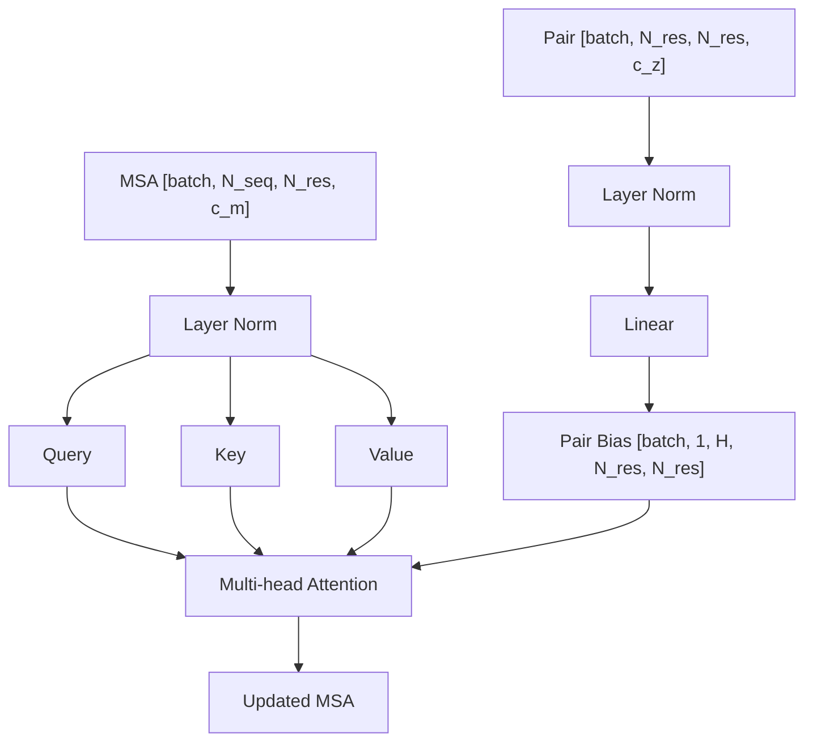

 Sources:

 - [msa\.py L295-L321](https://github.com/aqlaboratory/openfold/blob/56da08ec/openfold/model/msa.py#L295-L321)
- [primitives\.py L340-L547](https://github.com/aqlaboratory/openfold/blob/56da08ec/openfold/model/primitives.py#L340-L547)

### MSA Column Attention

 This attention mechanism operates along the columns of the MSA, allowing residues to attend to each other across sequences\. This helps to capture evolutionary conservation patterns\.

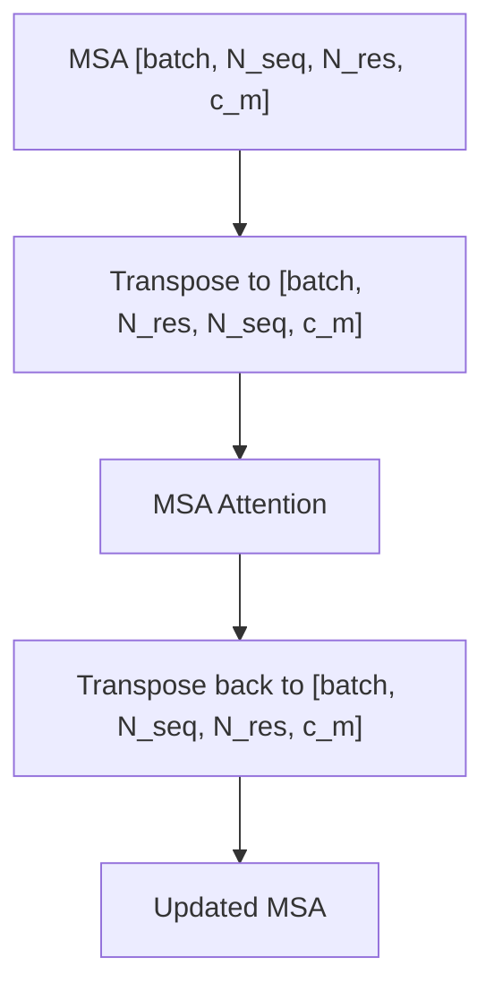

 Sources:

 - [msa\.py L324-L397](https://github.com/aqlaboratory/openfold/blob/56da08ec/openfold/model/msa.py#L324-L397)

### MSA Transition

 After the attention mechanisms, a feed\-forward network is applied to the MSA representation to introduce non\-linearity:

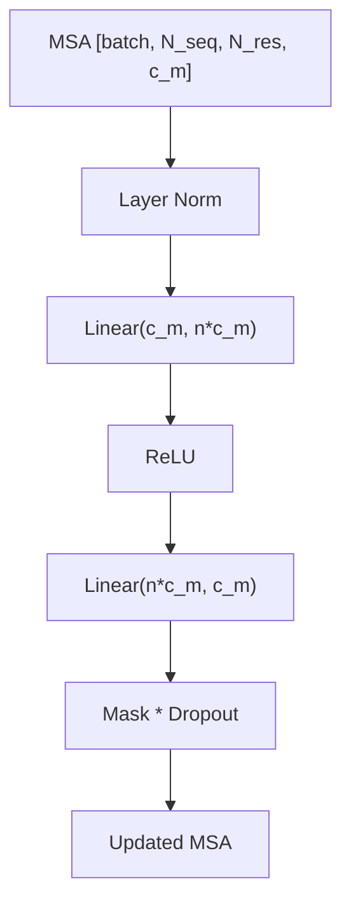

 Sources:

 - [evoformer\.py L48-L120](https://github.com/aqlaboratory/openfold/blob/56da08ec/openfold/model/evoformer.py#L48-L120)

## Pair Processing Components

 The pair representation is processed through a series of specialized operations in the `PairStack` class:

### Triangle Multiplication

 Triangle multiplication is a unique operation that updates the pair representation by multiplying it with itself in different ways:

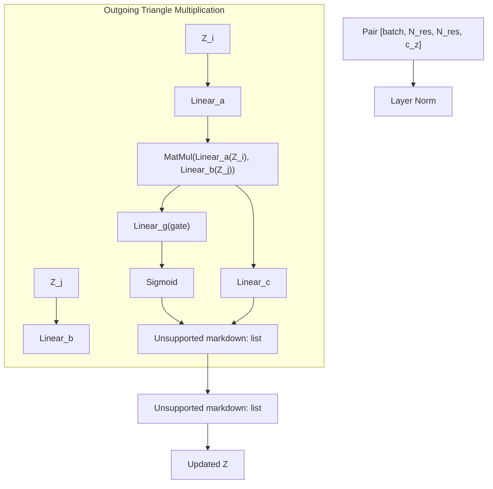

 Sources:

 - [openfold/model/triangular\_multiplicative\_update\.py](https://github.com/aqlaboratory/openfold/blob/56da08ec/openfold/model/triangular_multiplicative_update.py)

### Triangle Attention

 Triangle attention is a specialized form of attention that operates on the pair representation, with two variants:

 1. **Triangle Attention Starting Node**: Attention where each position attends to all other positions \(operating row\-wise\)
2. **Triangle Attention Ending Node**: Attention where all positions attend to each position \(operating column\-wise\)

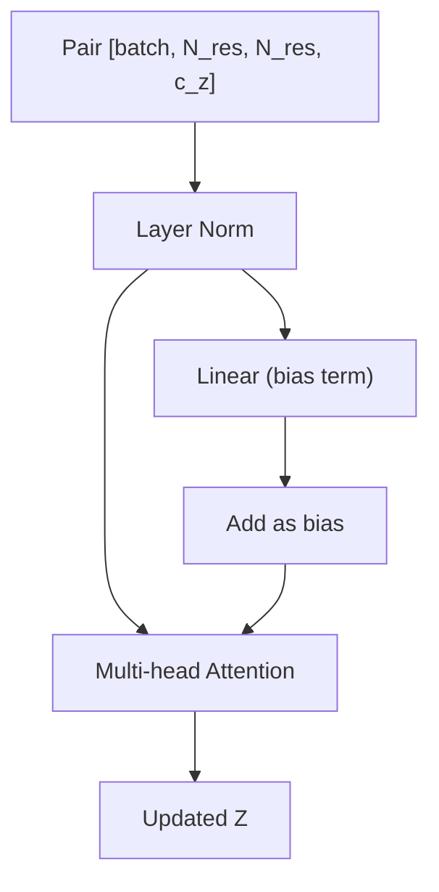

 Sources:

 - [triangular\_attention\.py L31-L164](https://github.com/aqlaboratory/openfold/blob/56da08ec/openfold/model/triangular_attention.py#L31-L164)

### Pair Transition

 Similar to the MSA transition, a feed\-forward network is applied to the pair representation:

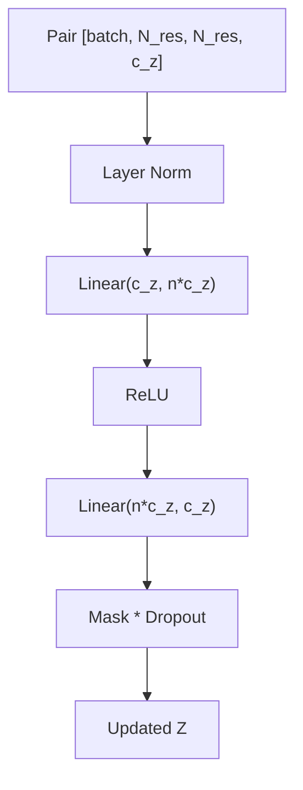

 Sources:

 - [pair\_transition\.py L24-L99](https://github.com/aqlaboratory/openfold/blob/56da08ec/openfold/model/pair_transition.py#L24-L99)

## Information Exchange: Outer Product Mean

 The Outer Product Mean is a critical operation that allows information to flow from the MSA representation to the pair representation:

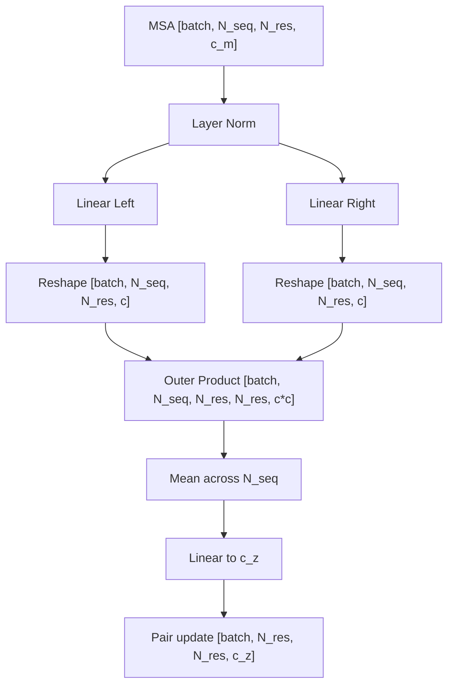

 Sources:

 - [openfold/model/outer\_product\_mean\.py](https://github.com/aqlaboratory/openfold/blob/56da08ec/openfold/model/outer_product_mean.py)

## Single Representation Output

 In addition to updating the MSA and pair representations, the EvoformerStack produces a single representation that's used by the Structure Module:

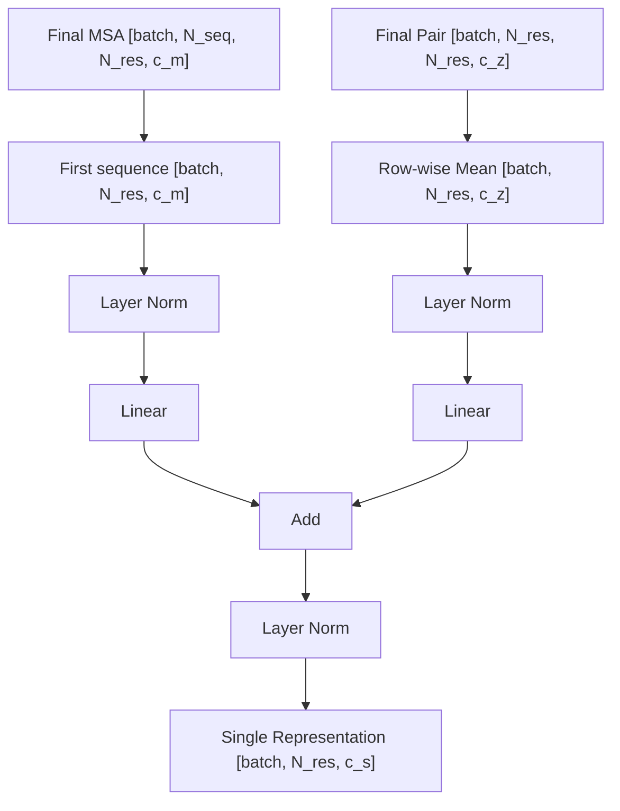

 Sources:

 - [evoformer\.py L248-L264](https://github.com/aqlaboratory/openfold/blob/56da08ec/openfold/model/evoformer.py#L248-L264)

## Memory Optimization and Performance

 The Evoformer Stack is the most computationally intensive part of AlphaFold 2\. OpenFold implements several optimizations to improve performance and reduce memory usage:

### Chunking

 Operations can be chunked to reduce peak memory usage:

```
# Chunking allows processing large tensors in smaller piecesif chunk_size is not None:    z = self._chunk(z, biases, chunk_size)else:    z = self.mha(q_x=z, kv_x=z, biases=biases)
```

 Sources:

 - [triangular\_attention\.py L60-L147](https://github.com/aqlaboratory/openfold/blob/56da08ec/openfold/model/triangular_attention.py#L60-L147)

### Activation Checkpointing

 The `blocks_per_ckpt` parameter controls how many blocks are included in each activation checkpoint, trading memory for computation:

```
# Checkpoint blocks to save memory during backpropagationz, = checkpoint_blocks(    blocks=blocks,    args=(z,),    blocks_per_ckpt=self.blocks_per_ckpt if self.training else None,)
```

 Sources:

 - [evoformer\.py L590-L607](https://github.com/aqlaboratory/openfold/blob/56da08ec/openfold/model/evoformer.py#L590-L607)

### Memory\-Efficient Attention

 OpenFold provides multiple options for efficient attention computation:

 1. Memory\-efficient kernel \(`use_memory_efficient_kernel`\)
2. DeepSpeed Evoformer attention \(`use_deepspeed_evo_attention`\)
3. Low\-memory attention \(`use_lma`\)
4. FlashAttention \(`use_flash`\)

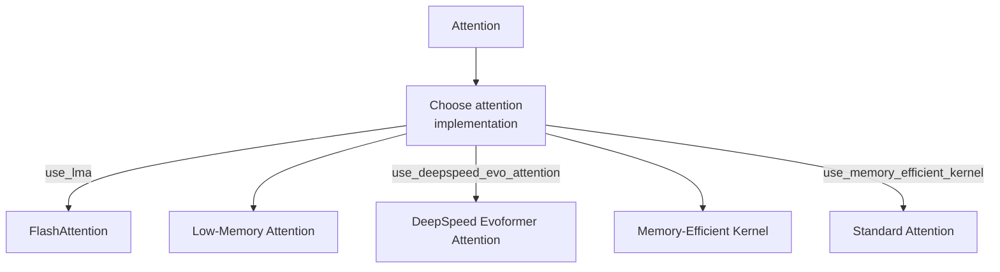

 Sources:

 - [primitives\.py L477-L545](https://github.com/aqlaboratory/openfold/blob/56da08ec/openfold/model/primitives.py#L477-L545)
- [config\.py L465-L486](https://github.com/aqlaboratory/openfold/blob/56da08ec/openfold/config.py#L465-L486)

## Integration with the Model

 The Evoformer Stack is a central component of the AlphaFold model\. Here's how it's integrated with the rest of the model:

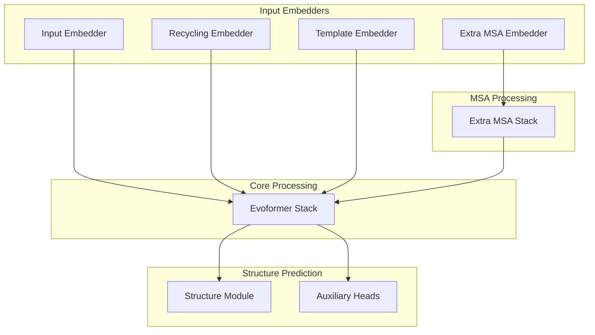

 Sources:

 - [model\.py L65-L461](https://github.com/aqlaboratory/openfold/blob/56da08ec/openfold/model/model.py#L65-L461)

### Model Execution Flow

 1. Input representations are generated by the InputEmbedder
2. Previous iteration outputs are incorporated via the RecyclingEmbedder
3. Template information is incorporated via the TemplateEmbedder
4. Extra MSA information is processed by the ExtraMSAStack
5. The Evoformer Stack processes all this information
6. The Structure Module converts the outputs into 3D coordinates
7. Auxiliary heads predict additional properties

 Sources:

 - [model\.py L209-L476](https://github.com/aqlaboratory/openfold/blob/56da08ec/openfold/model/model.py#L209-L476)

## Special Modes and Options

### Sequence Embedding Mode

 For single\-sequence predictions without MSAs, OpenFold provides a sequence embedding mode that disables column attention:

```
# Specifically, seqemb mode does not use column attentionself.no_column_attention = no_column_attention
```

 Sources:

 - [evoformer\.py L413-L421](https://github.com/aqlaboratory/openfold/blob/56da08ec/openfold/model/evoformer.py#L413-L421)
- [config\.py L924-L954](https://github.com/aqlaboratory/openfold/blob/56da08ec/openfold/config.py#L924-L954)

### Multimer Mode

 For predicting multi\-chain protein complexes, specialized multimer configurations are used:

```
# Multimer-specific configurationc.model.evoformer_stack.fuse_projection_weights = True if re.fullmatch("^model_[1-5]_multimer(_v2)?$", name) else False
```

 Sources:

 - [config\.py L193-L227](https://github.com/aqlaboratory/openfold/blob/56da08ec/openfold/config.py#L193-L227)
- [model\.py L136-L153](https://github.com/aqlaboratory/openfold/blob/56da08ec/openfold/model/model.py#L136-L153)

## Conclusion

 The Evoformer Stack is the core neural network component of AlphaFold 2, implemented in OpenFold\. It processes MSA and pair representations through a sophisticated series of attention mechanisms and transformations\. This architecture effectively captures evolutionary and structural information, enabling accurate protein structure prediction\. The OpenFold implementation provides various optimizations for performance and memory efficiency, making it applicable to a wide range of protein structure prediction tasks\.

---
*Source: [https://deepwiki.com/aqlaboratory/openfold/5.3-evoformer-stack](https://deepwiki.com/aqlaboratory/openfold/5.3-evoformer-stack) on DeepWiki*