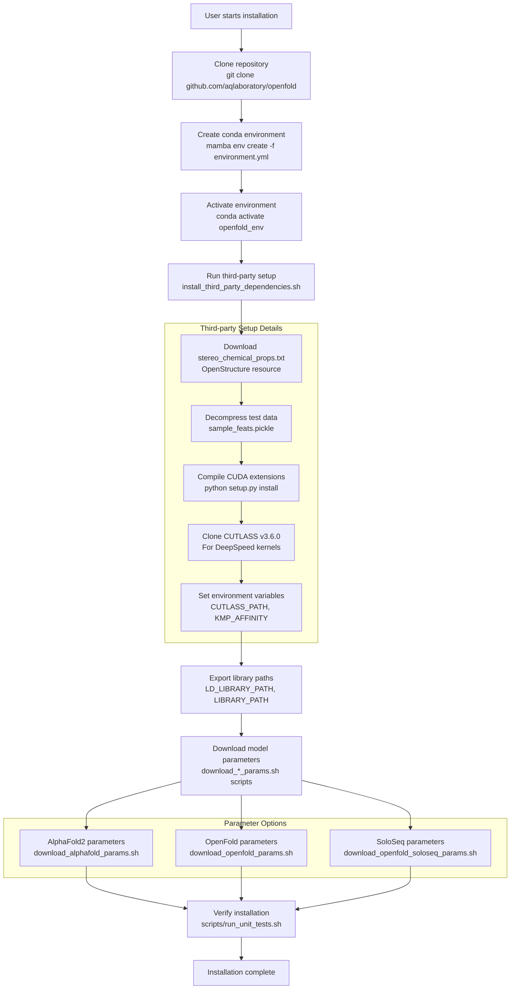
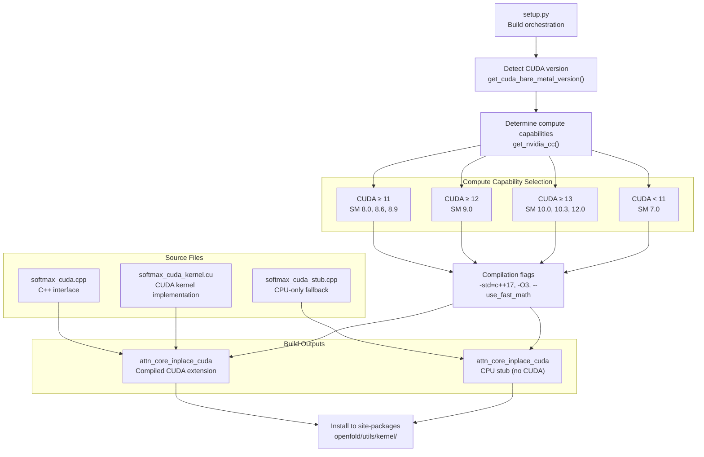
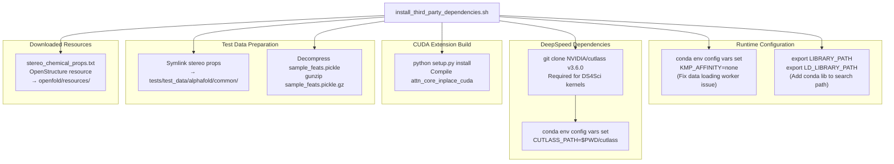
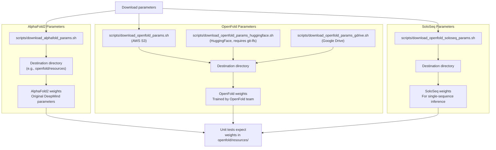
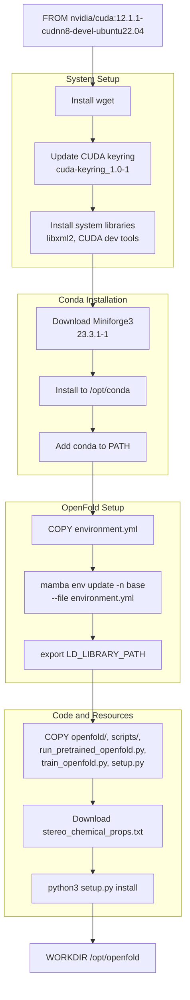

# Installation and Environment Setup

# Installation and Environment Setup

> **Relevant source files**
> - [Dockerfile](https://github.com/aqlaboratory/openfold/blob/56da08ec/Dockerfile)
> - [docs/source/Installation\.md](https://github.com/aqlaboratory/openfold/blob/56da08ec/docs/source/Installation.md?plain=1)
> - [environment\.yml](https://github.com/aqlaboratory/openfold/blob/56da08ec/environment.yml)
> - [scripts/download\_openfold\_params\.sh](https://github.com/aqlaboratory/openfold/blob/56da08ec/scripts/download_openfold_params.sh)
> - [scripts/install\_third\_party\_dependencies\.sh](https://github.com/aqlaboratory/openfold/blob/56da08ec/scripts/install_third_party_dependencies.sh)
> - [setup\.py](https://github.com/aqlaboratory/openfold/blob/56da08ec/setup.py)

## Purpose and Scope

 This document provides comprehensive instructions for installing OpenFold and configuring its runtime environment\. It covers system prerequisites, dependency installation, CUDA extension compilation, parameter downloads, and installation verification\. This guide targets Linux systems with NVIDIA GPUs\.

 For information about running inference after installation, see [Running Inference](https://deepwiki.com/aqlaboratory/openfold/3-running-inference)\. For training setup, see [Training OpenFold](https://deepwiki.com/aqlaboratory/openfold/4-training-openfold)\.

---

## Prerequisites

 OpenFold requires specific hardware, software, and system configurations to function correctly\.

### Hardware Requirements

| Component | Requirement | Notes |
| --- | --- | --- |
| GPU | NVIDIA GPU with Compute Capability ≥ 7\.0 | Ampere\+ \(8\.0\+\) recommended for TF32/BF16 |
| CUDA Cores | Sufficient for model size | Long sequences require substantial memory |
| System RAM | 32GB\+ recommended | MSA generation is memory\-intensive |
| Storage | 500GB\+ available | For databases and model parameters |

### Software Requirements

| Component | Version | Source |
| --- | --- | --- |
| Operating System | Linux \(Ubuntu 22\.04 tested\) | macOS not supported |
| CUDA Toolkit | 12\.1 \- 12\.4 | From NVIDIA |
| cuDNN | 8\.x | Bundled with CUDA |
| Python | 3\.10 | Via conda/mamba |
| GCC | 12\.4 | Via conda/mamba |

 **Sources**: [environment\.yml L1-L41](https://github.com/aqlaboratory/openfold/blob/56da08ec/environment.yml#L1-L41) [Dockerfile L1-L39](https://github.com/aqlaboratory/openfold/blob/56da08ec/Dockerfile#L1-L39) [setup\.py L41-L77](https://github.com/aqlaboratory/openfold/blob/56da08ec/setup.py#L41-L77)

---

## Installation Overview

 The installation process involves five major stages, each building on the previous:

### Installation Flow Diagram



 **Sources**: [Installation\.md?plain=1 L14-L39](https://github.com/aqlaboratory/openfold/blob/56da08ec/docs/source/Installation.md?plain=1#L14-L39) [install\_third\_party\_dependencies\.sh L1-L25](https://github.com/aqlaboratory/openfold/blob/56da08ec/scripts/install_third_party_dependencies.sh#L1-L25)

---

## Step 1: Repository Setup

 Clone the OpenFold repository from GitHub:

```
git clone https://github.com/aqlaboratory/openfold.gitcd openfold
```

 The repository contains the following installation\-critical files:

| File Path | Purpose |
| --- | --- |
| environment\.yml | Conda environment specification |
| setup\.py | CUDA extension build configuration |
| scripts/install\_third\_party\_dependencies\.sh | Post\-installation setup |
| scripts/download\_\*\_params\.sh | Parameter download utilities |
| Dockerfile | Container\-based installation |

 **Sources**: [Installation\.md?plain=1 L15](https://github.com/aqlaboratory/openfold/blob/56da08ec/docs/source/Installation.md?plain=1#L15-L15)

---

## Step 2: Environment Creation

### Using Mamba \(Recommended\)

 Mamba is significantly faster than conda for resolving OpenFold's complex dependency graph:

```
# Install Mamba if not availablewget https://github.com/conda-forge/miniforge/releases/latest/download/Miniforge3-Linux-x86_64.shbash Miniforge3-Linux-x86_64.sh # Create environmentmamba env create -n openfold_env -f environment.yml # Activate environmentconda activate openfold_env
```

### Dependency Specification

 The `environment.yml` file specifies dependencies across multiple channels:

```mermaid
flowchart TD

ENV["environment.yml<br>name: openfold-env"]
CF["conda-forge<br>Primary packages"]
BC["bioconda<br>Bioinformatics tools"]
PT["pytorch<br>PyTorch packages"]
NV["nvidia<br>CUDA toolkit"]
CUDA["cuda<br>CUDA runtime"]
GCC["gcc=12.4<br>Compiler"]
PY["python=3.10<br>Interpreter"]
SETUP_TOOLS["setuptools=59.5.0<br>Build system"]
TORCH["pytorch=2.5<br>Deep learning framework"]
TORCH_CUDA["pytorch-cuda=12.4<br>CUDA bindings"]
LIGHTNING["pytorch-lightning<br>Training orchestration"]
HMMER["bioconda::hmmer<br>hmmsearch, hmmbuild"]
HHSUITE["bioconda::hhsuite<br>hhblits, hhsearch"]
KALIGN["bioconda::kalign2<br>Sequence alignment"]
OPENMM["openmm<br>Molecular dynamics"]
PDBFIXER["pdbfixer<br>Structure preparation"]
DS["deepspeed==0.14.5<br>Distributed training"]
FLASH["flash-attn<br>Memory-efficient attention"]
DMTREE["dm-tree==0.1.6<br>Nested data structures"]
DLLOGGER["dllogger<br>NVIDIA logging"]

ENV --> CF
ENV --> BC
ENV --> PT
ENV --> NV
CF --> CUDA
CF --> GCC
CF --> PY
CF --> SETUP_TOOLS
CF --> LIGHTNING
CF --> OPENMM
CF --> PDBFIXER
PT --> TORCH
PT --> TORCH_CUDA
BC --> HMMER
BC --> HHSUITE
BC --> KALIGN
ENV --> DS
ENV --> FLASH
ENV --> DMTREE
ENV --> DLLOGGER

subgraph subGraph5 ["Pip Dependencies"]
    DS
    FLASH
    DMTREE
    DLLOGGER
end

subgraph subGraph4 ["Chemistry Tools"]
    OPENMM
    PDBFIXER
end

subgraph subGraph3 ["Bioinformatics Tools"]
    HMMER
    HHSUITE
    KALIGN
end

subgraph subGraph2 ["ML Frameworks"]
    TORCH
    TORCH_CUDA
    LIGHTNING
end

subgraph subGraph1 ["Core Dependencies"]
    CUDA
    GCC
    PY
    SETUP_TOOLS
end

subgraph subGraph0 ["Conda Channels"]
    CF
    BC
    PT
    NV
end
```



 **Key Dependencies Table**:

| Category | Packages | Version Constraints |
| --- | --- | --- |
| Build Tools | gcc, setuptools, pip | gcc=12\.4, setuptools=59\.5\.0 |
| Python Runtime | python | 3\.10 |
| Deep Learning | pytorch, pytorch\-cuda, pytorch\-lightning | pytorch=2\.5, pytorch\-cuda=12\.4 |
| Distributed Training | deepspeed | 0\.14\.5 |
| Attention Kernels | flash\-attn | Latest via pip |
| MSA Generation | hmmer, hhsuite, kalign2 | Via bioconda |
| Structure Tools | openmm, pdbfixer | Via conda\-forge |
| Utilities | biopython, numpy, pandas, scipy, tqdm | Latest compatible |
| Experiment Tracking | wandb, ml\-collections | Via conda/pip |

 **Sources**: [environment\.yml L1-L41](https://github.com/aqlaboratory/openfold/blob/56da08ec/environment.yml#L1-L41) [Installation\.md?plain=1 L17-L20](https://github.com/aqlaboratory/openfold/blob/56da08ec/docs/source/Installation.md?plain=1#L17-L20)

---

## Step 3: CUDA Extension Compilation

### Build Process

 The `setup.py` script compiles custom CUDA kernels for optimized attention operations:

```
python setup.py install
```

 This is executed automatically by the `install_third_party_dependencies.sh` script\.

### CUDA Extension Architecture



### Compilation Configuration

 The build system in [setup\.py L26-L149](https://github.com/aqlaboratory/openfold/blob/56da08ec/setup.py#L26-L149) configures:

 **Compiler Flags** \([setup\.py L32-L39](https://github.com/aqlaboratory/openfold/blob/56da08ec/setup.py#L32-L39)\):

 - `-std=c++17`: C\+\+17 standard
- `-maxrregcount=50`: Register usage limit
- `-U__CUDA_NO_HALF_OPERATORS__`: Enable half\-precision
- `--expt-relaxed-constexpr`: Relaxed constexpr
- `--expt-extended-lambda`: Extended lambda support

 **Compute Capability Detection** \([setup\.py L55-L76](https://github.com/aqlaboratory/openfold/blob/56da08ec/setup.py#L55-L76)\):

 - Detects CUDA version from `nvcc -V`
- Adds appropriate SM architectures based on CUDA version
- Falls back to SM 7\.0 for older CUDA
- Uses `get_nvidia_cc()` to detect GPU if present

 **Extension Sources**:

| File | Purpose | Lines |
| --- | --- | --- |
| openfold/utils/kernel/csrc/softmax\_cuda\.cpp | C\+\+ interface | setup\.py91 |
| openfold/utils/kernel/csrc/softmax\_cuda\_kernel\.cu | CUDA kernel | setup\.py92 |
| openfold/utils/kernel/csrc/softmax\_cuda\_stub\.cpp | CPU fallback | setup\.py114 |

 **Conditional Compilation** \([setup\.py L87-L119](https://github.com/aqlaboratory/openfold/blob/56da08ec/setup.py#L87-L119)\):

 - If CUDA detected: builds `CUDAExtension` with full kernel
- If no CUDA: builds `CppExtension` with stub implementation

 **Sources**: [setup\.py L1-L150](https://github.com/aqlaboratory/openfold/blob/56da08ec/setup.py#L1-L150) [install\_third\_party\_dependencies\.sh L14](https://github.com/aqlaboratory/openfold/blob/56da08ec/scripts/install_third_party_dependencies.sh#L14-L14)

---

## Step 4: Third\-Party Dependencies

 The `install_third_party_dependencies.sh` script handles post\-environment setup:

### Third\-Party Setup Components



### Execution

 Run the setup script from the repository root:

```
bash scripts/install_third_party_dependencies.sh
```

### What This Script Does

 1. **Downloads folding resources** \([install\_third\_party\_dependencies\.sh L3-L5](https://github.com/aqlaboratory/openfold/blob/56da08ec/scripts/install_third_party_dependencies.sh#L3-L5)\):  - `stereo_chemical_props.txt` from OpenStructure - Used for stereochemical constraint validation - Saved to `openfold/resources/`
2. **Prepares test data** \([install\_third\_party\_dependencies\.sh L7-L12](https://github.com/aqlaboratory/openfold/blob/56da08ec/scripts/install_third_party_dependencies.sh#L7-L12)\):  - Symlinks stereo props file for tests - Decompresses `sample_feats.pickle.gz`
3. **Compiles CUDA extensions** \([install\_third\_party\_dependencies\.sh L14](https://github.com/aqlaboratory/openfold/blob/56da08ec/scripts/install_third_party_dependencies.sh#L14-L14)\):  - Runs `python setup.py install` - Builds `attn_core_inplace_cuda` module
4. **Downloads CUTLASS** \([install\_third\_party\_dependencies\.sh L16-L18](https://github.com/aqlaboratory/openfold/blob/56da08ec/scripts/install_third_party_dependencies.sh#L16-L18)\):  - Clones CUTLASS v3\.6\.0 from NVIDIA - Required for DeepSpeed Evoformer attention kernel - Sets `CUTLASS_PATH` environment variable
5. **Configures runtime** \([install\_third\_party\_dependencies\.sh L20-L24](https://github.com/aqlaboratory/openfold/blob/56da08ec/scripts/install_third_party_dependencies.sh#L20-L24)\):  - Sets `KMP_AFFINITY=none` \(fixes OpenMP worker assignment\) - Exports library paths for conda environment

### Manual Library Path Configuration

 If not using the script, manually configure library paths:

```
export LIBRARY_PATH=$CONDA_PREFIX/lib:$LIBRARY_PATHexport LD_LIBRARY_PATH=$CONDA_PREFIX/lib:$LD_LIBRARY_PATH
```

 To make this persistent, add to conda environment:

```
conda env config vars set LD_LIBRARY_PATH=$CONDA_PREFIX/lib:$LD_LIBRARY_PATHconda env config vars set LIBRARY_PATH=$CONDA_PREFIX/lib:$LIBRARY_PATH
```

 **Sources**: [install\_third\_party\_dependencies\.sh L1-L25](https://github.com/aqlaboratory/openfold/blob/56da08ec/scripts/install_third_party_dependencies.sh#L1-L25) [Installation\.md?plain=1 L21-L30](https://github.com/aqlaboratory/openfold/blob/56da08ec/docs/source/Installation.md?plain=1#L21-L30)

---

## Step 5: Model Parameter Downloads

 OpenFold supports three parameter sets, each requiring separate downloads:

### Parameter Download Options



### Download Commands

 **AlphaFold2 Parameters**:

```
bash scripts/download_alphafold_params.sh openfold/resources
```

 **OpenFold Parameters** \(requires AWS CLI\):

```
bash scripts/download_openfold_params.sh openfold/resources
```

 **OpenFold Parameters** \(alternative sources\):

```
# HuggingFace (requires git-lfs)bash scripts/download_openfold_params_huggingface.sh openfold/resources # Google Drivebash scripts/download_openfold_params_gdrive.sh openfold/resources
```

 **SoloSeq Parameters**:

```
bash scripts/download_openfold_soloseq_params.sh openfold/resources
```

### Download Script Implementation

 The AWS download script [download\_openfold\_params\.sh L1-L35](https://github.com/aqlaboratory/openfold/blob/56da08ec/scripts/download_openfold_params.sh#L1-L35) performs validation and download:

```python
# Validates AWS CLI is availableif ! command -v aws &> /dev/null ; then    echo "Error: aws could not be found."    exit 1fi # Downloads from S3 bucketaws s3 cp --no-sign-request --region us-east-1 \    s3://openfold/openfold_params/ "${DOWNLOAD_DIR}" --recursive
```

### Recommended Directory Structure

 For seamless integration with unit tests, use `openfold/resources/` as the destination:

```
openfold/
├── resources/
│   ├── stereo_chemical_props.txt
│   ├── params_model_1.npz           # AlphaFold2
│   ├── params_model_2.npz
│   ├── ...
│   ├── finetuning_model_1_ptm.npz   # OpenFold
│   ├── finetuning_model_2_ptm.npz
│   ├── ...
│   └── finetuning_soloseq_1_ptm.npz # SoloSeq
```

 **Sources**: [download\_openfold\_params\.sh L1-L35](https://github.com/aqlaboratory/openfold/blob/56da08ec/scripts/download_openfold_params.sh#L1-L35) [Installation\.md?plain=1 L32-L38](https://github.com/aqlaboratory/openfold/blob/56da08ec/docs/source/Installation.md?plain=1#L32-L38)

---

## Step 6: Installation Verification

### Running Unit Tests

 Verify the installation using OpenFold's test suite:

```
bash scripts/run_unit_tests.sh
```

### Test Coverage

 The test suite validates:

| Test Category | Purpose | Required Parameters |
| --- | --- | --- |
| Model Tests | Forward pass correctness | AlphaFold2 or OpenFold weights |
| Kernel Tests | CUDA extension functionality | attn\_core\_inplace\_cuda compiled |
| Data Tests | Feature generation pipeline | Test data in tests/test\_data/ |
| Transform Tests | Data augmentation correctness | None |
| Loss Tests | Loss computation | None |

### Running Specific Tests

 The test script is a wrapper around Python's `unittest`:

```
# Run specific test module verboselybash scripts/run_unit_tests.sh -v tests.test_model # Run specific test classbash scripts/run_unit_tests.sh tests.test_evoformer.TestEvoformer # Run with pattern matchingbash scripts/run_unit_tests.sh -k "test_attention"
```

### Test Requirements

 Tests expect model parameters to be located at:

 - `openfold/resources/params_model_*.npz` \(AlphaFold2\)
- `openfold/resources/finetuning_model_*.npz` \(OpenFold\)

 If parameters are in a different location, symlink them:

```
ln -s /path/to/params openfold/resources/
```

### AlphaFold Comparison Tests

 Some tests compare OpenFold outputs with the original AlphaFold implementation\. These require:

 - AlphaFold 2\.0\.1 installed in the same environment
- JAX and Haiku dependencies

 These tests are automatically skipped if AlphaFold is not detected\.

 **Sources**: [Installation\.md?plain=1 L40-L52](https://github.com/aqlaboratory/openfold/blob/56da08ec/docs/source/Installation.md?plain=1#L40-L52)

---

## Optional Components

### MPI Support

 For distributed training with MPI:

```
pip install mpi4py
```

 MPI enables multi\-node training with frameworks like Horovod\.

### cuEquivariance Kernels

 cuEquivariance provides optimized SO\(3\)\-equivariant operations for the Structure Module:

 **CUDA 12**:

```
pip install cuequivariance_ops_torch_cu12 cuequivariance_torch
```

 **CUDA 13**:

```
pip install cuequivariance_ops_torch_cu13 cuequivariance_torch
```

 The [setup\.py L137-L142](https://github.com/aqlaboratory/openfold/blob/56da08ec/setup.py#L137-L142) includes cuEquivariance as an optional extra:

```
extras_require={    'cuequivariance': [        'cuequivariance-torch; sys_platform != "darwin"',        'triton>=3.3.0; sys_platform != "darwin"',    ],}
```

 Can also be installed via:

```
pip install .[cuequivariance]
```

### TensorRT Support

 For TensorRT optimization \(used in inference\):

 - Install TensorRT from NVIDIA
- Requires CUDA 12\.1\+
- Provides faster inference through graph optimization

 See [Performance Optimization](https://deepwiki.com/aqlaboratory/openfold/3.6-performance-optimization) for usage details\.

 **Sources**: [Installation\.md?plain=1 L54-L60](https://github.com/aqlaboratory/openfold/blob/56da08ec/docs/source/Installation.md?plain=1#L54-L60) [setup\.py L137-L142](https://github.com/aqlaboratory/openfold/blob/56da08ec/setup.py#L137-L142)

---

## Docker Installation

### Docker\-based Setup

 The `Dockerfile` provides a containerized installation:



### Building the Docker Image

```
# Build imagedocker build -t openfold . # Run container with GPU supportdocker run --gpus all -it openfold bash
```

### Docker Image Components

 The Dockerfile [Dockerfile L1-L39](https://github.com/aqlaboratory/openfold/blob/56da08ec/Dockerfile#L1-L39) includes:

 **Base Image** \([Dockerfile L1](https://github.com/aqlaboratory/openfold/blob/56da08ec/Dockerfile#L1-L1)\):

 - `nvidia/cuda:12.1.1-cudnn8-devel-ubuntu22.04`
- Includes CUDA toolkit and cuDNN

 **System Packages** \([Dockerfile L10-L16](https://github.com/aqlaboratory/openfold/blob/56da08ec/Dockerfile#L10-L16)\):

 - wget, libxml2, git
- CUDA development libraries: libcusparse, libcublas, libcusolver

 **Conda Environment** \([Dockerfile L18-L28](https://github.com/aqlaboratory/openfold/blob/56da08ec/Dockerfile#L18-L28)\):

 - Miniforge3 for mamba package manager
- Creates base environment from `environment.yml`
- Configures library paths

 **OpenFold Installation** \([Dockerfile L30-L38](https://github.com/aqlaboratory/openfold/blob/56da08ec/Dockerfile#L30-L38)\):

 - Copies source code to `/opt/openfold`
- Downloads stereo\_chemical\_props\.txt
- Compiles CUDA extensions via `setup.py`

### Docker Usage Notes

 - Parameters must be mounted or downloaded inside container
- GPU access requires `--gpus all` flag
- Consider mounting data directories for MSA generation
- Database files should be bind\-mounted for efficiency

 **Sources**: [Dockerfile L1-L39](https://github.com/aqlaboratory/openfold/blob/56da08ec/Dockerfile#L1-L39) [Installation\.md?plain=1 L68-L70](https://github.com/aqlaboratory/openfold/blob/56da08ec/docs/source/Installation.md?plain=1#L68-L70)

---

## Installation File System Layout

 After successful installation, the file system structure is:

```mermaid
flowchart TD

ROOT["openfold/<br>(repository root)"]
OPENFOLD["openfold/<br>(Python package)"]
SCRIPTS["scripts/<br>(Installation & utilities)"]
TESTS["tests/<br>(Unit tests)"]
ENV["environment.yml<br>(Conda specification)"]
SETUP["setup.py<br>(Extension builder)"]
DOCKER["Dockerfile<br>(Container definition)"]
RUN["run_pretrained_openfold.py<br>(Inference script)"]
TRAIN["train_openfold.py<br>(Training script)"]
NOTEBOOK["OpenFold.ipynb<br>(Colab notebook)"]
STEREO["stereo_chemical_props.txt<br>(Validation constraints)"]
PARAMS["params_model_*.npz<br>(AlphaFold2 weights)"]
PARAMS_OF["finetuning_model_*.npz<br>(OpenFold weights)"]
PARAMS_SS["finetuning_soloseq_*.npz<br>(SoloSeq weights)"]
CUTLASS["cutlass/<br>(NVIDIA CUTLASS v3.6.0)"]
EXT["attn_core_inplace_cuda.*.so<br>(in site-packages)"]

ROOT --> OPENFOLD
ROOT --> SCRIPTS
ROOT --> TESTS
ROOT --> ENV
ROOT --> SETUP
ROOT --> DOCKER
ROOT --> RUN
ROOT --> TRAIN
ROOT --> NOTEBOOK
ROOT --> STEREO
ROOT --> PARAMS
ROOT --> PARAMS_OF
ROOT --> PARAMS_SS
ROOT --> CUTLASS
OPENFOLD --> EXT

subgraph subGraph5 ["Compiled Extensions"]
    EXT
end

subgraph Third-Party ["Third-Party"]
    CUTLASS
end

subgraph subGraph3 ["Resources Directory"]
    STEREO
    PARAMS
    PARAMS_OF
    PARAMS_SS
end

subgraph subGraph2 ["Entry Points"]
    RUN
    TRAIN
    NOTEBOOK
end

subgraph Configuration ["Configuration"]
    ENV
    SETUP
    DOCKER
end

subgraph subGraph0 ["Source Code"]
    OPENFOLD
    SCRIPTS
    TESTS
end
```



 **Sources**: [install\_third\_party\_dependencies\.sh L1-L25](https://github.com/aqlaboratory/openfold/blob/56da08ec/scripts/install_third_party_dependencies.sh#L1-L25) [Dockerfile L30-L38](https://github.com/aqlaboratory/openfold/blob/56da08ec/Dockerfile#L30-L38)

---

## Troubleshooting

### Common Installation Issues

| Issue | Cause | Solution |
| --- | --- | --- |
| Import error for attn\_core\_inplace\_cuda | CUDA extension not compiled | Re\-run python setup\.py install |
| CUDA version mismatch | PyTorch CUDA \!= system CUDA | Ensure pytorch\-cuda version matches system |
| Missing CUTLASS\_PATH | Environment variable not set | Run conda env config vars set CUTLASS\_PATH=\.\.\. |
| DeepSpeed kernel compilation fails | CUTLASS not found | Clone CUTLASS v3\.6\.0 and set path |
| hmmsearch not found | Bioconda tools not in PATH | Verify conda activation |
| OpenMM import error | Library path not configured | Export LD\_LIBRARY\_PATH |
| Unit tests fail | Parameters not downloaded | Download weights to openfold/resources/ |

### Verifying CUDA Setup

 Check CUDA availability:

```python
import torchprint(f"CUDA available: {torch.cuda.is_available()}")print(f"CUDA version: {torch.version.cuda}")print(f"GPU count: {torch.cuda.device_count()}")
```

 Check attn\_core\_inplace\_cuda:

```python
try:    import attn_core_inplace_cuda    print("Custom CUDA extension loaded successfully")except ImportError as e:    print(f"Failed to load CUDA extension: {e}")
```

### Dependency Conflicts

 If dependency resolution fails:

 1. Create a clean environment:   ``` conda deactivateconda env remove -n openfold_envmamba env create -n openfold_env -f environment.yml ```
2. Update mamba itself:   ``` mamba update -n base mamba ```
3. Check for conflicting conda channels:   ``` conda config --show channels ```

### GPU Not Detected

 If setup\.py doesn't detect GPU compute capability:

 1. Check NVIDIA driver:   ``` nvidia-smi ```
2. Verify CUDA installation:   ``` nvcc --version ```
3. Manually specify compute capability in setup\.py environment:   ``` export TORCH_CUDA_ARCH_LIST="8.0;8.6;9.0"python setup.py install ```

 **Sources**: [setup\.py L41-L119](https://github.com/aqlaboratory/openfold/blob/56da08ec/setup.py#L41-L119) [install\_third\_party\_dependencies\.sh L20-L24](https://github.com/aqlaboratory/openfold/blob/56da08ec/scripts/install_third_party_dependencies.sh#L20-L24)

---

## Summary

 After completing installation:

 1. ✅ Conda environment with all dependencies
2. ✅ Compiled CUDA extensions \(`attn_core_inplace_cuda`\)
3. ✅ CUTLASS library for DeepSpeed kernels
4. ✅ Model parameters downloaded to `openfold/resources/`
5. ✅ Library paths configured
6. ✅ Unit tests passing

 The system is now ready for:

 - **Inference**: See [Running Inference](https://deepwiki.com/aqlaboratory/openfold/3-running-inference)
- **Training**: See [Training OpenFold](https://deepwiki.com/aqlaboratory/openfold/4-training-openfold)
- **Performance tuning**: See [Performance Optimization](https://deepwiki.com/aqlaboratory/openfold/3.6-performance-optimization)

 **Sources**: [Installation\.md?plain=1 L1-L71](https://github.com/aqlaboratory/openfold/blob/56da08ec/docs/source/Installation.md?plain=1#L1-L71) [environment\.yml L1-L41](https://github.com/aqlaboratory/openfold/blob/56da08ec/environment.yml#L1-L41) [setup\.py L1-L150](https://github.com/aqlaboratory/openfold/blob/56da08ec/setup.py#L1-L150) [install\_third\_party\_dependencies\.sh L1-L25](https://github.com/aqlaboratory/openfold/blob/56da08ec/scripts/install_third_party_dependencies.sh#L1-L25) [Dockerfile L1-L39](https://github.com/aqlaboratory/openfold/blob/56da08ec/Dockerfile#L1-L39)

---
*Source: [https://deepwiki.com/aqlaboratory/openfold/2-installation-and-environment-setup](https://deepwiki.com/aqlaboratory/openfold/2-installation-and-environment-setup) on DeepWiki*