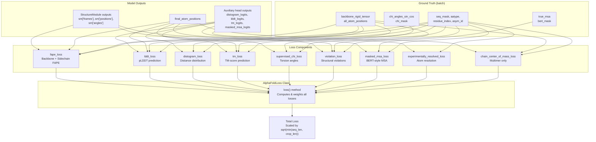
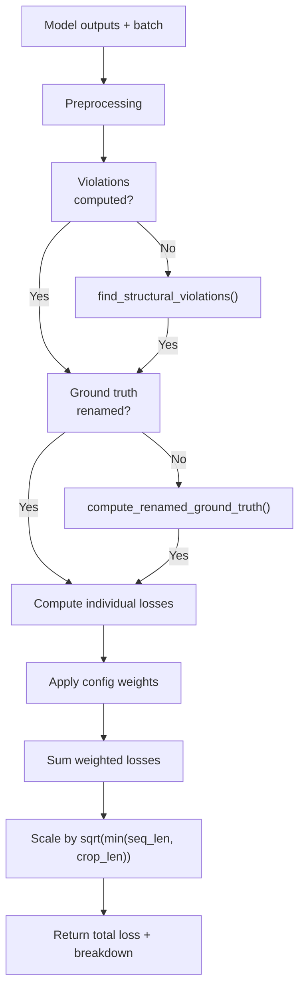
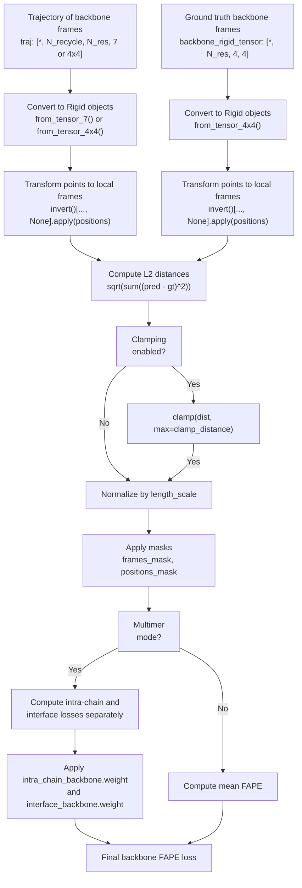
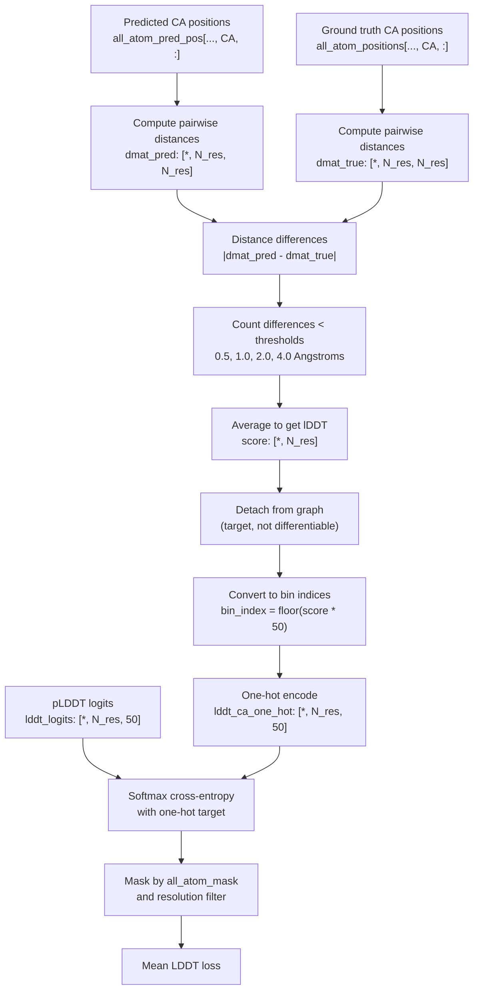
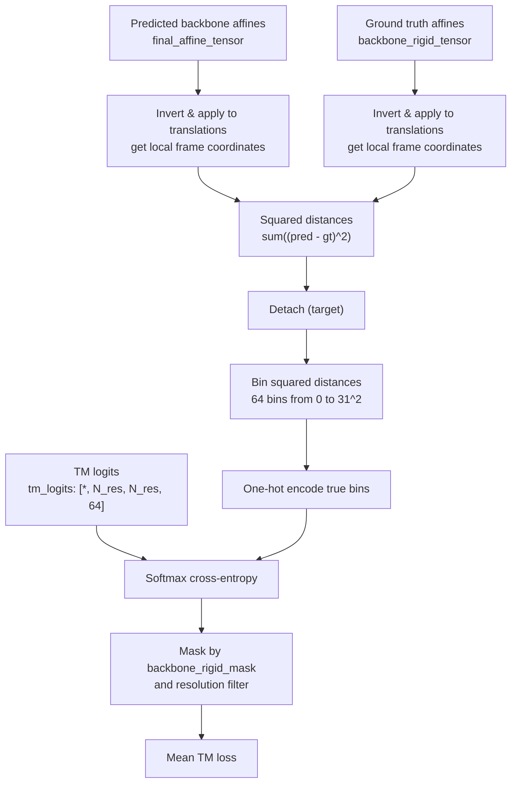
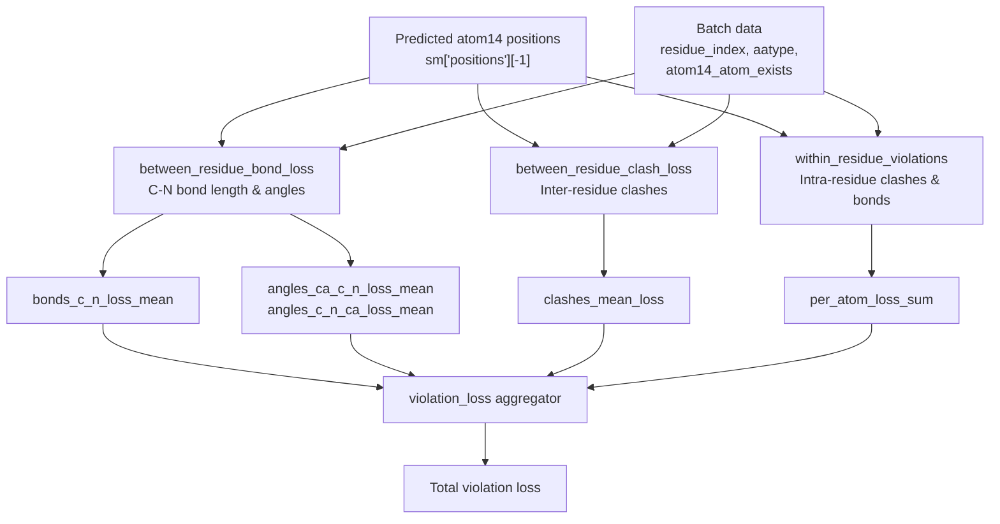
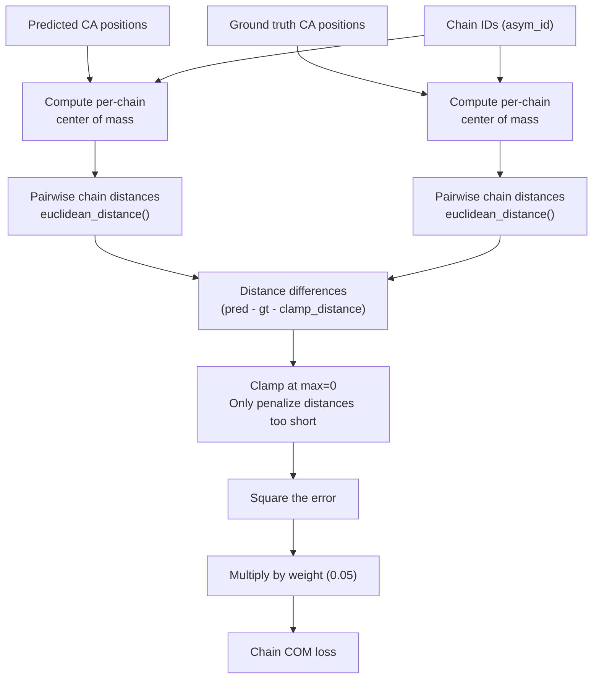
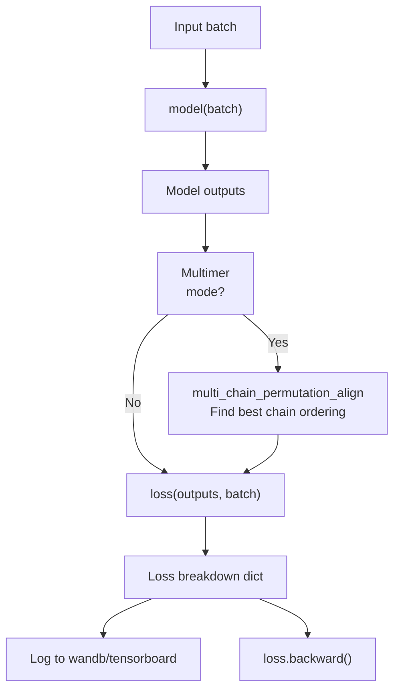

# Loss Functions

# Loss Functions

> **Relevant source files**
> - [openfold/data/data\_modules\.py](https://github.com/aqlaboratory/openfold/blob/56da08ec/openfold/data/data_modules.py)
> - [openfold/utils/loss\.py](https://github.com/aqlaboratory/openfold/blob/56da08ec/openfold/utils/loss.py)
> - [train\_openfold\.py](https://github.com/aqlaboratory/openfold/blob/56da08ec/train_openfold.py)

## Purpose and Scope

 This document explains the loss functions used to train the OpenFold model\. The loss system aggregates multiple complementary objectives that guide the model to predict accurate protein structures\. For information about the model architecture that these losses train, see [Model Architecture](https://deepwiki.com/aqlaboratory/openfold/5-model-architecture)\. For training pipeline details, see [Training Pipeline](https://deepwiki.com/aqlaboratory/openfold/4.1-training-pipeline)\.

 All loss function implementations are located in [openfold/utils/loss\.py](https://github.com/aqlaboratory/openfold/blob/56da08ec/openfold/utils/loss.py) The main entry point is the `AlphaFoldLoss` class, which combines individual loss components with configurable weights\.

---

## Loss System Architecture

 The OpenFold training loss consists of multiple components that collectively optimize different aspects of structure prediction:



 **Sources:** [loss\.py L1685-L1793](https://github.com/aqlaboratory/openfold/blob/56da08ec/openfold/utils/loss.py#L1685-L1793) [train\_openfold\.py L52](https://github.com/aqlaboratory/openfold/blob/56da08ec/train_openfold.py#L52-L52) [train\_openfold\.py L115-L117](https://github.com/aqlaboratory/openfold/blob/56da08ec/train_openfold.py#L115-L117)

---

## AlphaFoldLoss Class

 The `AlphaFoldLoss` class \([loss\.py L1685-L1793](https://github.com/aqlaboratory/openfold/blob/56da08ec/openfold/utils/loss.py#L1685-L1793)\) aggregates all individual loss components into a single training objective\.

### Key Methods

| Method | Purpose |
| --- | --- |
| \_\_init\_\_\(config\) | Initializes with configuration specifying weights and parameters for each loss component |
| loss\(out, batch, \_return\_breakdown\) | Computes all enabled losses and returns weighted sum |
| forward\(out, batch, \_return\_breakdown\) | Wrapper around loss\(\) for standard PyTorch Module interface |

### Loss Computation Flow



### Usage in Training

 The loss is instantiated in `OpenFoldWrapper` \([train\_openfold\.py L45-L60](https://github.com/aqlaboratory/openfold/blob/56da08ec/train_openfold.py#L45-L60)\):

```
self.loss = AlphaFoldLoss(config.loss)
```

 During training \([train\_openfold\.py L115-L117](https://github.com/aqlaboratory/openfold/blob/56da08ec/train_openfold.py#L115-L117)\):

```
loss, loss_breakdown = self.loss(    outputs, batch, _return_breakdown=True)
```

 **Sources:** [loss\.py L1685-L1793](https://github.com/aqlaboratory/openfold/blob/56da08ec/openfold/utils/loss.py#L1685-L1793) [train\_openfold\.py L45-L60](https://github.com/aqlaboratory/openfold/blob/56da08ec/train_openfold.py#L45-L60) [train\_openfold\.py L115-L117](https://github.com/aqlaboratory/openfold/blob/56da08ec/train_openfold.py#L115-L117)

---

## FAPE Loss \(Frame Aligned Point Error\)

 FAPE is the primary geometric loss that measures structural accuracy by comparing predicted and ground truth atomic positions in local reference frames\. This makes the loss invariant to global rotations and translations\.

### Components

 FAPE loss has two main components:

 1. **Backbone FAPE**: Measures accuracy of backbone rigid transformations
2. **Sidechain FAPE**: Measures accuracy of all\-atom sidechain positions

### Backbone FAPE

 The `backbone_loss` function \([loss\.py L169-L232](https://github.com/aqlaboratory/openfold/blob/56da08ec/openfold/utils/loss.py#L169-L232)\) computes FAPE for backbone frames:



 **Key parameters** \(from config\):

 - `length_scale`: Normalizes distances \(typically 10\.0 Angstroms\)
- `clamp_distance`: Maximum distance error to consider \(typically 10\.0\)
- `use_clamped_fape`: Whether to use clamping \(can be toggled during training\)

 For multimer mode \([loss\.py L293-L306](https://github.com/aqlaboratory/openfold/blob/56da08ec/openfold/utils/loss.py#L293-L306)\), the loss separates intra\-chain and interface regions:

 - **Intra\-chain**: Atoms within the same chain \(same `asym_id`\)
- **Interface**: Atoms across different chains

 **Sources:** [loss\.py L82-L166](https://github.com/aqlaboratory/openfold/blob/56da08ec/openfold/utils/loss.py#L82-L166) [loss\.py L169-L232](https://github.com/aqlaboratory/openfold/blob/56da08ec/openfold/utils/loss.py#L169-L232) [loss\.py L286-L325](https://github.com/aqlaboratory/openfold/blob/56da08ec/openfold/utils/loss.py#L286-L325)

### Sidechain FAPE

 The `sidechain_loss` function \([loss\.py L235-L283](https://github.com/aqlaboratory/openfold/blob/56da08ec/openfold/utils/loss.py#L235-L283)\) computes FAPE for all 8 rigid groups per residue \(backbone \+ 7 sidechain torsion frames\):

 1. Handles alternative ground truth for symmetric sidechains \(e\.g\., Phe, Tyr\)
2. Uses the final predicted sidechain frames from `sm["sidechain_frames"][-1]`
3. Compares all atom14 positions in their local rigid group frames

 **Sources:** [loss\.py L235-L283](https://github.com/aqlaboratory/openfold/blob/56da08ec/openfold/utils/loss.py#L235-L283)

### FAPE Algorithm

 The core FAPE computation \([loss\.py L82-L166](https://github.com/aqlaboratory/openfold/blob/56da08ec/openfold/utils/loss.py#L82-L166)\):

 $$\\text\{FAPE\} = \\frac\{1\}\{N\_\{\\text\{frames\}\} \\cdot N\_\{\\text\{pts\}\}\} \\sum\_\{f,p\} \\text\{mask\}\_\{f,p\} \\cdot \\frac\{\| T\_f^\{\-1\}\(\\mathbf\{x\}\_p^\{\\text\{pred\}\}\) \- T\_f^\{\-1\}\(\\mathbf\{x\}*p^\{\\text\{gt\}\}\) \|\}\{d*\{\\text\{scale\}\}\}$$

 Where:

 - $T\_f^\{\-1\}$ inverts frame $f$ and transforms points to its local coordinates
- $\\mathbf\{x\}\_p$ are 3D positions of atoms
- $d\_\{\\text\{scale\}\}$ is the length scale parameter
- Optional L1 clamping at `l1_clamp_distance`

 **Sources:** [loss\.py L82-L166](https://github.com/aqlaboratory/openfold/blob/56da08ec/openfold/utils/loss.py#L82-L166)

---

## LDDT Loss \(pLDDT Prediction\)

 The LDDT loss trains the model to predict per\-residue local distance difference test \(lDDT\) scores, which serve as confidence estimates\.

### Computation



### Key Features

 1. **Local metric**: Only considers atom pairs within 15 Angstroms cutoff
2. **Multi\-threshold scoring**: Uses 4 distance thresholds \(0\.5, 1\.0, 2\.0, 4\.0 Å\)
3. **Binned prediction**: Model predicts distribution over 50 bins from 0\-100
4. **Resolution filtering**: Only applied to structures with resolution between 0\.1\-3\.0 Å

 **Implementation:** [loss\.py L428-L481](https://github.com/aqlaboratory/openfold/blob/56da08ec/openfold/utils/loss.py#L428-L481) \(`lddt`\), [loss\.py L484-L504](https://github.com/aqlaboratory/openfold/blob/56da08ec/openfold/utils/loss.py#L484-L504) \(`lddt_ca`\), [loss\.py L507-L559](https://github.com/aqlaboratory/openfold/blob/56da08ec/openfold/utils/loss.py#L507-L559) \(`lddt_loss`\)

 **Sources:** [loss\.py L428-L481](https://github.com/aqlaboratory/openfold/blob/56da08ec/openfold/utils/loss.py#L428-L481) [loss\.py L484-L504](https://github.com/aqlaboratory/openfold/blob/56da08ec/openfold/utils/loss.py#L484-L504) [loss\.py L507-L559](https://github.com/aqlaboratory/openfold/blob/56da08ec/openfold/utils/loss.py#L507-L559)

---

## Distogram Loss

 The distogram loss trains the model to predict the distribution of C\-beta \(or C\-alpha for glycine\) pairwise distances\.

### Implementation

 The `distogram_loss` function \([loss\.py L562-L607](https://github.com/aqlaboratory/openfold/blob/56da08ec/openfold/utils/loss.py#L562-L607)\):

 1. **Compute pairwise distances** between pseudo\-beta atoms:   ``` dists = sum((pseudo_beta[..., None, :] - pseudo_beta[..., None, :, :])^2) ```
2. **Bin distances**: 64 bins with boundaries from 2\.3125² to 21\.6875² Ų
3. **Cross\-entropy loss**: Between predicted logits and true distance bins
4. **Masking**: Applied via `pseudo_beta_mask` to exclude missing residues

 The distogram provides a differentiable distance restraint that helps the model learn distance geometry principles\.

 **Sources:** [loss\.py L562-L607](https://github.com/aqlaboratory/openfold/blob/56da08ec/openfold/utils/loss.py#L562-L607)

---

## TM Score Loss

 For multimer and some training stages, the model predicts the expected TM\-score \(Template Modeling score\) between predicted and true structures\.

### Computation Flow



### TM Score Computation

 The model can also compute predicted TM\-scores from logits using `compute_tm` \([loss\.py L670-L718](https://github.com/aqlaboratory/openfold/blob/56da08ec/openfold/utils/loss.py#L670-L718)\):

 $$\\text\{TM\} = \\frac\{1\}\{N\} \\sum\_\{i,j\} \\frac\{1\}\{1 \+ \(d\_\{ij\} / d\_0\)^2\}$$

 Where:

 - $d\_0 = 1\.24 \\sqrt\[3\]\{N \- 15\} \- 1\.8$ \(normalization constant\)
- Supports both intra\-chain and interface TM\-scores \(controlled by `asym_id`\)

 **Sources:** [loss\.py L670-L718](https://github.com/aqlaboratory/openfold/blob/56da08ec/openfold/utils/loss.py#L670-L718) [loss\.py L721-L779](https://github.com/aqlaboratory/openfold/blob/56da08ec/openfold/utils/loss.py#L721-L779)

---

## Supervised Chi Loss \(Torsion Angles\)

 The supervised chi loss trains the model to predict accurate sidechain torsion angles\.

### Implementation

 The `supervised_chi_loss` function \([loss\.py L328-L411](https://github.com/aqlaboratory/openfold/blob/56da08ec/openfold/utils/loss.py#L328-L411)\):

 1. **Extract chi angles**: From `sm["angles"]` \(predicted\) and `chi_angles_sin_cos` \(ground truth\)  - Only considers chi angles \(indices 3\-7\), skipping backbone angles
2. **Handle periodicity**: Some chi angles are π\-periodic \(e\.g\., Phe, Tyr\)  - Compares both the angle and angle\+π, taking the minimum error
3. **Angle normalization**: Penalizes unnormalized angle predictions  - `angle_norm_loss = |norm(angle_vector) - 1.0|`
4. **Masking**: Uses `chi_mask` to only supervise chi angles that exist for each residue type

 **Loss formulation:**

```
loss = chi_weight * chi_loss + angle_norm_weight * norm_loss
```

 Typical weights: `chi_weight=0.5`, `angle_norm_weight=0.02`

 **Sources:** [loss\.py L328-L411](https://github.com/aqlaboratory/openfold/blob/56da08ec/openfold/utils/loss.py#L328-L411)

---

## Violation Losses

 Violation losses penalize physically implausible structures by enforcing geometric constraints\.

### Overview



### Between\-Residue Bond Loss

 The `between_residue_bond_loss` function \([loss\.py L782-L939](https://github.com/aqlaboratory/openfold/blob/56da08ec/openfold/utils/loss.py#L782-L939)\) enforces peptide bond geometry:

 **Constraints checked:**

 1. **C\-N bond length**: ~1\.329 Å \(1\.341 Å for proline\)
2. **CA\-C\-N angle**: Bond angle around C atom
3. **C\-N\-CA angle**: Bond angle around N atom

 **Tolerance:** Uses `tolerance_factor_soft` and `tolerance_factor_hard` \(both typically 12\.0\)

 - Soft: Applied with ReLU to compute loss
- Hard: Used to flag violations

 **Sources:** [loss\.py L782-L939](https://github.com/aqlaboratory/openfold/blob/56da08ec/openfold/utils/loss.py#L782-L939)

### Between\-Residue Clash Loss

 The `between_residue_clash_loss` function \([loss\.py L942-L1093](https://github.com/aqlaboratory/openfold/blob/56da08ec/openfold/utils/loss.py#L942-L1093)\) penalizes steric clashes:

 1. **Van der Waals radii**: Uses element\-specific radii from `residue_constants`
2. **Distance check**: Flags clashes when atoms closer than sum of radii minus tolerance
3. **Exclusions**: - Consecutive C\-N bonds \(not clashes\) - Disulfide bonds \(CYS SG\-SG\) - Same residue atoms \(handled separately\)
4. **Multimer support**: Uses `asym_id` to correctly identify consecutive residues across chains

 **Sources:** [loss\.py L942-L1093](https://github.com/aqlaboratory/openfold/blob/56da08ec/openfold/utils/loss.py#L942-L1093)

### Within\-Residue Violations

 The `within_residue_violations` function \([loss\.py L1096-L1183](https://github.com/aqlaboratory/openfold/blob/56da08ec/openfold/utils/loss.py#L1096-L1183)\) checks intra\-residue geometry:

 1. **Distance bounds**: Uses `residue_constants.make_atom14_dists_bounds()` - Lower and upper bounds for all atom pairs within each residue
2. **Violations**: Penalizes distances outside bounds
3. **Per\-atom aggregation**: Sums violations for each atom

 **Sources:** [loss\.py L1096-L1183](https://github.com/aqlaboratory/openfold/blob/56da08ec/openfold/utils/loss.py#L1096-L1183)

### Violation Loss Aggregation

 The `violation_loss` function \([loss\.py L1432-L1460](https://github.com/aqlaboratory/openfold/blob/56da08ec/openfold/utils/loss.py#L1432-L1460)\) combines all violation components:

```
loss = (    bonds_c_n_loss_mean +    angles_ca_c_n_loss_mean +    angles_c_n_ca_loss_mean +    l_clash  # Combined inter- and intra-residue clashes)
```

 With optional averaging over number of clashes if `average_clashes=True`\.

 **Sources:** [loss\.py L1432-L1460](https://github.com/aqlaboratory/openfold/blob/56da08ec/openfold/utils/loss.py#L1432-L1460)

---

## Masked MSA Loss

 The masked MSA loss implements BERT\-style pretraining on MSA sequences\.

### Implementation

 The `masked_msa_loss` function \([loss\.py L1595-L1625](https://github.com/aqlaboratory/openfold/blob/56da08ec/openfold/utils/loss.py#L1595-L1625)\):

 1. **Input**:  - Predicted residue distributions: `logits` \[\*, N\_seq, N\_res, 23\] - True MSA: `true_msa` \[\*, N\_seq, N\_res\] - Mask indicating masked positions: `bert_mask` \[\*, N\_seq, N\_res\]
2. **Loss computation**:  - Softmax cross\-entropy between predicted and true amino acids - Only at masked positions \(where `bert_mask=1`\)
3. **Purpose**: Helps the model learn evolutionary patterns from MSAs

 **Sources:** [loss\.py L1595-L1625](https://github.com/aqlaboratory/openfold/blob/56da08ec/openfold/utils/loss.py#L1595-L1625)

---

## Experimentally Resolved Loss

 The `experimentally_resolved_loss` function \([loss\.py L1571-L1592](https://github.com/aqlaboratory/openfold/blob/56da08ec/openfold/utils/loss.py#L1571-L1592)\) trains the model to predict which atoms are experimentally resolved \(present in the crystal structure\)\.

 **Implementation:**

 1. Binary classification per atom \(resolved vs\. unresolved\)
2. Uses sigmoid cross\-entropy loss
3. Filtered by resolution range \(typically 0\.1\-3\.0 Å\)

 This helps the model learn to predict confidence in individual atom positions\.

 **Sources:** [loss\.py L1571-L1592](https://github.com/aqlaboratory/openfold/blob/56da08ec/openfold/utils/loss.py#L1571-L1592)

---

## Chain Center of Mass Loss \(Multimer\)

 For multimer predictions, the `chain_center_of_mass_loss` function \([loss\.py L1628-L1682](https://github.com/aqlaboratory/openfold/blob/56da08ec/openfold/utils/loss.py#L1628-L1682)\) enforces consistency of inter\-chain distances\.

### Algorithm



 **Purpose:** Prevents chains from drifting apart or collapsing together during multimer training\.

 **Default parameters:**

 - `clamp_distance`: \-4\.0 \(negative = allow some compression\)
- `weight`: 0\.05

 **Sources:** [loss\.py L1628-L1682](https://github.com/aqlaboratory/openfold/blob/56da08ec/openfold/utils/loss.py#L1628-L1682)

---

## Loss Configuration and Weights

 Each loss component has configurable parameters set in `model_config` \(see [Configuration System](https://deepwiki.com/aqlaboratory/openfold/5.1-configuration-system)\)\.

### Typical Loss Weights

| Loss Component | Config Key | Typical Weight |
| --- | --- | --- |
| FAPE \(backbone\) | fape\.backbone\.weight | 0\.5 |
| FAPE \(sidechain\) | fape\.sidechain\.weight | 0\.5 |
| LDDT | plddt\_loss\.weight | 0\.01 |
| Distogram | distogram\.weight | 0\.3 |
| TM score | tm\.weight | 0\.0 \(multimer: varies\) |
| Supervised chi | supervised\_chi\.weight | 1\.0 |
| Violations | violation\.weight | 0\.0 \(enabled later in training\) |
| Masked MSA | masked\_msa\.weight | 2\.0 |
| Experimentally resolved | experimentally\_resolved\.weight | 0\.01 |
| Chain COM | chain\_center\_of\_mass\.weight | 0\.05 |

### Loss Scaling

 The final loss is scaled by $\\sqrt\{\\min\(L\_\{\\text\{seq\}\}, L\_\{\\text\{crop\}\}\)\}$ where:

 - $L\_\{\\text\{seq\}\}$ is the sequence length
- $L\_\{\\text\{crop\}\}$ is the crop size

 This normalization \([loss\.py L1776-L1778](https://github.com/aqlaboratory/openfold/blob/56da08ec/openfold/utils/loss.py#L1776-L1778)\):

```
seq_len = torch.mean(batch["seq_length"].float())crop_len = batch["aatype"].shape[-1]cum_loss = cum_loss * torch.sqrt(min(seq_len, crop_len))
```

 Ensures that losses for different protein sizes are comparable\.

 **Sources:** [loss\.py L1712-L1780](https://github.com/aqlaboratory/openfold/blob/56da08ec/openfold/utils/loss.py#L1712-L1780)

---

## Auxiliary Functions

### Ground Truth Renaming

 The `compute_renamed_ground_truth` function \([loss\.py L1463-L1568](https://github.com/aqlaboratory/openfold/blob/56da08ec/openfold/utils/loss.py#L1463-L1568)\) handles symmetric sidechains:

 **Problem:** Some amino acids have symmetric atoms \(e\.g\., Phe ring can flip\) **Solution:** Compare predicted positions to both original and "flipped" ground truth, use the better match

 **Process:**

 1. Compute LDDT\-like score for original and alternative ground truth
2. Choose alternative if it gives better score
3. Return renamed ground truth for use in all losses

 This prevents the model from being penalized for predicting valid symmetric configurations\.

 **Sources:** [loss\.py L1463-L1568](https://github.com/aqlaboratory/openfold/blob/56da08ec/openfold/utils/loss.py#L1463-L1568)

### Structural Violations Detection

 The `find_structural_violations` function \([loss\.py L1186-L1316](https://github.com/aqlaboratory/openfold/blob/56da08ec/openfold/utils/loss.py#L1186-L1316)\) computes all violation metrics:

 **Outputs:**

```
{    "between_residues": {        "bonds_c_n_loss_mean": ...,        "angles_ca_c_n_loss_mean": ...,        "clashes_mean_loss": ...,        ...    },    "within_residues": {        "per_atom_loss_sum": ...,        ...    },    "total_per_residue_violations_mask": ...}
```

 Used both for computing violation loss and for masking LDDT predictions\.

 **Sources:** [loss\.py L1186-L1316](https://github.com/aqlaboratory/openfold/blob/56da08ec/openfold/utils/loss.py#L1186-L1316)

---

## Loss in Training Loop

### Integration with OpenFoldWrapper

 The loss is used in the training step \([train\_openfold\.py L97-L122](https://github.com/aqlaboratory/openfold/blob/56da08ec/train_openfold.py#L97-L122)\):



### EMA and Validation

 During validation \([train\_openfold\.py L127-L156](https://github.com/aqlaboratory/openfold/blob/56da08ec/train_openfold.py#L127-L156)\):

 1. EMA weights are loaded for inference
2. Loss is computed with `use_clamped_fape=0.0` \(unclamped FAPE only\)
3. Additional metrics computed: `lddt_ca`, `drmsd_ca`, `gdt_ts`, `gdt_ha`
4. Original weights restored after validation

 **Sources:** [train\_openfold\.py L97-L122](https://github.com/aqlaboratory/openfold/blob/56da08ec/train_openfold.py#L97-L122) [train\_openfold\.py L127-L156](https://github.com/aqlaboratory/openfold/blob/56da08ec/train_openfold.py#L127-L156)

---

## Summary Table

| Loss | Purpose | Key Parameters | Output Shape |
| --- | --- | --- | --- |
| FAPE | Geometric accuracy of frames & atoms | length\_scale, clamp\_distance | Scalar |
| LDDT | Train confidence prediction | cutoff=15\.0, no\_bins=50 | Scalar |
| Distogram | Distance distribution | min\_bin, max\_bin, no\_bins=64 | Scalar |
| TM Score | Predicted TM\-score | max\_bin=31, no\_bins=64 | Scalar |
| Supervised Chi | Torsion angle accuracy | chi\_weight, angle\_norm\_weight | Scalar |
| Violations | Physical plausibility | tolerance\_factor, clash\_overlap\_tolerance | Scalar |
| Masked MSA | MSA representation learning | num\_classes=23 | Scalar |
| Exp\. Resolved | Atom resolution prediction | min\_resolution, max\_resolution | Scalar |
| Chain COM | Multimer chain spacing | clamp\_distance=\-4\.0, weight=0\.05 | Scalar |

 All losses return scalars \(averaged over batch\) and are combined with configurable weights in `AlphaFoldLoss`\.

 **Sources:** [loss\.py L1-L1793](https://github.com/aqlaboratory/openfold/blob/56da08ec/openfold/utils/loss.py#L1-L1793)

---
*Source: [https://deepwiki.com/aqlaboratory/openfold/5.6-loss-functions](https://deepwiki.com/aqlaboratory/openfold/5.6-loss-functions) on DeepWiki*