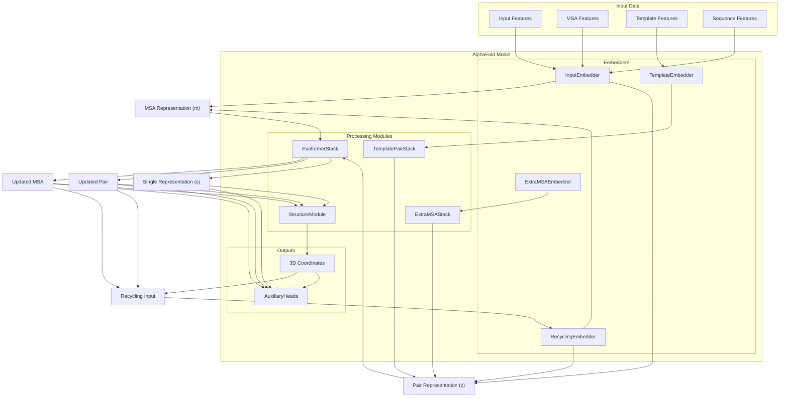
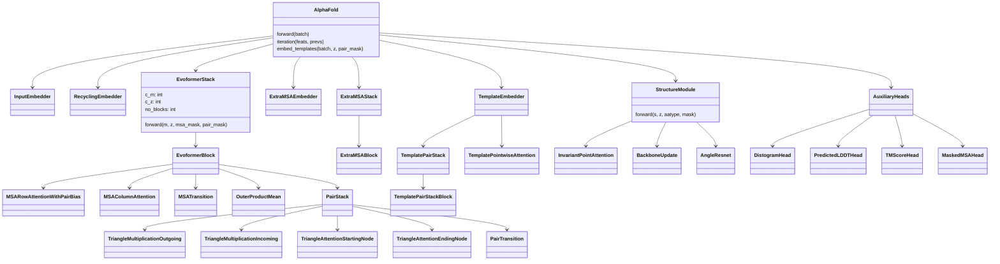
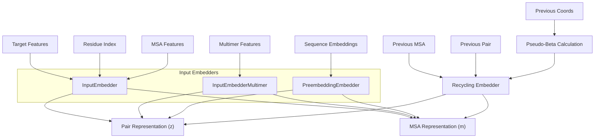
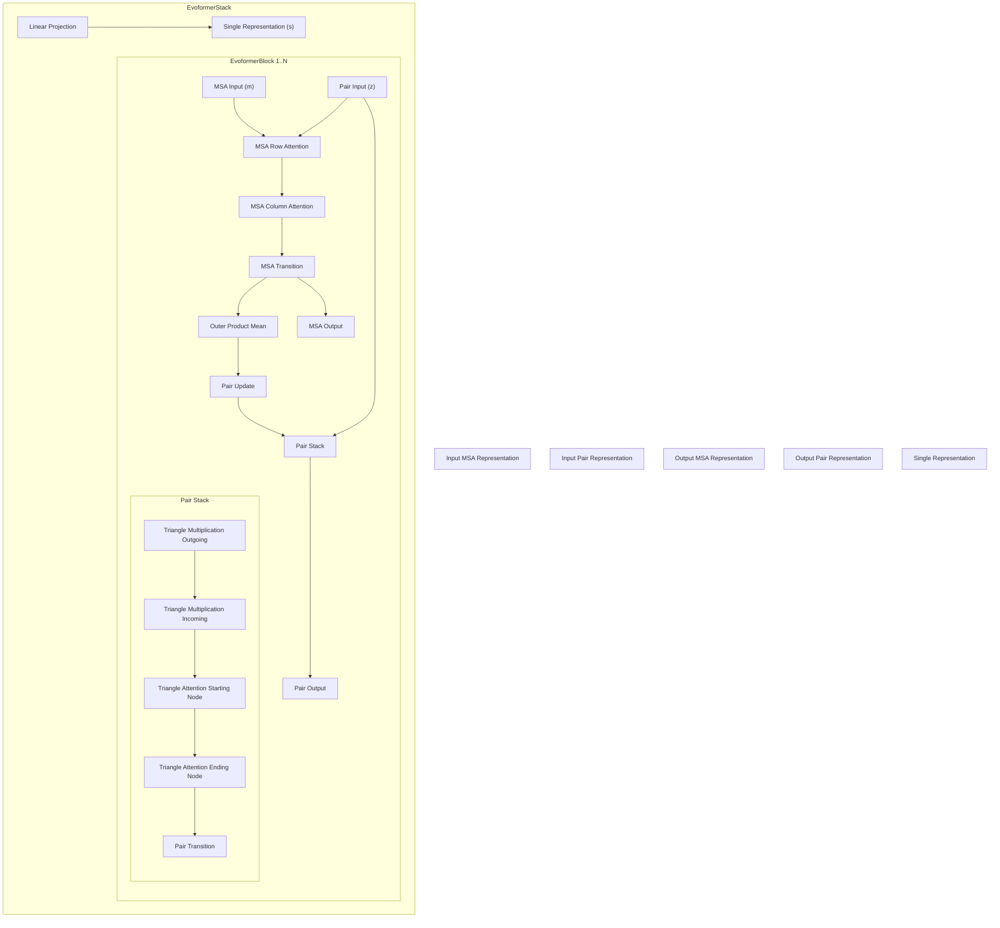
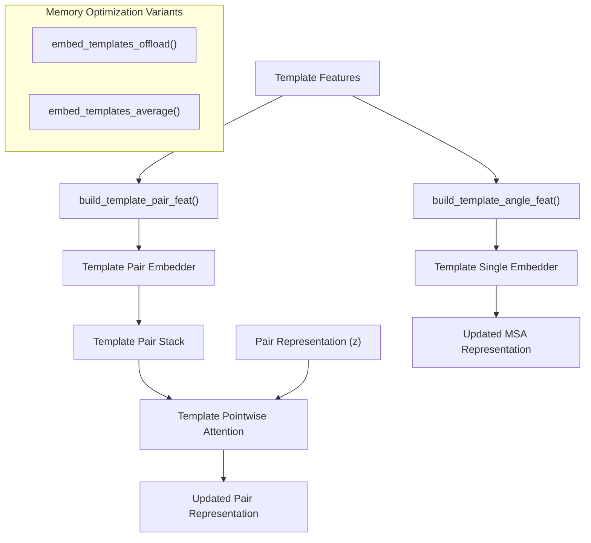
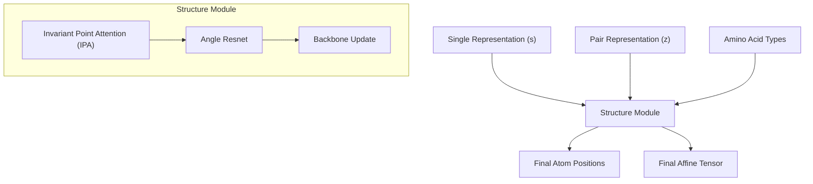
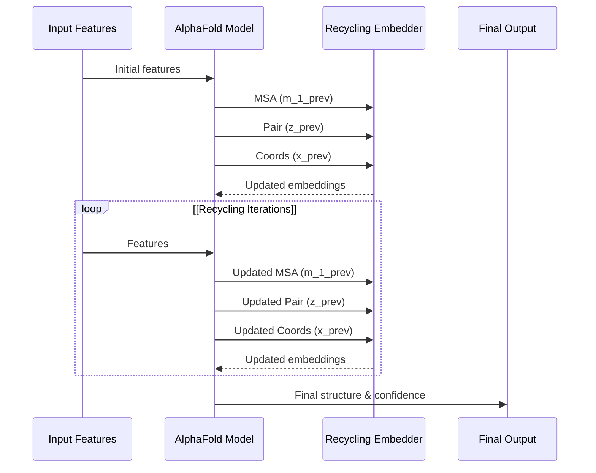

# Model Architecture

# Model Architecture

> **Relevant source files**
> - [openfold/config\.py](https://github.com/aqlaboratory/openfold/blob/56da08ec/openfold/config.py)
> - [openfold/model/dropout\.py](https://github.com/aqlaboratory/openfold/blob/56da08ec/openfold/model/dropout.py)
> - [openfold/model/evoformer\.py](https://github.com/aqlaboratory/openfold/blob/56da08ec/openfold/model/evoformer.py)
> - [openfold/model/model\.py](https://github.com/aqlaboratory/openfold/blob/56da08ec/openfold/model/model.py)
> - [openfold/model/template\.py](https://github.com/aqlaboratory/openfold/blob/56da08ec/openfold/model/template.py)
> - [openfold/model/triangular\_attention\.py](https://github.com/aqlaboratory/openfold/blob/56da08ec/openfold/model/triangular_attention.py)
> - [openfold/utils/tensor\_utils\.py](https://github.com/aqlaboratory/openfold/blob/56da08ec/openfold/utils/tensor_utils.py)

 The Model Architecture page describes the core neural network design and components that comprise the OpenFold implementation of AlphaFold 2 in PyTorch\. This document covers the overall model structure, key components, and their interactions during protein structure prediction\. For information about training the model, see [Training OpenFold](https://deepwiki.com/aqlaboratory/openfold/4-training-openfold); for details about running inference, see [Running Inference](https://deepwiki.com/aqlaboratory/openfold/3-running-inference)\.

## Overall Architecture Overview

 OpenFold's model architecture closely mirrors AlphaFold 2's design, implementing a deep learning system that predicts protein structures from sequence information, multiple sequence alignments \(MSAs\), and optional template information\.



 Sources: [model\.py L65-L492](https://github.com/aqlaboratory/openfold/blob/56da08ec/openfold/model/model.py#L65-L492) [config\.py L61-L260](https://github.com/aqlaboratory/openfold/blob/56da08ec/openfold/config.py#L61-L260)

## Model Components and Data Flow

 The OpenFold architecture consists of the following key components that process data through the system:

| Component | Purpose | Implementation |
| --- | --- | --- |
| InputEmbedder | Embeds sequence and MSA features into initial representations | model/embedders\.py |
| RecyclingEmbedder | Incorporates information from previous iterations | model/embedders\.py |
| TemplateEmbedder | Processes template information | model/template\.py |
| ExtraMSAEmbedder | Embeds additional MSA sequences | model/embedders\.py |
| EvoformerStack | Core processing module for MSA and pair representations | model/evoformer\.py |
| ExtraMSAStack | Processes extra MSA information | model/evoformer\.py |
| StructureModule | Converts embeddings to 3D coordinates | model/structure\_module\.py |
| AuxiliaryHeads | Produces additional outputs like confidence scores | model/heads\.py |

 The AlphaFold class \([model\.py L65-L591](https://github.com/aqlaboratory/openfold/blob/56da08ec/openfold/model/model.py#L65-L591)\) orchestrates these components, implementing the recycling mechanism that allows the model to refine its predictions over multiple iterations\.

## Code Structure and Class Relationships

 This diagram maps the model components to their corresponding classes in the codebase:



 Sources: [model\.py L65-L492](https://github.com/aqlaboratory/openfold/blob/56da08ec/openfold/model/model.py#L65-L492) [evoformer\.py L748-L1025](https://github.com/aqlaboratory/openfold/blob/56da08ec/openfold/model/evoformer.py#L748-L1025)

## Model Initialization and Configuration

 The model is initialized with a comprehensive configuration object defined in [openfold/config\.py](https://github.com/aqlaboratory/openfold/blob/56da08ec/openfold/config.py) that controls all architectural aspects\. Different model presets are available, including:

 - Model variants \(1\-5\) with different architectural choices
- PTM variants with template modeling score prediction
- Multimer variants for multi\-chain protein complexes
- Sequence embedding variants for no\-MSA inference

 The `model_config` function in [config\.py L61-L260](https://github.com/aqlaboratory/openfold/blob/56da08ec/openfold/config.py#L61-L260) provides these preset configurations\.

```
model = AlphaFold(config)
```

## Input Processing and Embedding

 The model processes several types of input features:

 1. **Target sequence features**: One\-hot encoded sequence information
2. **MSA features**: Multiple sequence alignment information
3. **Template features**: Structural templates from similar proteins
4. **Extra MSA features**: Additional sequences for evolutionary information

 These inputs are embedded into initial representations by specialized embedders:



 Sources: [model\.py L87-L100](https://github.com/aqlaboratory/openfold/blob/56da08ec/openfold/model/model.py#L87-L100) [model\.py L232-L258](https://github.com/aqlaboratory/openfold/blob/56da08ec/openfold/model/model.py#L232-L258)

## The Evoformer Stack

 The Evoformer is the core processing module in OpenFold, responsible for iteratively refining the MSA and pair representations\. It consists of multiple EvoformerBlocks stacked together\.



 Sources: [evoformer\.py L747-L1025](https://github.com/aqlaboratory/openfold/blob/56da08ec/openfold/model/evoformer.py#L747-L1025) [evoformer\.py L377-L552](https://github.com/aqlaboratory/openfold/blob/56da08ec/openfold/model/evoformer.py#L377-L552)

 The EvoformerStack typically consists of 48 identical blocks, each performing several transformations on the MSA and pair representations:

 1. **MSA Row Attention with Pair Bias**: Attention between sequences, biased by pair information
2. **MSA Column Attention**: Attention between positions in the sequence
3. **MSA Transition**: Feed\-forward network applied to MSA
4. **Outer Product Mean**: Connects MSA and pair representations
5. **Pair Stack**: Series of operations on the pair representation - Triangle Multiplication: Outgoing and Incoming variants - Triangle Attention: Starting Node and Ending Node variants - Pair Transition: Feed\-forward network for pairs

## Template Processing

 Template information provides structural priors derived from similar proteins\. This information is processed through several specialized modules:



 Sources: [template\.py L136-L692](https://github.com/aqlaboratory/openfold/blob/56da08ec/openfold/model/template.py#L136-L692) [model\.py L325-L342](https://github.com/aqlaboratory/openfold/blob/56da08ec/openfold/model/model.py#L325-L342)

 OpenFold implements two memory\-efficient template processing methods:

 1. `embed_templates_offload`: Offloads template tensors to CPU to save GPU memory
2. `embed_templates_average`: Processes templates in groups and averages them

## Structure Module

 The Structure Module transforms the embeddings from the Evoformer into 3D atomic coordinates, predicting the protein structure:



 Sources: [model\.py L442-L454](https://github.com/aqlaboratory/openfold/blob/56da08ec/openfold/model/model.py#L442-L454)

## Recycling Mechanism

 OpenFold implements an iterative refinement process called recycling\. In each recycling iteration:

 1. The model generates MSA, pair representations, and 3D coordinates
2. These outputs are used as inputs for the next iteration
3. The process continues for a fixed number of iterations or until convergence



 Sources: [model\.py L209-L473](https://github.com/aqlaboratory/openfold/blob/56da08ec/openfold/model/model.py#L209-L473) [model\.py L544-L586](https://github.com/aqlaboratory/openfold/blob/56da08ec/openfold/model/model.py#L544-L586)

 The `recycle_early_stop_tolerance` parameter allows early stopping when consecutive iterations produce similar structures, improving efficiency\.

## Auxiliary Outputs

 In addition to the 3D structure, OpenFold produces several auxiliary outputs:

 1. **pLDDT**: Per\-residue confidence scores
2. **Distogram**: Distance distribution predictions between residues
3. **TM\-score**: Template modeling score prediction \(in PTM variants\)
4. **Masked MSA**: Used during training for MSA completion tasks

 These outputs are generated by specialized heads in the `AuxiliaryHeads` class\.

## Memory Optimization Techniques

 OpenFold incorporates several memory optimization techniques to enable processing of long sequences and multi\-chain complexes:

 1. **Activation checkpointing**: Reduces memory during backpropagation
2. **Chunk\-based processing**: Splits computations into manageable chunks
3. **Template offloading**: Moves template tensors to CPU when not needed
4. **Low\-memory attention**: Optional memory\-efficient attention implementations
5. **DeepSpeed integration**: For memory\-efficient attention kernels

 Sources: [evoformer\.py L876-L895](https://github.com/aqlaboratory/openfold/blob/56da08ec/openfold/model/evoformer.py#L876-L895) [template\.py L472-L580](https://github.com/aqlaboratory/openfold/blob/56da08ec/openfold/model/template.py#L472-L580) [config\.py L230-L236](https://github.com/aqlaboratory/openfold/blob/56da08ec/openfold/config.py#L230-L236)

## Model Variants and Configuration

 OpenFold supports various model configurations through the configuration system in [config\.py L61-L260](https://github.com/aqlaboratory/openfold/blob/56da08ec/openfold/config.py#L61-L260):

| Model Variant | Description |
| --- | --- |
| Model\_1 to Model\_5 | Different architectural settings matching AlphaFold2 presets |
| PTM variants | Include template modeling score prediction |
| Multimer variants | For multi\-chain protein complexes |
| Sequence embedding | For running without MSAs using ESM\-1b embeddings |

 These configurations control architectural choices like:

 - Number of Evoformer blocks
- Use of templates
- Size of extra MSA inputs
- Attention mechanism details

 The `model_config` function provides these preset configurations, which can be further customized\.

---
*Source: [https://deepwiki.com/aqlaboratory/openfold/5-model-architecture](https://deepwiki.com/aqlaboratory/openfold/5-model-architecture) on DeepWiki*