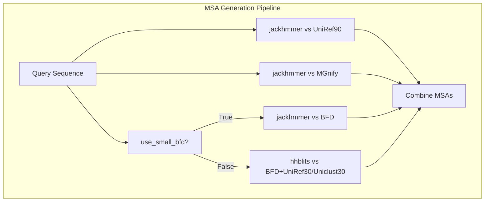
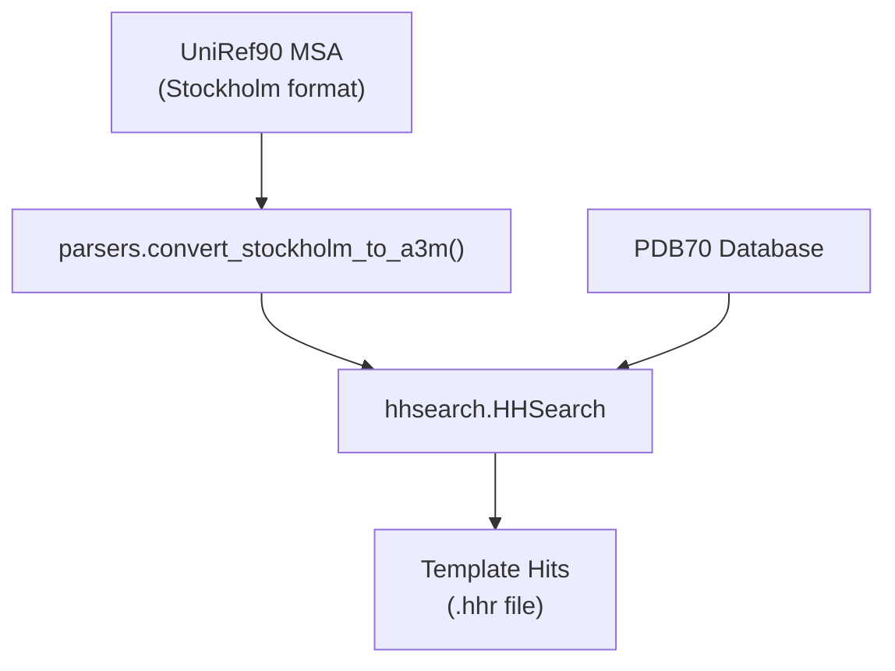
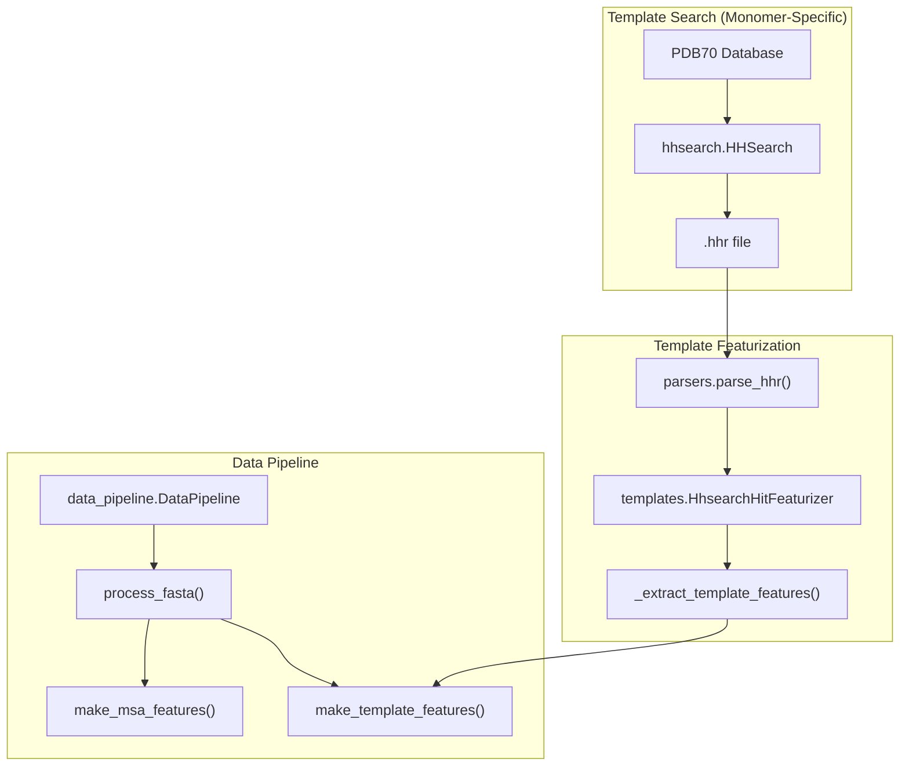
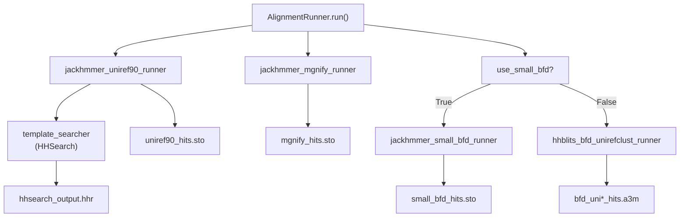
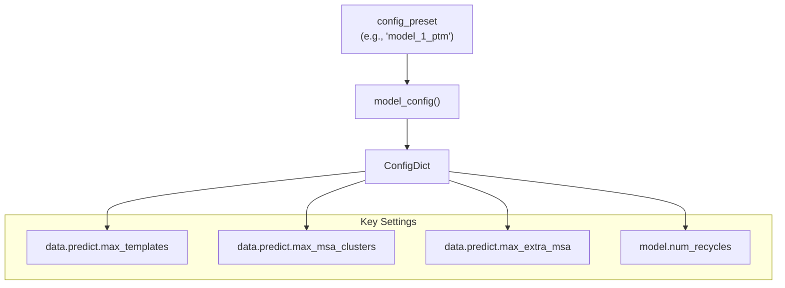
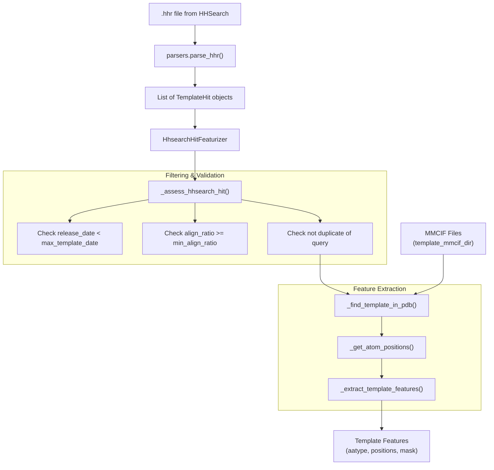
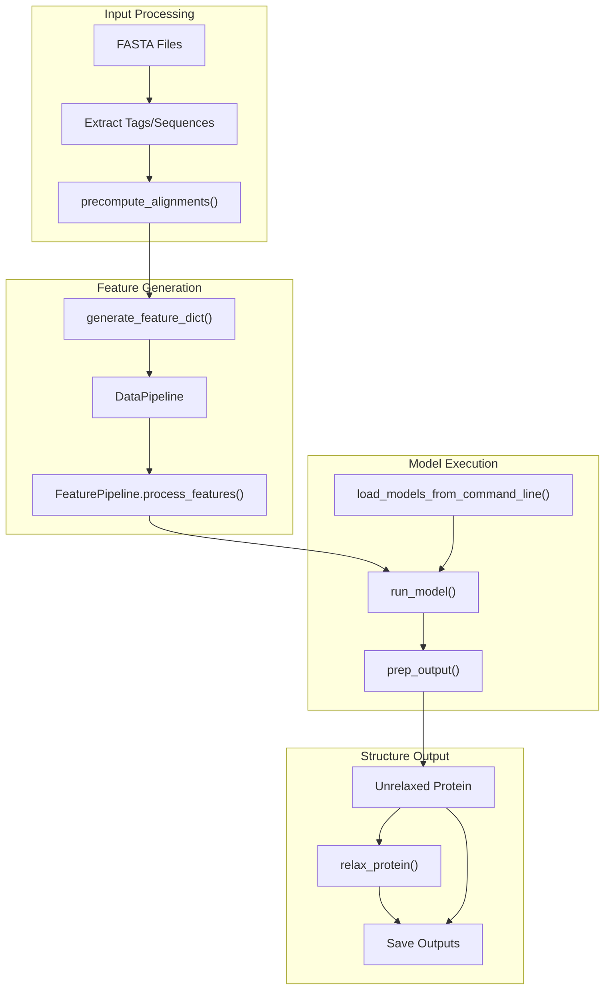

# Monomer Inference

# Monomer Inference

> **Relevant source files**
> - [README\.md](https://github.com/aqlaboratory/openfold/blob/56da08ec/README.md?plain=1)
> - [docs/source/Inference\.md](https://github.com/aqlaboratory/openfold/blob/56da08ec/docs/source/Inference.md?plain=1)
> - [docs/source/Multimer\_Inference\.md](https://github.com/aqlaboratory/openfold/blob/56da08ec/docs/source/Multimer_Inference.md?plain=1)
> - [docs/source/Single\_Sequence\_Inference\.md](https://github.com/aqlaboratory/openfold/blob/56da08ec/docs/source/Single_Sequence_Inference.md?plain=1)
> - [docs/source/conf\.py](https://github.com/aqlaboratory/openfold/blob/56da08ec/docs/source/conf.py)
> - [openfold/data/data\_pipeline\.py](https://github.com/aqlaboratory/openfold/blob/56da08ec/openfold/data/data_pipeline.py)
> - [openfold/data/templates\.py](https://github.com/aqlaboratory/openfold/blob/56da08ec/openfold/data/templates.py)
> - [run\_pretrained\_openfold\.py](https://github.com/aqlaboratory/openfold/blob/56da08ec/run_pretrained_openfold.py)
> - [scripts/generate\_mmcif\_cache\.py](https://github.com/aqlaboratory/openfold/blob/56da08ec/scripts/generate_mmcif_cache.py)
> - [scripts/precompute\_alignments\.py](https://github.com/aqlaboratory/openfold/blob/56da08ec/scripts/precompute_alignments.py)
> - [scripts/utils\.py](https://github.com/aqlaboratory/openfold/blob/56da08ec/scripts/utils.py)

 This page explains how to run OpenFold to predict the structure of a single protein chain \(monomer\)\. For multi\-chain complexes, see page 3\.3 \(Multimer Inference\), and for MSA\-free prediction, see page 3\.4 \(SoloSeq Inference\)\.

## Overview

 Monomer inference predicts the 3D structure of a single protein chain using multiple sequence alignments \(MSAs\) and optional template structures\. The system uses AlphaFold2 methodology with HHSearch\-based template searching against PDB70\.

 **Monomer Detection**: The inference script automatically detects monomer mode when:

 1. The `config_preset` does not contain "multimer"
2. Each input FASTA file contains exactly one sequence

 Sources: [run\_pretrained\_openfold\.py L209](https://github.com/aqlaboratory/openfold/blob/56da08ec/run_pretrained_openfold.py#L209-L209) [run\_pretrained\_openfold\.py L269-L274](https://github.com/aqlaboratory/openfold/blob/56da08ec/run_pretrained_openfold.py#L269-L274)

## Monomer vs Multimer Differences

 The following table summarizes key differences between monomer and multimer inference:

| Component | Monomer Mode | Multimer Mode |
| --- | --- | --- |
| Template Searcher | hhsearch\.HHSearch | hmmsearch\.Hmmsearch |
| Template Database | PDB70 | PDB SeqRes |
| Template Featurizer | HhsearchHitFeaturizer | HmmsearchHitFeaturizer |
| Data Pipeline | DataPipeline | DataPipelineMultimer |
| Processing Method | process\_fasta\(\) | process\_fasta\(\) with multimer flag |
| MSA Databases | UniRef90, MGnify, BFD | UniRef90, MGnify, UniRef30, Uniprot |
| Sequence Input | Single sequence per file | Multiple sequences per file |

 Sources: [run\_pretrained\_openfold\.py L82-L86](https://github.com/aqlaboratory/openfold/blob/56da08ec/run_pretrained_openfold.py#L82-L86) [run\_pretrained\_openfold\.py L76-L81](https://github.com/aqlaboratory/openfold/blob/56da08ec/run_pretrained_openfold.py#L76-L81) [run\_pretrained\_openfold\.py L228-L235](https://github.com/aqlaboratory/openfold/blob/56da08ec/run_pretrained_openfold.py#L228-L235) [run\_pretrained\_openfold\.py L218-L226](https://github.com/aqlaboratory/openfold/blob/56da08ec/run_pretrained_openfold.py#L218-L226) [run\_pretrained\_openfold\.py L239-L242](https://github.com/aqlaboratory/openfold/blob/56da08ec/run_pretrained_openfold.py#L239-L242)

## Database Requirements

 Monomer inference requires specific databases for MSA generation and template searching:

### MSA Databases



 **MSA Databases Used by AlignmentRunner:**

| Database | Tool | Purpose | Max Hits | Required |
| --- | --- | --- | --- | --- |
| UniRef90 | jackhmmer | Primary MSA | 10,000 | Yes |
| MGnify | jackhmmer | Metagenome sequences | 5,000 | Optional |
| BFD | jackhmmer/hhblits | Large sequence database | Unlimited | Optional but recommended |
| UniRef30 | hhblits | Used with BFD | Unlimited | Optional \(with BFD\) |
| Uniclust30 | hhblits | Used with BFD | Unlimited | Optional \(with BFD\) |

 Sources: [data\_pipeline\.py L334-L476](https://github.com/aqlaboratory/openfold/blob/56da08ec/openfold/data/data_pipeline.py#L334-L476) [data\_pipeline\.py L388-L404](https://github.com/aqlaboratory/openfold/blob/56da08ec/openfold/data/data_pipeline.py#L388-L404) [data\_pipeline\.py L413-L415](https://github.com/aqlaboratory/openfold/blob/56da08ec/openfold/data/data_pipeline.py#L413-L415)

### Template Database

 **PDB70 for Template Search:**

 Monomer mode uses `hhsearch.HHSearch` to search PDB70 for template structures\. The UniRef90 MSA from jackhmmer is converted to A3M format and used as input to HHSearch\.



 Sources: [data\_pipeline\.py L494-L518](https://github.com/aqlaboratory/openfold/blob/56da08ec/openfold/data/data_pipeline.py#L494-L518) [run\_pretrained\_openfold\.py L82-L86](https://github.com/aqlaboratory/openfold/blob/56da08ec/run_pretrained_openfold.py#L82-L86)

### Template MMCIF Directory

 The `template_mmcif_dir` argument must point to a directory containing MMCIF files for template structures\. Even for template\-free models \(model\_3\-5\), this directory is required as a parameter\.

 Sources: [run\_pretrained\_openfold\.py L404-L405](https://github.com/aqlaboratory/openfold/blob/56da08ec/run_pretrained_openfold.py#L404-L405) [run\_pretrained\_openfold\.py L228-L235](https://github.com/aqlaboratory/openfold/blob/56da08ec/run_pretrained_openfold.py#L228-L235)

## Model Parameters

 Download model parameters using the provided scripts:

```
# AlphaFold parameters (monomer models 1-5)bash scripts/download_alphafold_params.sh openfold/resources # OpenFold parameters (trained weights)bash scripts/download_openfold_params.sh openfold/resources
```

 If parameters are stored in `openfold/resources/params`, the system automatically selects parameters matching the `config_preset`\.

 Sources: [run\_pretrained\_openfold\.py L530-L534](https://github.com/aqlaboratory/openfold/blob/56da08ec/run_pretrained_openfold.py#L530-L534) [Inference\.md?plain=1 L28-L44](https://github.com/aqlaboratory/openfold/blob/56da08ec/docs/source/Inference.md?plain=1#L28-L44)

## Input Format

 Monomer inference requires a directory \(`fasta_dir`\) containing FASTA files with **exactly one sequence per file**\. Files with multiple sequences will be skipped unless multimer mode is enabled\.

 **Example FASTA file:**

```
>6KWC_B
MKLKQVADKLEEVASKLYHNANELARVAKLLGER
```

 **Input validation logic:**

```
# run_pretrained_openfold.py:269-274if not is_multimer and len(tags) != 1:    print(        f"{fasta_path} contains more than one sequence but "        f"multimer mode is not enabled. Skipping..."    )    continue
```

 Sources: [run\_pretrained\_openfold\.py L261-L274](https://github.com/aqlaboratory/openfold/blob/56da08ec/run_pretrained_openfold.py#L261-L274)

## Running Monomer Inference

### Basic Command

```
python3 run_pretrained_openfold.py \    $INPUT_FASTA_DIR \    $TEMPLATE_MMCIF_DIR \    --output_dir $OUTPUT_DIR \    --config_preset model_1_ptm \    --uniref90_database_path $BASE_DATA_DIR/uniref90/uniref90.fasta \    --mgnify_database_path $BASE_DATA_DIR/mgnify/mgy_clusters_2018_12.fa \    --pdb70_database_path $BASE_DATA_DIR/pdb70 \    --uniclust30_database_path $BASE_DATA_DIR/uniclust30/uniclust30_2018_08/uniclust30_2018_08 \    --bfd_database_path $BASE_DATA_DIR/bfd/bfd_metaclust_clu_complete_id30_c90_final_seq.sorted_opt \    --model_device "cuda:0"
```

### Monomer\-Specific Pipeline Components

 The following diagram shows the code entities involved in monomer processing:



 Sources: [run\_pretrained\_openfold\.py L82-L86](https://github.com/aqlaboratory/openfold/blob/56da08ec/run_pretrained_openfold.py#L82-L86) [templates\.py L228-L235](https://github.com/aqlaboratory/openfold/blob/56da08ec/openfold/data/templates.py#L228-L235) [data\_pipeline\.py L706-L914](https://github.com/aqlaboratory/openfold/blob/56da08ec/openfold/data/data_pipeline.py#L706-L914)

### AlignmentRunner for Monomer

 The `AlignmentRunner.run()` method orchestrates MSA generation for monomer sequences:



 Sources: [data\_pipeline\.py L477-L563](https://github.com/aqlaboratory/openfold/blob/56da08ec/openfold/data/data_pipeline.py#L477-L563) [data\_pipeline\.py L421-L450](https://github.com/aqlaboratory/openfold/blob/56da08ec/openfold/data/data_pipeline.py#L421-L450)

### Using Precomputed Alignments

 To skip MSA generation and use existing alignments:

```
python3 run_pretrained_openfold.py \    $INPUT_FASTA_DIR \    $TEMPLATE_MMCIF_DIR \    --output_dir $OUTPUT_DIR \    --use_precomputed_alignments $PRECOMPUTED_ALIGNMENTS \    --config_preset model_1_ptm \    --model_device "cuda:0"
```

 **Expected directory structure for precomputed alignments:**

```
alignments/
└── 6KWC_B/                    # Subdirectory per sequence tag
    ├── bfd_uniclust_hits.a3m  # BFD+UniRef/Uniclust MSA (hhblits)
    ├── hhsearch_output.hhr    # Template hits (HHSearch)
    ├── mgnify_hits.sto        # MGnify MSA (jackhmmer)
    └── uniref90_hits.sto      # UniRef90 MSA (jackhmmer)
```

 The `DataPipeline._parse_msa_data()` method reads these files and `_parse_template_hit_files()` processes the `.hhr` file for template information\.

 Sources: [run\_pretrained\_openfold\.py L254-L257](https://github.com/aqlaboratory/openfold/blob/56da08ec/run_pretrained_openfold.py#L254-L257) [data\_pipeline\.py L714-L764](https://github.com/aqlaboratory/openfold/blob/56da08ec/openfold/data/data_pipeline.py#L714-L764) [data\_pipeline\.py L766-L811](https://github.com/aqlaboratory/openfold/blob/56da08ec/openfold/data/data_pipeline.py#L766-L811) [Inference\.md?plain=1 L92-L103](https://github.com/aqlaboratory/openfold/blob/56da08ec/docs/source/Inference.md?plain=1#L92-L103)

## Configuration Presets

 OpenFold provides 10 monomer configuration presets divided by template usage and pTM scoring:

| Preset | Templates | pTM | AlphaFold Parameters | OpenFold Parameters |
| --- | --- | --- | --- | --- |
| model\_1, model\_2 | Yes | No | params\_model\_1\.npz, params\_model\_2\.npz | finetuning\_\[2\-5\]\.pt |
| model\_1\_ptm, model\_2\_ptm | Yes | Yes | params\_model\_1\_ptm\.npz, params\_model\_2\_ptm\.npz | finetuning\_ptm\_\[1\-2\]\.pt |
| model\_3, model\_4, model\_5 | No | No | params\_model\_3\.npz, params\_model\_4\.npz, params\_model\_5\.npz | finetuning\_no\_templ\_\[1\-2\]\.pt |
| model\_3\_ptm, model\_4\_ptm, model\_5\_ptm | No | Yes | params\_model\_3\_ptm\.npz, params\_model\_4\_ptm\.npz, params\_model\_5\_ptm\.npz | finetuning\_no\_templ\_ptm\_1\.pt |

### Configuration System

 The `model_config()` function in `openfold/config.py` creates configuration dictionaries\. Key monomer\-related settings:



 **Template\-related settings:**

 - Models 1\-2: `max_templates = 4`
- Models 3\-5: `max_templates = 0` \(template\-free\)

 Sources: [run\_pretrained\_openfold\.py L184-L196](https://github.com/aqlaboratory/openfold/blob/56da08ec/run_pretrained_openfold.py#L184-L196) [run\_pretrained\_openfold\.py L429-L430](https://github.com/aqlaboratory/openfold/blob/56da08ec/run_pretrained_openfold.py#L429-L430) [Inference\.md?plain=1 L106-L120](https://github.com/aqlaboratory/openfold/blob/56da08ec/docs/source/Inference.md?plain=1#L106-L120)

## Template Processing in Monomer Mode

### HhsearchHitFeaturizer

 Monomer mode uses the `HhsearchHitFeaturizer` class to process template hits from HHSearch:



 The featurizer performs several validation steps before extracting template features:

 1. Date filtering: Templates released after `max_template_date` are excluded
2. Alignment quality: Templates with `align_ratio < min_align_ratio` are excluded
3. Duplicate checking: Templates that are near\-exact matches to the query are excluded

 Sources: [templates\.py L228-L235](https://github.com/aqlaboratory/openfold/blob/56da08ec/openfold/data/templates.py#L228-L235) [templates\.py L220-L289](https://github.com/aqlaboratory/openfold/blob/56da08ec/openfold/data/templates.py#L220-L289) [templates\.py L548-L705](https://github.com/aqlaboratory/openfold/blob/56da08ec/openfold/data/templates.py#L548-L705)

## Command\-Line Options

### Database Paths

| Argument | Required | Default | Description |
| --- | --- | --- | --- |
| \-\-uniref90\_database\_path | Optional | None | Path to UniRef90 FASTA |
| \-\-mgnify\_database\_path | Optional | None | Path to MGnify FASTA |
| \-\-bfd\_database\_path | Optional | None | Path to BFD database |
| \-\-uniclust30\_database\_path | Optional | None | Path to Uniclust30 \(used with BFD\) |
| \-\-pdb70\_database\_path | Optional | None | Path to PDB70 for template search |

### Binary Paths

| Argument | Default | Description |
| --- | --- | --- |
| \-\-jackhmmer\_binary\_path | $CONDA\_PREFIX/bin/jackhmmer | Path to jackhmmer executable |
| \-\-hhblits\_binary\_path | $CONDA\_PREFIX/bin/hhblits | Path to hhblits executable |
| \-\-hhsearch\_binary\_path | $CONDA\_PREFIX/bin/hhsearch | Path to hhsearch executable |
| \-\-kalign\_binary\_path | $CONDA\_PREFIX/bin/kalign | Path to kalign executable |

### Template Options

| Argument | Default | Description |
| --- | --- | --- |
| \-\-max\_template\_date | Current date | Exclude templates released after this date |
| \-\-release\_dates\_path | None | Path to JSON file with PDB release dates |
| \-\-obsolete\_pdbs\_path | None | Path to file listing obsolete PDB entries |

### Performance Options

| Argument | Description |
| --- | --- |
| \-\-long\_sequence\_inference | Enable memory optimizations for long sequences |
| \-\-use\_deepspeed\_evoformer\_attention | Use DeepSpeed attention kernels |
| \-\-use\_cuequivariance\_attention | Use cuEquivariance attention kernels |
| \-\-trace\_model | Convert model to TorchScript for faster inference |

 Sources: [utils\.py L13-L66](https://github.com/aqlaboratory/openfold/blob/56da08ec/scripts/utils.py#L13-L66) [run\_pretrained\_openfold\.py L398-L527](https://github.com/aqlaboratory/openfold/blob/56da08ec/run_pretrained_openfold.py#L398-L527) [Inference\.md?plain=1 L133-L180](https://github.com/aqlaboratory/openfold/blob/56da08ec/docs/source/Inference.md?plain=1#L133-L180)

## Output Files

 The inference script produces the following output:

```
output_dir/
├── alignments/         # MSA and template search results
│   └── query_name/     
├── 6KWC_B_model_1_ptm_unrelaxed.pdb  # Unrelaxed structure prediction
├── 6KWC_B_model_1_ptm.pdb            # Relaxed structure prediction (if relaxation not skipped)
└── 6KWC_B_model_1_ptm_output_dict.pkl # (Optional) All model outputs if --save_outputs was specified
```

 The predicted structures include confidence scores \(pLDDT\) in the B\-factor column, where higher values \(0\-100\) indicate greater confidence:

 - <50: Very low confidence
- 50\-70: Low confidence
- 70\-90: Confident
- > 90: Very high confidence

 Sources: [run\_pretrained\_openfold\.py L356-L384](https://github.com/aqlaboratory/openfold/blob/56da08ec/run_pretrained_openfold.py#L356-L384)

## Internal Process Flow

 The following diagram illustrates the internal components and data flow during monomer inference:



 Sources: [run\_pretrained\_openfold\.py L175-L386](https://github.com/aqlaboratory/openfold/blob/56da08ec/run_pretrained_openfold.py#L175-L386) [run\_pretrained\_openfold\.py L61-L131](https://github.com/aqlaboratory/openfold/blob/56da08ec/run_pretrained_openfold.py#L61-L131)

## Troubleshooting

 Common issues and solutions:

 1. **Memory errors**: For long sequences, try using `--long_sequence_inference` or reduce the MSA size in the configuration\.
2. **Missing templates**: Ensure the template\_mmcif\_dir is correctly specified\. Even for template\-free models, this directory is required as a parameter\.
3. **Slow performance**: Consider using `--trace_model` for better performance, especially for batch jobs\. If you have DeepSpeed installed, try `--use_deepspeed_evoformer_attention`\.
4. **Missing dependencies**: If alignment tools aren't found, explicitly specify their paths using the corresponding command\-line arguments\.

 Sources: [run\_pretrained\_openfold\.py L494-L498](https://github.com/aqlaboratory/openfold/blob/56da08ec/run_pretrained_openfold.py#L494-L498) [Inference\.md?plain=1 L145-L170](https://github.com/aqlaboratory/openfold/blob/56da08ec/docs/source/Inference.md?plain=1#L145-L170)

---
*Source: [https://deepwiki.com/aqlaboratory/openfold/3.2-monomer-inference](https://deepwiki.com/aqlaboratory/openfold/3.2-monomer-inference) on DeepWiki*