# Multimer Inference

# Multimer Inference

> **Relevant source files**
> - [README\.md](https://github.com/aqlaboratory/openfold/blob/56da08ec/README.md?plain=1)
> - [docs/source/Inference\.md](https://github.com/aqlaboratory/openfold/blob/56da08ec/docs/source/Inference.md?plain=1)
> - [docs/source/Multimer\_Inference\.md](https://github.com/aqlaboratory/openfold/blob/56da08ec/docs/source/Multimer_Inference.md?plain=1)
> - [docs/source/Single\_Sequence\_Inference\.md](https://github.com/aqlaboratory/openfold/blob/56da08ec/docs/source/Single_Sequence_Inference.md?plain=1)
> - [docs/source/conf\.py](https://github.com/aqlaboratory/openfold/blob/56da08ec/docs/source/conf.py)
> - [openfold/data/data\_pipeline\.py](https://github.com/aqlaboratory/openfold/blob/56da08ec/openfold/data/data_pipeline.py)
> - [openfold/data/templates\.py](https://github.com/aqlaboratory/openfold/blob/56da08ec/openfold/data/templates.py)
> - [openfold/utils/multi\_chain\_permutation\.py](https://github.com/aqlaboratory/openfold/blob/56da08ec/openfold/utils/multi_chain_permutation.py)
> - [run\_pretrained\_openfold\.py](https://github.com/aqlaboratory/openfold/blob/56da08ec/run_pretrained_openfold.py)
> - [scripts/generate\_mmcif\_cache\.py](https://github.com/aqlaboratory/openfold/blob/56da08ec/scripts/generate_mmcif_cache.py)
> - [scripts/precompute\_alignments\.py](https://github.com/aqlaboratory/openfold/blob/56da08ec/scripts/precompute_alignments.py)
> - [scripts/utils\.py](https://github.com/aqlaboratory/openfold/blob/56da08ec/scripts/utils.py)
> - [tests/test\_permutation\.py](https://github.com/aqlaboratory/openfold/blob/56da08ec/tests/test_permutation.py)

 This page explains how to use OpenFold for predicting the structures of protein complexes \(multimers\) consisting of multiple chains\. For single\-chain protein structure prediction, see [Monomer Inference](https://deepwiki.com/aqlaboratory/openfold/3.1-inference-pipeline-overview)\. For inference without MSAs using ESM\-1b embeddings, see [Single Sequence \(SoloSeq\) Inference](https://deepwiki.com/aqlaboratory/openfold/3.3-multimer-inference)\.

## Overview of Multimer Inference

 Multimer inference predicts structures of protein complexes containing multiple chains\. OpenFold's multimer mode is based on AlphaFold\-Multimer and differs from monomer inference in several technical aspects:

 - Uses `DataPipelineMultimer` class wrapping the monomer `DataPipeline`
- Employs `hmmsearch.Hmmsearch` for template searching instead of `hhsearch.HHSearch`
- Uses `HmmsearchHitFeaturizer` instead of `HhsearchHitFeaturizer` for template processing
- Implements chain permutation via `multi_chain_permutation_align()` to handle symmetric chains
- Requires AlphaFold\-Multimer v2\.3 parameters and additional databases \(UniProt, PDB SeqRes\)

 The multimer mode is automatically activated when `config_preset` contains "multimer" and the input FASTA contains multiple sequences\.

 Sources: [run\_pretrained\_openfold\.py L209](https://github.com/aqlaboratory/openfold/blob/56da08ec/run_pretrained_openfold.py#L209-L209) [run\_pretrained\_openfold\.py L76-L86](https://github.com/aqlaboratory/openfold/blob/56da08ec/run_pretrained_openfold.py#L76-L86) [data\_pipeline\.py L706-L712](https://github.com/aqlaboratory/openfold/blob/56da08ec/openfold/data/data_pipeline.py#L706-L712) [multi\_chain\_permutation\.py L515-L543](https://github.com/aqlaboratory/openfold/blob/56da08ec/openfold/utils/multi_chain_permutation.py#L515-L543)

## Prerequisites

 Before running multimer inference, you'll need the following:

 1. **AlphaFold\-Multimer v2\.3 Parameters**: These are specialized weights trained for protein complex prediction\.
2. **Updated Sequence Databases**: - UniRef90 - MGnify - BFD - UniRef30/UniClust30 - UniProt - PDB SeqRes \(replaces PDB70 used in monomer mode\)
3. **Required Tools**: - Jackhmmer - HHBlits - HMMSearch \(replaces HHSearch used in monomer mode\) - HMMBuild - Kalign

 Sources: [Multimer\_Inference\.md?plain=1 L9-L52](https://github.com/aqlaboratory/openfold/blob/56da08ec/docs/source/Multimer_Inference.md?plain=1#L9-L52) [run\_pretrained\_openfold\.py L386-L440](https://github.com/aqlaboratory/openfold/blob/56da08ec/run_pretrained_openfold.py#L386-L440)

## Multimer Inference Pipeline

 The following diagram shows the complete multimer inference pipeline with actual code entities from the codebase:

```mermaid
flowchart TD

FASTA["FASTA Files<br>Multiple sequences"]
parse_fasta["parse_fasta()<br>openfold.utils.script_utils"]
check_multimer["is_multimer check<br>'multimer' in config_preset"]
precompute_alignments["precompute_alignments()<br>run_pretrained_openfold.py:63-123"]
Hmmsearch["hmmsearch.Hmmsearch<br>openfold.data.tools.hmmsearch"]
Hmmbuild["hmmbuild_binary_path<br>Profile building"]
PDBSeqRes["pdb_seqres_database_path<br>PDB sequence database"]
HmmsearchFeaturizer["HmmsearchHitFeaturizer<br>openfold.data.templates"]
DataPipelineMultimer["DataPipelineMultimer<br>openfold.data.data_pipeline:948-1078"]
MonomerDataPipeline["DataPipeline.process_fasta()<br>Per-chain processing"]
add_assembly_features["add_assembly_features()<br>Add entity_id, asym_id, sym_id"]
pair_and_merge["pair_and_merge()<br>MSA pairing & feature merge"]
generate_feature_dict["generate_feature_dict()<br>run_pretrained_openfold.py:129-170"]
FeaturePipeline["FeaturePipeline.process_features()<br>openfold.data.feature_pipeline"]
run_model["run_model()<br>openfold.utils.script_utils"]
model_forward["model.forward()<br>AlphaFold class"]
multi_chain_permutation_align["multi_chain_permutation_align()<br>openfold.utils.multi_chain_permutation:515-543"]
prep_output["prep_output()<br>openfold.utils.script_utils"]
protein_to_pdb["protein.to_pdb()<br>openfold.np.protein"]
relax_protein["relax_protein()<br>AMBER relaxation"]

precompute_alignments -->|"is_multimer=True"| Hmmsearch
HmmsearchFeaturizer --> DataPipelineMultimer
precompute_alignments --> DataPipelineMultimer
FeaturePipeline --> run_model
multi_chain_permutation_align --> prep_output

subgraph subGraph4 ["Output Generation"]
    prep_output
    protein_to_pdb
    relax_protein
    prep_output --> protein_to_pdb
    protein_to_pdb --> relax_protein
end

subgraph subGraph3 ["Model Execution"]
    run_model
    model_forward
    multi_chain_permutation_align
    run_model --> model_forward
    model_forward --> multi_chain_permutation_align
end

subgraph subGraph2 ["Data Processing"]
    DataPipelineMultimer
    MonomerDataPipeline
    add_assembly_features
    pair_and_merge
    generate_feature_dict
    FeaturePipeline
    DataPipelineMultimer --> MonomerDataPipeline
    MonomerDataPipeline --> add_assembly_features
    add_assembly_features --> pair_and_merge
    pair_and_merge --> generate_feature_dict
    generate_feature_dict --> FeaturePipeline
end

subgraph subGraph1 ["Template Searching"]
    Hmmsearch
    Hmmbuild
    PDBSeqRes
    HmmsearchFeaturizer
    Hmmsearch --> Hmmbuild
    Hmmbuild --> PDBSeqRes
    PDBSeqRes --> HmmsearchFeaturizer
end

subgraph subGraph0 ["Input & Alignment"]
    FASTA
    parse_fasta
    check_multimer
    precompute_alignments
    FASTA --> parse_fasta
    parse_fasta -->|"is_multimer=True"| check_multimer
    check_multimer -->|"is_multimer=True"| precompute_alignments
end
```



 Sources: [run\_pretrained\_openfold\.py L63-L123](https://github.com/aqlaboratory/openfold/blob/56da08ec/run_pretrained_openfold.py#L63-L123) [run\_pretrained\_openfold\.py L129-L170](https://github.com/aqlaboratory/openfold/blob/56da08ec/run_pretrained_openfold.py#L129-L170) [run\_pretrained\_openfold\.py L218-L242](https://github.com/aqlaboratory/openfold/blob/56da08ec/run_pretrained_openfold.py#L218-L242) [run\_pretrained\_openfold\.py L297-L395](https://github.com/aqlaboratory/openfold/blob/56da08ec/run_pretrained_openfold.py#L297-L395) [data\_pipeline\.py L948-L1078](https://github.com/aqlaboratory/openfold/blob/56da08ec/openfold/data/data_pipeline.py#L948-L1078)

## Input Format for Multimer Inference

 For multimer inference, input FASTA files should contain multiple sequences, one for each chain in the complex:

```
>Chain_A
SEQUENCE_A
>Chain_B
SEQUENCE_B
...
```

 Each FASTA file should represent one complex\. The script will automatically detect multiple sequences and use the multimer pipeline if the `config_preset` includes "multimer"\.

 Sources: [run\_pretrained\_openfold\.py L251-L270](https://github.com/aqlaboratory/openfold/blob/56da08ec/run_pretrained_openfold.py#L251-L270)

## Running Multimer Inference

 Execute multimer inference using `run_pretrained_openfold.py` with a multimer configuration preset:

```
python3 run_pretrained_openfold.py \    fasta_dir \    template_mmcif_dir \    --config_preset "model_1_multimer_v3" \    --model_device "cuda:0" \    --output_dir ./output \    --uniref90_database_path data/uniref90/uniref90.fasta \    --mgnify_database_path data/mgnify/mgy_clusters_2022_05.fa \    --pdb_seqres_database_path data/pdb_seqres/pdb_seqres.txt \    --uniref30_database_path data/uniref30/UniRef30_2021_03 \    --uniprot_database_path data/uniprot/uniprot.fasta \    --bfd_database_path data/bfd/bfd_metaclust_clu_complete_id30_c90_final_seq.sorted_opt \    --hmmsearch_binary_path path/to/hmmsearch \    --hmmbuild_binary_path path/to/hmmbuild \    --jackhmmer_binary_path path/to/jackhmmer \    --hhblits_binary_path path/to/hhblits \    --kalign_binary_path path/to/kalign
```

 **Required Arguments for Multimer**

| Argument | Purpose | Notes |
| --- | --- | --- |
| \-\-config\_preset | Must contain "multimer" | e\.g\., "model\_1\_multimer\_v3" |
| \-\-pdb\_seqres\_database\_path | PDB sequence database | Replaces \-\-pdb70\_database\_path |
| \-\-uniprot\_database\_path | UniProt database | Required for multimer MSA generation |
| \-\-hmmsearch\_binary\_path | HMMSearch executable | Required for template search |
| \-\-hmmbuild\_binary\_path | HMMBuild executable | Required for profile building |

 **Optional Arguments**

| Argument | Default | Purpose |
| --- | --- | --- |
| \-\-multimer\_ri\_gap | 200 | Residue index offset between chains |
| \-\-use\_precomputed\_alignments | None | Path to precomputed alignment directory |
| \-\-skip\_relaxation | False | Skip AMBER relaxation |
| \-\-long\_sequence\_inference | False | Enable memory optimizations for large complexes |

 The script automatically detects multimer mode when:

 1. `config_preset` contains "multimer", AND
2. Input FASTA contains multiple sequences

 Sources: [Multimer\_Inference\.md?plain=1 L53-L78](https://github.com/aqlaboratory/openfold/blob/56da08ec/docs/source/Multimer_Inference.md?plain=1#L53-L78) [run\_pretrained\_openfold\.py L397-L541](https://github.com/aqlaboratory/openfold/blob/56da08ec/run_pretrained_openfold.py#L397-L541) [run\_pretrained\_openfold\.py L209](https://github.com/aqlaboratory/openfold/blob/56da08ec/run_pretrained_openfold.py#L209-L209) [run\_pretrained\_openfold\.py L466-L468](https://github.com/aqlaboratory/openfold/blob/56da08ec/run_pretrained_openfold.py#L466-L468)

## Chain Permutation Algorithm

 Multimer inference handles symmetric chains using a chain permutation algorithm that aligns predicted chains to ground truth chains\. This is necessary because the model cannot be assumed to predict chains in the same order as the ground truth structure\.

 **Chain Permutation Algorithm Flow**

```mermaid
flowchart TD

calc_transform["calculate_optimal_transform()<br>Kabsch algorithm"]
input["Input:<br>out (model predictions)<br>features (input)<br>ground_truth"]
get_per_asym["get_per_asym_residue_index()<br>Map residues to asym_id"]
check_monomer["Check:<br>len(unique_asym_ids) == 1"]
output["Return: best_align, per_asym_residue_index"]
get_least_asym["get_least_asym_entity_or_longest_length()<br>Select anchor entity"]
get_entity_2_asym["get_entity_2_asym_list()<br>Map entities to asym_ids"]
split_labels["split_ground_truth_labels()<br>Split by chains"]
extract_ca["Extract CA positions:<br>final_atom_positions[..., ca_idx, :]"]
apply_transform["Apply rotation r and translation x"]
greedy_align["greedy_align()<br>Align remaining chains by RMSD"]
merge_labels["merge_labels()<br>Merge according to alignment"]
compute_rmsd["compute_rmsd()<br>Calculate total RMSD"]
best_align["Select alignment with lowest RMSD"]

subgraph compute_permutation_alignment() ["compute_permutation_alignment()"]
    input
    get_per_asym
    check_monomer
    output
    get_least_asym
    get_entity_2_asym
    split_labels
    extract_ca
    best_align
    input --> get_per_asym
    get_per_asym --> check_monomer
    check_monomer -->|"is_monomer"| output
    check_monomer -->|"is_multimer"| get_least_asym
    get_least_asym -->|"is_multimer"| get_entity_2_asym
    get_entity_2_asym --> split_labels
    split_labels --> extract_ca
    extract_ca --> calc_transform
    compute_rmsd --> best_align
    best_align --> output

subgraph subGraph0 ["For each candidate anchor"]
    calc_transform
    apply_transform
    greedy_align
    merge_labels
    compute_rmsd
    calc_transform --> apply_transform
    apply_transform --> greedy_align
    greedy_align --> merge_labels
    merge_labels --> compute_rmsd
end
end
```

 **Key Functions**

| Function | Purpose | Location |
| --- | --- | --- |
| compute\_permutation\_alignment\(\) | Main permutation function | openfold/utils/multi\_chain\_permutation\.py430\-513 |
| get\_least\_asym\_entity\_or\_longest\_length\(\) | Select anchor entity \(fewest copies or longest\) | openfold/utils/multi\_chain\_permutation\.py111\-164 |
| calculate\_optimal\_transform\(\) | Compute Kabsch alignment between anchor chains | openfold/utils/multi\_chain\_permutation\.py380\-428 |
| kabsch\_rotation\(\) | Calculate optimal rotation matrix via SVD | openfold/utils/multi\_chain\_permutation\.py35\-61 |
| greedy\_align\(\) | Greedily align remaining chains by RMSD | openfold/utils/multi\_chain\_permutation\.py167\-228 |
| merge\_labels\(\) | Reorder ground truth according to permutation | openfold/utils/multi\_chain\_permutation\.py249\-286 |
| split\_ground\_truth\_labels\(\) | Split concatenated labels by chains | openfold/utils/multi\_chain\_permutation\.py289\-314 |

 **Algorithm Steps**

 1. **Identify Chains**: Extract unique `asym_id` values from features
2. **Select Anchor**: Choose entity with fewest asymmetric units; if tied, select longest entity
3. **Kabsch Alignment**: For each candidate anchor, compute optimal rotation/translation using Kabsch algorithm
4. **Greedy Chain Matching**: Align remaining chains to ground truth by minimizing RMSD
5. **Permutation Selection**: Choose permutation with lowest overall RMSD
6. **Label Reordering**: Reorder ground truth labels according to optimal permutation

 Sources: [multi\_chain\_permutation\.py L430-L513](https://github.com/aqlaboratory/openfold/blob/56da08ec/openfold/utils/multi_chain_permutation.py#L430-L513) [multi\_chain\_permutation\.py L111-L164](https://github.com/aqlaboratory/openfold/blob/56da08ec/openfold/utils/multi_chain_permutation.py#L111-L164) [multi\_chain\_permutation\.py L167-L228](https://github.com/aqlaboratory/openfold/blob/56da08ec/openfold/utils/multi_chain_permutation.py#L167-L228) [multi\_chain\_permutation\.py L35-L61](https://github.com/aqlaboratory/openfold/blob/56da08ec/openfold/utils/multi_chain_permutation.py#L35-L61) [test\_permutation\.py L80-L174](https://github.com/aqlaboratory/openfold/blob/56da08ec/tests/test_permutation.py#L80-L174)

## Template Handling in Multimer Mode

 Multimer inference uses different tools and databases for template searching compared to monomer mode:

| Feature | Monomer Inference | Multimer Inference |
| --- | --- | --- |
| Template Searcher Class | hhsearch\.HHSearch | hmmsearch\.Hmmsearch |
| Binary Tools | hhsearch\_binary\_path | hmmsearch\_binary\_pathhmmbuild\_binary\_path |
| Template Featurizer Class | HhsearchHitFeaturizer | HmmsearchHitFeaturizer |
| Database Argument | \-\-pdb70\_database\_path | \-\-pdb\_seqres\_database\_path |
| Database Format | HHSearch profiles | FASTA sequences |
| Template Processing | Direct alignment | Profile\-based search |

 **Code Locations**

```
# Multimer template searcher initialization (run_pretrained_openfold.py:76-81)if "multimer" in args.config_preset:    template_searcher = hmmsearch.Hmmsearch(        binary_path=args.hmmsearch_binary_path,        hmmbuild_binary_path=args.hmmbuild_binary_path,        database_path=args.pdb_seqres_database_path,    ) # Multimer template featurizer (run_pretrained_openfold.py:218-226)template_featurizer = templates.HmmsearchHitFeaturizer(    mmcif_dir=args.template_mmcif_dir,    max_template_date=args.max_template_date,    max_hits=config.data.predict.max_templates,    kalign_binary_path=args.kalign_binary_path,    release_dates_path=args.release_dates_path,    obsolete_pdbs_path=args.obsolete_pdbs_path)
```

 The `HmmsearchHitFeaturizer` processes template hits from HMMSearch and extracts template features including atom positions, masks, and alignments\. These are then unified across chains using `unify_template_features()`\.

 Sources: [run\_pretrained\_openfold\.py L76-L86](https://github.com/aqlaboratory/openfold/blob/56da08ec/run_pretrained_openfold.py#L76-L86) [run\_pretrained\_openfold\.py L218-L226](https://github.com/aqlaboratory/openfold/blob/56da08ec/run_pretrained_openfold.py#L218-L226) [templates\.py L1-L57](https://github.com/aqlaboratory/openfold/blob/56da08ec/openfold/data/templates.py#L1-L57) [data\_pipeline\.py L66-L108](https://github.com/aqlaboratory/openfold/blob/56da08ec/openfold/data/data_pipeline.py#L66-L108)

## Data Pipeline Differences

 The `DataPipelineMultimer` class extends monomer processing to handle multiple chains:

 **DataPipelineMultimer Architecture**

```mermaid
flowchart TD

deduplicate["Deduplicate MSAs"]
fasta_input["FASTA with multiple chains"]
parse_fasta_mult["parsers.parse_fasta()"]
chain_id_map["_make_chain_id_map()<br>Map sequences to PDB chain IDs"]
per_chain["For each chain"]
temp_fasta["Create temporary FASTA"]
process_mono["monomer_data_pipeline.process_fasta()"]
convert_features["convert_monomer_features()<br>Reshape for multimer"]
add_assembly["add_assembly_features()<br>Add entity_id, asym_id, sym_id"]
pair_msa["pair_and_merge()<br>Pair MSAs between chains"]
create_int_features["Create msa_all_seq, deletion_matrix_all_seq"]
unify_templates["unify_template_features()<br>Merge template features"]
pad_msa["pad_msa()<br>Ensure minimum MSA depth"]
output["Return unified FeatureDict"]

subgraph DataPipelineMultimer.process_fasta() ["DataPipelineMultimer.process_fasta()"]
    fasta_input
    parse_fasta_mult
    chain_id_map
    add_assembly
    unify_templates
    pad_msa
    output
    fasta_input --> parse_fasta_mult
    parse_fasta_mult --> chain_id_map
    chain_id_map --> per_chain
    convert_features --> add_assembly
    add_assembly --> deduplicate
    create_int_features --> unify_templates
    unify_templates --> pad_msa
    pad_msa --> output

subgraph subGraph1 ["MSA Processing"]
    deduplicate
    pair_msa
    create_int_features
    deduplicate --> pair_msa
    pair_msa --> create_int_features
end

subgraph subGraph0 ["Per-Chain Processing"]
    per_chain
    temp_fasta
    process_mono
    convert_features
    per_chain --> temp_fasta
    temp_fasta --> process_mono
    process_mono --> convert_features
end
end
```

 **Key Classes and Functions**

| Component | Purpose | Location |
| --- | --- | --- |
| DataPipelineMultimer | Main multimer data pipeline class | openfold/data/data\_pipeline\.py948\-1078 |
| DataPipeline | Monomer pipeline \(wrapped by multimer\) | openfold/data/data\_pipeline\.py706\-947 |
| convert\_monomer\_features\(\) | Reshape monomer features for multimer | openfold/data/data\_pipeline\.py600\-624 |
| add\_assembly\_features\(\) | Add chain distinction features | openfold/data/data\_pipeline\.py649\-691 |
| pair\_and\_merge\(\) | Pair MSAs and merge chain features | openfold/data/msa\_pairing\.py |
| unify\_template\_features\(\) | Merge templates across chains | openfold/data/data\_pipeline\.py66\-108 |
| pad\_msa\(\) | Pad MSA to minimum depth | openfold/data/data\_pipeline\.py694\-703 |

 **Chain\-Specific Features Added**

 The multimer pipeline adds the following features to distinguish chains:

 - `entity_id`: Unique identifier for each distinct sequence \(same for identical chains\)
- `asym_id`: Unique identifier for each chain instance
- `sym_id`: Symmetry identifier within an entity
- `auth_chain_id`: Original chain ID from the input

 Sources: [data\_pipeline\.py L948-L1078](https://github.com/aqlaboratory/openfold/blob/56da08ec/openfold/data/data_pipeline.py#L948-L1078) [data\_pipeline\.py L600-L624](https://github.com/aqlaboratory/openfold/blob/56da08ec/openfold/data/data_pipeline.py#L600-L624) [data\_pipeline\.py L649-L691](https://github.com/aqlaboratory/openfold/blob/56da08ec/openfold/data/data_pipeline.py#L649-L691) [data\_pipeline\.py L66-L108](https://github.com/aqlaboratory/openfold/blob/56da08ec/openfold/data/data_pipeline.py#L66-L108)

## Important Considerations and Limitations

 **Parameter Compatibility**

 OpenFold checkpoint files \(`--openfold_checkpoint_path`\) are not supported for multimer mode\. Only AlphaFold JAX parameters \(`--jax_param_path`\) are available:

```
# run_pretrained_openfold.py:286-288if is_multimer and args.openfold_checkpoint_path:    raise ValueError(        '`openfold_checkpoint_path` was specified, but no OpenFold checkpoints are available for multimer mode')
```

 **Memory and Performance**

| Factor | Impact | Solution |
| --- | --- | --- |
| Number of chains | Linear memory increase | Use \-\-long\_sequence\_inference |
| Chain length | Quadratic memory increase \(attention\) | Reduce max\_templates or use template\-free preset |
| Template count | Linear memory increase | Set config\.data\.predict\.max\_templates lower |
| MSA depth | Linear memory increase | Reduce via data transforms |

 **Residue Indexing**

 The `--multimer_ri_gap` parameter \(default 200\) controls residue index spacing between chains\. This prevents interference between chains in positional encodings:

```
# Example: 3-chain complex with chains of length 100, 150, 200# Chain A: residue_index = [0...99]# Chain B: residue_index = [200...349]  # offset by multimer_ri_gap# Chain C: residue_index = [400...599]  # offset by 2*multimer_ri_gap
```

 **Technical Limitations**

 - No hard limit on complex size, but performance degrades beyond ~1000 residues per chain
- Chain permutation algorithm complexity is O\(n²\) where n = number of chains with same sequence
- PDB/mmCIF output limited to 62 chains \(PDB format limitation via `protein.PDB_CHAIN_IDS`\)

 Sources: [run\_pretrained\_openfold\.py L286-L288](https://github.com/aqlaboratory/openfold/blob/56da08ec/run_pretrained_openfold.py#L286-L288) [run\_pretrained\_openfold\.py L466-L468](https://github.com/aqlaboratory/openfold/blob/56da08ec/run_pretrained_openfold.py#L466-L468) [run\_pretrained\_openfold\.py L481-L483](https://github.com/aqlaboratory/openfold/blob/56da08ec/run_pretrained_openfold.py#L481-L483) [data\_pipeline\.py L579-L581](https://github.com/aqlaboratory/openfold/blob/56da08ec/openfold/data/data_pipeline.py#L579-L581)

## Troubleshooting

 Common issues with multimer inference:

| Issue | Possible Cause | Solution |
| --- | --- | --- |
| "no OpenFold checkpoints are available for multimer mode" | Attempting to use OpenFold checkpoint with multimer | Use AlphaFold JAX parameters instead |
| Low prediction quality | Poor MSA coverage | Ensure your databases are up\-to\-date |
| Out of memory errors | Complex too large | Use \-\-long\_sequence\_inference flag |
| Incorrect chain arrangement | Complex permutation issue | The algorithm should handle this automatically |
| Slow processing | Large complex or many templates | Reduce template count with \-\-config\_preset model\_3\_multimer\_v3 \(template\-free\) |

 Sources: [run\_pretrained\_openfold\.py L276-L278](https://github.com/aqlaboratory/openfold/blob/56da08ec/run_pretrained_openfold.py#L276-L278) [Multimer\_Inference\.md?plain=1 L53-L72](https://github.com/aqlaboratory/openfold/blob/56da08ec/docs/source/Multimer_Inference.md?plain=1#L53-L72)

## Available Configuration Presets

 The following multimer configuration presets are available:

| Preset | Description | Use Case |
| --- | --- | --- |
| model\_1\_multimer\_v3 | Template\-based model | General purpose, highest accuracy |
| model\_2\_multimer\_v3 | Template\-based model | Alternative model architecture |
| model\_3\_multimer\_v3 | Template\-free model | When templates are unavailable or poor quality |
| model\_4\_multimer\_v3 | Template\-free model | Alternative template\-free architecture |
| model\_5\_multimer\_v3 | Template\-free model | Alternative template\-free architecture |

 Sources: [run\_pretrained\_openfold\.py L419-L421](https://github.com/aqlaboratory/openfold/blob/56da08ec/run_pretrained_openfold.py#L419-L421)

---
*Source: [https://deepwiki.com/aqlaboratory/openfold/3.3-multimer-inference](https://deepwiki.com/aqlaboratory/openfold/3.3-multimer-inference) on DeepWiki*