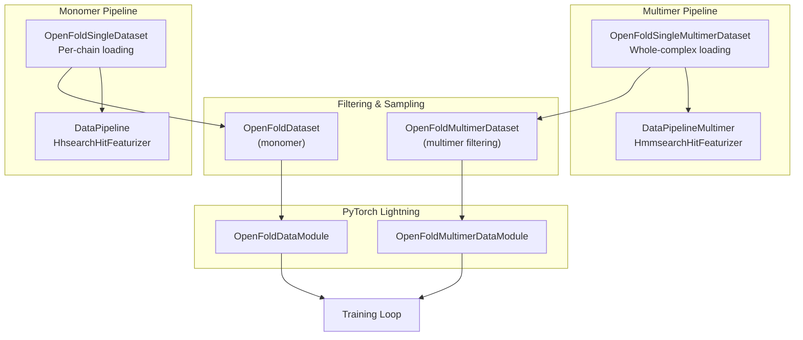
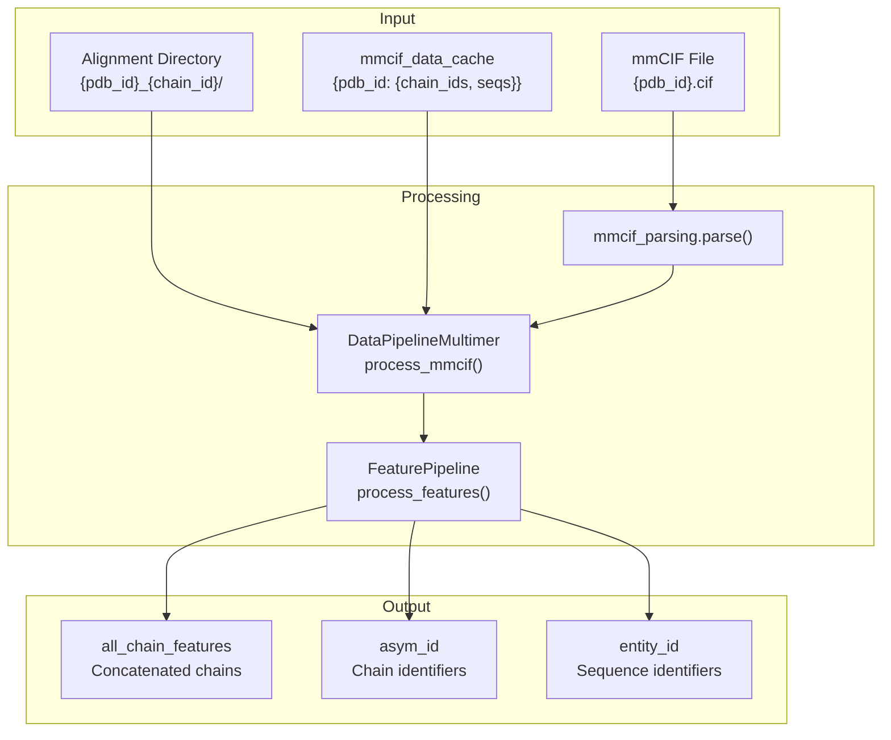
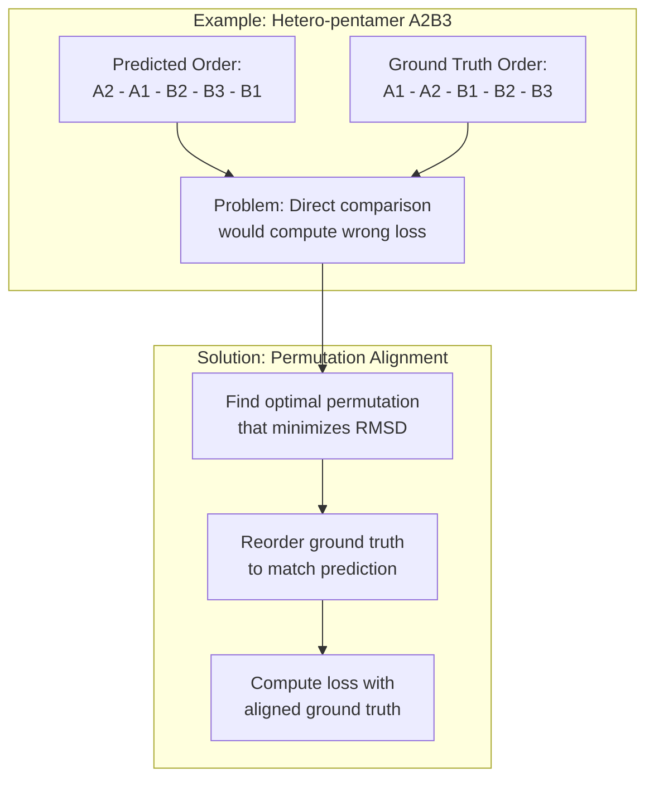
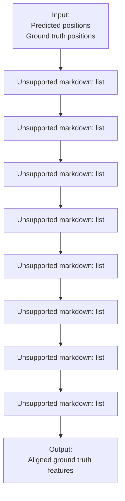
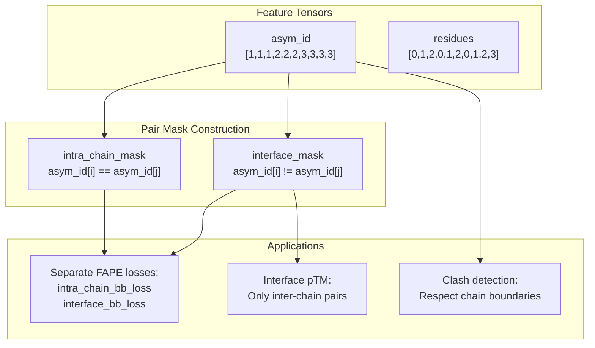
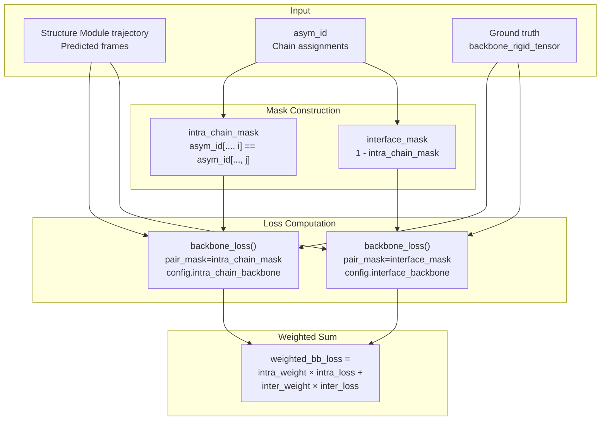
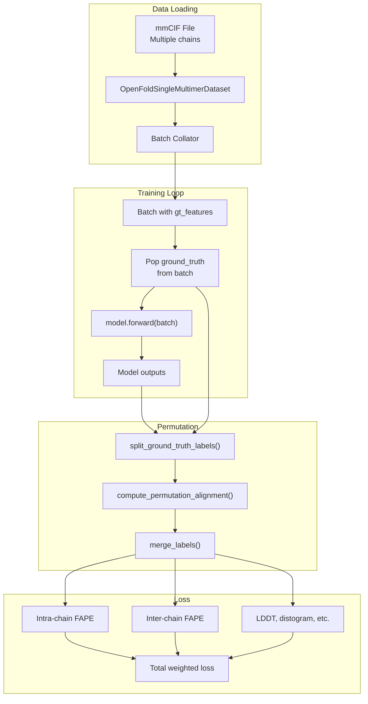

# Multimer\-Specific Processing

# Multimer\-Specific Processing

> **Relevant source files**
> - [openfold/data/data\_modules\.py](https://github.com/aqlaboratory/openfold/blob/56da08ec/openfold/data/data_modules.py)
> - [openfold/utils/loss\.py](https://github.com/aqlaboratory/openfold/blob/56da08ec/openfold/utils/loss.py)
> - [openfold/utils/multi\_chain\_permutation\.py](https://github.com/aqlaboratory/openfold/blob/56da08ec/openfold/utils/multi_chain_permutation.py)
> - [tests/test\_permutation\.py](https://github.com/aqlaboratory/openfold/blob/56da08ec/tests/test_permutation.py)
> - [train\_openfold\.py](https://github.com/aqlaboratory/openfold/blob/56da08ec/train_openfold.py)

## Purpose and Scope

 This page documents the specialized data processing and alignment logic required for predicting multi\-chain protein complexes\. When training or running inference on protein complexes with multiple chains, OpenFold must handle:

 1. **Multi\-chain data loading** \- Reading and organizing features for all chains in a complex
2. **Chain permutation alignment** \- Resolving the ambiguity of which predicted chain corresponds to which ground truth chain
3. **Inter\-chain feature computation** \- Distinguishing intra\-chain vs inter\-chain interactions
4. **Multimer\-specific loss calculations** \- Computing separate losses for chain interfaces vs chain interiors

 For information about the base data pipeline, see [Data Pipeline and Feature Generation](https://deepwiki.com/aqlaboratory/openfold/6.1-data-pipeline-and-feature-generation)\. For MSA and template processing differences in multimer mode, see [MSA and Template Processing](https://deepwiki.com/aqlaboratory/openfold/6.3-msa-and-template-processing)\. For the AlphaFold model itself, see [AlphaFold Model Overview](https://deepwiki.com/aqlaboratory/openfold/5.2-alphafold-model-overview)\.

 **Sources:** [data\_modules\.py L292-L504](https://github.com/aqlaboratory/openfold/blob/56da08ec/openfold/data/data_modules.py#L292-L504) [multi\_chain\_permutation\.py L1-L543](https://github.com/aqlaboratory/openfold/blob/56da08ec/openfold/utils/multi_chain_permutation.py#L1-L543) [train\_openfold\.py L109-L112](https://github.com/aqlaboratory/openfold/blob/56da08ec/train_openfold.py#L109-L112)

---

## Multimer Data Loading Architecture

### Dataset Classes



 **Analysis:** The multimer pipeline uses parallel classes to the monomer pipeline but with key differences\. `OpenFoldSingleMultimerDataset` loads entire PDB structures with all chains, while `OpenFoldSingleDataset` loads individual chains\. The multimer dataset uses `HmmsearchHitFeaturizer` for template search instead of `HhsearchHitFeaturizer`\. The `OpenFoldMultimerDataset` applies multimer\-specific stochastic filtering based on per\-chain cluster sizes\.

 **Sources:** [data\_modules\.py L292-L354](https://github.com/aqlaboratory/openfold/blob/56da08ec/openfold/data/data_modules.py#L292-L354) [data\_modules\.py L664-L754](https://github.com/aqlaboratory/openfold/blob/56da08ec/openfold/data/data_modules.py#L664-L754) [data\_modules\.py L1062-L1133](https://github.com/aqlaboratory/openfold/blob/56da08ec/openfold/data/data_modules.py#L1062-L1133)

---

### Key Differences from Monomer Mode

| Aspect | Monomer | Multimer |
| --- | --- | --- |
| Data Unit | Individual chain | Entire complex |
| Cache File | chain\_data\_cache\_path | mmcif\_data\_cache\_path |
| Cache Structure | \{chain\_id: metadata\} | \{pdb\_id: \{chain\_ids, seqs, \.\.\.\}\} |
| Template Search | HHSearch | HMMSearch |
| Identifier | \{pdb\_id\}\_\{chain\_id\} | \{pdb\_id\} |
| Filtering | Per\-chain cluster size | Per\-chain cluster sizes \(list\) |
| Min Residues | No requirement | 200 residues \(distillation only\) |

 **Sources:** [data\_modules\.py L26-L290](https://github.com/aqlaboratory/openfold/blob/56da08ec/openfold/data/data_modules.py#L26-L290) [data\_modules\.py L292-L504](https://github.com/aqlaboratory/openfold/blob/56da08ec/openfold/data/data_modules.py#L292-L504)

---

### OpenFoldSingleMultimerDataset

 The `OpenFoldSingleMultimerDataset` class handles loading multi\-chain complexes from mmCIF files\. Key features:



 **Key implementation details:**

 - **Line 405\-413:** Uses `HmmsearchHitFeaturizer` instead of `HhsearchHitFeaturizer`
- **Line 418\-420:** Wraps monomer `DataPipeline` in `DataPipelineMultimer`
- **Line 452\-458:** Loads all chains sharing the same PDB ID using alignment index filtering
- **Line 490\-493:** Calls `FeaturePipeline.process_features()` with `is_multimer=True` flag

 **Sources:** [data\_modules\.py L292-L504](https://github.com/aqlaboratory/openfold/blob/56da08ec/openfold/data/data_modules.py#L292-L504)

---

### Multimer\-Specific Filtering

 The `OpenFoldMultimerDataset` applies additional filtering criteria beyond the monomer dataset:

```
# Hard filters (deterministic)- resolution <= 9.0 Å- No single amino acid > 80% of total sequence- Total residues >= 200 (distillation only) # Stochastic filters- Per-chain cluster size: P(sample chain) = 1 / cluster_size
```

 **Implementation:**

 [data\_modules\.py L684-L706](https://github.com/aqlaboratory/openfold/blob/56da08ec/openfold/data/data_modules.py#L684-L706) \- `deterministic_train_filter` checks resolution, amino acid composition, and minimum residue count\.

 [data\_modules\.py L707-L719](https://github.com/aqlaboratory/openfold/blob/56da08ec/openfold/data/data_modules.py#L707-L719) \- `get_stochastic_train_filter_prob` returns a list of probabilities, one per chain, based on cluster sizes\.

 [data\_modules\.py L737-L741](https://github.com/aqlaboratory/openfold/blob/56da08ec/openfold/data/data_modules.py#L737-L741) \- Extends weights list with one entry per chain rather than one per complex\.

 **Sources:** [data\_modules\.py L664-L754](https://github.com/aqlaboratory/openfold/blob/56da08ec/openfold/data/data_modules.py#L664-L754)

---

## Chain Permutation Alignment

### The Permutation Problem

 During training, the model predicts chains in an arbitrary order, but the ground truth has a fixed order\. Without permutation alignment, the model would be penalized for predicting the correct structure in the "wrong" order\.



 **Sources:** [multi\_chain\_permutation\.py L430-L512](https://github.com/aqlaboratory/openfold/blob/56da08ec/openfold/utils/multi_chain_permutation.py#L430-L512) [test\_permutation\.py L80-L174](https://github.com/aqlaboratory/openfold/blob/56da08ec/tests/test_permutation.py#L80-L174)

---

### Permutation Alignment Algorithm

 The chain permutation alignment follows Algorithm 4 from the AlphaFold\-Multimer supplement:



 **Sources:** [multi\_chain\_permutation\.py L430-L512](https://github.com/aqlaboratory/openfold/blob/56da08ec/openfold/utils/multi_chain_permutation.py#L430-L512)

---

### Key Functions in Chain Permutation

#### Anchor Selection

 **Function:** `get_least_asym_entity_or_longest_length()`

 **Purpose:** Select a stable reference chain for alignment that minimizes permutation ambiguity\.

 **Algorithm:**

 1. Count how many copies of each unique sequence exist \(entity counts\)
2. Select entity with fewest copies \(e\.g\., in A2B3, select A\)
3. If tie, select entity with longest sequence
4. Return one ground truth chain and all matching predicted chains

 **Example:** For A2B3 complex:

 - Entity A has 2 chains → count = 2
- Entity B has 3 chains → count = 3
- Select entity A \(fewer copies\)
- Return: `anchor_gt_asym=1` \(or 2\), `anchor_pred_asym=[1,2]`

 **Sources:** [multi\_chain\_permutation\.py L111-L164](https://github.com/aqlaboratory/openfold/blob/56da08ec/openfold/utils/multi_chain_permutation.py#L111-L164) [test\_permutation\.py L60-L78](https://github.com/aqlaboratory/openfold/blob/56da08ec/tests/test_permutation.py#L60-L78)

---

#### Optimal Transform Computation

 **Function:** `get_optimal_transform()` and `kabsch_rotation()`

 **Purpose:** Compute rotation matrix R and translation vector x that best align predicted anchor to ground truth anchor\.

 **Kabsch Algorithm:**

```yaml
Input: Source points P, Target points Q
1. Center both: P' = P - mean(P), Q' = Q - mean(Q)
2. Compute covariance: H = P'^T · Q'
3. SVD: H = U · Σ · V^T
4. Construct correction: S = diag(1, 1, sign(det(U·V^T)))
5. Optimal rotation: R = U · S · V^T
6. Translation: x = mean(Q) - mean(P) · R
```

 **Sources:** [multi\_chain\_permutation\.py L35-L62](https://github.com/aqlaboratory/openfold/blob/56da08ec/openfold/utils/multi_chain_permutation.py#L35-L62) [multi\_chain\_permutation\.py L64-L108](https://github.com/aqlaboratory/openfold/blob/56da08ec/openfold/utils/multi_chain_permutation.py#L64-L108)

---

#### Greedy Chain Matching

 **Function:** `greedy_align()`

 **Purpose:** Match remaining chains to minimize total RMSD using greedy algorithm\.

 **Algorithm:**

```yaml
For each predicted chain i:
    best_rmsd = infinity
    best_match = None
    
    For each unused ground truth chain j with same sequence:
        Compute RMSD between i and j
        If RMSD < best_rmsd:
            best_rmsd = RMSD
            best_match = j
    
    Mark best_match as used
    Record alignment (i, best_match)

Return: List of (pred_idx, gt_idx) tuples
```

 **Sources:** [multi\_chain\_permutation\.py L167-L228](https://github.com/aqlaboratory/openfold/blob/56da08ec/openfold/utils/multi_chain_permutation.py#L167-L228) [test\_permutation\.py L80-L174](https://github.com/aqlaboratory/openfold/blob/56da08ec/tests/test_permutation.py#L80-L174)

---

### Permutation Alignment Flow

```mermaid
sequenceDiagram
  participant train_openfold.py
  participant OpenFoldWrapper
  participant multi_chain_permutation_align()
  participant compute_permutation_alignment()
  participant merge_labels()

  train_openfold.py->>OpenFoldWrapper: training_step(batch)
  OpenFoldWrapper->>OpenFoldWrapper: outputs = model(batch)
  OpenFoldWrapper->>multi_chain_permutation_align(): multi_chain_permutation_align(
  multi_chain_permutation_align()->>multi_chain_permutation_align(): out=outputs, features=batch,
  multi_chain_permutation_align()->>compute_permutation_alignment(): ground_truth=gt_features)
  compute_permutation_alignment()->>compute_permutation_alignment(): labels = split_ground_truth_labels()
  compute_permutation_alignment()->>compute_permutation_alignment(): compute_permutation_alignment()
  compute_permutation_alignment()->>compute_permutation_alignment(): Select anchor chains
  compute_permutation_alignment()->>compute_permutation_alignment(): For each anchor candidate:
  compute_permutation_alignment()->>compute_permutation_alignment(): - compute optimal transform
  compute_permutation_alignment()->>compute_permutation_alignment(): - apply transform to GT
  compute_permutation_alignment()->>compute_permutation_alignment(): - greedy_align chains
  compute_permutation_alignment()-->>multi_chain_permutation_align(): - compute total RMSD
  multi_chain_permutation_align()->>merge_labels(): Return best permutation
  merge_labels()-->>multi_chain_permutation_align(): align, per_asym_residue_index
  multi_chain_permutation_align()-->>OpenFoldWrapper: merge_labels(align, labels)
  OpenFoldWrapper->>OpenFoldWrapper: reordered ground truth
```

 **Sources:** [train\_openfold\.py L109-L112](https://github.com/aqlaboratory/openfold/blob/56da08ec/train_openfold.py#L109-L112) [multi\_chain\_permutation\.py L515-L542](https://github.com/aqlaboratory/openfold/blob/56da08ec/openfold/utils/multi_chain_permutation.py#L515-L542)

---

### Label Merging After Permutation

 **Function:** `merge_labels()`

 After determining the optimal permutation, ground truth features must be reordered to match the predicted structure:

 **Process:**

 1. Split original ground truth by chain using `asym_id`
2. For each permutation tuple `(pred_idx, gt_idx)`: - Select ground truth chain `gt_idx` - Index it using residues from predicted chain `pred_idx` - Append to new concatenated tensor
3. Pad if necessary to match input size

 **Example:**

```
Alignment: [(0,1), (1,0), (2,3), (3,4), (4,2)]

Original GT: [Chain0, Chain1, Chain2, Chain3, Chain4]
Reordered GT: [Chain1, Chain0, Chain3, Chain4, Chain2]
                  ↑       ↑       ↑       ↑       ↑
              pred 0   pred 1  pred 2  pred 3  pred 4
```

 **Sources:** [multi\_chain\_permutation\.py L249-L286](https://github.com/aqlaboratory/openfold/blob/56da08ec/openfold/utils/multi_chain_permutation.py#L249-L286) [test\_permutation\.py L175-L254](https://github.com/aqlaboratory/openfold/blob/56da08ec/tests/test_permutation.py#L175-L254)

---

## Inter\-Chain Feature Pairing

### Asymmetric ID \(asym\_id\)

 The `asym_id` tensor identifies which chain each residue belongs to\. It is the primary mechanism for distinguishing intra\-chain from inter\-chain pairs:



 **Sources:** [loss\.py L291-L312](https://github.com/aqlaboratory/openfold/blob/56da08ec/openfold/utils/loss.py#L291-L312)

---

### Entity ID \(entity\_id\)

 The `entity_id` tensor groups chains with identical sequences\. Multiple chains can share the same `entity_id`:

```yaml
Example: A2B3 complex
asym_id:   [1, 1, 1, 2, 2, 2, 3, 3, 3, 3, 4, 4, 4, 4, 5, 5, 5, 5]
entity_id: [1, 1, 1, 1, 1, 1, 2, 2, 2, 2, 2, 2, 2, 2, 2, 2, 2, 2]
            └─ Chain A1 ┘ └─ Chain A2 ┘ └─────────── Chains B1, B2, B3 ──────────┘
```

 **Usage:**

 - **Permutation alignment:** Group chains by entity for matching
- **Anchor selection:** Select entity with fewest chains
- **Filtering:** Validate sequence composition per entity

 **Sources:** [multi\_chain\_permutation\.py L336-L353](https://github.com/aqlaboratory/openfold/blob/56da08ec/openfold/utils/multi_chain_permutation.py#L336-L353)

---

### Symmetry ID \(sym\_id\)

 The `sym_id` \(not extensively used in current code\) can mark symmetric chains for specialized handling\. In most cases, `sym_id` equals `asym_id`\.

 **Sources:** [test\_permutation\.py L54-L58](https://github.com/aqlaboratory/openfold/blob/56da08ec/tests/test_permutation.py#L54-L58)

---

## Multimer\-Specific Loss Components

### Backbone FAPE Loss Separation

 The backbone FAPE loss is computed separately for intra\-chain and inter\-chain residue pairs:



 **Implementation:** [loss\.py L291-L312](https://github.com/aqlaboratory/openfold/blob/56da08ec/openfold/utils/loss.py#L291-L312)

 **Configuration:**

```
# From config filesconfig.loss.fape.intra_chain_backbone.weight = 0.5config.loss.fape.intra_chain_backbone.clamp_distance = 10.0config.loss.fape.intra_chain_backbone.loss_unit_distance = 10.0 config.loss.fape.interface_backbone.weight = 0.5config.loss.fape.interface_backbone.clamp_distance = 30.0config.loss.fape.interface_backbone.loss_unit_distance = 20.0
```

 **Sources:** [loss\.py L286-L325](https://github.com/aqlaboratory/openfold/blob/56da08ec/openfold/utils/loss.py#L286-L325)

---

### Interface Predicted TM Score \(ipTM\)

 The interface pTM score measures confidence in inter\-chain relative positioning:

 **Computation:**

 1. Compute pairwise distance error logits
2. Construct pair mask: `asym_id[i] != asym_id[j]`
3. Calculate TM score using only inter\-chain pairs
4. Weight by `1 / (1 + (d/d0)²)` where d0 depends on protein size

 **Implementation:** [loss\.py L670-L719](https://github.com/aqlaboratory/openfold/blob/56da08ec/openfold/utils/loss.py#L670-L719)

 **Key code:**

```
if interface and (asym_id is not None):    pair_mask *= (asym_id[..., None] != asym_id[..., None, :])
```

 The `interface=True` flag triggers inter\-chain only computation\.

 **Sources:** [loss\.py L670-L719](https://github.com/aqlaboratory/openfold/blob/56da08ec/openfold/utils/loss.py#L670-L719)

---

### Clash Loss with Chain Boundaries

 The between\-residue clash loss respects chain boundaries to avoid penalizing C\-N bonds between chains:

 **Logic:**

 1. Compute all pairwise atom distances
2. Check if consecutive residues are in same chain:  ``` neighbour_mask = (residue_index[i] + 1 == residue_index[j])if asym_id is not None:    neighbour_mask = neighbour_mask & (asym_id[i] == asym_id[j]) ```
3. Exclude C\-N bonds across chain boundaries from penalties

 **Implementation:** [loss\.py L1022-L1034](https://github.com/aqlaboratory/openfold/blob/56da08ec/openfold/utils/loss.py#L1022-L1034)

 **Sources:** [loss\.py L942-L1094](https://github.com/aqlaboratory/openfold/blob/56da08ec/openfold/utils/loss.py#L942-L1094)

---

## Training Integration

### Training Step with Permutation

```python
def training_step(self, batch, batch_idx):    ground_truth = batch.pop('gt_features', None)    outputs = self(batch)    batch = tensor_tree_map(lambda t: t[..., -1], batch)        if self.is_multimer:        batch = multi_chain_permutation_align(            out=outputs,            features=batch,            ground_truth=ground_truth        )        loss, loss_breakdown = self.loss(outputs, batch, _return_breakdown=True)    return loss
```

 **Key points:**

 1. Ground truth is popped before model forward pass
2. Model predicts without seeing ground truth labels
3. After prediction, permutation alignment reorders ground truth
4. Loss is computed against aligned ground truth

 **Sources:** [train\_openfold\.py L97-L122](https://github.com/aqlaboratory/openfold/blob/56da08ec/train_openfold.py#L97-L122)

---

### Data Flow Diagram



 **Sources:** [train\_openfold\.py L97-L122](https://github.com/aqlaboratory/openfold/blob/56da08ec/train_openfold.py#L97-L122) [loss\.py L286-L326](https://github.com/aqlaboratory/openfold/blob/56da08ec/openfold/utils/loss.py#L286-L326)

---

## Summary of Key Code Entities

### Data Classes

| Class | Purpose | Key Methods |
| --- | --- | --- |
| OpenFoldSingleMultimerDataset | Load multi\-chain complexes | \_\_getitem\_\_\(\), \_parse\_mmcif\(\) |
| OpenFoldMultimerDataset | Stochastic filtering for multimers | deterministic\_train\_filter\(\), looped\_samples\(\) |
| OpenFoldMultimerDataModule | PyTorch Lightning data module | setup\(\), train\_dataloader\(\) |

### Permutation Functions

| Function | Purpose | Location |
| --- | --- | --- |
| multi\_chain\_permutation\_align\(\) | Main entry point | multi\_chain\_permutation\.py515\-542 |
| compute\_permutation\_alignment\(\) | Compute optimal permutation | multi\_chain\_permutation\.py430\-512 |
| get\_least\_asym\_entity\_or\_longest\_length\(\) | Select anchor chain | multi\_chain\_permutation\.py111\-164 |
| get\_optimal\_transform\(\) | Kabsch alignment | multi\_chain\_permutation\.py64\-108 |
| greedy\_align\(\) | Greedy chain matching | multi\_chain\_permutation\.py167\-228 |
| merge\_labels\(\) | Reorder ground truth | multi\_chain\_permutation\.py249\-286 |

### Loss Functions

| Function | Purpose | Multimer\-Specific |
| --- | --- | --- |
| fape\_loss\(\) | FAPE with chain separation | Lines 291\-312 check asym\_id |
| compute\_tm\(\) | pTM/ipTM calculation | interface=True for ipTM |
| between\_residue\_clash\_loss\(\) | Clash detection | Lines 1024\-1025 respect chain boundaries |

 **Sources:** [data\_modules\.py L1-L1133](https://github.com/aqlaboratory/openfold/blob/56da08ec/openfold/data/data_modules.py#L1-L1133) [multi\_chain\_permutation\.py L1-L543](https://github.com/aqlaboratory/openfold/blob/56da08ec/openfold/utils/multi_chain_permutation.py#L1-L543) [loss\.py L1-L1304](https://github.com/aqlaboratory/openfold/blob/56da08ec/openfold/utils/loss.py#L1-L1304)

---
*Source: [https://deepwiki.com/aqlaboratory/openfold/6.4-multimer-specific-processing](https://deepwiki.com/aqlaboratory/openfold/6.4-multimer-specific-processing) on DeepWiki*