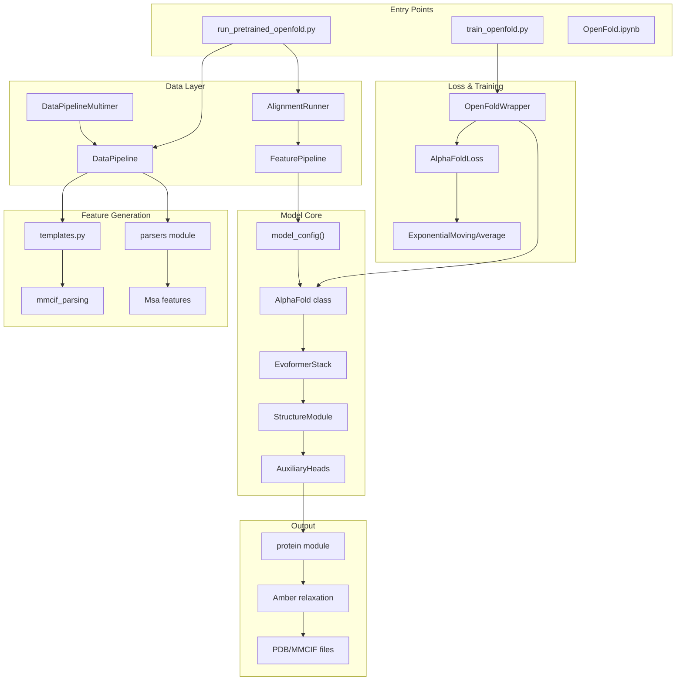
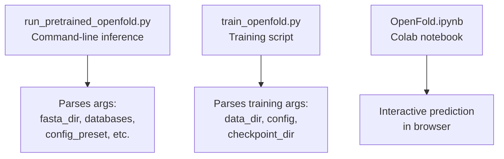
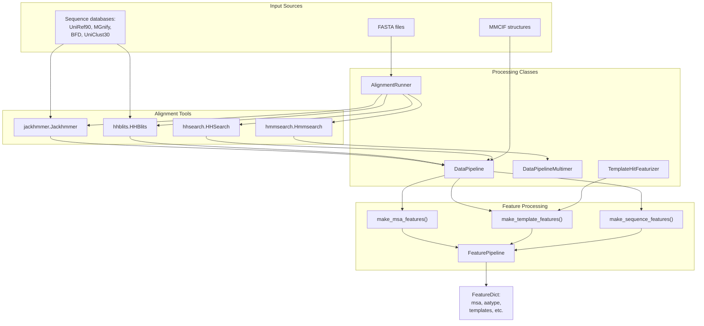
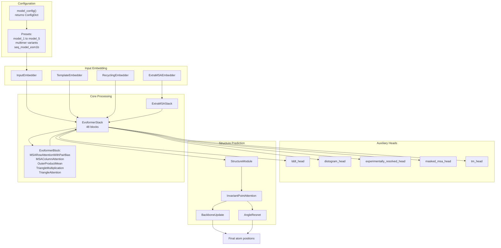
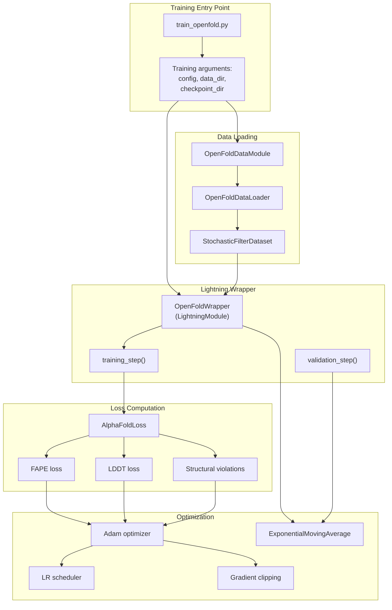
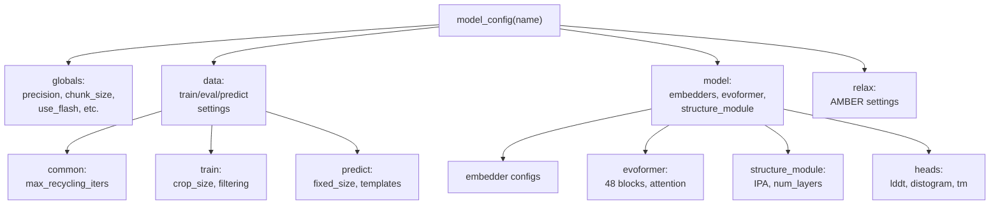
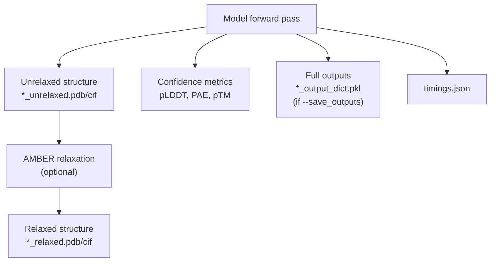

# OpenFold Overview

# OpenFold Overview

> **Relevant source files**
> - [README\.md](https://github.com/aqlaboratory/openfold/blob/56da08ec/README.md?plain=1)
> - [docs/source/Inference\.md](https://github.com/aqlaboratory/openfold/blob/56da08ec/docs/source/Inference.md?plain=1)
> - [docs/source/Multimer\_Inference\.md](https://github.com/aqlaboratory/openfold/blob/56da08ec/docs/source/Multimer_Inference.md?plain=1)
> - [docs/source/Single\_Sequence\_Inference\.md](https://github.com/aqlaboratory/openfold/blob/56da08ec/docs/source/Single_Sequence_Inference.md?plain=1)
> - [docs/source/conf\.py](https://github.com/aqlaboratory/openfold/blob/56da08ec/docs/source/conf.py)
> - [openfold/data/data\_pipeline\.py](https://github.com/aqlaboratory/openfold/blob/56da08ec/openfold/data/data_pipeline.py)
> - [openfold/data/templates\.py](https://github.com/aqlaboratory/openfold/blob/56da08ec/openfold/data/templates.py)
> - [run\_pretrained\_openfold\.py](https://github.com/aqlaboratory/openfold/blob/56da08ec/run_pretrained_openfold.py)
> - [scripts/generate\_mmcif\_cache\.py](https://github.com/aqlaboratory/openfold/blob/56da08ec/scripts/generate_mmcif_cache.py)
> - [scripts/precompute\_alignments\.py](https://github.com/aqlaboratory/openfold/blob/56da08ec/scripts/precompute_alignments.py)
> - [scripts/utils\.py](https://github.com/aqlaboratory/openfold/blob/56da08ec/scripts/utils.py)

 This page provides a high\-level introduction to OpenFold, its architecture, and its capabilities\. For detailed setup instructions, see [Installation and Environment Setup](https://deepwiki.com/aqlaboratory/openfold/2-installation-and-environment-setup)\. For running predictions, see [Running Inference](https://deepwiki.com/aqlaboratory/openfold/3-running-inference)\. For training details, see [Training OpenFold](https://deepwiki.com/aqlaboratory/openfold/4-training-openfold)\.

## What is OpenFold

 OpenFold is a trainable, memory\-efficient PyTorch reimplementation of DeepMind's AlphaFold 2, a deep learning system for protein structure prediction\. Unlike the original JAX\-based AlphaFold implementation, OpenFold provides:

 - **Full trainability**: All components can be trained from scratch
- **PyTorch implementation**: Native integration with the PyTorch ecosystem
- **Memory optimizations**: Support for long sequences and limited GPU memory
- **Multiple inference modes**: Monomer, multimer, and single\-sequence prediction
- **Reproducible training**: Open training pipeline and datasets \(OpenProteinSet\)

 The project maintains compatibility with AlphaFold's model parameters while offering additional flexibility for research and development\.

 **Sources:** [README\.md?plain=1 L1-L57](https://github.com/aqlaboratory/openfold/blob/56da08ec/README.md?plain=1#L1-L57)

## Key Capabilities

 OpenFold supports three primary structure prediction modes:

| Mode | Description | Model Preset | Key Features |
| --- | --- | --- | --- |
| Monomer | Single\-chain protein prediction | model\_1 through model\_5 | Template\-based or template\-free, pTM scoring |
| Multimer | Multi\-chain complex prediction | model\_\*\_multimer\_v3 | Chain pairing, interface prediction, AlphaFold\-Multimer v2\.3 |
| SoloSeq | MSA\-free single sequence prediction | seq\_model\_esm1b\_ptm | ESM\-1b embeddings, fast inference without MSA generation |

 All modes support:

 - Configurable precision \(FP32, TF32, FP16, BF16\)
- Optimized attention kernels \(DeepSpeed, FlashAttention, cuEquivariance\)
- Optional AMBER relaxation
- TensorRT acceleration
- Long sequence inference strategies

 **Sources:** [Inference\.md?plain=1 L1-L195](https://github.com/aqlaboratory/openfold/blob/56da08ec/docs/source/Inference.md?plain=1#L1-L195) [Multimer\_Inference\.md?plain=1 L1-L78](https://github.com/aqlaboratory/openfold/blob/56da08ec/docs/source/Multimer_Inference.md?plain=1#L1-L78) [Single\_Sequence\_Inference\.md?plain=1 L1-L57](https://github.com/aqlaboratory/openfold/blob/56da08ec/docs/source/Single_Sequence_Inference.md?plain=1#L1-L57)

## System Architecture Overview



 **System Architecture Diagram**: Core components and data flow from input to output

 **Sources:** [run\_pretrained\_openfold\.py L1-L542](https://github.com/aqlaboratory/openfold/blob/56da08ec/run_pretrained_openfold.py#L1-L542) [data\_pipeline\.py L1-L1163](https://github.com/aqlaboratory/openfold/blob/56da08ec/openfold/data/data_pipeline.py#L1-L1163)

## Major System Components

### User Interfaces

 OpenFold provides three primary interfaces for users:



 **User Interface Entry Points**

 The main inference script accepts FASTA files and produces PDB/MMCIF predictions:

 - Handles monomer, multimer, and SoloSeq modes via `--config_preset`
- Manages alignment generation or loads precomputed alignments
- Supports various optimization flags for performance tuning

 **Sources:** [run\_pretrained\_openfold\.py L397-L542](https://github.com/aqlaboratory/openfold/blob/56da08ec/run_pretrained_openfold.py#L397-L542) [utils\.py L13-L66](https://github.com/aqlaboratory/openfold/blob/56da08ec/scripts/utils.py#L13-L66)

### Data Processing Pipeline

 The data processing system transforms raw biological data into model\-ready features:



 **Data Pipeline Components and Flow**

 The `AlignmentRunner` class orchestrates sequence database searches:

 - Runs Jackhmmer against UniRef90 and MGnify
- Runs HHBlits/Jackhmmer against BFD
- Performs template search with HHSearch \(monomer\) or HMMSearch \(multimer\)

 The `DataPipeline` class parses alignment outputs and generates features:

 - `process_fasta()` \- Processes single\-chain sequences
- `process_mmcif()` \- Processes structure files for training
- `_parse_msa_data()` \- Parses MSA files \(Stockholm, A3M formats\)
- `_parse_template_hit_files()` \- Parses template search results

 For multimer predictions, `DataPipelineMultimer` extends the monomer pipeline with chain pairing logic\.

 **Sources:** [data\_pipeline\.py L334-L563](https://github.com/aqlaboratory/openfold/blob/56da08ec/openfold/data/data_pipeline.py#L334-L563) [data\_pipeline\.py L706-L914](https://github.com/aqlaboratory/openfold/blob/56da08ec/openfold/data/data_pipeline.py#L706-L914) [data\_pipeline\.py L1006-L1163](https://github.com/aqlaboratory/openfold/blob/56da08ec/openfold/data/data_pipeline.py#L1006-L1163)

### Model Architecture



 **Model Architecture: From Input to Structure Prediction**

 The model follows this processing flow:

 1. **Configuration**: `model_config()` function returns a configuration preset
2. **Input Embedders**: Convert raw features into latent representations \(MSA, pair, and template embeddings\)
3. **Recycling**: `RecyclingEmbedder` incorporates outputs from previous iterations
4. **Evoformer Processing**: 48 blocks of attention and geometric operations
5. **Structure Module**: Converts latent representations to 3D coordinates using invariant point attention
6. **Auxiliary Heads**: Predict confidence metrics \(pLDDT, PAE, pTM\)

 Key model classes:

 - `AlphaFold` \- Main model class coordinating all components
- `EvoformerStack` \- Core reasoning engine with MSA and pair tracks
- `StructureModule` \- 3D coordinate prediction with geometric constraints
- `AuxiliaryHeads` \- Confidence and quality predictions

 **Sources:** [config\.py L105-L283](https://github.com/aqlaboratory/openfold/blob/56da08ec/openfold/config.py#L105-L283) [model\.py L1-L500](https://github.com/aqlaboratory/openfold/blob/56da08ec/openfold/model/model.py#L1-L500)

### Training System



 **Training System Components**

 The training system uses PyTorch Lightning for orchestration:

 - `OpenFoldWrapper` \- Lightning module wrapping the AlphaFold model
- `OpenFoldDataModule` \- Handles dataset loading with stochastic filtering
- `AlphaFoldLoss` \- Composite loss with FAPE, LDDT, and structural violation terms
- `ExponentialMovingAverage` \- Smoothed weights for validation

 Training features:

 - Distributed training with DeepSpeed
- Gradient checkpointing for memory efficiency
- Recycling iterations during training
- Chunked processing for long sequences
- Stochastic data filtering by cluster size and sequence length

 **Sources:** [train\_openfold\.py L1-L200](https://github.com/aqlaboratory/openfold/blob/56da08ec/train_openfold.py#L1-L200) [loss\.py L1-L500](https://github.com/aqlaboratory/openfold/blob/56da08ec/openfold/utils/loss.py#L1-L500)

## Feature Dictionary Structure

 The `FeatureDict` is the central data structure passed through the system:

| Feature Key | Shape | Type | Description |
| --- | --- | --- | --- |
| aatype | \[N\_res\] or \[N\_res, 21\] | int32/float32 | Amino acid type \(one\-hot or indices\) |
| msa | \[N\_seq, N\_res\] | int32 | Multiple sequence alignment |
| deletion\_matrix\_int | \[N\_seq, N\_res\] | int32 | Deletion counts in MSA |
| template\_aatype | \[N\_templ, N\_res, 22\] | float32 | Template amino acid types |
| template\_all\_atom\_positions | \[N\_templ, N\_res, 37, 3\] | float32 | Template atomic coordinates |
| template\_all\_atom\_mask | \[N\_templ, N\_res, 37\] | float32 | Template atom validity mask |
| residue\_index | \[N\_res\] | int32 | Residue position indices |
| seq\_length | \[N\_res\] | int32 | Sequence length \(repeated\) |
| all\_atom\_positions | \[N\_res, 37, 3\] | float32 | Ground truth coordinates \(training\) |
| all\_atom\_mask | \[N\_res, 37\] | float32 | Atom validity mask \(training\) |

 For multimer predictions, additional features track chain identities:

 - `asym_id` \- Asymmetric chain ID
- `sym_id` \- Symmetric chain ID
- `entity_id` \- Entity ID for grouping identical sequences

 **Sources:** [data\_pipeline\.py L111-L131](https://github.com/aqlaboratory/openfold/blob/56da08ec/openfold/data/data_pipeline.py#L111-L131) [data\_pipeline\.py L224-L261](https://github.com/aqlaboratory/openfold/blob/56da08ec/openfold/data/data_pipeline.py#L224-L261)

## Configuration System

 OpenFold uses `ml_collections.ConfigDict` for hierarchical configuration:



 **Configuration Hierarchy**

 Available presets include:

 - `model_1` through `model_5` \- Monomer models with/without templates
- `model_1_ptm` through `model_5_ptm` \- Monomer models with pTM scoring
- `model_*_multimer_v3` \- Multimer models
- `seq_model_esm1b_ptm` \- SoloSeq model with ESM\-1b embeddings

 Configuration can be customized via:

 - Command\-line flags \(e\.g\., `--long_sequence_inference`\)
- JSON config file \(`--experiment_config_json`\)
- Direct modification of the config object

 **Sources:** [config\.py L1-L283](https://github.com/aqlaboratory/openfold/blob/56da08ec/openfold/config.py#L1-L283) [run\_pretrained\_openfold\.py L184-L202](https://github.com/aqlaboratory/openfold/blob/56da08ec/run_pretrained_openfold.py#L184-L202)

## Memory and Performance Optimizations

 OpenFold includes several optimization strategies:

| Optimization | Enabled By | Effect | Use Case |
| --- | --- | --- | --- |
| DeepSpeed Attention | \-\-use\_deepspeed\_evoformer\_attention | 2\-3x faster inference | General use |
| FlashAttention | globals\.use\_flash=True | Memory\-efficient attention | Sequences < 1000 residues |
| cuEquivariance kernels | \-\-use\_cuequivariance\_attention | 1\.2\-1\.5x speedup | All sequence lengths |
| TensorRT | \-\-trt\_mode=run | Module\-level optimization | Batch inference |
| BF16 precision | \-\-precision=bf16 | ~1\.5x speedup vs TF32 | Ampere\+ GPUs |
| Low\-memory attention | long\_sequence\_inference | Reduced memory | Long sequences \(\>1000 residues\) |
| Template offloading | offload\_templates=True | Reduced memory | Many templates |
| Gradient checkpointing | Training default | Reduced memory | Training |
| Model tracing | \-\-trace\_model | Faster repeated inference | Batch jobs |

 **Sources:** [Inference\.md?plain=1 L145-L194](https://github.com/aqlaboratory/openfold/blob/56da08ec/docs/source/Inference.md?plain=1#L145-L194) [run\_pretrained\_openfold\.py L184-L196](https://github.com/aqlaboratory/openfold/blob/56da08ec/run_pretrained_openfold.py#L184-L196)

## Output Files and Formats

 The inference pipeline produces:



 **Output Structure**

 Default output directory structure:

```
output_dir/
├── alignments/
│   └── {sequence_name}/
│       ├── uniref90_hits.sto
│       ├── mgnify_hits.sto
│       ├── bfd_uniclust_hits.a3m
│       └── hhsearch_output.hhr (or hmmsearch_output.sto)
├── predictions/
│   ├── {sequence_name}_{preset}_unrelaxed.pdb
│   └── {sequence_name}_{preset}_relaxed.pdb
└── timings.json
```

 PDB files include:

 - Predicted atomic coordinates
- B\-factors: pLDDT scores \(or 100\-pLDDT if `--subtract_plddt`\)
- Metadata in header

 **Sources:** [run\_pretrained\_openfold\.py L356-L395](https://github.com/aqlaboratory/openfold/blob/56da08ec/run_pretrained_openfold.py#L356-L395) [protein\.py L1-L300](https://github.com/aqlaboratory/openfold/blob/56da08ec/openfold/np/protein.py#L1-L300)

## Relation to AlphaFold

 OpenFold maintains compatibility with AlphaFold parameters while providing enhancements:

| Aspect | AlphaFold 2 | OpenFold |
| --- | --- | --- |
| Framework | JAX | PyTorch |
| Trainability | Limited | Full |
| Parameters | DeepMind pretrained | AlphaFold or OpenFold trained |
| Memory | Standard | Optimized \(DeepSpeed, offloading\) |
| Kernels | XLA optimizations | DeepSpeed, FlashAttention, cuEquivariance |
| Licensing | Parameters: CC BY 4\.0 | Code: Apache 2\.0, Parameters: CC BY 4\.0 |
| Training data | Proprietary | OpenProteinSet \(public\) |

 OpenFold can load and use AlphaFold's pretrained parameters directly via the `--jax_param_path` argument\. The model architecture is functionally equivalent, ensuring predictions match AlphaFold 2 when using the same parameters and input features\.

 **Sources:** [README\.md?plain=1 L4-L20](https://github.com/aqlaboratory/openfold/blob/56da08ec/README.md?plain=1#L4-L20) [import\_weights\.py L1-L200](https://github.com/aqlaboratory/openfold/blob/56da08ec/openfold/utils/import_weights.py#L1-L200)

## Getting Started

 To begin using OpenFold:

 1. **Installation**: Follow [Installation and Environment Setup](https://deepwiki.com/aqlaboratory/openfold/2-installation-and-environment-setup) to set up dependencies and download databases
2. **Inference**: See [Running Inference](https://deepwiki.com/aqlaboratory/openfold/3-running-inference) for structure prediction workflows - [Monomer Inference](https://deepwiki.com/aqlaboratory/openfold/3.2-monomer-inference) for single\-chain predictions - [Multimer Inference](https://deepwiki.com/aqlaboratory/openfold/3.3-multimer-inference) for protein complexes - [Single Sequence Inference](https://deepwiki.com/aqlaboratory/openfold/3.4-single-sequence-(soloseq)-inference) for fast MSA\-free predictions
3. **Training**: See [Training OpenFold](https://deepwiki.com/aqlaboratory/openfold/4-training-openfold) to train models from scratch
4. **Model Details**: Explore [Model Architecture](https://deepwiki.com/aqlaboratory/openfold/5-model-architecture) for component\-level documentation

 For questions and issues, visit the [GitHub repository](https://github.com/aqlaboratory/openfold/blob/56da08ec/GitHub repository)

 **Sources:** [README\.md?plain=1 L1-L57](https://github.com/aqlaboratory/openfold/blob/56da08ec/README.md?plain=1#L1-L57) [Inference\.md?plain=1 L1-L50](https://github.com/aqlaboratory/openfold/blob/56da08ec/docs/source/Inference.md?plain=1#L1-L50)

---
*Source: [https://deepwiki.com/aqlaboratory/openfold/1-openfold-overview](https://deepwiki.com/aqlaboratory/openfold/1-openfold-overview) on DeepWiki*