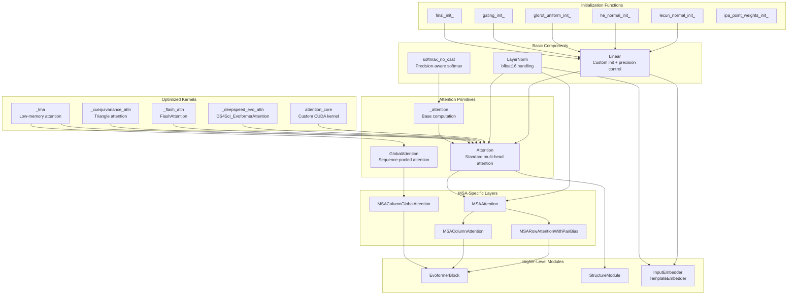
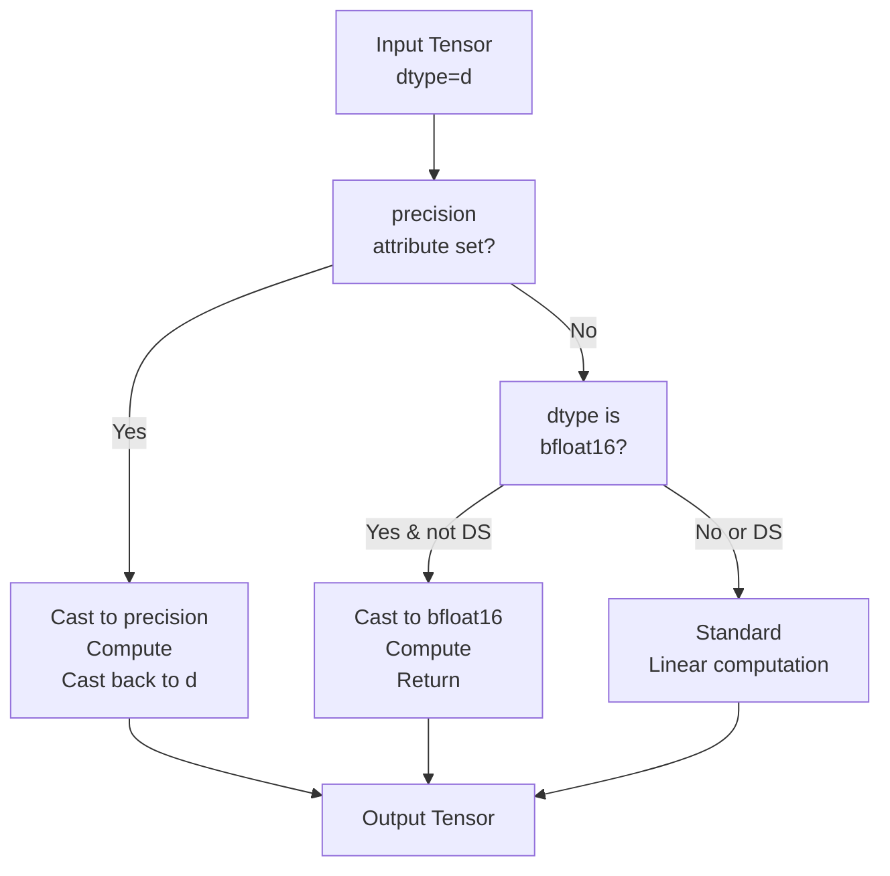
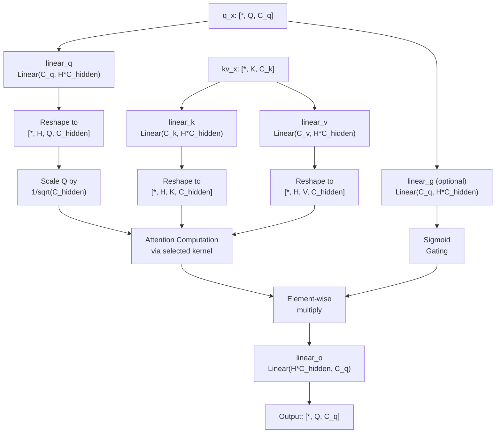
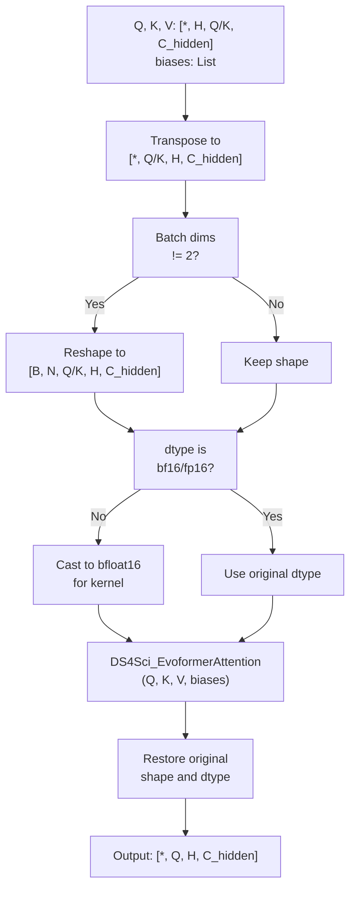
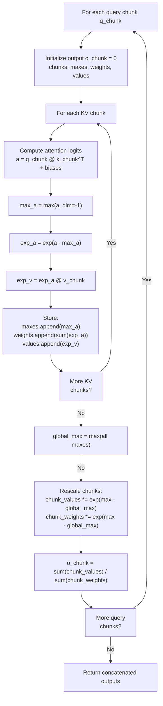
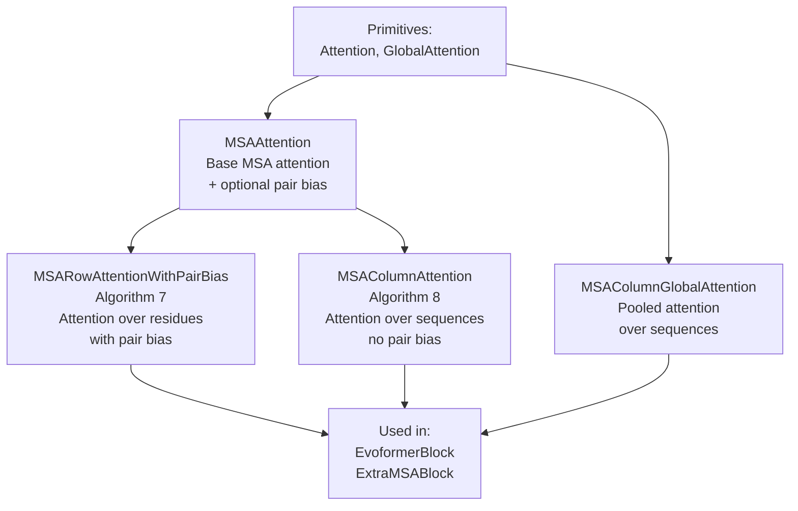
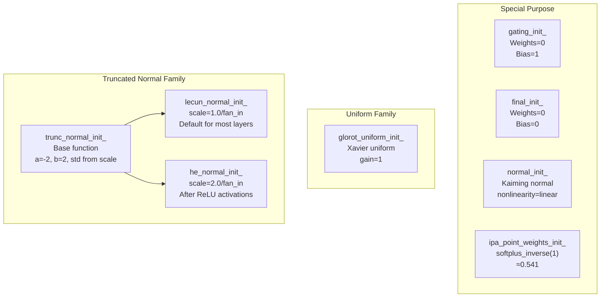
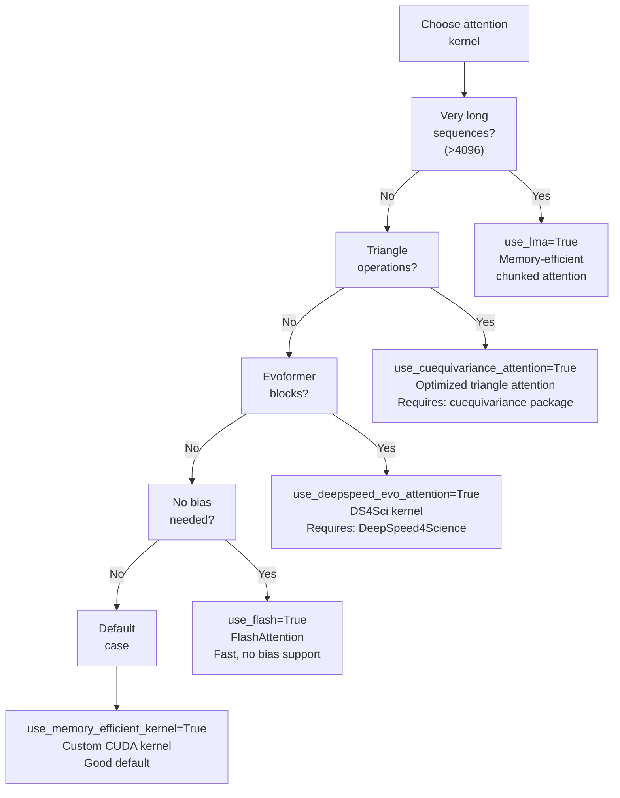

# Primitives and Building Blocks

# Primitives and Building Blocks

> **Relevant source files**
> - [openfold/model/msa\.py](https://github.com/aqlaboratory/openfold/blob/56da08ec/openfold/model/msa.py)
> - [openfold/model/primitives\.py](https://github.com/aqlaboratory/openfold/blob/56da08ec/openfold/model/primitives.py)

## Purpose and Scope

 This page documents the fundamental neural network components that form the computational foundation of OpenFold\. These primitives include basic layers \(`Linear`, `LayerNorm`\), attention mechanisms \(`Attention`, `GlobalAttention`\), and their optimized kernel implementations\. These building blocks are composed throughout the model architecture to implement the Evoformer, Structure Module, and other high\-level components described in pages [5\.2](https://deepwiki.com/aqlaboratory/openfold/5.2-alphafold-model-overview), [5\.3](https://deepwiki.com/aqlaboratory/openfold/5.3-evoformer-stack), and [5\.4](https://deepwiki.com/aqlaboratory/openfold/5.4-structure-module)\.

 The primitives in OpenFold extend standard PyTorch modules with:

 - Custom initialization schemes matching AlphaFold's specifications
- Multiple optimized attention kernel backends for performance
- Precision\-aware operations for bfloat16 and mixed\-precision training
- Memory\-efficient implementations for long sequences

---

## Architecture Overview

 The following diagram shows how primitives relate to each other and to higher\-level model components:



 **Sources:** [primitives\.py L1-L936](https://github.com/aqlaboratory/openfold/blob/56da08ec/openfold/model/primitives.py#L1-L936) [msa\.py L1-L503](https://github.com/aqlaboratory/openfold/blob/56da08ec/openfold/model/msa.py#L1-L503)

---

## Basic Components

### Linear Layer

 The `Linear` class extends `torch.nn.Linear` with custom initialization schemes and precision control\. It is the fundamental building block for all linear transformations in the model\.

#### Initialization Schemes

 The layer supports multiple initialization strategies specified via the `init` parameter:

| Init String | Function | Use Case | Scale |
| --- | --- | --- | --- |
| "default" | lecun\_normal\_init\_ | General purpose \(LeCun fan\-in\) | 1\.0 / fan\_in |
| "relu" | he\_normal\_init\_ | After ReLU activations | 2\.0 / fan\_in |
| "glorot" | glorot\_uniform\_init\_ | Query/Key/Value projections | 1\.0 / fan\_avg |
| "gating" | gating\_init\_ | Gating mechanisms | Weights=0, Bias=1 |
| "final" | final\_init\_ | Output projections | Weights=0, Bias=0 |
| "normal" | normal\_init\_ | Alternative general init | Kaiming normal |

 All truncated normal initializations use bounds `a=-2, b=2` following AlphaFold's specification\.

 **Sources:** [primitives\.py L138-L227](https://github.com/aqlaboratory/openfold/blob/56da08ec/openfold/model/primitives.py#L138-L227) [primitives\.py L92-L135](https://github.com/aqlaboratory/openfold/blob/56da08ec/openfold/model/primitives.py#L92-L135)

#### Precision Handling

 The `Linear.forward()` method implements precision\-aware computation:



 The special handling for bfloat16 prevents automatic casting when DeepSpeed is not initialized, ensuring correct gradient computation\.

 **Sources:** [primitives\.py L208-L226](https://github.com/aqlaboratory/openfold/blob/56da08ec/openfold/model/primitives.py#L208-L226)

### LayerNorm

 The `LayerNorm` class wraps `torch.nn.functional.layer_norm` with similar bfloat16 handling:

```python
# Usage example from codeself.layer_norm_m = LayerNorm(c_in)m = self.layer_norm_m(m)  # [*, N_seq, N_res, C_in]
```

 Like `Linear`, it applies autocast control when dtype is bfloat16 and DeepSpeed is not initialized\. This ensures consistent behavior across different training configurations\.

 **Sources:** [primitives\.py L229-L263](https://github.com/aqlaboratory/openfold/blob/56da08ec/openfold/model/primitives.py#L229-L263)

### Softmax Without Cast

 The `softmax_no_cast()` function prevents automatic casting to fp32 when using bfloat16:

```python
def softmax_no_cast(t: torch.Tensor, dim: int = -1) -> torch.Tensor:    """Softmax without automatic casting to fp32 for bfloat16"""
```

 This is critical for attention mechanisms where maintaining precision control is important for numerical stability and performance\.

 **Sources:** [primitives\.py L266-L283](https://github.com/aqlaboratory/openfold/blob/56da08ec/openfold/model/primitives.py#L266-L283)

---

## Standard Attention Mechanism

### Attention Class

 The `Attention` class implements standard multi\-head attention with optional gating, supporting multiple execution backends\.

#### Architecture



 **Sources:** [primitives\.py L360-L587](https://github.com/aqlaboratory/openfold/blob/56da08ec/openfold/model/primitives.py#L360-L587)

#### Attention Computation Backends

 The `Attention.forward()` method selects from multiple backends based on flags:

| Flag | Backend | Requirements | Use Case |
| --- | --- | --- | --- |
| use\_memory\_efficient\_kernel | attention\_core | Custom CUDA extension | Default efficient attention |
| use\_deepspeed\_evo\_attention | DS4Sci\_EvoformerAttention | DeepSpeed4Science | Evoformer\-optimized attention |
| use\_cuequivariance\_attention | triangle\_attention | cuEquivariance package | Triangle attention operations |
| use\_flash | FlashAttention | flash\_attn package | Fast attention without bias |
| use\_lma | \_lma | None | Long sequences \(memory\-limited\) |
| None | \_attention | None | Standard PyTorch implementation |

 Only one backend can be active at a time\. The implementation checks for mutual exclusivity\.

 **Sources:** [primitives\.py L468-L587](https://github.com/aqlaboratory/openfold/blob/56da08ec/openfold/model/primitives.py#L468-L587)

#### Base Attention Implementation

 The standard PyTorch implementation `_attention()` computes:

```
attention(Q, K, V, biases) = softmax((Q @ K^T + Σbiases) / √d_k) @ V
```

 Where:

 - Q: \[\*, H, Q, C\_hidden\]
- K: \[\*, H, K, C\_hidden\]
- V: \[\*, H, V, C\_hidden\]
- biases: List of tensors broadcasting to \[\*, H, Q, K\]

 **Sources:** [primitives\.py L286-L302](https://github.com/aqlaboratory/openfold/blob/56da08ec/openfold/model/primitives.py#L286-L302)

### GlobalAttention

 `GlobalAttention` implements a variant where queries are pooled across the sequence dimension:

```
# Query pooling with maskq = sum(m * mask) / sum(mask)  # [*, N_res, C_in]
```

 This is used in `MSAColumnGlobalAttention` for efficient processing of the MSA representation\.

 **Sources:** [primitives\.py L590-L676](https://github.com/aqlaboratory/openfold/blob/56da08ec/openfold/model/primitives.py#L590-L676)

---

## Optimized Attention Kernels

### Memory\-Efficient Kernel

 The custom CUDA kernel `attention_core` from [openfold/utils/kernel/attention\_core\.py](https://github.com/aqlaboratory/openfold/blob/56da08ec/openfold/utils/kernel/attention_core.py) provides memory\-efficient attention computation\. It supports up to 2 bias terms and is disabled when fp16 autocast is enabled\.

 Usage pattern:

```
if use_memory_efficient_kernel:    o = attention_core(q, k, v, bias1, bias2)    o = o.transpose(-2, -3)
```

 **Sources:** [primitives\.py L557-L564](https://github.com/aqlaboratory/openfold/blob/56da08ec/openfold/model/primitives.py#L557-L564)

### DeepSpeed Evoformer Attention

 The `_deepspeed_evo_attn()` function wraps `DS4Sci_EvoformerAttention` from DeepSpeed4Science:



 The kernel requires inputs in bfloat16 or float16, and expects exactly 2 batch dimensions `[B, N, Q/K, H, C_hidden]`\. The wrapper handles necessary reshaping and casting\.

 **Sources:** [primitives\.py L679-L742](https://github.com/aqlaboratory/openfold/blob/56da08ec/openfold/model/primitives.py#L679-L742)

### Low\-Memory Attention \(LMA\)

 The `_lma()` function implements chunked attention computation for memory\-constrained scenarios, based on Staats & Rabe 2021:

#### Algorithm



 Default chunk sizes:

 - Q chunks: 1024 \(`DEFAULT_LMA_Q_CHUNK_SIZE`\)
- KV chunks: 4096 \(`DEFAULT_LMA_KV_CHUNK_SIZE`\)

 **Sources:** [primitives\.py L745-L804](https://github.com/aqlaboratory/openfold/blob/56da08ec/openfold/model/primitives.py#L745-L804)

### FlashAttention

 The `_flash_attn()` wrapper integrates FlashAttention v2 for memory\-efficient attention without explicit bias terms:

 Key features:

 - Requires flash\_attn package
- Uses `flash_attn_varlen_kvpacked_func` for variable\-length sequences
- Masks are handled via `unpad_input` rather than bias terms
- Forces half precision \(fp16\) computation

 **Sources:** [primitives\.py L807-L870](https://github.com/aqlaboratory/openfold/blob/56da08ec/openfold/model/primitives.py#L807-L870)

### cuEquivariance Attention

 The `_cuequivariance_attn()` function wraps triangle attention kernels optimized for geometric operations:

```
# Expected inputsq: [*, H, Q, C_hidden]k: [*, H, K, C_hidden]v: [*, H, V, C_hidden]bias: [*, H, Q, K]  # Triangular biasmask: [*, Q, K]      # 0/1 mask (0 for invalid positions)
```

 The kernel automatically falls back to PyTorch implementation when:

 - Sequence length ≤ `CUEQ_TRIATTN_FALLBACK_THRESHOLD`
- Hidden dimension constraints violated \(depends on dtype\)

 **Sources:** [primitives\.py L873-L935](https://github.com/aqlaboratory/openfold/blob/56da08ec/openfold/model/primitives.py#L873-L935) [primitives\.py L37-L55](https://github.com/aqlaboratory/openfold/blob/56da08ec/openfold/model/primitives.py#L37-L55)

---

## MSA\-Specific Attention Layers

 The primitives are composed into MSA\-specific attention layers that add domain\-specific functionality:

### Layer Hierarchy



 **Sources:** [msa\.py L1-L503](https://github.com/aqlaboratory/openfold/blob/56da08ec/openfold/model/msa.py#L1-L503)

### MSAAttention

 `MSAAttention` is the base class that wraps the primitive `Attention` with MSA\-specific functionality:

#### Key Features

 1. **Pair Bias Integration**: Optionally incorporates pair representation z into attention bias   ``` # When pair_bias=Truez_bias = linear_z(layer_norm_z(z))  # [*, N_res, N_res, no_heads]z_bias = z_bias.permute(...).unsqueeze(-4)  # [*, 1, no_heads, N_res, N_res] ```
2. **Mask Handling**: Converts masks to attention bias   ``` mask_bias = inf * (mask - 1)  # [*, N_seq, 1, 1, N_res] ```
3. **Chunking Support**: Processes inputs in chunks for memory efficiency   ``` if chunk_size is not None:    m = self._chunk(m, biases, chunk_size, ...) ```
4. **Kernel Selection**: Forwards all kernel selection flags to underlying `Attention`

 **Sources:** [msa\.py L38-L316](https://github.com/aqlaboratory/openfold/blob/56da08ec/openfold/model/msa.py#L38-L316)

### MSARowAttentionWithPairBias

 Direct subclass of `MSAAttention` that sets `pair_bias=True` and requires pair representation z:

```python
class MSARowAttentionWithPairBias(MSAAttention):    def __init__(self, c_m, c_z, c_hidden, no_heads, inf=1e9):        super().__init__(c_m, c_hidden, no_heads, pair_bias=True, c_z=c_z, inf=inf)
```

 Implements Algorithm 7 from the AlphaFold paper\. Attention is computed over the residue dimension with bias from the pair representation\.

 **Sources:** [msa\.py L319-L346](https://github.com/aqlaboratory/openfold/blob/56da08ec/openfold/model/msa.py#L319-L346)

### MSAColumnAttention

 Computes attention over the sequence dimension by transposing the MSA:

```
# Input: [*, N_seq, N_res, C_m]m = m.transpose(-2, -3)  # [*, N_res, N_seq, C_m]m = self._msa_att(m, ...)m = m.transpose(-2, -3)  # [*, N_seq, N_res, C_m]
```

 Implements Algorithm 8 from the AlphaFold paper\. Does not use pair bias\.

 **Sources:** [msa\.py L348-L424](https://github.com/aqlaboratory/openfold/blob/56da08ec/openfold/model/msa.py#L348-L424)

### MSAColumnGlobalAttention

 Uses `GlobalAttention` to compute attention over sequences with query pooling:

```
# Query: average over sequences (dimension -2)q = sum(m * mask) / (sum(mask) + eps)  # [*, N_res, C_in] # Attention computed over sequence dimension# with pooled query broadcast to all sequence positions
```

 This provides efficient communication across the sequence dimension in the Evoformer\.

 **Sources:** [msa\.py L427-L502](https://github.com/aqlaboratory/openfold/blob/56da08ec/openfold/model/msa.py#L427-L502)

---

## Initialization Strategy Reference

### Weight Initialization Functions



 All truncated normal functions use:

 - Bounds: `a=-2, b=2`
- Standard deviation computed to match target scale after truncation
- Implementation via `scipy.stats.truncnorm`

 **Sources:** [primitives\.py L92-L135](https://github.com/aqlaboratory/openfold/blob/56da08ec/openfold/model/primitives.py#L92-L135)

### Usage Patterns in Model

| Component | Linear Init | Purpose |
| --- | --- | --- |
| Query/Key/Value projections | glorot | Balanced gradient flow |
| Gating layers | gating | Initial gate\-closed state |
| Output projections | final | Prevent large initial updates |
| IPA point attention weights | ipa\_point\_weights\_init\_ | Softplus pre\-activation |
| General hidden layers | default \(LeCun\) | Standard initialization |
| After ReLU/activations | relu \(He\) | Account for activation variance |

 **Sources:** [primitives\.py L138-L205](https://github.com/aqlaboratory/openfold/blob/56da08ec/openfold/model/primitives.py#L138-L205)

---

## Performance Considerations

### Kernel Selection Guidelines



### Memory vs Speed Tradeoffs

| Kernel | Memory Usage | Speed | Bias Support | Special Requirements |
| --- | --- | --- | --- | --- |
| Standard PyTorch | High | Slow | Unlimited | None |
| attention\_core | Medium | Fast | 2 biases | Custom CUDA extension |
| DeepSpeed | Low | Fast | 2 biases | DeepSpeed4Science, bf16/fp16 |
| FlashAttention | Very Low | Very Fast | None \(masks only\) | flash\_attn package |
| cuEquivariance | Low | Very Fast | 1 bias \+ 1 mask | cuequivariance package |
| LMA | Very Low | Slow | Unlimited | None |

 **Sources:** [primitives\.py L468-L587](https://github.com/aqlaboratory/openfold/blob/56da08ec/openfold/model/primitives.py#L468-L587)

### Precision Control

 All primitives respect precision settings:

 1. **Explicit precision attribute**: If `Linear` has `precision` set, computation occurs in that precision
2. **bfloat16 handling**: When dtype is bfloat16 and DeepSpeed is not initialized, operations disable autocast to prevent unwanted fp32 conversion
3. **Kernel requirements**: DeepSpeed requires bf16/fp16 inputs; FlashAttention forces fp16

 **Sources:** [primitives\.py L208-L226](https://github.com/aqlaboratory/openfold/blob/56da08ec/openfold/model/primitives.py#L208-L226) [primitives\.py L239-L263](https://github.com/aqlaboratory/openfold/blob/56da08ec/openfold/model/primitives.py#L239-L263) [primitives\.py L729-L739](https://github.com/aqlaboratory/openfold/blob/56da08ec/openfold/model/primitives.py#L729-L739)

---

## Integration Examples

### Example 1: MSA Row Attention in Evoformer

```
# From EvoformerBlockself.msa_att_row = MSARowAttentionWithPairBias(    c_m=c_m,    c_z=c_z,     c_hidden=c_hidden_msa_att,    no_heads=no_heads_msa,) # Usagem = m + self.msa_att_row(    m, z=z, mask=msa_mask,    use_deepspeed_evo_attention=True,  # Enable optimized kernel)
```

 The pair representation `z` is incorporated as attention bias via the internal `linear_z` projection\.

### Example 2: Structure Module Attention

```
# From StructureModule/InvariantPointAttentionself.linear_q = Linear(c_s, c_hidden * no_heads, bias=False, init="glorot")self.linear_k = Linear(c_s, c_hidden * no_heads, bias=False, init="glorot")self.linear_v = Linear(c_s, c_hidden * no_heads, bias=False, init="glorot") # IPA-specific point attention weightsself.linear_q_points = Linear(c_s, no_heads * no_qk_points * 3)self.linear_q_points.weight.data.copy_(...)  # Custom init
```

 Structure module uses `glorot` init for query/key/value and specialized initialization for geometric point attention\.

### Example 3: Template Embedder

```
# From SingleTemplateEmbeddingself.linear_t = Linear(c_t, c_z, init="relu")  # After activationself.linear_z = Linear(c_z, c_z, init="default")  # Standard init
```

 Different initialization strategies are chosen based on whether the layer follows an activation function\.

 **Sources:** [openfold/model/evoformer\.py](https://github.com/aqlaboratory/openfold/blob/56da08ec/openfold/model/evoformer.py) [openfold/model/structure\_module\.py](https://github.com/aqlaboratory/openfold/blob/56da08ec/openfold/model/structure_module.py) [openfold/model/embedders\.py](https://github.com/aqlaboratory/openfold/blob/56da08ec/openfold/model/embedders.py)

---

## Summary

 The primitives in OpenFold provide:

 1. **Consistent Interface**: All attention mechanisms follow the same basic API while supporting multiple backend implementations
2. **Flexible Optimization**: Runtime selection of attention kernels allows adaptation to different hardware and sequence lengths
3. **Precision Control**: Explicit handling of bfloat16 and mixed precision across all components
4. **Composability**: Simple primitives compose into MSA\-specific layers which further compose into Evoformer blocks

 These building blocks enable the efficient implementation of the full AlphaFold architecture while maintaining flexibility for research and optimization\.

 **Sources:** [primitives\.py L1-L936](https://github.com/aqlaboratory/openfold/blob/56da08ec/openfold/model/primitives.py#L1-L936) [msa\.py L1-L503](https://github.com/aqlaboratory/openfold/blob/56da08ec/openfold/model/msa.py#L1-L503)

---
*Source: [https://deepwiki.com/aqlaboratory/openfold/5.5-primitives-and-building-blocks](https://deepwiki.com/aqlaboratory/openfold/5.5-primitives-and-building-blocks) on DeepWiki*