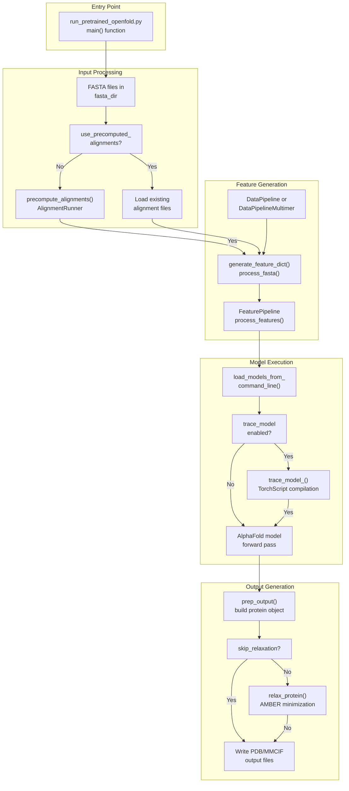
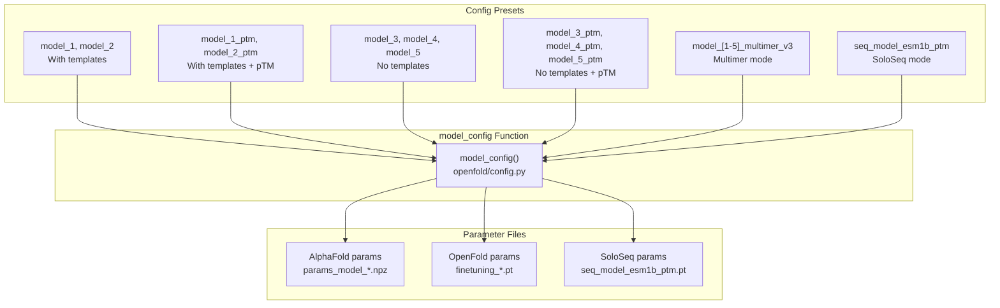
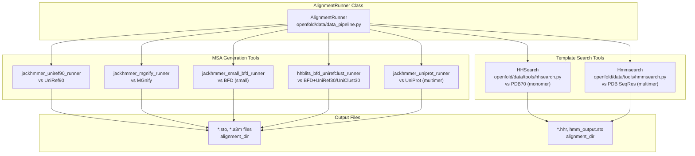
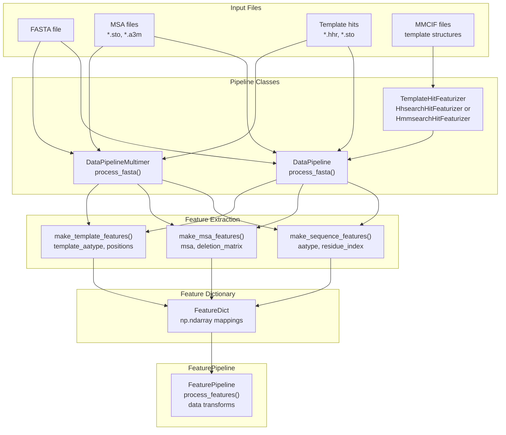

# Running Inference

# Running Inference

> **Relevant source files**
> - [README\.md](https://github.com/aqlaboratory/openfold/blob/56da08ec/README.md?plain=1)
> - [docs/source/Inference\.md](https://github.com/aqlaboratory/openfold/blob/56da08ec/docs/source/Inference.md?plain=1)
> - [docs/source/Multimer\_Inference\.md](https://github.com/aqlaboratory/openfold/blob/56da08ec/docs/source/Multimer_Inference.md?plain=1)
> - [docs/source/Single\_Sequence\_Inference\.md](https://github.com/aqlaboratory/openfold/blob/56da08ec/docs/source/Single_Sequence_Inference.md?plain=1)
> - [docs/source/conf\.py](https://github.com/aqlaboratory/openfold/blob/56da08ec/docs/source/conf.py)
> - [openfold/data/data\_pipeline\.py](https://github.com/aqlaboratory/openfold/blob/56da08ec/openfold/data/data_pipeline.py)
> - [openfold/data/templates\.py](https://github.com/aqlaboratory/openfold/blob/56da08ec/openfold/data/templates.py)
> - [run\_pretrained\_openfold\.py](https://github.com/aqlaboratory/openfold/blob/56da08ec/run_pretrained_openfold.py)
> - [scripts/generate\_mmcif\_cache\.py](https://github.com/aqlaboratory/openfold/blob/56da08ec/scripts/generate_mmcif_cache.py)
> - [scripts/precompute\_alignments\.py](https://github.com/aqlaboratory/openfold/blob/56da08ec/scripts/precompute_alignments.py)
> - [scripts/utils\.py](https://github.com/aqlaboratory/openfold/blob/56da08ec/scripts/utils.py)

## Purpose and Scope

 This page provides an overview of OpenFold's inference capabilities for protein structure prediction\. It describes the available inference modes, main entry points, and common workflows\. For detailed instructions on specific inference scenarios, see:

 - [Inference Pipeline Overview](https://deepwiki.com/aqlaboratory/openfold/3.1-inference-pipeline-overview) \- detailed walkthrough of `run_pretrained_openfold.py`
- [Monomer Inference](https://deepwiki.com/aqlaboratory/openfold/3.2-monomer-inference) \- single\-chain protein prediction
- [Multimer Inference](https://deepwiki.com/aqlaboratory/openfold/3.3-multimer-inference) \- multi\-chain complex prediction
- [Single Sequence \(SoloSeq\) Inference](https://deepwiki.com/aqlaboratory/openfold/3.4-single-sequence-(soloseq)-inference) \- MSA\-free prediction with ESM embeddings
- [Jupyter Notebook Interface](https://deepwiki.com/aqlaboratory/openfold/3.5-jupyter-notebook-interface) \- interactive Colab\-based prediction
- [Performance Optimization](https://deepwiki.com/aqlaboratory/openfold/3.6-performance-optimization) \- precision settings, kernels, and memory management

 For training the model, see [Training OpenFold](https://deepwiki.com/aqlaboratory/openfold/4-training-openfold)\. For model architecture details, see [Model Architecture](https://deepwiki.com/aqlaboratory/openfold/5-model-architecture)\.

## Inference Modes

 OpenFold supports three primary inference modes, each optimized for different prediction scenarios:

| Mode | Description | Config Preset Pattern | Primary Use Case |
| --- | --- | --- | --- |
| Monomer | Single\-chain protein prediction with full MSA | model\_\[1\-5\], model\_\[1\-5\]\_ptm | Standard protein structure prediction |
| Multimer | Multi\-chain complex prediction | model\_\[1\-5\]\_multimer\_v3 | Protein\-protein interactions, homo/hetero\-oligomers |
| SoloSeq | MSA\-free prediction using ESM\-1b embeddings | seq\_model\_esm1b\_ptm | Fast prediction without database searches |

 **Sources:** [run\_pretrained\_openfold\.py L181-L196](https://github.com/aqlaboratory/openfold/blob/56da08ec/run_pretrained_openfold.py#L181-L196) [Inference\.md?plain=1 L6-L13](https://github.com/aqlaboratory/openfold/blob/56da08ec/docs/source/Inference.md?plain=1#L6-L13) [Multimer\_Inference\.md?plain=1 L1-L78](https://github.com/aqlaboratory/openfold/blob/56da08ec/docs/source/Multimer_Inference.md?plain=1#L1-L78)

## Main Entry Points

### Command\-Line Inference Script

 The primary entry point for inference is `run_pretrained_openfold.py`, which orchestrates the complete prediction pipeline from FASTA input to PDB/MMCIF output\.



 **Inference Workflow Through run\_pretrained\_openfold\.py**

 The script executes the following major phases:

 1. **Configuration Setup** \([run\_pretrained\_openfold\.py L184-L196](https://github.com/aqlaboratory/openfold/blob/56da08ec/run_pretrained_openfold.py#L184-L196)\): Loads model config based on `--config_preset`
2. **Alignment Generation** \([run\_pretrained\_openfold\.py L63-L123](https://github.com/aqlaboratory/openfold/blob/56da08ec/run_pretrained_openfold.py#L63-L123)\): Runs `AlignmentRunner` via `precompute_alignments()` or loads existing alignments
3. **Feature Dictionary Construction** \([run\_pretrained\_openfold\.py L129-L170](https://github.com/aqlaboratory/openfold/blob/56da08ec/run_pretrained_openfold.py#L129-L170)\): Converts alignments to features via `DataPipeline.process_fasta()`
4. **Feature Processing** \([run\_pretrained\_openfold\.py L325-L327](https://github.com/aqlaboratory/openfold/blob/56da08ec/run_pretrained_openfold.py#L325-L327)\): Transforms features for model input via `FeaturePipeline.process_features()`
5. **Model Inference** \([run\_pretrained\_openfold\.py L347](https://github.com/aqlaboratory/openfold/blob/56da08ec/run_pretrained_openfold.py#L347-L347)\): Executes forward pass through loaded model
6. **Structure Output** \([run\_pretrained\_openfold\.py L356-L377](https://github.com/aqlaboratory/openfold/blob/56da08ec/run_pretrained_openfold.py#L356-L377)\): Generates unrelaxed PDB/MMCIF
7. **Optional Relaxation** \([run\_pretrained\_openfold\.py L381-L385](https://github.com/aqlaboratory/openfold/blob/56da08ec/run_pretrained_openfold.py#L381-L385)\): AMBER energy minimization

 **Sources:** [run\_pretrained\_openfold\.py L177-L395](https://github.com/aqlaboratory/openfold/blob/56da08ec/run_pretrained_openfold.py#L177-L395) [openfold/utils/script\_utils\.py](https://github.com/aqlaboratory/openfold/blob/56da08ec/openfold/utils/script_utils.py)

### Colab Notebook Interface

 For interactive inference with visualization capabilities, OpenFold provides a Jupyter notebook interface accessible via Google Colab\. This provides a web\-based alternative to the command\-line script with integrated visualization of predicted structures\.

 **Sources:** [Inference\.md?plain=1 L1-L195](https://github.com/aqlaboratory/openfold/blob/56da08ec/docs/source/Inference.md?plain=1#L1-L195)

## Configuration Presets and Model Parameters

### Config Preset System

 OpenFold uses a preset\-based configuration system that controls model behavior, template usage, and output metrics\. Each preset corresponds to specific model architectures and parameter files\.



 **Config Preset to Parameter File Mapping**

| Config Preset | Template Support | pTM Score | Compatible Parameters |
| --- | --- | --- | --- |
| model\_1, model\_2 | Yes | No | params\_model\_\[1\-2\]\.npz, finetuning\_\[2\-5\]\.pt |
| model\_1\_ptm, model\_2\_ptm | Yes | Yes | params\_model\_\[1\-2\]\_ptm\.npz, finetuning\_ptm\_\[1\-2\]\.pt |
| model\_3, model\_4, model\_5 | No | No | params\_model\_\[3\-5\]\.npz, finetuning\_no\_templ\_\[1\-2\]\.pt |
| model\_3\_ptm, model\_4\_ptm, model\_5\_ptm | No | Yes | params\_model\_\[3\-5\]\_ptm\.npz, finetuning\_no\_templ\_ptm\_1\.pt |
| model\_\[1\-5\]\_multimer\_v3 | Yes \(HMMSearch\) | Yes | params\_model\_\[1\-5\]\_multimer\_v3\.npz |
| seq\_model\_esm1b\_ptm | Optional | Yes | seq\_model\_esm1b\_ptm\.pt |

 The config preset is specified via the `--config_preset` argument\. If no parameter path is explicitly provided via `--jax_param_path` or `--openfold_checkpoint_path`, the script automatically selects parameters from `openfold/resources/params/` matching the preset name\.

 **Sources:** [run\_pretrained\_openfold\.py L184-L196](https://github.com/aqlaboratory/openfold/blob/56da08ec/run_pretrained_openfold.py#L184-L196) [run\_pretrained\_openfold\.py L530-L534](https://github.com/aqlaboratory/openfold/blob/56da08ec/run_pretrained_openfold.py#L530-L534) [Inference\.md?plain=1 L106-L120](https://github.com/aqlaboratory/openfold/blob/56da08ec/docs/source/Inference.md?plain=1#L106-L120)

## Data Processing Components

### AlignmentRunner and Template Search

 The `AlignmentRunner` class orchestrates external bioinformatics tools to generate MSAs and template hits\.



 **AlignmentRunner Configuration**

 The `AlignmentRunner` is configured differently for monomer vs\. multimer modes:

 - **Monomer**: Uses Jackhmmer \(UniRef90, MGnify, BFD\) \+ HHBlits \(BFD\+UniRef30/UniClust30\) for MSAs, HHSearch \(PDB70\) for templates
- **Multimer**: Uses Jackhmmer \(UniRef90, MGnify, UniProt\) for MSAs, Hmmsearch \(PDB SeqRes\) for templates

 **Sources:** [data\_pipeline\.py L334-L563](https://github.com/aqlaboratory/openfold/blob/56da08ec/openfold/data/data_pipeline.py#L334-L563) [run\_pretrained\_openfold\.py L76-L115](https://github.com/aqlaboratory/openfold/blob/56da08ec/run_pretrained_openfold.py#L76-L115)

### DataPipeline and Feature Generation

 The `DataPipeline` class converts raw alignment files and template hits into feature dictionaries suitable for model input\.



 **Key Methods:**

 - `DataPipeline.process_fasta()` \([data\_pipeline\.py L864-L914](https://github.com/aqlaboratory/openfold/blob/56da08ec/openfold/data/data_pipeline.py#L864-L914)\): Processes single\-chain FASTA files
- `DataPipeline._parse_msa_data()` \([data\_pipeline\.py L714-L764](https://github.com/aqlaboratory/openfold/blob/56da08ec/openfold/data/data_pipeline.py#L714-L764)\): Parses MSA files into `Msa` objects
- `DataPipeline._parse_template_hit_files()` \([data\_pipeline\.py L766-L811](https://github.com/aqlaboratory/openfold/blob/56da08ec/openfold/data/data_pipeline.py#L766-L811)\): Parses template search results
- `make_msa_features()` \([data\_pipeline\.py L224-L261](https://github.com/aqlaboratory/openfold/blob/56da08ec/openfold/data/data_pipeline.py#L224-L261)\): Converts MSAs to integer arrays
- `make_template_features()` \([data\_pipeline\.py L46-L63](https://github.com/aqlaboratory/openfold/blob/56da08ec/openfold/data/data_pipeline.py#L46-L63)\): Extracts template atom positions and features
- `FeaturePipeline.process_features()` \([openfold/data/feature\_pipeline\.py](https://github.com/aqlaboratory/openfold/blob/56da08ec/openfold/data/feature_pipeline.py)\): Applies data transforms \(cropping, masking, etc\.\)

 **Sources:** [data\_pipeline\.py L706-L914](https://github.com/aqlaboratory/openfold/blob/56da08ec/openfold/data/data_pipeline.py#L706-L914) [run\_pretrained\_openfold\.py L129-L170](https://github.com/aqlaboratory/openfold/blob/56da08ec/run_pretrained_openfold.py#L129-L170) [run\_pretrained\_openfold\.py L236-L242](https://github.com/aqlaboratory/openfold/blob/56da08ec/run_pretrained_openfold.py#L236-L242)

## Command\-Line Arguments

### Required Arguments

```
# Positional argumentsfasta_dir              # Directory containing FASTA files (.fasta or .fa)template_mmcif_dir     # Directory containing template MMCIF files # Model configuration--config_preset        # Model preset (default: "model_1")--model_device         # Device for inference (e.g., "cuda:0", "cpu")
```

### Database Paths \(for alignment generation\)

```
--uniref90_database_path       # UniRef90 FASTA database--mgnify_database_path         # MGnify FASTA database  --bfd_database_path            # BFD database--pdb70_database_path          # PDB70 database (monomer)--pdb_seqres_database_path     # PDB SeqRes database (multimer)--uniprot_database_path        # UniProt database (multimer)--uniref30_database_path       # UniRef30 database (optional)--uniclust30_database_path     # UniClust30 database (optional)
```

### Common Options

```
--output_dir                   # Output directory (default: current directory)--use_precomputed_alignments   # Path to precomputed alignment directory--jax_param_path               # Path to AlphaFold .npz parameters--openfold_checkpoint_path     # Path to OpenFold .pt checkpoint--skip_relaxation              # Skip AMBER energy minimization--save_outputs                 # Save all model outputs (embeddings, etc.)--cif_output                   # Output MMCIF instead of PDB format--data_random_seed             # Random seed for reproducibility
```

### Performance Optimization

```
--trace_model                              # Enable TorchScript tracing--long_sequence_inference                  # Enable memory-saving options--precision                                # Compute precision: tf32|fp32|fp16|bf16--use_deepspeed_evoformer_attention       # Use DeepSpeed attention kernel--use_cuequivariance_attention            # Use cuEquivariance attention--use_cuequivariance_multiplicative_update # Use cuEquivariance tri-mult kernel--trt_mode                                 # TensorRT mode: build|run--trt_engine_dir                          # TensorRT engine directory--experiment_config_json                   # Custom config overrides
```

 **Sources:** [run\_pretrained\_openfold\.py L398-L527](https://github.com/aqlaboratory/openfold/blob/56da08ec/run_pretrained_openfold.py#L398-L527) [utils\.py L13-L65](https://github.com/aqlaboratory/openfold/blob/56da08ec/scripts/utils.py#L13-L65)

## Output Structure

 The inference script produces the following output structure:

```
output_dir/
├── alignments/
│   └── {sequence_tag}/
│       ├── uniref90_hits.sto
│       ├── mgnify_hits.sto
│       ├── bfd_uniclust_hits.a3m
│       └── hhsearch_output.hhr (or hmm_output.sto for multimer)
└── predictions/
    ├── {sequence_tag}_{config_preset}_unrelaxed.pdb
    ├── {sequence_tag}_{config_preset}_relaxed.pdb (if relaxation enabled)
    └── {sequence_tag}_{config_preset}_output_dict.pkl (if --save_outputs)
```

### Output Files

 - **Unrelaxed PDB/MMCIF**: Raw model prediction with pLDDT scores in B\-factor column
- **Relaxed PDB/MMCIF**: Structure after AMBER energy minimization \(if `--skip_relaxation` not set\)
- **Output Dictionary** \(optional\): Full model outputs including: - `final_atom_positions`: Predicted atomic coordinates - `plddt`: Per\-residue confidence scores \(0\-100\) - `predicted_aligned_error` \(PAE\): Inter\-residue distance error estimates - `ptm` / `iptm`: Template modeling scores - MSA and pair representations

 **Sources:** [run\_pretrained\_openfold\.py L366-L394](https://github.com/aqlaboratory/openfold/blob/56da08ec/run_pretrained_openfold.py#L366-L394) [openfold/utils/script\_utils\.py](https://github.com/aqlaboratory/openfold/blob/56da08ec/openfold/utils/script_utils.py)

## Inference Mode Selection

 The inference mode is primarily determined by:

 1. **Config Preset**: Specified via `--config_preset` argument  - Monomer: `model_[1-5]`, `model_[1-5]_ptm` - Multimer: `model_[1-5]_multimer_v3` - SoloSeq: `seq_model_esm1b_ptm`
2. **FASTA Input**:  - Single sequence per file → Monomer \(unless multimer preset\) - Multiple sequences per file → Multimer or AlphaFold\-Gap mode
3. **Database Configuration**:  - Multimer requires UniProt and PDB SeqRes databases - SoloSeq can skip database searches entirely

 The script automatically configures the appropriate `DataPipeline`, `AlignmentRunner`, and template featurizer based on these settings\.

 **Sources:** [run\_pretrained\_openfold\.py L209-L242](https://github.com/aqlaboratory/openfold/blob/56da08ec/run_pretrained_openfold.py#L209-L242) [run\_pretrained\_openfold\.py L267-L280](https://github.com/aqlaboratory/openfold/blob/56da08ec/run_pretrained_openfold.py#L267-L280) [run\_pretrained\_openfold\.py L286-L295](https://github.com/aqlaboratory/openfold/blob/56da08ec/run_pretrained_openfold.py#L286-L295)

## Related Pages

 For more detailed information on specific aspects of inference:

 - **[Inference Pipeline Overview](https://deepwiki.com/aqlaboratory/openfold/3.1-inference-pipeline-overview)**: Complete walkthrough of `run_pretrained_openfold.py` workflow
- **[Monomer Inference](https://deepwiki.com/aqlaboratory/openfold/3.2-monomer-inference)**: Detailed guide for single\-chain predictions
- **[Multimer Inference](https://deepwiki.com/aqlaboratory/openfold/3.3-multimer-inference)**: Multi\-chain complex prediction specifics
- **[Single Sequence \(SoloSeq\) Inference](https://deepwiki.com/aqlaboratory/openfold/3.4-single-sequence-(soloseq)-inference)**: MSA\-free prediction with ESM embeddings
- **[Jupyter Notebook Interface](https://deepwiki.com/aqlaboratory/openfold/3.5-jupyter-notebook-interface)**: Interactive Colab\-based prediction
- **[Performance Optimization](https://deepwiki.com/aqlaboratory/openfold/3.6-performance-optimization)**: Precision, kernels, tracing, and memory management
- **[Data Processing Pipeline](https://deepwiki.com/aqlaboratory/openfold/6-data-processing-pipeline)**: Detailed feature generation pipeline
- **[Configuration System](https://deepwiki.com/aqlaboratory/openfold/5.1-configuration-system)**: Model configuration and presets

 **Sources:** [docs/source/Inference\.md](https://github.com/aqlaboratory/openfold/blob/56da08ec/docs/source/Inference.md?plain=1) [docs/source/Multimer\_Inference\.md](https://github.com/aqlaboratory/openfold/blob/56da08ec/docs/source/Multimer_Inference.md?plain=1) [docs/source/Single\_Sequence\_Inference\.md](https://github.com/aqlaboratory/openfold/blob/56da08ec/docs/source/Single_Sequence_Inference.md?plain=1)

---
*Source: [https://deepwiki.com/aqlaboratory/openfold/3-running-inference](https://deepwiki.com/aqlaboratory/openfold/3-running-inference) on DeepWiki*