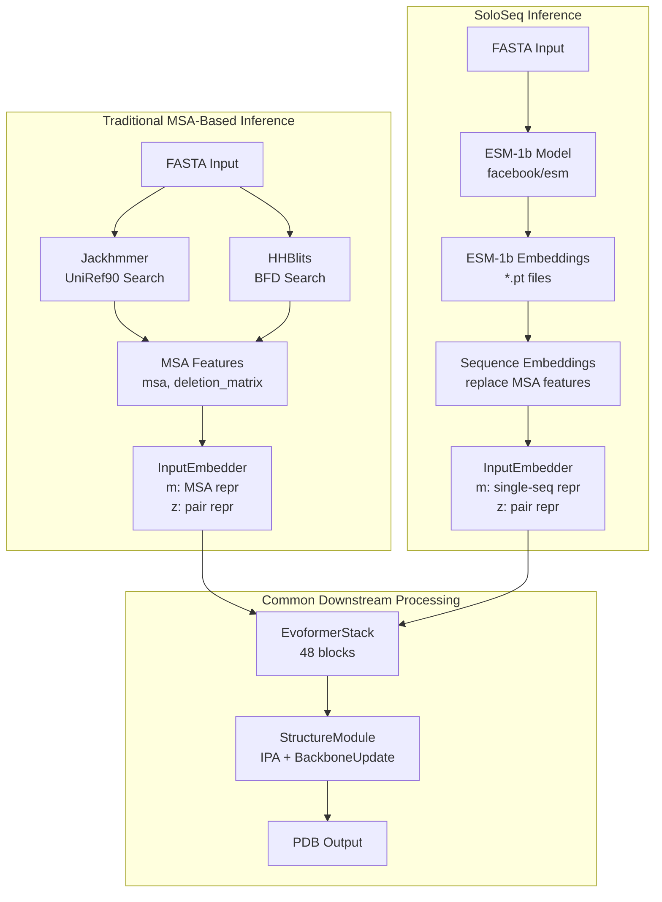
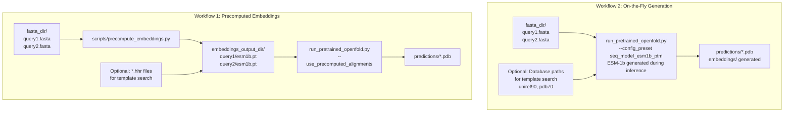
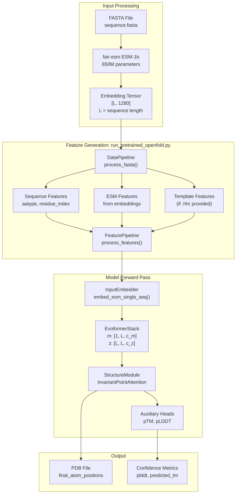

# Single Sequence \(SoloSeq\) Inference

# Single Sequence \(SoloSeq\) Inference

> **Relevant source files**
> - [docs/source/Inference\.md](https://github.com/aqlaboratory/openfold/blob/56da08ec/docs/source/Inference.md?plain=1)
> - [docs/source/Multimer\_Inference\.md](https://github.com/aqlaboratory/openfold/blob/56da08ec/docs/source/Multimer_Inference.md?plain=1)
> - [docs/source/Single\_Sequence\_Inference\.md](https://github.com/aqlaboratory/openfold/blob/56da08ec/docs/source/Single_Sequence_Inference.md?plain=1)
> - [docs/source/conf\.py](https://github.com/aqlaboratory/openfold/blob/56da08ec/docs/source/conf.py)
> - [notebooks/OpenFold\.ipynb](https://github.com/aqlaboratory/openfold/blob/56da08ec/notebooks/OpenFold.ipynb)
> - [notebooks/environment\.yml](https://github.com/aqlaboratory/openfold/blob/56da08ec/notebooks/environment.yml)
> - [openfold/resources/\_\_init\_\_\.py](https://github.com/aqlaboratory/openfold/blob/56da08ec/openfold/resources/__init__.py)
> - [scripts/download\_openfold\_params\_gdrive\.sh](https://github.com/aqlaboratory/openfold/blob/56da08ec/scripts/download_openfold_params_gdrive.sh)
> - [scripts/download\_openfold\_params\_huggingface\.sh](https://github.com/aqlaboratory/openfold/blob/56da08ec/scripts/download_openfold_params_huggingface.sh)

## Purpose and Scope

 This page describes SoloSeq inference mode in OpenFold, which enables fast protein structure prediction using **ESM\-1b language model embeddings** instead of traditional Multiple Sequence Alignments \(MSAs\)\. SoloSeq is designed for scenarios where MSA generation is impractical due to time constraints, lack of homologous sequences, or computational resource limitations\.

 For standard MSA\-based inference on single chains, see [Monomer Inference](https://deepwiki.com/aqlaboratory/openfold/3.2-monomer-inference)\. For multi\-chain predictions, see [Multimer Inference](https://deepwiki.com/aqlaboratory/openfold/3.3-multimer-inference)\. For general inference pipeline concepts, see [Inference Pipeline Overview](https://deepwiki.com/aqlaboratory/openfold/3.1-inference-pipeline-overview)\.

 **Sources:** [Single\_Sequence\_Inference\.md?plain=1 L1-L57](https://github.com/aqlaboratory/openfold/blob/56da08ec/docs/source/Single_Sequence_Inference.md?plain=1#L1-L57) [Inference\.md?plain=1 L7-L13](https://github.com/aqlaboratory/openfold/blob/56da08ec/docs/source/Inference.md?plain=1#L7-L13)

---

## Overview

 SoloSeq replaces the traditional MSA generation pipeline \(Jackhmmer, HHBlits\) with pre\-trained protein language model embeddings from ESM\-1b \(Evolutionary Scale Modeling\)\. This approach:

 - **Eliminates database searches**: No need to query UniRef90, MGnify, or BFD
- **Reduces inference time**: From hours to minutes for most sequences
- **Works with orphan sequences**: Effective even when no homologs exist
- **Maintains structure quality**: Competitive accuracy on sequences with limited evolutionary information

 The SoloSeq model is trained on the same AlphaFold architecture but uses ESM\-1b embeddings as the primary sequence representation instead of MSA features\.

 **Sources:** [Single\_Sequence\_Inference\.md?plain=1 L1-L3](https://github.com/aqlaboratory/openfold/blob/56da08ec/docs/source/Single_Sequence_Inference.md?plain=1#L1-L3)

---

## SoloSeq vs MSA\-Based Inference Architecture



 **Diagram: SoloSeq Architecture Comparison** \- SoloSeq bypasses database search tools and uses ESM\-1b embeddings directly, feeding into the same `InputEmbedder` that would normally process MSA features\. The downstream `EvoformerStack` and `StructureModule` remain unchanged\.

 **Sources:** [Single\_Sequence\_Inference\.md?plain=1 L1-L7](https://github.com/aqlaboratory/openfold/blob/56da08ec/docs/source/Single_Sequence_Inference.md?plain=1#L1-L7)

---

## ESM\-1b Embeddings

 ESM\-1b \(Evolutionary Scale Modeling v1b\) is a 650M\-parameter transformer language model trained on 250 million protein sequences\. It learns to represent amino acid sequences in a high\-dimensional embedding space that captures:

 - **Evolutionary patterns**: Learned from sequence co\-occurrence statistics
- **Structural constraints**: Implicit in conserved sequence motifs
- **Functional relationships**: Encoded through sequence similarity

 For OpenFold SoloSeq:

 - Each residue is represented by a 1280\-dimensional ESM\-1b embedding vector
- These embeddings replace the MSA features that would normally be extracted from multiple sequence alignments
- The embeddings are computed once and can be reused across multiple predictions

 **Length Limitation**: ESM\-1b has a maximum sequence length of **1022 residues**\. Longer sequences will be automatically truncated\.

 **Sources:** [Single\_Sequence\_Inference\.md?plain=1 L3-L57](https://github.com/aqlaboratory/openfold/blob/56da08ec/docs/source/Single_Sequence_Inference.md?plain=1#L3-L57)

---

## SoloSeq Workflow Comparison



 **Diagram: SoloSeq Workflow Options** \- Two paths for running SoloSeq inference: precomputing embeddings in bulk \(top\) or generating them on\-the\-fly during inference \(bottom\)\.

 **Sources:** [Single\_Sequence\_Inference\.md?plain=1 L5-L49](https://github.com/aqlaboratory/openfold/blob/56da08ec/docs/source/Single_Sequence_Inference.md?plain=1#L5-L49)

---

## Setup Requirements

### Model Parameters

 Download the SoloSeq model weights using the provided script:

```
bash scripts/download_openfold_soloseq_params.sh openfold/resources
```

 This downloads the `seq_model_esm1b_ptm.pt` checkpoint file to the default parameter directory\.

 **Available Models:**

| Model Name | Configuration Preset | Template Support | pTM Score |
| --- | --- | --- | --- |
| seq\_model\_esm1b\_ptm\.pt | seq\_model\_esm1b\_ptm | Yes \(optional\) | Yes |

### Dependencies

 The ESM\-1b model requires the Facebook ESM package, which should be installed as part of the OpenFold environment:

```
pip install fair-esm
```

### Optional: Template Search Databases

 If using templates with SoloSeq, you need:

 - **UniRef90 database**: For generating template profiles
- **PDB70 database**: For HHSearch template matching
- **PDB MMCIF files**: Directory containing template structures

 **Sources:** [Single\_Sequence\_Inference\.md?plain=1 L15-L51](https://github.com/aqlaboratory/openfold/blob/56da08ec/docs/source/Single_Sequence_Inference.md?plain=1#L15-L51)

---

## Usage: Precomputed Embeddings \(Recommended for Batch Inference\)

### Step 1: Precompute ESM\-1b Embeddings

 Use the provided script to generate embeddings in bulk:

```
python scripts/precompute_embeddings.py fasta_dir/ embeddings_output_dir/
```

 **Input Structure:**

```
fasta_dir/
├── protein1.fasta
├── protein2.fasta
└── protein3.fasta
```

 **Output Structure:**

```
embeddings_output_dir/
├── protein1/
│   └── esm1b.pt
├── protein2/
│   └── esm1b.pt
└── protein3/
    └── esm1b.pt
```

### Step 2: \(Optional\) Add Template Information

 If using templates, place HHSearch output files \(`.hhr`\) in the per\-protein subdirectories:

```
embeddings_output_dir/
├── protein1/
│   ├── esm1b.pt
│   └── hhsearch_output.hhr
└── protein2/
    ├── esm1b.pt
    └── hhsearch_output.hhr
```

### Step 3: Run Inference

 Run inference using the precomputed embeddings:

```
python run_pretrained_openfold.py \    fasta_dir \    data/pdb_mmcif/mmcif_files/ \    --use_precomputed_alignments embeddings_output_dir \    --output_dir ./predictions \    --model_device "cuda:0" \    --config_preset "seq_model_esm1b_ptm" \    --openfold_checkpoint_path openfold/resources/openfold_soloseq_params/seq_model_esm1b_ptm.pt
```

 **Key Arguments:**

 - `--use_precomputed_alignments`: Path to directory containing precomputed ESM\-1b embeddings
- `--config_preset "seq_model_esm1b_ptm"`: Specifies SoloSeq configuration
- `--openfold_checkpoint_path`: Path to SoloSeq model weights

 **Sources:** [Single\_Sequence\_Inference\.md?plain=1 L7-L32](https://github.com/aqlaboratory/openfold/blob/56da08ec/docs/source/Single_Sequence_Inference.md?plain=1#L7-L32) [precompute\_embeddings\.py L1](https://github.com/aqlaboratory/openfold/blob/56da08ec/scripts/precompute_embeddings.py#L1-L1)

---

## Usage: On\-the\-Fly Embedding Generation

 For single predictions or exploratory runs, generate embeddings during inference:

### Without Templates

```
python run_pretrained_openfold.py \    fasta_dir \    data/pdb_mmcif/mmcif_files/ \    --output_dir ./predictions \    --model_device "cuda:0" \    --config_preset "seq_model_esm1b_ptm" \    --openfold_checkpoint_path openfold/resources/openfold_soloseq_params/seq_model_esm1b_ptm.pt
```

 This mode:

 - Generates ESM\-1b embeddings on\-the\-fly
- Does **not** search for templates
- Produces fastest results for quick predictions

### With Template Search

 To enable template matching during on\-the\-fly inference:

```
python run_pretrained_openfold.py \    fasta_dir \    data/pdb_mmcif/mmcif_files/ \    --output_dir ./predictions \    --model_device "cuda:0" \    --config_preset "seq_model_esm1b_ptm" \    --openfold_checkpoint_path openfold/resources/openfold_soloseq_params/seq_model_esm1b_ptm.pt \    --uniref90_database_path data/uniref90/uniref90.fasta \    --pdb70_database_path data/pdb70/pdb70 \    --jackhmmer_binary_path lib/conda/envs/openfold_venv/bin/jackhmmer \    --hhsearch_binary_path lib/conda/envs/openfold_venv/bin/hhsearch \    --kalign_binary_path lib/conda/envs/openfold_venv/bin/kalign
```

 When database paths are provided:

 - HHSearch finds template structures
- Templates are incorporated into the prediction
- `.hhr` files are generated automatically

 **Sources:** [Single\_Sequence\_Inference\.md?plain=1 L34-L51](https://github.com/aqlaboratory/openfold/blob/56da08ec/docs/source/Single_Sequence_Inference.md?plain=1#L34-L51)

---

## Configuration Details

### Model Configuration Preset

 The `seq_model_esm1b_ptm` configuration preset configures the model for SoloSeq mode:

| Configuration Key | Value | Description |
| --- | --- | --- |
| input\_embedder\.use\_esm\_embeddings | True | Enable ESM\-1b embedding input |
| model\.predicted\_tm\.enabled | True | Compute pTM confidence score |
| data\.common\.use\_templates | True/False | Template usage \(configurable\) |
| globals\.max\_recycling\_iters | 3 | Number of recycling iterations |

 The configuration is defined in [openfold/config\.py](https://github.com/aqlaboratory/openfold/blob/56da08ec/openfold/config.py) and can be accessed via:

```python
from openfold import configcfg = config.model_config("seq_model_esm1b_ptm")
```

### Compatible Command\-Line Options

 SoloSeq supports the same optimization flags as standard OpenFold inference:

| Flag | Description | Recommendation |
| --- | --- | --- |
| \-\-skip\_relaxation | Skip AMBER energy minimization | Use for faster results |
| \-\-save\_outputs | Save all model outputs \(MSA track, etc\.\) | Use for debugging |
| \-\-cif\_output | Generate MMCIF format output | Use for better metadata |
| \-\-use\_deepspeed\_inference | Use DeepSpeed attention kernels | Use for speed \(if available\) |
| \-\-use\_flash\_attn | Use FlashAttention kernels | Use for sequences < 1000 residues |
| \-\-trace\_model | Trace model for faster batch inference | Use for large\-scale runs |

 **Sources:** [Single\_Sequence\_Inference\.md?plain=1 L53-L54](https://github.com/aqlaboratory/openfold/blob/56da08ec/docs/source/Single_Sequence_Inference.md?plain=1#L53-L54) [Inference\.md?plain=1 L135-L180](https://github.com/aqlaboratory/openfold/blob/56da08ec/docs/source/Inference.md?plain=1#L135-L180)

---

## SoloSeq Data Flow



 **Diagram: SoloSeq Data Flow** \- Complete data flow from FASTA input through ESM\-1b embedding generation to final structure prediction\. Key code entities: `DataPipeline`, `FeaturePipeline`, `InputEmbedder`, `EvoformerStack`, `StructureModule`\.

 **Sources:** [Single\_Sequence\_Inference\.md?plain=1 L1-L57](https://github.com/aqlaboratory/openfold/blob/56da08ec/docs/source/Single_Sequence_Inference.md?plain=1#L1-L57) [run\_pretrained\_openfold\.py L1](https://github.com/aqlaboratory/openfold/blob/56da08ec/run_pretrained_openfold.py#L1-L1)

---

## Limitations and Constraints

### Sequence Length Limitation

 **Maximum Length: 1022 residues**

 This constraint comes from ESM\-1b's positional encoding architecture\. Sequences exceeding this length will be automatically truncated:

 - Truncation occurs at the N\-terminus
- No warning is issued during truncation
- Consider splitting very long sequences into domains

### Performance Characteristics

| Aspect | Limitation | Workaround |
| --- | --- | --- |
| Sequence length | Max 1022 residues | Split into domains |
| MSA information | No evolutionary information | Use standard inference if homologs exist |
| Memory usage | Similar to MSA\-based | Same optimization flags apply |
| Multimer support | Not available | Use standard multimer pipeline |

### When NOT to Use SoloSeq

 SoloSeq is **not recommended** when:

 - Abundant homologs exist \(\>100 sequences in MSA\)
- Complex multimers need to be predicted
- Maximum accuracy is required for well\-characterized protein families
- Sequences exceed 1022 residues

### When TO Use SoloSeq

 SoloSeq is **recommended** when:

 - MSA generation is too slow or computationally expensive
- Few or no homologs exist \(orphan proteins\)
- Rapid prototyping or screening is needed
- Database searches are impractical

 **Sources:** [Single\_Sequence\_Inference\.md?plain=1 L55-L57](https://github.com/aqlaboratory/openfold/blob/56da08ec/docs/source/Single_Sequence_Inference.md?plain=1#L55-L57)

---

## Output Structure

 SoloSeq generates the same output files as standard inference:

```
predictions/
├── protein1_unrelaxed.pdb          # Raw model output
├── protein1_relaxed.pdb            # AMBER-relaxed (if not skipped)
├── protein1_confidence.json        # pLDDT and pTM scores
└── timings.json                    # Runtime statistics
```

 If `--save_outputs` is specified:

```
predictions/
├── protein1_unrelaxed.pdb
├── protein1_relaxed.pdb
├── protein1_confidence.json
├── protein1_output_dict.pkl        # Complete model outputs
└── timings.json
```

### Confidence Metrics

 SoloSeq outputs include:

 - **pLDDT** \(per\-residue confidence\): 0\-100 scale, higher is better
- **pTM** \(predicted TM\-score\): 0\-1 scale, measures global accuracy
- **Final atom positions**: All\-atom coordinates

 These metrics have the same interpretation as in standard AlphaFold/OpenFold inference\.

 **Sources:** [Inference\.md?plain=1 L123-L129](https://github.com/aqlaboratory/openfold/blob/56da08ec/docs/source/Inference.md?plain=1#L123-L129)

---

## Performance Optimization

 SoloSeq inference supports all standard OpenFold optimizations\. See [Performance Optimization](https://deepwiki.com/aqlaboratory/openfold/3.6-performance-optimization) for detailed guidance\.

### Quick Optimization Guidelines

 **For maximum speed:**

```
python run_pretrained_openfold.py \    --config_preset "seq_model_esm1b_ptm" \    --skip_relaxation \    --use_deepspeed_inference \    --precision bf16 \    ...
```

 **For maximum memory efficiency:**

```
python run_pretrained_openfold.py \    --config_preset "seq_model_esm1b_ptm" \    --long_sequence_inference \    ...
```

 **For batch processing:**

```
# 1. Precompute embeddings oncepython scripts/precompute_embeddings.py fasta_dir/ embeddings_dir/ # 2. Run inference with tracingpython run_pretrained_openfold.py \    --use_precomputed_alignments embeddings_dir/ \    --trace_model \    ...
```

 **Sources:** [Inference\.md?plain=1 L145-L180](https://github.com/aqlaboratory/openfold/blob/56da08ec/docs/source/Inference.md?plain=1#L145-L180) [Single\_Sequence\_Inference\.md?plain=1 L53-L54](https://github.com/aqlaboratory/openfold/blob/56da08ec/docs/source/Single_Sequence_Inference.md?plain=1#L53-L54)

---

## Comparison with Standard Inference

| Feature | Standard \(MSA\-based\) | SoloSeq \(ESM\-1b\) |
| --- | --- | --- |
| Input requirements | FASTA \+ databases | FASTA only |
| Preprocessing time | Minutes to hours | Seconds |
| Sequence databases | UniRef90, BFD, MGnify | None required |
| Template support | Full support | Optional support |
| Accuracy \(well\-sampled\) | Higher | Moderate |
| Accuracy \(orphan proteins\) | Lower | Competitive |
| Max sequence length | ~10,000 residues | 1,022 residues |
| Multimer support | Yes \(AlphaFold\-Multimer\) | No |
| Inference speed | Slower \(MSA search\) | Faster \(no search\) |
| Memory usage | High \(large MSAs\) | Moderate |

 **Sources:** [Single\_Sequence\_Inference\.md?plain=1 L1-L57](https://github.com/aqlaboratory/openfold/blob/56da08ec/docs/source/Single_Sequence_Inference.md?plain=1#L1-L57) [Inference\.md?plain=1 L1-L195](https://github.com/aqlaboratory/openfold/blob/56da08ec/docs/source/Inference.md?plain=1#L1-L195)

---

## Example: Complete SoloSeq Workflow

### Scenario: Predict structure for 50 proteins without MSA generation

 **Step 1: Prepare input FASTA files**

```
mkdir -p fasta_dir# Add your *.fasta files to fasta_dir/
```

 **Step 2: Precompute ESM\-1b embeddings**

```
python scripts/precompute_embeddings.py \    fasta_dir/ \    embeddings_dir/
```

 *This step can be parallelized across multiple GPUs for large batches\.*

 **Step 3: Download SoloSeq weights**

```
bash scripts/download_openfold_soloseq_params.sh openfold/resources
```

 **Step 4: Run batch inference**

```
python run_pretrained_openfold.py \    fasta_dir \    data/pdb_mmcif/mmcif_files/ \    --use_precomputed_alignments embeddings_dir \    --output_dir ./predictions \    --model_device "cuda:0" \    --config_preset "seq_model_esm1b_ptm" \    --openfold_checkpoint_path openfold/resources/openfold_soloseq_params/seq_model_esm1b_ptm.pt \    --skip_relaxation \    --trace_model
```

 **Step 5: Analyze outputs**

```
# Check confidence scorescat predictions/*/confidence.json # View structurespymol predictions/*_unrelaxed.pdb
```

 **Sources:** [Single\_Sequence\_Inference\.md?plain=1 L7-L32](https://github.com/aqlaboratory/openfold/blob/56da08ec/docs/source/Single_Sequence_Inference.md?plain=1#L7-L32) [precompute\_embeddings\.py L1](https://github.com/aqlaboratory/openfold/blob/56da08ec/scripts/precompute_embeddings.py#L1-L1)

---

## Related Documentation

 - **Standard inference workflows**: [Monomer Inference](https://deepwiki.com/aqlaboratory/openfold/3.2-monomer-inference), [Multimer Inference](https://deepwiki.com/aqlaboratory/openfold/3.3-multimer-inference)
- **General inference concepts**: [Inference Pipeline Overview](https://deepwiki.com/aqlaboratory/openfold/3.1-inference-pipeline-overview)
- **Performance tuning**: [Performance Optimization](https://deepwiki.com/aqlaboratory/openfold/3.6-performance-optimization)
- **Model architecture**: [AlphaFold Model Overview](https://deepwiki.com/aqlaboratory/openfold/5.2-alphafold-model-overview)
- **Training with ESM embeddings**: [Training Pipeline](https://deepwiki.com/aqlaboratory/openfold/4.1-training-pipeline)

 **Sources:** [Inference\.md?plain=1 L1-L195](https://github.com/aqlaboratory/openfold/blob/56da08ec/docs/source/Inference.md?plain=1#L1-L195) [Single\_Sequence\_Inference\.md?plain=1 L1-L57](https://github.com/aqlaboratory/openfold/blob/56da08ec/docs/source/Single_Sequence_Inference.md?plain=1#L1-L57)

---
*Source: [https://deepwiki.com/aqlaboratory/openfold/3.4-single-sequence-(soloseq)-inference](https://deepwiki.com/aqlaboratory/openfold/3.4-single-sequence-(soloseq)-inference) on DeepWiki*