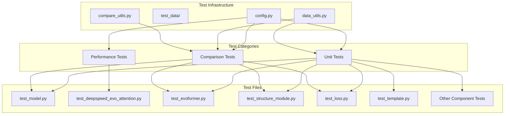
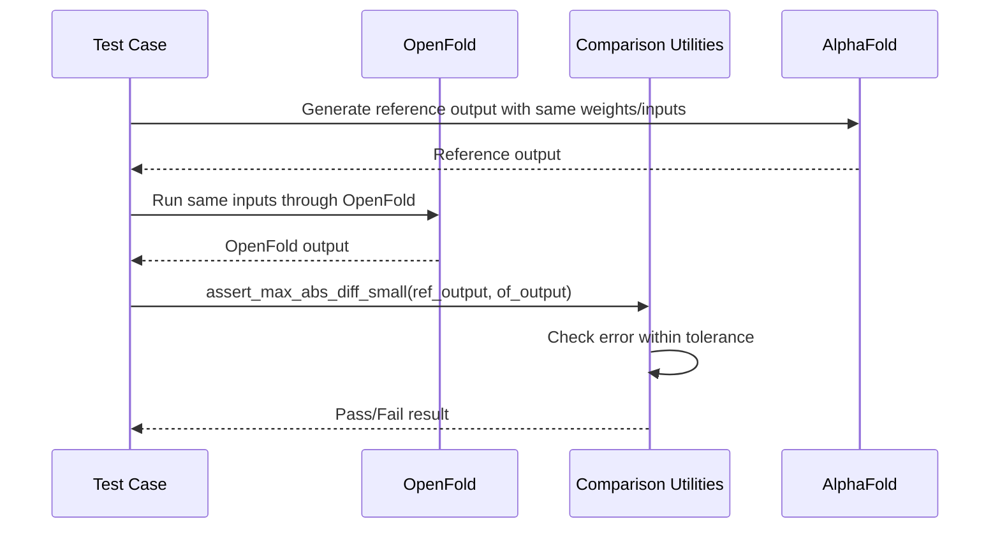
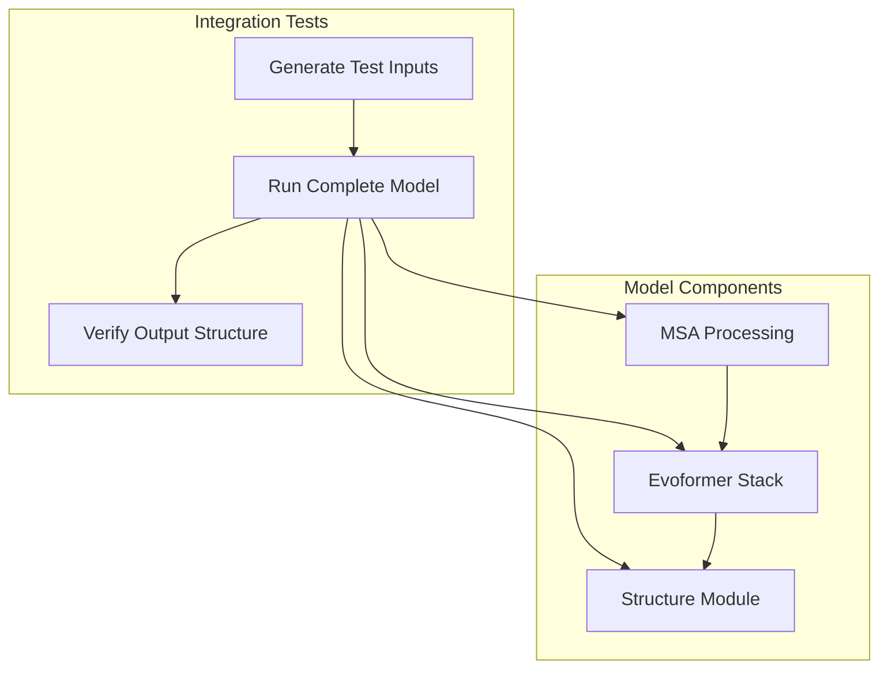
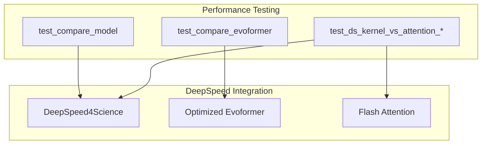
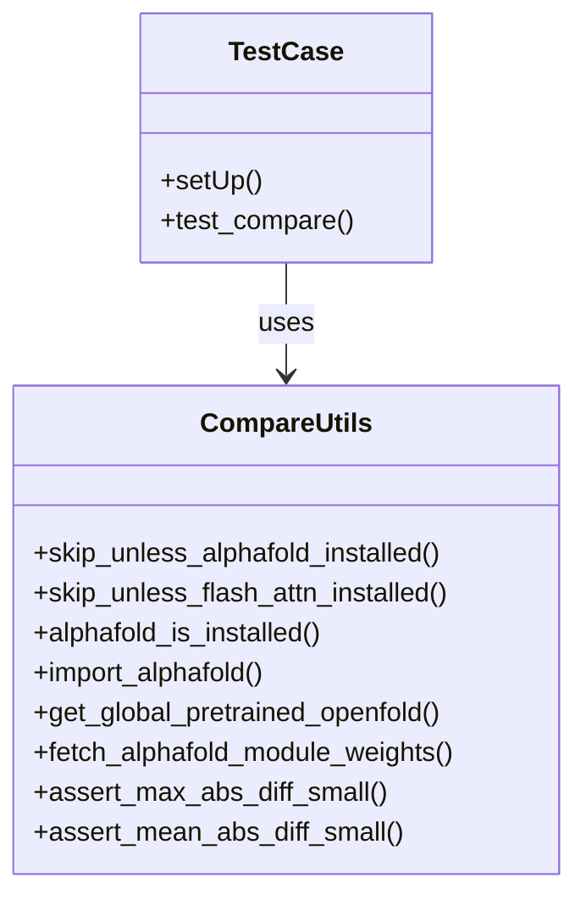
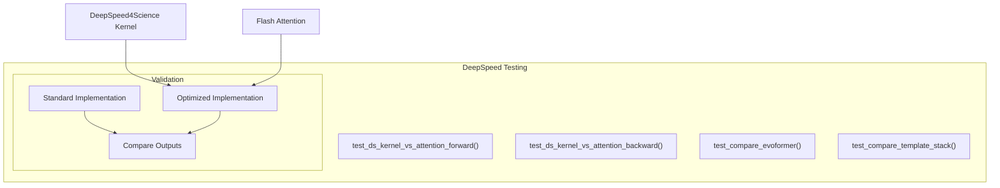
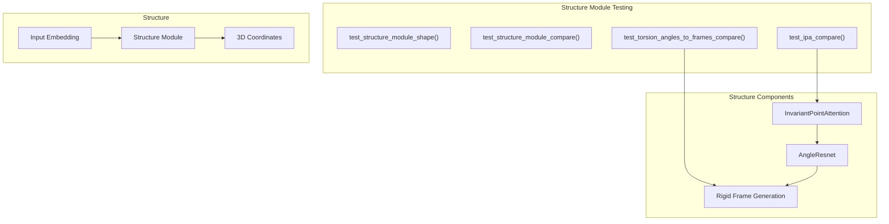

# Testing and Validation

# Testing and Validation

> **Relevant source files**
> - [Dockerfile](https://github.com/aqlaboratory/openfold/blob/56da08ec/Dockerfile)
> - [environment\.yml](https://github.com/aqlaboratory/openfold/blob/56da08ec/environment.yml)
> - [scripts/download\_openfold\_params\.sh](https://github.com/aqlaboratory/openfold/blob/56da08ec/scripts/download_openfold_params.sh)
> - [scripts/install\_third\_party\_dependencies\.sh](https://github.com/aqlaboratory/openfold/blob/56da08ec/scripts/install_third_party_dependencies.sh)
> - [setup\.py](https://github.com/aqlaboratory/openfold/blob/56da08ec/setup.py)
> - [tests/config\.py](https://github.com/aqlaboratory/openfold/blob/56da08ec/tests/config.py)
> - [tests/data\_utils\.py](https://github.com/aqlaboratory/openfold/blob/56da08ec/tests/data_utils.py)
> - [tests/test\_deepspeed\_evo\_attention\.py](https://github.com/aqlaboratory/openfold/blob/56da08ec/tests/test_deepspeed_evo_attention.py)
> - [tests/test\_primitives\.py](https://github.com/aqlaboratory/openfold/blob/56da08ec/tests/test_primitives.py)

 This page provides an overview of OpenFold's testing and validation framework\. OpenFold implements comprehensive testing methodologies to ensure correctness, numerical accuracy, and performance of the PyTorch implementation compared to the original DeepMind AlphaFold codebase\.

## Testing Framework Overview



 The testing framework in OpenFold is designed to validate that the PyTorch implementation correctly reproduces AlphaFold's behavior, while also ensuring optimizations maintain accuracy\. The tests verify both the individual components and the complete model pipeline\.

## Test Suite Structure

 OpenFold's test suite is organized into several key components:

| Component | Purpose | Key Files |
| --- | --- | --- |
| Core Test Utilities | Functions for comparing OpenFold with AlphaFold | tests/compare\_utils\.py |
| Test Data Utilities | Functions for generating test data | tests/data\_utils\.py |
| Test Configuration | Constants and configuration for tests | tests/config\.py |
| Model Tests | Test the full model functionality | tests/test\_model\.py |
| Module Tests | Test individual components | Various test files |
| Performance Tests | Test optimized implementations | tests/test\_deepspeed\_evo\_attention\.py |

## Comparison with AlphaFold

 A key aspect of OpenFold's testing strategy is comparing its outputs with the original AlphaFold implementation to ensure numerical consistency\.



 This comparison mechanism is implemented in the `compare_utils.py` module, which provides utilities for loading AlphaFold weights, running both implementations on the same inputs, and comparing outputs\.

 Sources: [compare\_utils\.py L38-L136](https://github.com/aqlaboratory/openfold/blob/56da08ec/tests/compare_utils.py#L38-L136) [test\_model\.py L145-L205](https://github.com/aqlaboratory/openfold/blob/56da08ec/tests/test_model.py#L145-L205)

## Main Test Categories

### Unit Tests

 OpenFold uses unit tests to verify that individual components work correctly in isolation\. Each module has its own test file that verifies its behavior\.

 Examples of unit tests:

 - Testing attention mechanisms \(`test_deepspeed_evo_attention.py`\)
- Testing EvoFormer modules \(`test_evoformer.py`\)
- Testing structure module components \(`test_structure_module.py`\)

### Integration Tests

 Integration tests verify that the entire model pipeline works correctly, from input processing to final structure prediction:



 The primary integration test is the `test_compare()` method in `test_model.py`, which runs a complete forward pass through the model and compares the output with AlphaFold's output\.

 Sources: [test\_model\.py L54-L144](https://github.com/aqlaboratory/openfold/blob/56da08ec/tests/test_model.py#L54-L144) [test\_model\.py L145-L205](https://github.com/aqlaboratory/openfold/blob/56da08ec/tests/test_model.py#L145-L205)

### Performance Tests

 OpenFold includes tests for performance optimizations, particularly those related to DeepSpeed integration:



 These tests ensure that performance optimizations don't affect the model's accuracy\. For example, `test_ds_kernel_vs_attention_forward()` compares the outputs of the standard attention mechanism with the DeepSpeed\-optimized version\.

 Sources: [test\_deepspeed\_evo\_attention\.py L37-L162](https://github.com/aqlaboratory/openfold/blob/56da08ec/tests/test_deepspeed_evo_attention.py#L37-L162) [test\_deepspeed\_evo\_attention\.py L277-L335](https://github.com/aqlaboratory/openfold/blob/56da08ec/tests/test_deepspeed_evo_attention.py#L277-L335)

## Validation Methods

### Numerical Validation

 OpenFold employs two main approaches for numerical validation:

 1. **Maximum Absolute Difference**: Ensures that no value differs by more than a small threshold   ```python def assert_max_abs_diff_small(expected, actual, eps):    abs_diff = torch.abs(expected - actual)    err = torch.max(abs_diff)    assert err < eps ```
2. **Mean Absolute Difference**: Ensures that the average error is below a threshold   ```python def assert_mean_abs_diff_small(expected, actual, eps):    abs_diff = torch.abs(expected - actual)    err = torch.mean(abs_diff)    assert err < eps ```

 Different components have different tolerance thresholds based on their numerical stability characteristics\.

 Sources: [compare\_utils\.py L125-L139](https://github.com/aqlaboratory/openfold/blob/56da08ec/tests/compare_utils.py#L125-L139)

### Component\-Specific Validation

 Different components require specialized validation approaches:

| Component | Validation Method | Test File |
| --- | --- | --- |
| Attention Mechanisms | Compare outputs between implementations | test\_deepspeed\_evo\_attention\.py |
| Evoformer | Compare with AlphaFold implementation | test\_evoformer\.py |
| Structure Module | Validate atom positions | test\_structure\_module\.py |
| Loss Functions | Compare loss values | test\_loss\.py |

 Sources: [test\_evoformer\.py L152-L221](https://github.com/aqlaboratory/openfold/blob/56da08ec/tests/test_evoformer.py#L152-L221) [test\_structure\_module\.py L134-L200](https://github.com/aqlaboratory/openfold/blob/56da08ec/tests/test_structure_module.py#L134-L200)

## Test Utilities

### Comparison Utilities

 The `compare_utils` module provides essential utilities for comparing OpenFold with AlphaFold:



 - `skip_unless_alphafold_installed()`: A decorator that skips tests requiring AlphaFold if it's not installed
- `get_global_pretrained_openfold()`: Returns a pre\-initialized OpenFold model with loaded weights
- `fetch_alphafold_module_weights()`: Extracts weights from AlphaFold checkpoints

 Sources: [compare\_utils\.py L24-L43](https://github.com/aqlaboratory/openfold/blob/56da08ec/tests/compare_utils.py#L24-L43) [compare\_utils\.py L72-L97](https://github.com/aqlaboratory/openfold/blob/56da08ec/tests/compare_utils.py#L72-L97)

### Test Data Utilities

 The `data_utils` module provides functions for generating test data:

```python
# Examples of data generation functionsdef random_attention_inputs(batch_size, n_seq, n, no_heads, c_hidden, ...):    # Generate random inputs for attention modules    def random_template_feats(n_templ, n, batch_size=None):    # Generate random template features    def random_affines_4x4(dim):    # Generate random 4x4 transformation matrices
```

 These utilities ensure consistent test data generation across different tests\.

 Sources: [data\_utils\.py L23-L144](https://github.com/aqlaboratory/openfold/blob/56da08ec/tests/data_utils.py#L23-L144)

## Testing Deep Learning Optimizations

 OpenFold implements several optimizations for improved performance, particularly using DeepSpeed\. These optimizations are carefully tested to ensure they don't affect model accuracy\.



 Tests verify that optimized implementations produce results consistent with the standard implementation, within a specified tolerance\.

 Sources: [test\_deepspeed\_evo\_attention\.py L40-L83](https://github.com/aqlaboratory/openfold/blob/56da08ec/tests/test_deepspeed_evo_attention.py#L40-L83) [test\_deepspeed\_evo\_attention\.py L164-L218](https://github.com/aqlaboratory/openfold/blob/56da08ec/tests/test_deepspeed_evo_attention.py#L164-L218)

## Testing Structural Components

 The structure module, which predicts 3D coordinates, requires specialized testing approaches:



 Structure tests verify both the shapes of intermediate tensors and the final 3D coordinates\.

 Sources: [test\_structure\_module\.py L46-L200](https://github.com/aqlaboratory/openfold/blob/56da08ec/tests/test_structure_module.py#L46-L200) [test\_structure\_module\.py L203-L252](https://github.com/aqlaboratory/openfold/blob/56da08ec/tests/test_structure_module.py#L203-L252)

## Running and Extending Tests

### Running Tests

 Tests can be run using the standard Python unittest framework or pytest:

```
# Run all testspython -m unittest discover tests # Run a specific test filepython -m unittest tests/test_model.py # Using pytest with filteringpython -m pytest tests/test_model.py::TestModel::test_dry_run
```

### Adding New Tests

 When adding new functionality to OpenFold, follow these testing guidelines:

 1. **Add Unit Tests**: Create tests for the individual component
2. **Add Comparison Tests**: If applicable, compare outputs with AlphaFold
3. **Update Integration Tests**: Ensure the new component works in the full pipeline
4. **Test Performance Optimizations**: If optimizing for performance, verify numerical equivalence

## Common Test Constants

 The testing framework uses a set of constants defined in `tests/config.py`:

```
# Example constantsconsts = {    "model": "model_1_ptm",  # Model name for testing    "batch_size": 2,         # Default batch size     "n_res": 22,             # Number of residues    "n_seq": 13,             # Number of sequences    "c_m": 256,              # MSA channel dimension    "c_z": 128,              # Pair representation dimension    "eps": 5e-4,             # Default error tolerance}
```

 These constants ensure consistency across different tests\.

 Sources: [config\.py L1-L66](https://github.com/aqlaboratory/openfold/blob/56da08ec/tests/config.py#L1-L66)

## Key Test Coverage Areas

 OpenFold's test suite covers all major components of the model:

| Component | Test Coverage | Key Test Files |
| --- | --- | --- |
| Full Model | Forward pass, comparison with AlphaFold | test\_model\.py |
| Evoformer | Module testing, comparison | test\_evoformer\.py |
| Structure Module | Coordinate prediction, frame generation | test\_structure\_module\.py |
| MSA Processing | Attention mechanisms, transitions | test\_msa\.py |
| Template Processing | Template embedding, stacking | test\_template\.py |
| Loss Functions | All loss components | test\_loss\.py |
| Optimizations | DeepSpeed, performance testing | test\_deepspeed\_evo\_attention\.py |

 Sources: [test\_model\.py L15-L31](https://github.com/aqlaboratory/openfold/blob/56da08ec/tests/test_model.py#L15-L31) [test\_evoformer\.py L15-L23](https://github.com/aqlaboratory/openfold/blob/56da08ec/tests/test_evoformer.py#L15-L23) [test\_structure\_module\.py L15-L34](https://github.com/aqlaboratory/openfold/blob/56da08ec/tests/test_structure_module.py#L15-L34)

## Conclusion

 OpenFold's testing framework ensures that the PyTorch implementation faithfully reproduces AlphaFold's behavior while maintaining high performance\. The comprehensive test suite covers all aspects of the model, from individual components to the complete prediction pipeline\. This testing framework is essential for maintaining the reliability and accuracy of OpenFold as it continues to evolve\.

---
*Source: [https://deepwiki.com/aqlaboratory/openfold/8-testing-and-validation](https://deepwiki.com/aqlaboratory/openfold/8-testing-and-validation) on DeepWiki*