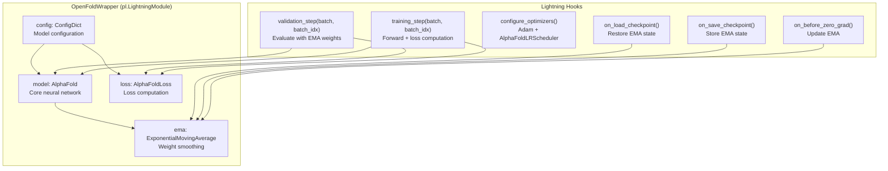
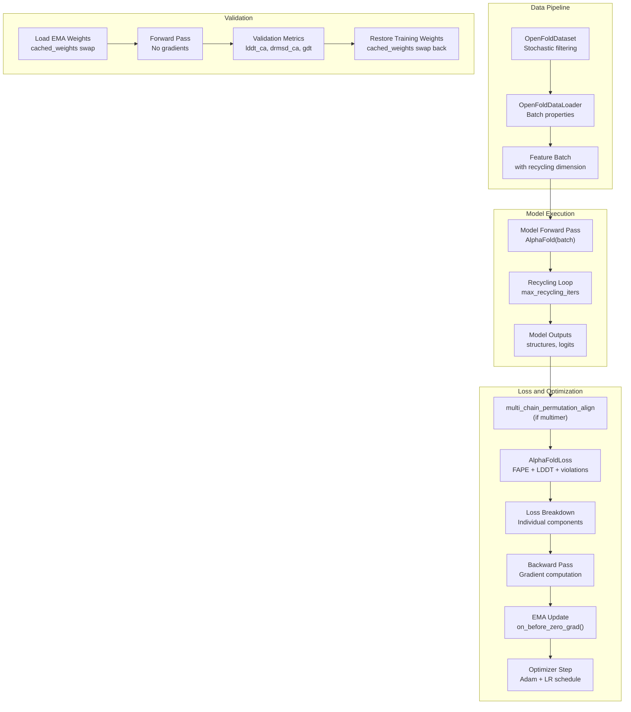
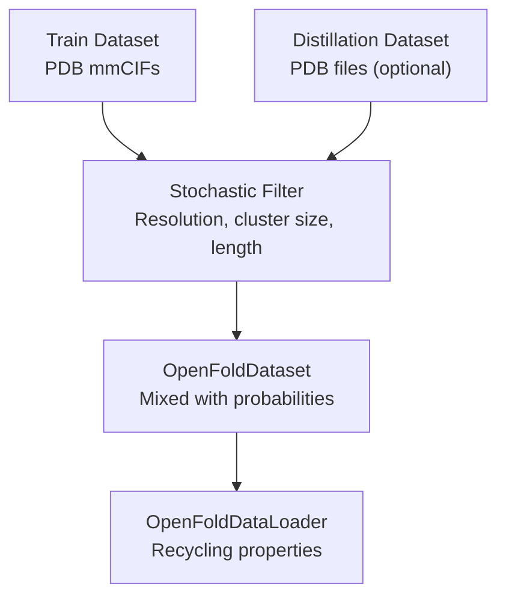
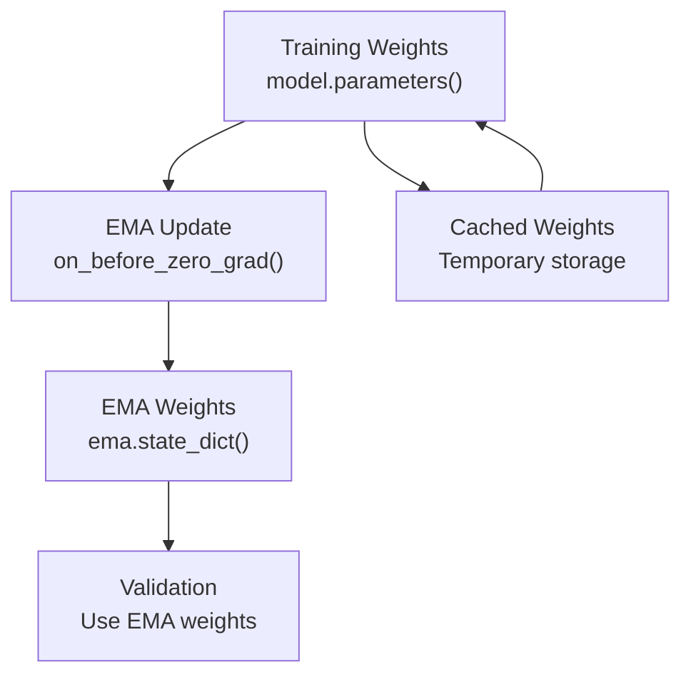
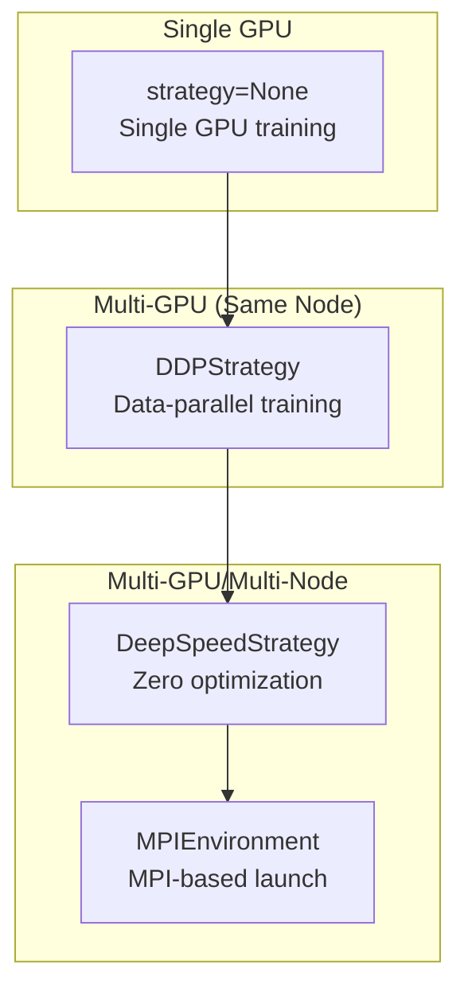

# Training OpenFold

# Training OpenFold

> **Relevant source files**
> - [openfold/data/data\_modules\.py](https://github.com/aqlaboratory/openfold/blob/56da08ec/openfold/data/data_modules.py)
> - [openfold/utils/loss\.py](https://github.com/aqlaboratory/openfold/blob/56da08ec/openfold/utils/loss.py)
> - [train\_openfold\.py](https://github.com/aqlaboratory/openfold/blob/56da08ec/train_openfold.py)

## Purpose and Scope

 This document provides an overview of the training system in OpenFold\. It describes the main training script, PyTorch Lightning integration, training workflow, and key components involved in training AlphaFold\-style models\.

 For detailed information about specific training subsystems, see:

 - Training pipeline internals: [Training Pipeline](https://deepwiki.com/aqlaboratory/openfold/4.1-training-pipeline)
- Data loading and filtering: [Data Loading and Filtering](https://deepwiki.com/aqlaboratory/openfold/4.2-data-loading-and-filtering)
- Memory optimization strategies: [Memory Optimization for Training](https://deepwiki.com/aqlaboratory/openfold/4.3-memory-optimization-for-training)
- Model architecture details: [Model Architecture](https://deepwiki.com/aqlaboratory/openfold/5-model-architecture)
- Loss function implementations: [Loss Functions](https://deepwiki.com/aqlaboratory/openfold/5.6-loss-functions)

---

## Training Entry Point

 The main training script is [train\_openfold\.py](https://github.com/aqlaboratory/openfold/blob/56da08ec/train_openfold.py) which orchestrates all training operations using PyTorch Lightning\. This script handles command\-line argument parsing, model initialization, data loading, distributed training configuration, and checkpoint management\.

 **Sources:** [train\_openfold\.py L1-L703](https://github.com/aqlaboratory/openfold/blob/56da08ec/train_openfold.py#L1-L703)

### Command\-Line Arguments

 The training script accepts several categories of arguments:

| Category | Key Arguments | Description |
| --- | --- | --- |
| Data Paths | train\_data\_dir, train\_alignment\_dir, template\_mmcif\_dir | Locations of training structures, MSAs, and templates |
| Output | output\_dir, experiment\_name | Where to save checkpoints and logs |
| Configuration | config\_preset, experiment\_config\_json | Model configuration selection and overrides |
| Training Control | max\_epochs, train\_epoch\_len, seed | Training duration and reproducibility |
| Distributed | gpus, num\_nodes, deepspeed\_config\_path | Multi\-GPU and multi\-node settings |
| Validation | val\_data\_dir, val\_alignment\_dir | Validation dataset locations |
| Checkpointing | resume\_from\_ckpt, checkpoint\_every\_epoch | Checkpoint loading and saving |
| Logging | wandb, wandb\_project, log\_lr | Experiment tracking |

 **Sources:** [train\_openfold\.py L470-L688](https://github.com/aqlaboratory/openfold/blob/56da08ec/train_openfold.py#L470-L688)

### Basic Training Command

```
python train_openfold.py \    /path/to/train_mmcifs/ \    /path/to/train_alignments/ \    /path/to/template_mmcifs/ \    /path/to/output/ \    2021-01-01 \    --config_preset initial_training \    --gpus 8 \    --max_epochs 100 \    --seed 42
```

 **Sources:** [train\_openfold\.py L469-L703](https://github.com/aqlaboratory/openfold/blob/56da08ec/train_openfold.py#L469-L703)

---

## PyTorch Lightning Integration

 OpenFold uses PyTorch Lightning to abstract distributed training, checkpointing, and logging\. The core wrapper is the `OpenFoldWrapper` class, which inherits from `pl.LightningModule`\.

### OpenFoldWrapper Class



 **Sources:** [train\_openfold\.py L45-L270](https://github.com/aqlaboratory/openfold/blob/56da08ec/train_openfold.py#L45-L270)

### Key Methods

| Method | Purpose | Key Operations |
| --- | --- | --- |
| \_\_init\_\_\(config\) | Initialize wrapper | Create model, loss, and EMA instances |
| forward\(batch\) | Model inference | Delegates to self\.model\(batch\) |
| training\_step\(batch, batch\_idx\) | Single training iteration | Forward pass, loss computation, multimer permutation alignment |
| validation\_step\(batch, batch\_idx\) | Single validation iteration | Load EMA weights, forward pass, compute metrics |
| on\_before\_zero\_grad\(\) | Pre\-optimizer hook | Update EMA with current model weights |
| configure\_optimizers\(\) | Setup optimization | Create Adam optimizer and AlphaFoldLRScheduler |
| on\_save\_checkpoint\(\) | Checkpoint hook | Save EMA state dict |
| on\_load\_checkpoint\(\) | Load checkpoint hook | Restore EMA state dict |

 **Sources:** [train\_openfold\.py L45-L270](https://github.com/aqlaboratory/openfold/blob/56da08ec/train_openfold.py#L45-L270)

---

## Training Workflow

 The complete training workflow involves data preparation, model forward passes with recycling, loss computation, gradient updates, and validation\.

### High\-Level Training Loop



 **Sources:** [train\_openfold\.py L97-L216](https://github.com/aqlaboratory/openfold/blob/56da08ec/train_openfold.py#L97-L216)

### Training Step Details

 The `training_step` method implements the following sequence:

 1. **EMA Device Check**: Ensure EMA is on the same device as the batch
2. **Extract Ground Truth**: Pop `gt_features` from batch if present
3. **Forward Pass**: Execute `self.model(batch)` with recycling
4. **Remove Recycling Dimension**: Use only the final recycling iteration for loss
5. **Multimer Alignment** \(if applicable\): Permute chains to minimize loss via `multi_chain_permutation_align`
6. **Loss Computation**: Calculate all loss components via `self.loss(outputs, batch)`
7. **Logging**: Log all loss components and metrics

 **Sources:** [train\_openfold\.py L97-L122](https://github.com/aqlaboratory/openfold/blob/56da08ec/train_openfold.py#L97-L122)

### Validation Step Details

 The `validation_step` differs from training in several ways:

 1. **EMA Weight Loading**: Swap to EMA weights at validation start
2. **No Clamped FAPE**: Set `batch["use_clamped_fape"] = 0.0`
3. **Additional Metrics**: Compute superimposition\-based metrics \(GDT\-TS, GDT\-HA, alignment RMSD\)
4. **Weight Restoration**: Return to training weights after validation epoch

 **Sources:** [train\_openfold\.py L127-L162](https://github.com/aqlaboratory/openfold/blob/56da08ec/train_openfold.py#L127-L162)

---

## Configuration System

 Training behavior is controlled through model configuration presets defined in `openfold.config.model_config`\.

### Available Presets

| Preset | Purpose | Key Differences |
| --- | --- | --- |
| initial\_training | Train from scratch | Standard configuration for full training |
| finetuning | Fine\-tune pretrained model | May use different loss weights or data augmentation |
| model\_1 | AlphaFold2 Model 1 architecture | Specific architectural choices |
| model\_1\_multimer | Multimer Model 1 | Multi\-chain specific settings |
| model\_1\_ptm | Model 1 with pTM head | Includes predicted TM\-score head |

 **Sources:** [train\_openfold\.py L291-L295](https://github.com/aqlaboratory/openfold/blob/56da08ec/train_openfold.py#L291-L295)

### Custom Configuration Override

 You can override any configuration parameter using a JSON file:

```
python train_openfold.py ... \    --config_preset initial_training \    --experiment_config_json custom_config.json
```

 The JSON file should contain a flattened dictionary of configuration paths:

```
{  "model.evoformer_stack.no_blocks": 48,  "loss.fape.weight": 0.5,  "data.train.max_template_hits": 4}
```

 **Sources:** [train\_openfold\.py L296-L299](https://github.com/aqlaboratory/openfold/blob/56da08ec/train_openfold.py#L296-L299)

---

## Key Training Components

### Data Loading System

 Training data is loaded through the `OpenFoldDataModule` \(monomer\) or `OpenFoldMultimerDataModule` \(multimer\), which implements stochastic filtering and dataset mixing\.



 For detailed information, see [Data Loading and Filtering](https://deepwiki.com/aqlaboratory/openfold/4.2-data-loading-and-filtering)\.

 **Sources:** [train\_openfold\.py L342-L356](https://github.com/aqlaboratory/openfold/blob/56da08ec/train_openfold.py#L342-L356) [data\_modules\.py L848-L1060](https://github.com/aqlaboratory/openfold/blob/56da08ec/openfold/data/data_modules.py#L848-L1060)

### Loss Computation

 The `AlphaFoldLoss` class aggregates multiple loss components with configurable weights:

| Loss Component | Purpose | Key Parameters |
| --- | --- | --- |
| fape | Frame Aligned Point Error | Backbone and sidechain structure accuracy |
| plddt\_loss | pLDDT prediction | Per\-residue confidence prediction |
| distogram | Distance prediction | Inter\-residue distance distribution |
| masked\_msa | MSA reconstruction | BERT\-style masked MSA prediction |
| supervised\_chi | Torsion angle prediction | Side\-chain dihedral angles |
| violation | Structural violations | Bond lengths, angles, clashes |
| tm \(optional\) | TM\-score prediction | Template modeling score |
| chain\_center\_of\_mass \(optional\) | Multimer COM loss | Inter\-chain positioning |

 The final loss is scaled by the square root of the minimum of the crop size and sequence length\.

 For implementation details, see [Loss Functions](https://deepwiki.com/aqlaboratory/openfold/5.6-loss-functions)\.

 **Sources:** [loss\.py L1685-L1794](https://github.com/aqlaboratory/openfold/blob/56da08ec/openfold/utils/loss.py#L1685-L1794)

### Exponential Moving Average \(EMA\)

 The training process maintains an EMA of model weights, which are used during validation\. This provides more stable predictions and better generalization\.



 **Sources:** [train\_openfold\.py L54-L56](https://github.com/aqlaboratory/openfold/blob/56da08ec/train_openfold.py#L54-L56) [train\_openfold\.py L124-L161](https://github.com/aqlaboratory/openfold/blob/56da08ec/train_openfold.py#L124-L161)

### Optimizer and Learning Rate Schedule

 The training uses Adam optimizer with a custom learning rate schedule \(`AlphaFoldLRScheduler`\) that implements the schedule described in the AlphaFold2 paper\.

 **Sources:** [train\_openfold\.py L217-L245](https://github.com/aqlaboratory/openfold/blob/56da08ec/train_openfold.py#L217-L245)

---

## Distributed Training Support

 OpenFold supports multiple distributed training strategies through PyTorch Lightning\.

### Training Strategies



 **Sources:** [train\_openfold\.py L415-L428](https://github.com/aqlaboratory/openfold/blob/56da08ec/train_openfold.py#L415-L428)

### DeepSpeed Integration

 When using DeepSpeed, provide a configuration file:

```
python train_openfold.py ... \    --deepspeed_config_path deepspeed_config.json \    --precision bf16
```

 The DeepSpeed optimizer configuration overrides the standard Adam optimizer settings\. For memory optimization details, see [Memory Optimization for Training](https://deepwiki.com/aqlaboratory/openfold/4.3-memory-optimization-for-training)\.

 **Sources:** [train\_openfold\.py L416-L422](https://github.com/aqlaboratory/openfold/blob/56da08ec/train_openfold.py#L416-L422)

### Multi\-Node Training

 For multi\-node training, use the MPI plugin:

```
mpirun -np 16 python train_openfold.py ... \    --mpi_plugin \    --num_nodes 2 \    --gpus 8 \    --seed 42
```

 **Note:** A seed must be specified for distributed training to ensure reproducibility across workers\.

 **Sources:** [train\_openfold\.py L415](https://github.com/aqlaboratory/openfold/blob/56da08ec/train_openfold.py#L415-L415) [train\_openfold\.py L691-L694](https://github.com/aqlaboratory/openfold/blob/56da08ec/train_openfold.py#L691-L694)

---

## Checkpointing and Resumption

### Checkpoint Content

 Checkpoints saved by PyTorch Lightning include:

 - Model state dict \(`state_dict`\)
- Optimizer state
- Learning rate scheduler state
- Global training step
- EMA state dict \(via `on_save_checkpoint`\)

 **Sources:** [train\_openfold\.py L254-L255](https://github.com/aqlaboratory/openfold/blob/56da08ec/train_openfold.py#L254-L255)

### Resuming Training

 To resume from a checkpoint:

```
python train_openfold.py ... \    --resume_from_ckpt /path/to/checkpoint.ckpt
```

 This restores the full training state including optimizer, scheduler, and EMA\.

 **Sources:** [train\_openfold\.py L303-L331](https://github.com/aqlaboratory/openfold/blob/56da08ec/train_openfold.py#L303-L331)

### Loading Pretrained Weights Only

 To initialize from pretrained weights without resuming training state:

```
python train_openfold.py ... \    --resume_from_ckpt /path/to/checkpoint.ckpt \    --resume_model_weights_only true
```

 **Sources:** [train\_openfold\.py L303-L322](https://github.com/aqlaboratory/openfold/blob/56da08ec/train_openfold.py#L303-L322)

### Loading JAX Parameters

 To initialize from original AlphaFold2 JAX parameters:

```
python train_openfold.py ... \    --resume_from_jax_params /path/to/params.npz
```

 **Sources:** [train\_openfold\.py L333-L336](https://github.com/aqlaboratory/openfold/blob/56da08ec/train_openfold.py#L333-L336) [train\_openfold\.py L260-L269](https://github.com/aqlaboratory/openfold/blob/56da08ec/train_openfold.py#L260-L269)

---

## Logging and Monitoring

### Weights & Biases Integration

 Enable W&B logging for experiment tracking:

```
python train_openfold.py ... \    --wandb \    --wandb_project my_project \    --wandb_entity my_entity \    --experiment_name my_experiment
```

 The wrapper automatically logs:

 - All loss components \(per step and per epoch\)
- Validation metrics \(lddt\_ca, drmsd\_ca, gdt\_ts, gdt\_ha\)
- Learning rate \(if `--log_lr` enabled\)

 **Sources:** [train\_openfold\.py L393-L413](https://github.com/aqlaboratory/openfold/blob/56da08ec/train_openfold.py#L393-L413) [train\_openfold\.py L65-L95](https://github.com/aqlaboratory/openfold/blob/56da08ec/train_openfold.py#L65-L95)

### Performance Logging

 Track training throughput and performance metrics:

```
python train_openfold.py ... \    --log_performance true
```

 This saves performance data to `output_dir/performance_log.json`\.

 **Sources:** [train\_openfold\.py L379-L385](https://github.com/aqlaboratory/openfold/blob/56da08ec/train_openfold.py#L379-L385)

### Early Stopping

 Enable early stopping based on validation metrics:

```
python train_openfold.py ... \    --early_stopping true \    --patience 3 \    --min_delta 0.001
```

 This monitors `val/lddt_ca` and stops training if it doesn't improve for `patience` epochs\.

 **Sources:** [train\_openfold\.py L367-L377](https://github.com/aqlaboratory/openfold/blob/56da08ec/train_openfold.py#L367-L377)

---

## Training for Multimer

 Multimer training requires specialized data handling and loss components\. The key differences are:

 1. **Data Module**: Use `OpenFoldMultimerDataModule` instead of `OpenFoldDataModule`
2. **Config Preset**: Use a multimer\-specific preset \(e\.g\., `model_1_multimer`\)
3. **Chain Permutation**: Automatically align chain permutations during training
4. **Additional Losses**: Chain center\-of\-mass loss, inter\-chain metrics

```
python train_openfold.py ... \    --config_preset model_1_multimer \    --train_mmcif_data_cache_path /path/to/mmcif_cache.json
```

 The multimer data cache is generated by `scripts/generate_mmcif_cache.py` and contains chain information for each structure\.

 **Sources:** [train\_openfold\.py L342-L353](https://github.com/aqlaboratory/openfold/blob/56da08ec/train_openfold.py#L342-L353) [train\_openfold\.py L109-L112](https://github.com/aqlaboratory/openfold/blob/56da08ec/train_openfold.py#L109-L112)

---

## Validation Metrics

 During validation, the following metrics are computed:

| Metric | Description | Computation |
| --- | --- | --- |
| lddt\_ca | Local Distance Difference Test \(Cα only\) | Distance\-based accuracy within 15Å cutoff |
| drmsd\_ca | Distance Root Mean Square Deviation \(Cα\) | RMSD of inter\-residue distances |
| gdt\_ts | Global Distance Test \- Total Score | Fraction of residues within 1,2,4,8Å after superimposition |
| gdt\_ha | Global Distance Test \- High Accuracy | Fraction of residues within 0\.5,1,2,4Å after superimposition |
| alignment\_rmsd | Alignment RMSD | RMSD after optimal superimposition |

 **Sources:** [train\_openfold\.py L163-L215](https://github.com/aqlaboratory/openfold/blob/56da08ec/train_openfold.py#L163-L215)

---
*Source: [https://deepwiki.com/aqlaboratory/openfold/4-training-openfold](https://deepwiki.com/aqlaboratory/openfold/4-training-openfold) on DeepWiki*