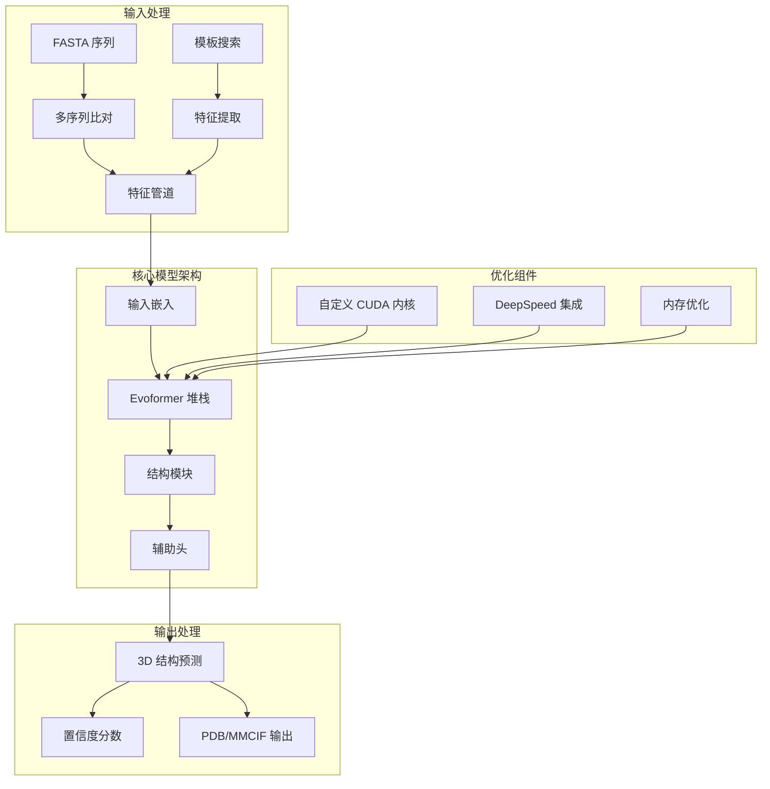

---
slug:1-overview
blog_type:normal
---


OpenFold 是 DeepMind 的 AlphaFold 2 的忠实但可训练的 PyTorch 重现版本，代表了开源蛋白质结构预测领域的重大进步。该项目为研究人员和开发者提供了最先进的蛋白质折叠能力，同时与原始 AlphaFold 架构保持完全兼容。


## 什么是 OpenFold？

OpenFold 是 AlphaFold 2 在 PyTorch 中的完整重新实现，旨在既忠实于原始实现，又完全支持从头开始训练。与主要专注于推理的原始 AlphaFold 不同，OpenFold 使研究人员能够训练自定义模型、修改架构，并为蛋白质结构预测技术的发展做出贡献。

该项目旨在让尖端蛋白质折叠技术的获取更加民主化，同时为科学创新和研究进展提供所需的灵活性。

来源：[README.md](README.md#L1-L10), [docs/source/index.md](docs/source/index.md#L1-L10)

## 主要功能和优势

与原始 AlphaFold 实现相比，OpenFold 提供了几个显著优势：

| 功能 | 描述 | 优势 |
|---------|-------------|---------|
| **PyTorch 实现** | 在 PyTorch 框架下完全重写 | 更容易与现有机器学习工作流集成，具有更好的调试能力 |
| **更快推理** | 优化 GPU 性能，速度提升高达 2 倍 | 减少计算时间和资源需求 |
| **长序列支持** | 在单个 A100 上处理超过 4000 个残基的序列 | 能够预测大型蛋白质复合物 |
| **内存优化** | 自定义 CUDA 内核和注意力机制 | GPU 内存使用量比替代方案少 4-5 倍 |
| **训练能力** | 具有多种精度模式的完整训练流程 | 能够在专有数据上训练自定义模型 |
| **DeepSpeed 集成** | 支持分布式训练和推理 | 可扩展到多 GPU 和多节点环境 |
| **FlashAttention 支持** | 优化的注意力计算 | 显著提升 MSA 处理速度 |

来源：[docs/source/index.md](docs/source/index.md#L18-L45), [setup.py](setup.py#L30-L137)

## 架构概述

OpenFold 遵循与 AlphaFold 2 相同的核心架构原则，包含几个关键组件：



该架构包含三个主要阶段：

1. **输入处理**：通过多序列比对（MSA）和模板搜索从氨基酸序列中提取特征
2. **核心模型**：Evoformer 处理进化信息，结构模块生成 3D 坐标
3. **输出处理**：最终预测结果经过细化，并输出置信度指标

来源：[openfold/model/model.py](openfold/model/model.py#L1-L50), [openfold/model/evoformer.py](openfold/model/evoformer.py#L748-L754)

## 核心组件

### Evoformer 堆栈
OpenFold 的核心是 Evoformer，它通过复杂的注意力机制处理多序列比对和成对表示：

- **MSA 处理**：使用行和列注意力处理多序列比对数据
- **成对表示**：管理氨基酸之间的成对关系
- **三角形注意力**：为蛋白质结构实现高效的注意力模式
- **外积均值**：计算跨 MSA 维度的均值表示

来源：[openfold/model/evoformer.py](openfold/model/evoformer.py#L748-L754)

### 结构模块
使用几何推理和不变变换将处理后的特征转换为 3D 原子坐标：

- **不变点注意力**：尊重 3D 几何约束的注意力机制
- **框架更新**：迭代优化蛋白质主链和侧链位置
- **损失函数**：用于结构预测质量的专用损失函数

### 数据处理管道
支持各种输入格式和预处理要求的综合数据处理系统：

- **特征提取**：将原始序列转换为模型就绪特征
- **模板集成**：整合来自 PDB 的已知结构信息
- **MSA 生成**：使用各种工具创建多序列比对

来源：[run_pretrained_openfold.py](run_pretrained_openfold.py#L127-L173)

## 项目结构

OpenFold 仓库组织为几个关键目录：

```
openfold/
├── openfold/           # 核心库代码
│   ├── model/         # 神经网络架构
│   ├── data/          # 数据处理管道
│   ├── utils/         # 实用函数和内核
│   └── np/            # 基于 NumPy 的蛋白质工具
├── scripts/           # 训练和推理脚本
├── examples/          # 用法示例和配置
├── docs/             # 文档和指南
├── tests/            # 单元测试和验证
└── notebooks/        # 交互式教程
```

来源：[openfold/__init__.py](openfold/__init__.py#L1-L8)

## 性能和可扩展性

OpenFold 引入了多项性能优化，使其适用于研究和生产环境：

### 内存效率
- **自定义 CUDA 内核**：专用注意力内核，将内存占用减少 4-5 倍
- **低内存注意力**：为长序列实现内存高效的注意力机制
- **CPU 卸载**：在需要时通过卸载到 CPU 来支持非常长序列的推理

### 计算速度
- **FlashAttention 集成**：利用优化的注意力实现
- **DeepSpeed DS4Sci_EvoformerAttention**：用于显著加速的专用内核
- **GPU 优化**：针对现代 GPU 架构优化以实现最大性能

<CgxTip>OpenFold 的自定义 CUDA 内核可以在单个 A100 GPU 上处理超过 4000 个残基的序列，使其适用于标准实现无法处理的大型蛋白质复合物。</CgxTip>

来源：[docs/source/index.md](docs/source/index.md#L27-L35), [openfold/config.py](openfold/config.py#L1-L50)

## OpenFold 入门指南

要开始使用 OpenFold，请按照以下逻辑步骤操作：

1. **安装**：设置环境和依赖项
2. **数据库配置**：下载并配置所需的生物数据库
3. **基本推理**：使用预训练模型运行预测
4. **高级用法**：探索训练自定义模型和专用功能

有关详细说明，请参阅[快速入门](2-quick-start)指南，该指南将引导你完成初始设置和首次预测。

## 后续步骤

根据你的兴趣和需求，考虑探索以下特定领域：

- **安装和设置**：[系统要求和依赖项](3-system-requirements-and-dependencies)
- **基本用法**：[使用预训练模型运行推理](5-running-inference-with-pretrained-models)
- **高级架构**：[AlphaFold 2 模型实现](9-alphafold-2-model-implementation)
- **性能优化**：[内存优化技术](11-memory-optimization-techniques)