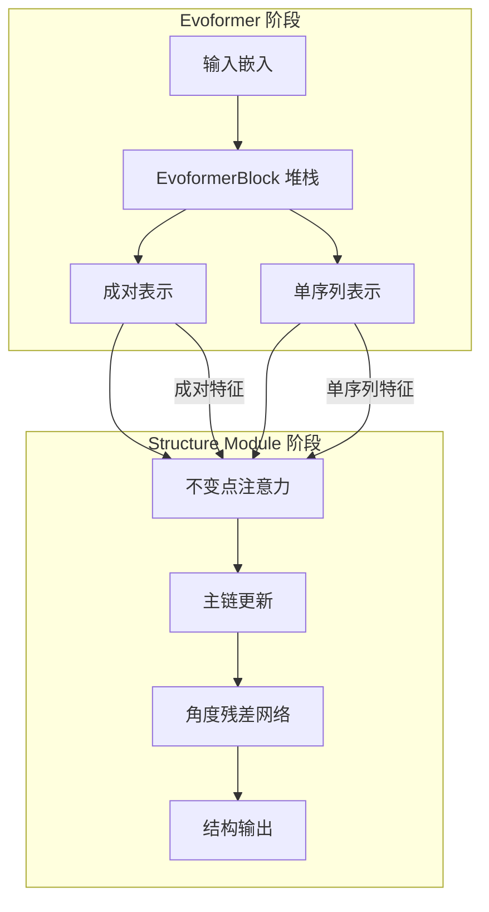

---
slug:10-evoformer-and-structure-module
blog_type:normal
---


Evoformer 和 Structure Module 构成了 OpenFold 的 AlphaFold 2 实现的核心计算引擎，它们协同工作，将进化和序列信息转化为精确的 3D 蛋白质结构。这些组件实现了复杂的注意力机制和几何推理，从而实现准确的蛋白质结构预测。

## 架构概述

Evoformer 和 Structure Module 形成一个两阶段处理流水线，其中进化信息首先通过基于注意力的操作进行精炼，然后通过几何变换转化为 3D 坐标。



该架构体现了 AlphaFold 2 论文中的算法 6（Evoformer）和算法 23（Structure Module），并特别关注计算效率和内存优化。

## Evoformer 核心组件

### EvoformerStack：主干网络

`EvoformerStack` 作为主要处理引擎，通过多个注意力和几何变换块实现算法 6 [evoformer.py#L748-L770]：

```python
class EvoformerStack(nn.Module):
    """
    主 Evoformer 干线。
    
    实现算法 6。
    """
```

关键架构特性包括：

| 组件 | 用途 | 参数 |
|-----------|---------|------------|
| **MSA 处理** | 多序列比对注意力 | `c_m`, `no_heads_msa` |
| **成对处理** | 残基对关系 | `c_z`, `no_heads_pair` |
| **外积均值** | MSA 到成对信息流 | `c_hidden_opm` |
| **三角更新** | 几何约束传播 | `c_hidden_mul`, `c_hidden_pair_att` |

<CgxTip>EvoformerStack 支持单体和多聚体模式，可通过可配置的检查点（`blocks_per_ckpt`）在训练大型蛋白质复合物时优化内存。</CgxTip>

### EvoformerBlock：原子处理单元

每个 `EvoformerBlock` 代表一个完整的处理周期，结合 MSA 和成对表示 [evoformer.py#L377-L440]：

```python
class EvoformerBlock(MSABlock):
    def __init__(self,
        c_m: int,           # MSA 通道维度
        c_z: int,           # 成对通道维度
        no_heads_msa: int,  # MSA 注意力头数
        no_heads_pair: int, # 成对注意力头数
        no_column_attention: bool,  # 列注意力开关
        ...
    ):
```

块架构特性包括：

1. **MSA 行注意力**：跨比对位置处理序列
2. **MSA 列注意力**：跨序列处理位置（可配置）
3. **外积均值**：将 MSA 信息转换为成对表示
4. **三角注意力**：通过成对表示传播几何约束
5. **转换层**：具有可配置 dropout 的非线性变换

### ExtraMSAStack：扩展进化信息

为增强进化建模，`ExtraMSAStack` 使用专门块处理额外的 MSA 数据，这些块采用 GlobalAttention 进行列向处理 [evoformer.py#L1028-L1050]：

```python
class ExtraMSAStack(nn.Module):
    """
    实现算法 18。
    """
```

该组件通过处理未包含在主 Evoformer 堆栈中的额外 MSA 序列，提供更深入的进化背景。

## Structure Module：几何实现

Structure Module 通过复杂的几何推理，将 Evoformer 的抽象表示转化为具体的 3D 坐标。

### StructureModule：主协调器

`StructureModule` 协调最终结构预测，支持单体和多聚体蛋白质结构 [structure_module.py#L817-L880]：

```python
class StructureModule(nn.Module):
    def __init__(
        self,
        c_s,                    # 单序列表示通道维度
        c_z,                    # 成对表示通道维度
        c_ipa,                  # IPA 隐藏通道维度
        no_heads_ipa,           # IPA 头数
        no_qk_points,           # IPA 的查询/关键点数
        no_v_points,            # IPA 的值点数
        no_blocks,              # 结构模块块数
        is_multimer=False,      # 多聚体模式开关
        **kwargs,
    ):
```

关键架构决策包括：

| 参数 | 作用 | 影响 |
|-----------|------|--------|
| **`no_qk_points`/`no_v_points`** | 3D 注意力分辨率 | 较高值捕获更精细的几何细节 |
| **`no_blocks`** | 迭代精炼 | 更多块提高精度但增加计算量 |
| **`is_multimer`** | 链处理 | 多链复合物的专门处理 |

### InvariantPointAttention：3D 几何注意力

`InvariantPointAttention`（IPA）机制代表核心几何推理组件，实现算法 22 [structure_module.py#L209-L230]：

```python
class InvariantPointAttention(nn.Module):
    """
    实现算法 22。
    """
```

IPA 通过以下方式运作：

1. **点生成**：将单序列表示转换为 3D 查询/键/值点
2. **刚性变换**：应用当前结构框架变换
3. **注意力计算**：在具有几何感知的 3D 空间中执行注意力
4. **不变聚合**：在保持旋转/平移不变性的同时组合注意力结果

多聚体变体（`InvariantPointAttentionMultimer`）通过专门处理链间相互作用扩展了此功能 [structure_module.py#L513-L525]。

### 主链更新和角度精炼

最终结构组件协同工作以生成原子坐标：

- **BackboneUpdate**：将单序列表示转换为主链坐标更新 [structure_module.py#L736-L753]
- **AngleResnet**：使用残差网络预测扭转角（算法 20，第 11-14 行）[structure_module.py#L78-L117]
- **StructureModuleTransition**：在 IPA 块之间提供非线性变换 [structure_module.py#L791-L807]

## 集成模式和数据流

Evoformer 和 Structure Module 通过主 `AlphaFold` 模型中精心设计的数据流进行集成 [model.py#L124-L131]：

```python
self.evoformer = EvoformerStack(
    **self.config["evoformer_stack"],
)

self.structure_module = StructureModule(
    is_multimer=self.globals.is_multimer,
    **self.config["structure_module"],
)
```

### 关键集成点

1. **表示传递**：
   - 单序列表示（`m`）和成对表示（`z`）从 Evoformer 流向 Structure Module
   - 回收嵌入支持跨多个周期的迭代精炼

2. **掩码传播**：
   - 序列掩码和成对掩码确保正确的注意力计算
   - 多聚体模式包括用于多链处理的非对称链掩码

3. **内存优化**：
   - Evoformer 和 Structure Module 操作均支持分块处理
   - DeepSpeed 集成用于大规模训练
   - 可配置检查点以平衡内存和计算

## 性能优化特性

### 内存效率

两个模块都实现了多种内存优化策略：

| 优化 | Evoformer | Structure Module | 优势 |
|--------------|-----------|------------------|---------|
| **分块处理** | ✓ | ✓ | 分段处理大序列 |
| **DeepSpeed 集成** | ✓ | ✓ | 分布式训练优化 |
| **Flash Attention** | ✓ | ✓ | 内存高效注意力计算 |
| **原地操作** | ✓ | ✓ | 减少内存开销 |

### 计算效率

实现包含多种性能优化：

- **TorchScript 兼容性**：关键组件支持 TorchScript 以便部署
- **自定义 CUDA 内核**：专门操作以实现最大性能
- **可配置精度**：支持混合精度训练
- **延迟初始化**：按需初始化残基常量以节省内存

## 配置和用法

### 关键配置参数

模块暴露众多配置选项用于调整性能和精度：

```python
# EvoformerStack 配置
evoformer_config = {
    'no_blocks': 48,              # Evoformer 块数
    'c_m': 256,                   # MSA 通道维度  
    'c_z': 128,                   # 成对通道维度
    'no_heads_msa': 8,            # MSA 注意力头数
    'no_heads_pair': 4,           # 成对注意力头数
    'blocks_per_ckpt': 1,         # 检查点频率
}

# StructureModule 配置
structure_config = {
    'no_blocks': 8,               # 结构精炼迭代次数
    'c_ipa': 384,                 # IPA 隐藏维度
    'no_heads_ipa': 12,           # IPA 注意力头数
    'no_qk_points': 4,            # 3D 注意力分辨率
    'no_v_points': 8,             # 3D 值分辨率
    'no_angles': 7,               # 每残基扭转角数
}
```

### 模式选择

模块支持不同操作模式：

- **单体模式**：标准单链蛋白质预测
- **多聚体模式**：具有专门注意力的多链蛋白质复合物预测
- **序列嵌入模式**：无需 MSA 处理的直接嵌入输入
- **推理模式**：针对内存受限的预测进行优化

## 后续步骤

要全面理解 OpenFold 的架构，请继续探索：

- [AlphaFold 2 模型实现](9-alphafold-2-model-implementation) - 完整模型架构概述
- [内存优化技术](11-memory-optimization-techniques) - 处理大型蛋白质的详细策略
- [自定义 CUDA 内核和 FlashAttention](17-custom-cuda-kernels-and-flashattention) - 性能优化详情
- [多聚体蛋白质结构预测](18-multimer-protein-structure-prediction) - 蛋白质复合物的专门处理

Evoformer 和 Structure Module 代表 OpenFold 的计算核心，结合进化信息处理和几何推理，实现最先进的蛋白质结构预测。它们的模块化设计和优化特性支持从研究探索到生产部署的广泛蛋白质预测任务。