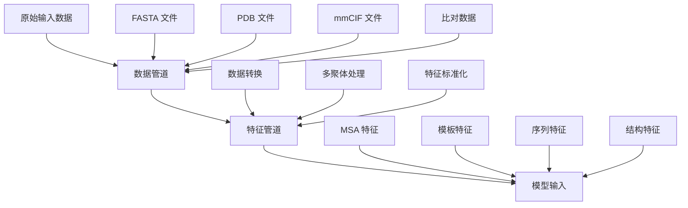

---
slug:12-feature-extraction-and-processing
blog_type:normal
---


OpenFold 中的特征提取与处理管道通过复杂的多阶段架构，将原始生物序列数据转化为结构化的神经网络输入。该管道处理从序列解析到高级多聚体处理的全流程，使 AlphaFold 2 模型能够有效学习多样化的蛋白质数据来源。

## 核心架构概述

特征处理系统围绕三个主要组件构建，协同工作将原始数据转换为模型就绪特征：

### 数据管道架构



`DataPipeline` 类 ([data_pipeline.py#L706-L1374](openfold/data/data_pipeline.py#L706)) 作为主要接口，协调比对解析、模板搜索和特征组装。它处理包括 FASTA、PDB 和 mmCIF 在内的多种输入格式，将生物信息提取并整合为标准化的特征字典。

### 特征处理管道

`FeaturePipeline` 类 ([feature_pipeline.py#L132-L154](openfold/data/feature_pipeline.py#L132)) 作为中央处理协调器，应用配置特定的转换并准备特征供模型使用：

```python
class FeaturePipeline:
    def __init__(self, config: ml_collections.ConfigDict):
        self.config = config

    def process_features(self, raw_features: FeatureDict, 
                        mode: str = "train", 
                        is_multimer: bool = False) -> FeatureDict:
        return np_example_to_features(
            np_example=raw_features,
            config=self.config,
            mode=mode,
            is_multimer=is_multimer,
        )
```

## 特征提取组件

### 序列与 MSA 特征生成

该管道生成多种对蛋白质结构预测至关重要的序列相关特征：

#### 核心序列特征
- **氨基酸编码**：残基类型的独热表示
- **序列掩码**：有效位置的二元指示器
- **片段间残基**：结构域断裂信息
- **概要特征**：来自比对的位置特异性评分矩阵

#### MSA 特征处理
多重序列比对特征通过 `make_msa_feat` ([data_transforms.py#L544-L593](openfold/data/data_transforms.py#L544)) 中的复杂转换进行处理：

```python
def make_msa_feat(protein):
    """创建并拼接 MSA 特征。"""
    msa_1hot = make_one_hot(protein["msa"], 23)
    has_deletion = torch.clip(protein["deletion_matrix"], 0.0, 1.0)
    deletion_value = torch.atan(protein["deletion_matrix"] / 3.0) * (2.0 / np.pi)
    
    msa_feat = [
        msa_1hot,  # 23维独热编码
        torch.unsqueeze(has_deletion, dim=-1),    # 缺失存在指示
        torch.unsqueeze(deletion_value, dim=-1),  # 标准化缺失值
    ]
    
    if "cluster_profile" in protein:
        # 添加基于聚类的概要特征
        deletion_mean_value = torch.atan(protein["cluster_deletion_mean"] / 3.0) * (2.0 / np.pi)
        msa_feat.extend([protein["cluster_profile"], 
                        torch.unsqueeze(deletion_mean_value, dim=-1)])
```

### 模板特征集成

模板特征整合来自同源蛋白质的结构信息，通过专用特征化器将 PDB/mmCIF 数据转换为数值表示：

| 模板特征类型 | 维度 | 描述 |
|------------------------|------------|-------------|
| 模板坐标 | (num_templates, num_res, 37, 3) | 模板结构的原子位置 |
| 模板掩码 | (num_templates, num_res) | 模板位置的有效性指示器 |
| 模板单位向量 | (num_templates, num_res, num_res, 3) | 残基间的方向关系 |
| 模板成对距离 | (num_templates, num_res, num_res) | 用于结构比较的距离矩阵 |

### 结构特征推导

管道从原子坐标计算结构特征，包括伪-beta位置、扭转角和参考坐标系：

```python
def atom37_to_torsion_angles(protein, prefix=""):
    """将 atom37 位置转换为扭转角。"""
    # 提取主干框架并计算 chi 角
    # 返回：angles, alt_angles, frames, mask
```

<CgxTip>伪-beta特征对表示蛋白质主干几何结构至关重要，大多数残基使用α-碳位置，在可用时使用β-碳位置。</CgxTip>

## 数据转换与标准化

### 特征标准化

`make_fixed_size` 函数 ([data_transforms.py#L505-L540](openfold/data/data_transforms.py#L505)) 确保不同蛋白质长度和 MSA 深度下的张量维度一致性：

```python
def make_fixed_size(protein, shape_schema, msa_cluster_size, 
                   extra_msa_size, num_res=0, num_templates=0):
    pad_size_map = {
        NUM_RES: num_res,
        NUM_MSA_SEQ: msa_cluster_size,
        NUM_EXTRA_SEQ: extra_msa_size,
        NUM_TEMPLATES: num_templates,
    }
    
    for k, v in protein.items():
        # 应用填充以匹配模式维度
        padding = [(0, p - v.shape[i]) for i, p in enumerate(pad_size)]
        protein[k] = torch.nn.functional.pad(v, padding)
```

### MSA 采样与处理

管道实现复杂的 MSA 处理策略：

| 处理方法 | 目的 | 配置参数 |
|-------------------|---------|-------------------------|
| 随机采样 | 减少 MSA 深度以提高训练效率 | `max_seq` |
| 基于聚类的采样 | 保留进化信息 | `keep_extra` |
| 区块删除 | 模拟不完整比对数据 | `block_delete_msa` |
| 掩码 MSA | 启用 BERT 式预训练 | `replace_fraction` |

## 多聚体特征处理

### 链配对与合并

对于多聚体预测，`pair_and_merge` 函数 ([feature_processing_multimer.py#L50-L85](openfold/data/feature_processing_multimer.py#L50)) 协调复杂的链间处理：

```python
def pair_and_merge(all_chain_features: MutableMapping[str, Mapping[str, np.ndarray]]):
    process_unmerged_features(all_chain_features)
    np_chains_list = list(all_chain_features.values())
    
    pair_msa_sequences = not _is_homomer_or_monomer(np_chains_list)
    
    if pair_msa_sequences:
        np_chains_list = msa_pairing.create_paired_features(chains=np_chains_list)
        np_chains_list = msa_pairing.deduplicate_unpaired_sequences(np_chains_list)
    
    np_chains_list = crop_chains(np_chains_list, msa_crop_size=MSA_CROP_SIZE,
                                pair_msa_sequences=pair_msa_sequences,
                                max_templates=MAX_TEMPLATES)
    
    return msa_pairing.merge_chain_features(np_chains_list=np_chains_list,
                                          pair_msa_sequences=pair_msa_sequences,
                                          max_templates=MAX_TEMPLATES)
```

### 多聚体特异性特征

多聚体处理生成额外的链间相互作用特征：

- **组装特征**：链连接性和界面信息
- **配对特征**：跨链 MSA 序列关系
- **界面掩码**：残基级别的相互作用指示器
- **链映射**：单体与多聚体索引间的对应关系

## 特征配置与模式处理

### 训练与推理模式

管道根据操作模式调整特征处理：

| 模式 | 关键差异 | 添加特征 |
|------|-----------------|----------------|
| 训练 | 数据增强、随机裁剪 | `use_clamped_fape`、随机掩码 |
| 推理 | 完整 MSA、无增强 | 标准特征、无随机化 |
| 评估 | 平衡处理 | 中等特征集 |

### 配置驱动的处理

特征处理通过详细的配置规范控制，定义：

- **形状模式**：每个特征的预期张量维度
- **处理标志**：启用/禁用特定转换
- **模式特定设置**：训练与推理参数
- **多聚体配置**：链处理参数

<CgxTip>配置系统支持灵活的特征处理管道，可适应不同的模型架构、数据可用性场景和计算约束。</CgxTip>

## 特征质量与验证

### 输入验证

管道包含全面的验证检查：

- **序列有效性**：确保正确的氨基酸编码
- **模板一致性**：验证模板结构兼容性
- **MSA 完整性**：检查比对质量和完整性
- **维度匹配**：验证张量形状一致性

### 特征监控

内置监控功能跟踪：

- **特征覆盖率**：有效位置百分比
- **MSA 深度统计**：比对质量指标
- **模板使用率**：结构信息利用率
- **处理时间**：计算效率指标

这种复杂的特征提取与处理架构使 OpenFold 能够有效将多样化的生物数据源转换为准确蛋白质结构预测所需的结构化输入，通过可配置的处理管道支持单体和多聚体预测场景。

有关数据处理管道特定方面的更多详情，请参阅[多重序列比对（MSA）处理](13-multiple-sequence-alignment-msa-handling)和[模板搜索与集成](14-template-search-and-integration)。