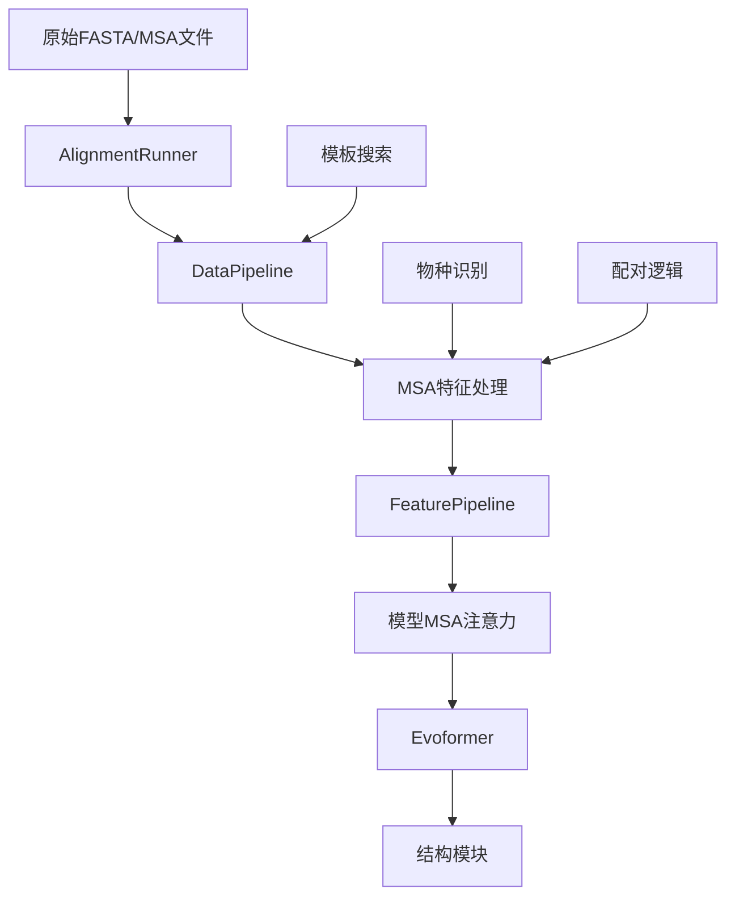

---
slug:13-multiple-sequence-alignment-msa-handling
blog_type:normal
---


多重序列比对（MSA）处理构成了OpenFold结构预测流程的计算主干，作为实现准确蛋白质结构推理的主要进化信息来源。本文档探讨了使MSA处理既高效又可扩展的架构模式、实现细节和优化策略。

## MSA架构概述
MSA处理流程实现了复杂的多阶段架构，将原始序列比对转换为适合深度学习模型的丰富特征表示。该系统支持单体和多聚体蛋白质预测，并针对大规模比对和内存受限环境提供专门处理。



来源：[data_pipeline.py](openfold/data/data_pipeline.py#L334-L482), [feature_pipeline.py](openfold/data/feature_pipeline.py#L132-L148)

## MSA数据处理流程
核心MSA处理始于`AlignmentRunner`类，该类协调多个比对工具和数据库以生成全面的序列比对。该组件支持多种搜索策略和数据库配置，在保持计算效率的同时最大化覆盖率。

### AlignmentRunner架构
`AlignmentRunner` ([data_pipeline.py#L334](openfold/data/data_pipeline.py#L334)) 作为MSA生成的主要接口，支持多种搜索算法：

| 搜索工具 | 数据库支持 | 主要用例 | 性能特征 |
|----------|------------|----------|----------|
| Jackhmmer | UniRef90, Mgnify, Small BFD, UniProt | 通用比对 | 高精度，中等速度 |
| HHblits | BFD + UniRef30/UniClust30 | 深度同源检测 | 极快，支持大型数据库 |

```python
class AlignmentRunner:
    def __init__(
        self,
        jackhmmer_binary_path: Optional[str] = None,
        hhblits_binary_path: Optional[str] = None,
        uniref90_database_path: Optional[str] = None,
        mgnify_database_path: Optional[str] = None,
        bfd_database_path: Optional[str] = None,
        # ... 其他参数
    ):
```

来源：[data_pipeline.py#L334-L482](openfold/data/data_pipeline.py#L334-L482)

### MSA特征构建
`make_msa_features`函数 ([data_pipeline.py#L224](openfold/data/data_pipeline.py#L224)) 将原始比对数据转换为结构化特征数组：

```python
def make_msa_features(msas: Sequence[parsers.Msa]) -> FeatureDict:
    """构建MSA特征字典。"""
    int_msa = []
    deletion_matrix = []
    species_ids = []
    seen_sequences = set()
    
    for msa_index, msa in enumerate(msas):
        for sequence_index, sequence in enumerate(msa.sequences):
            if sequence in seen_sequences:
                continue
            seen_sequences.add(sequence)
            int_msa.append(
                [residue_constants.HHBLITS_AA_TO_ID[res] for res in sequence]
            )
```

生成的关键特征包括：
- **msa**: 整数编码的氨基酸序列
- **deletion_matrix**: 每个比对位置的间隙/删除信息
- **msa_species_identifiers**: 用于进化分析的分类学信息
- **num_alignments**: 每个残基位置的总比对数

<CgxTip>`make_msa_features`中的去重逻辑防止冗余序列膨胀MSA，在保留进化多样性的同时显著减少内存使用。</CgxTip>

来源：[data_pipeline.py#L224-L264](openfold/data/data_pipeline.py#L224-L264)

## MSA特征处理与物种识别
物种识别为MSA处理提供关键的进化背景，支持复杂的配对和分析策略。

### 物种标识符提取
`msa_identifiers`模块 ([msa_identifiers.py#L15](openfold/data/msa_identifiers.py#L15)) 实现了对序列元数据的稳健解析：

```python
_UNIPROT_PATTERN = re.compile(
    r"""
    ^
    # 数据库类型（sp代表Swiss-Prot，tr代表TrEMBL）
    (?P<db_type>sp|tr)
    \|
    # 唯一标识符（例如A0A146SKV9）
    (?P<unique_id>[A-Z0-9]{6,10})
    \|
    # 条目名称（例如A0A146SKV9_FUNHE）
    (?P<entry_name>[A-Z0-9_]+)
    $
    """,
    re.VERBOSE,
)
```

这种模式识别能够从UniProt风格标识符中提取分类学信息，支持跨多样化序列数据库的进化分析。

来源：[msa_identifiers.py#L22-L28](openfold/data/msa_identifiers.py#L22-L28)

### 特征流程集成
`FeaturePipeline`类 ([feature_pipeline.py#L132](openfold/data/feature_pipeline.py#L132)) 作为模型输入前的最终处理阶段：

```python
class FeaturePipeline:
    def process_features(
        self,
        raw_features: FeatureDict,
        mode: str = "train",
        is_multimer: bool = False,
    ) -> FeatureDict:
        return np_example_to_features(
            raw_features, self.config, mode, is_multimer
        )
```

该流程处理数据类型转换、配置驱动的特征选择以及训练与推理的模式特定处理。

来源：[feature_pipeline.py#L132-L148](openfold/data/feature_pipeline.py#L132-L148)

## MSA注意力机制
OpenFold实现了专为MSA数据设计的复杂注意力机制，使模型能够跨多个序列维度捕获复杂的进化模式。

### MSA注意力架构
`MSAAttention`类 ([msa.py#L36](openfold/model/msa.py#L36)) 提供了MSA特定注意力操作的基础：

```python
class MSAAttention(nn.Module):
    def __init__(
        self,
        c_in,
        c_hidden,
        no_heads,
        pair_bias=False,
        c_z=None,
        inf=1e9,
    ):
        self.layer_norm_m = LayerNorm(self.c_in)
        self.mha = Attention(
            self.c_in, self.c_in, self.c_in, 
            self.c_hidden, self.no_heads,
        )
```

关键架构组件：
- **多头注意力**，具有可配置的隐藏维度
- **配对偏置支持**，用于集成结构信息
- **层归一化**，确保稳定的训练动态

<CgxTip>MSA注意力实现支持多种优化策略，包括DeepSpeed集成、FlashAttention和内存高效内核，以处理大规模比对。</CgxTip>

来源：[msa.py#L36-L100](openfold/model/msa.py#L36-L100)

### 专用注意力变体
OpenFold为MSA数据实现了几种专用注意力模式：

| 注意力类型 | 算法参考 | 主要功能 | 关键特性 |
|------------|----------|----------|----------|
| MSARowAttentionWithPairBias | 算法7 | 具有结构偏置的行注意力 | 集成配对嵌入、进化背景 |
| MSAColumnAttention | 算法8 | 列注意力 | 捕获跨序列的位置模式 |
| MSAColumnGlobalAttention | - | 全局列注意力 | 长程依赖建模 |

```python
class MSARowAttentionWithPairBias(MSAAttention):
    """实现算法7。"""
    
class MSAColumnAttention(nn.Module):
    """实现算法8。"""
```

来源：[msa.py#L295-L402](openfold/model/msa.py#L295-L402)

## 多聚体MSA配对
对于蛋白质复合物预测，OpenFold实现了复杂的MSA配对逻辑，确保跨多个链的进化信息一致性。

### 配对算法
`pair_sequences`函数 ([msa_pairing.py#L181](openfold/data/msa_pairing.py#L181)) 实现了核心配对逻辑：

```python
def pair_sequences(
    examples: List[Mapping[str, np.ndarray]],
) -> Dict[int, np.ndarray]:
  """返回跨链的配对MSA序列索引。"""
  
  all_chain_species_dict = []
  common_species = set()
  for chain_features in examples:
    msa_df = _make_msa_df(chain_features)
    species_dict = _create_species_dict(msa_df)
    all_chain_species_dict.append(species_dict)
    common_species.update(set(species_dict))
```

配对算法：
1. **跨链物种识别**
2. **配对候选的公共物种检测**
3. **物种组内序列相似性匹配**
4. **模型消费的配对索引生成**

来源：[msa_pairing.py#L181-L235](openfold/data/msa_pairing.py#L181-L235)

### 特征合并策略
`merge_chain_features`函数 ([msa_pairing.py#L432](openfold/data/msa_pairing.py#L432)) 协调配对和未配对特征的组合：

```python
def merge_chain_features(np_chains_list: List[Mapping[str, np.ndarray]],
                         pair_msa_sequences: bool,
                         max_templates: int) -> Mapping[str, np.ndarray]:
    if pair_msa_sequences:
        paired_rows_dict = pair_sequences(np_chains_list)
        reordered_paired_rows = reorder_paired_rows(paired_rows_dict)
        # ... 合并逻辑
```

关键合并策略：
- **配对序列**：跨链的进化相关序列
- **块对角排列**：未配对序列保持链独立性
- **模板集成**：合并过程中保留结构信息

来源：[msa_pairing.py#L432-L461](openfold/data/msa_pairing.py#L432-L461)

## 性能优化与内存管理
OpenFold实现了多种优化策略以高效处理大型MSA数据集，这对长序列和复杂多聚体预测尤为重要。

### 内存高效处理
MSA注意力模块支持多种优化策略：

| 优化方式 | 内存收益 | 性能影响 | 用例 |
|----------|----------|----------|------|
| 分块 | 显著减少内存使用 | 中等开销 | 大型MSA（>1000序列） |
| FlashAttention | 内存减少高达3倍 | 执行更快 | 基于GPU的推理 |
| DeepSpeed集成 | 分布式内存管理 | 最小开销 | 多GPU训练 |

```python
@torch.jit.ignore
def _chunked_msa_attn(self,
    m: torch.Tensor,
    z: Optional[torch.Tensor],
    mask: Optional[torch.Tensor],
    chunk_logits: int,
    checkpoint: bool,
    inplace_safe: bool = False
) -> torch.Tensor:
    """训练时带分块的MSA注意力。"""
```

来源：[msa.py#L171-L185](openfold/model/msa.py#L171-L185)

### 配置驱动的处理
MSA流程通过数据特定参数支持灵活配置：

```python
def make_data_config(
    config: ml_collections.ConfigDict,
    mode: str,
    num_res: int,
) -> Tuple[ml_collections.ConfigDict, List[str]]:
    """创建包含MSA特定参数的数据配置。"""
```

关键配置选项：
- **max_msa_clusters**：控制MSA多样性采样
- **num_extra_msa**：用于模型鲁棒性的额外序列
- **subsample_msa**：大型比对的降采样策略

来源：[feature_pipeline.py#L53-L78](openfold/data/feature_pipeline.py#L53-L78)

## 后续步骤
要全面了解OpenFold的数据处理流程，请继续探索：

- **[特征提取与处理](12-feature-extraction-and-processing)**：详细考察特征生成和转换
- **[模板搜索与集成](14-template-search-and-integration)**：结构模板处理及与MSA数据的集成
- **[多聚体蛋白质结构预测](18-multimer-protein-structure-prediction)**：高级多聚体专用MSA策略
- **[AlphaFold 2模型实现](9-alphafold-2-model-implementation)**：MSA特征如何集成到完整模型架构中