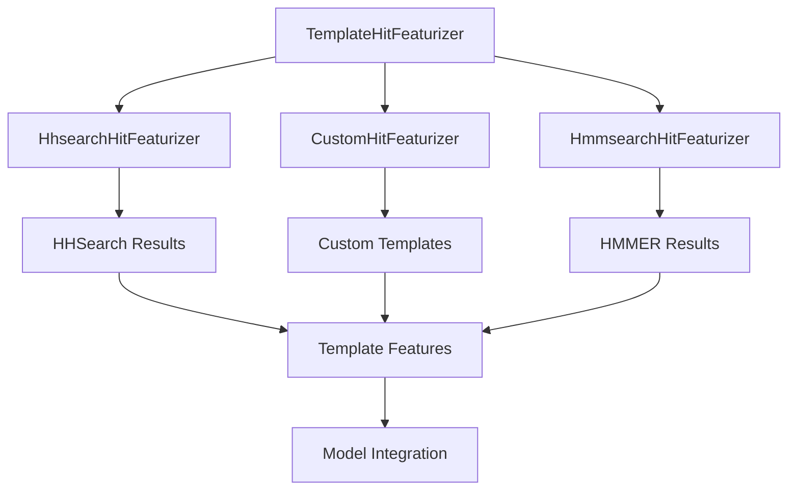
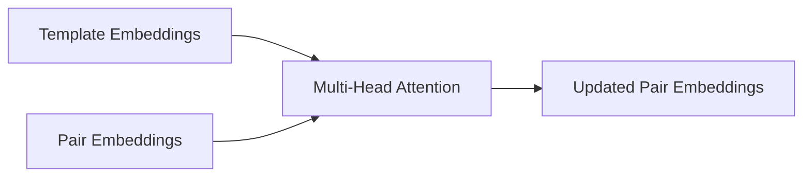

---
slug:14-template-search-and-integration
blog_type:normal
---


模板搜索与整合是 OpenFold 蛋白质结构预测流程的关键组成部分，使模型能够利用同源蛋白质的已知结构信息来提高预测准确性。该系统通过复杂的多阶段流程识别相关模板结构、提取其特征，并将其整合到模型的神经网络架构中。

## 模板搜索架构

OpenFold 中的模板搜索系统采用分层架构，包含多个特征化器类，用于处理不同的模板来源和搜索方法：



### 抽象基类：TemplateHitFeaturizer

`TemplateHitFeaturizer` 作为所有模板处理实现的抽象基类（[openfold/data/templates.py#L1023-L1102](openfold/data/templates.py#L1023-L1102)）。该类为模板搜索和处理提供了基础架构：

- **配置参数**：管理关键设置，包括 mmCIF 目录路径、最大模板日期、命中限制和比对工具路径
- **日期过滤**：实现时间过滤，确保模板不超过指定的发布日期截止时间
- **过时 PDB 处理**：自动将过时的 PDB ID 映射到其当前替代项
- **错误处理**：为模板验证提供可配置的严格错误检查

核心初始化过程验证 mmCIF 目录结构，并准备发布日期和过时 PDB 映射，以便高效过滤模板。

### 专用特征化器实现

#### HhsearchHitFeaturizer
`HhsearchHitFeaturizer` 专门处理 HHSearch 结果，这是 OpenFold 中主要的模板搜索方法（[openfold/data/templates.py#L1105-L1207](openfold/data/templates.py#L1105-L1207)）。该实现：

- 处理包含序列比对和置信度分数的 HHSearch 命中结果
- 基于比对质量、日期约束和序列相似性过滤模板
- 从有效的模板命中中提取 mmCIF 文件的结构特征
- 处理模板去重和质量评估

#### CustomHitFeaturizer
`CustomHitFeaturizer` 支持用户提供的模板结构（[openfold/data/templates.py#L1208-L1224](openfold/data/templates.py#L1208-L1224)）。该实现：

- 处理用户提供的自定义模板文件
- 假设模板链为链 A 且具有匹配的序列长度
- 支持实验性或自定义结构数据的整合

#### HmmsearchHitFeaturizer
`HmmsearchHitFeaturizer` 处理基于 HMMER 的模板搜索结果（[openfold/data/templates.py#L1225-L1232](openfold/data/templates.py#L1225-L1232)），为模板识别提供了 HHSearch 的替代方案。

## 模板处理流程

### 模板命中解析与验证

模板命中通过多个过滤阶段进行严格验证（[openfold/data/templates.py#L220-L291](openfold/data/templates.py#L220-L291)）：

```python
def _assess_hhsearch_hit(
    hit: parsers.TemplateHit,
    hit_pdb_code: str,
    query_sequence: str,
    release_dates: Mapping[str, datetime.datetime],
    release_date_cutoff: datetime.datetime,
    max_subsequence_ratio: float = 0.95,
    min_align_ratio: float = 0.1,
) -> bool:
```

过滤过程包括：

- **日期验证**：确保模板结构在指定的截止日期之前发布
- **比对质量**：验证模板与查询序列具有足够的比对覆盖率
- **序列同一性**：防止使用查询序列的精确子序列作为模板
- **长度要求**：强制执行最小模板长度要求

### 特征提取与处理

有效的模板命中经过全面的特征提取，以生成神经网络输入（[openfold/data/templates.py#L548-L707](openfold/data/templates.py#L548-L707)）：

```python
def _extract_template_features(
    mmcif_object: mmcif_parsing.MmcifObject,
    pdb_id: str,
    mapping: Mapping[int, int],
    template_sequence: str,
    query_sequence: str,
    template_chain_id: str,
    kalign_binary_path: str,
    _zero_center_positions: bool = True,
) -> Tuple[Dict[str, Any], Optional[str]]:
```

提取的特征包括：

- **Template Aatype**：模板残基的氨基酸类型信息
- **Template All Atom Positions**：模板结构中所有原子的 3D 坐标
- **Template All Atom Mask**：指示有效原子位置的二进制掩码
- **Template Domain Names**：模板域的标识符
- **Template Sequence**：模板序列信息
- **Template Sum Probabilities**：模板比对的置信度分数

<CgxTip>模板特征提取包括关键的验证步骤，如 CA 原子距离检查，以确保结构完整性，防止使用具有不合理几何结构的模板，这些模板可能会降低模型性能。</CgxTip>

## 模型整合架构

### 模板嵌入神经网络

整合的模板特征通过专门设计的神经网络模块进行处理，用于模板信息整合：

#### 模板逐点注意力
`TemplatePointwiseAttention` 模块实现了 AlphaFold 论文中的算法 17（[openfold/model/template.py#L55-L148](openfold/model/template.py#L55-L148)）：



该模块实现了模板结构与不断发展的配对表示之间的信息流动，使模型能够利用模板信息进行结构预测。

#### 模板配对堆栈
`TemplatePairStack` 实现了算法 16，为模板嵌入提供了深度处理架构（[openfold/model/template.py#L345-L471](openfold/model/template.py#L345-L471)）：

- **多个处理块**：包含可配置数量的 `TemplatePairStackBlock` 单元
- **三角注意力**：实现行和列方向的注意力，以捕获长程结构依赖关系
- **三角乘法**：对局部结构特征应用乘法更新
- **内存优化**：支持大型模板集的分块处理和激活检查点

### 内存优化策略

模板处理系统包括复杂的内存优化技术（[openfold/model/template.py#L472-L592](openfold/model/template.py#L472-L592)）：

- **模板卸载**：`embed_templates_offload` 函数以分块方式处理模板以减少内存使用
- **模板平均**：`embed_templates_average` 函数在内存约束严重时合并模板特征
- **分块处理**：支持不同处理阶段的可配置分块大小
- **激活检查点**：通过重新计算中间激活来减少训练期间的内存使用

## 模板特征类型

模板系统生成一组全面的特征，定义在 `TEMPLATE_FEATURES` 中（[openfold/data/templates.py#L83-L110](openfold/data/templates.py#L83-L110)）：

| 特征名称 | 数据类型 | 维度 | 描述 |
|-------------|-----------|------------|-------------|
| `template_aatype` | np.int64 | `[N_templates, N_res, 22]` | 带间隙的氨基酸类型 |
| `template_all_atom_mask` | np.float32 | `[N_templates, N_res, 37]` | 有效原子位置指示器 |
| `template_all_atom_positions` | np.float32 | `[N_templates, N_res, 37, 3]` | 3D 原子坐标 |
| `template_domain_names` | object | `[N_templates]` | 模板域标识符 |
| `template_sequence` | object | `[N_templates]` | 模板序列 |
| `template_sum_probs` | np.float32 | `[N_templates, 1]` | 模板置信度分数 |

## 数据管道中的模板整合

模板系统通过 `DataPipeline` 类与 OpenFold 的数据处理管道无缝集成（[openfold/data/data_pipeline.py#L706-L1153](openfold/data/data_pipeline.py#L706-L1153)）：

```python
def make_template_features(
    input_sequence: str,
    hits: Sequence[Any],
    template_featurizer: Any,
) -> FeatureDict:
```

这种集成提供了：

- **统一特征处理**：将模板特征与 MSA 和序列特征结合
- **多聚体支持**：处理多链蛋白质复合物的模板处理
- **灵活输入源**：支持各种输入格式，包括 FASTA、PDB 和 mmCIF
- **错误恢复**：优雅处理缺失或无效的模板数据

## 性能考虑

### 预过滤优化

模板系统实现了高效的预过滤以减少计算开销（[openfold/data/templates.py#L780-L836](openfold/data/templates.py#L780-L836)）：

- **早期拒绝**：在昂贵的 mmCIF 解析之前过滤无效模板
- **缓存元数据**：发布日期和过时 PDB 映射被缓存以快速访问
- **并行处理**：模板处理可以在多个命中上并行化

### 内存管理

系统包括复杂的内存管理策略：

- **分块处理**：大型模板集以可配置的分块大小处理
- **梯度检查点**：减少训练期间的内存使用
- **特征压缩**：使用适当的数据类型高效存储模板特征

<CgxTip>模板处理系统通过 `ChunkSizeTuner` 支持动态分块大小调整，根据可用硬件资源和输入特性自动优化内存使用。</CgxTip>

## 后续步骤

要全面了解 OpenFold 架构，建议探索：

- **[特征提取与处理](12-feature-extraction-and-processing)**：了解整合模板特征的更广泛数据处理管道
- **[AlphaFold 2 模型实现](9-alphafold-2-model-implementation)**：理解模板特征如何在完整的神经网络架构中使用
- **[多序列比对 (MSA) 处理](13-multiple-sequence-alignment-msa-handling)**：探索模板搜索如何补充基于 MSA 的进化信息

模板搜索与整合系统代表了 OpenFold 的一个复杂组件，通过利用已知结构信息显著提高了预测准确性，同时通过仔细的优化和内存管理策略保持了计算效率。