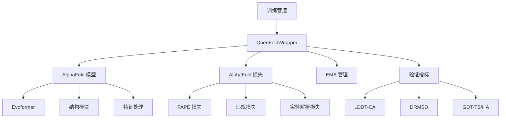
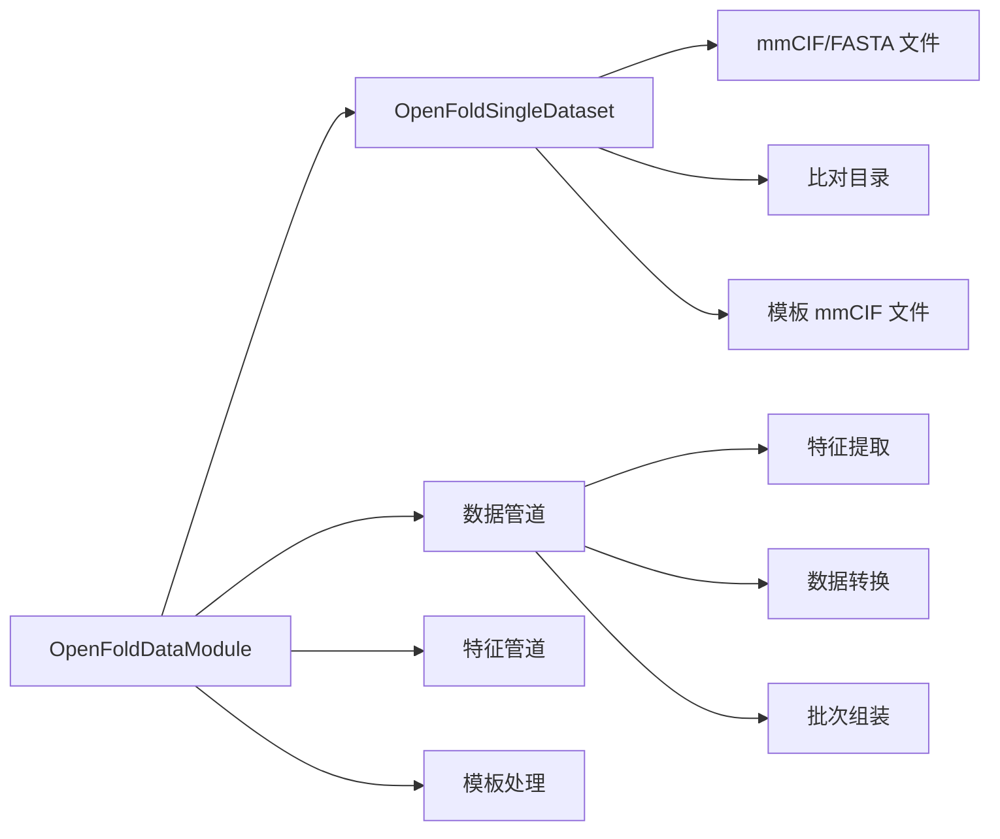

---
slug:15-training-pipeline-and-configuration
blog_type:normal
---


OpenFold 训练管道提供了一个全面的 AlphaFold 2 模型训练框架，具备灵活的配置选项、分布式训练支持和高级优化技术。本文档涵盖核心架构、配置系统和高级训练功能。

## 核心训练架构

OpenFold 使用 PyTorch Lightning 作为训练框架，通过内置的分布式训练支持、检查点保存和实验跟踪功能，为模型训练提供结构化方法。训练管道围绕 `OpenFoldWrapper` 类 ([train_openfold.py#L29](train_openfold.py#L29)) 构建，该类封装了 AlphaFold 模型、损失计算和训练逻辑。



### 关键组件

**OpenFoldWrapper**: 协调训练的主要 Lightning 模块 ([train_openfold.py#L29](train_openfold.py#L29)):
- 通过配置管理模型初始化
- 处理训练和验证步骤
- 实现模型权重的指数移动平均 (EMA)
- 计算并记录全面的验证指标
- 集成 PyTorch Lightning 的分布式训练框架

**训练步骤流程** ([train_openfold.py#L79](train_openfold.py#L79)):
1. 通过 AlphaFold 模型进行前向传播
2. 从批次中移除循环维度
3. 对多聚体模型应用多链排列对齐
4. 计算损失和损失分解
5. 记录指标和验证分数

**验证策略** ([train_openfold.py#L115](train_openfold.py#L115)):
- 使用 EMA 权重进行验证，同时保留训练权重
- 计算结构指标 (LDDT-CA, DRMSD, GDT-TS, GDT-HA)
- 可选的基于叠加的结构准确性指标
- 验证后自动恢复权重

## 配置系统

OpenFold 提供了灵活的配置系统，包含多个预设和自定义选项。配置通过 `model_config` 函数 ([config.py#L42](config.py#L42)) 进行管理。

### 训练预设

| 预设 | 裁剪大小 | 最大额外 MSA | 最大 MSA 聚类 | 模板启用 | 损失权重 | 用例 |
|--------|-----------|---------------|------------------|------------------|---------------|----------|
| `initial_training` | 默认 | 默认 | 默认 | 是 | 默认 | 初始模型训练 |
| `finetuning` | 384 | 5120 | 512 | 是 | 违规: 1.0, 实验解析: 0.01 | 微调预训练模型 |
| `finetuning_ptm` | 384 | 5120 | 512 | 是 | + TM: 0.1 | 使用 pTM 头微调 |
| `finetuning_no_templ` | 384 | 5120 | 512 | 否 | 违规: 1.0, 实验解析: 0.01 | 无模板微调 |
| `finetuning_no_templ_ptm` | 384 | 5120 | 512 | 否 | + TM: 0.1 | 无模板带 pTM |

### 配置加载过程

配置系统支持多个来源 ([train_openfold.py#L387](train_openfold.py#L387)):
1. **基础预设**: 从预定义配置加载
2. **JSON 覆盖**: 通过 `--experiment_config_json` 自定义配置
3. **运行时参数**: 命令行参数覆盖特定设置

```python
config = model_config(
    args.config_preset, 
    train=True, 
    low_prec=is_low_precision,
) 
if args.experiment_config_json: 
    with open(args.experiment_config_json, 'r') as f:
        custom_config_dict = json.load(f)
    config.update_from_flattened_dict(custom_config_dict)
```

### 互斥配置选项

配置系统强制执行约束以防止不兼容的设置 ([config.py#L25](config.py#L25)):
- 模板平均与模板卸载
- 内存优化技术 (LMA, FlashAttention, DeepSpeed EvoFormer)

<CgxTip>配置验证确保互斥的优化技术不能同时启用，防止运行时冲突并确保稳定的训练性能。</CgxTip>

## 数据管道集成

训练管道集成了复杂的数据处理模块，用于处理蛋白质结构数据、多序列比对和模板信息。

### 数据模块架构



**数据模块选择** ([train_openfold.py#L425](train_openfold.py#L425)):
- `OpenFoldDataModule`: 标准单体训练
- `OpenFoldMultimerDataModule`: 多链蛋白质复合物

**数据集配置** ([data_modules.py#L13](data/data_modules.py#L13)):
- 多个数据来源 (训练、验证、蒸馏)
- 灵活的比对和模板目录
- 可配置的过滤和缓存选项
- 支持 mmCIF 和 FASTA 格式

## 优化和学习率调度

### 学习率调度

OpenFold 实现了 AlphaFold 2 学习率调度，包含线性预热、平台期和指数衰减阶段 ([lr_schedulers.py#L7](utils/lr_schedulers.py#L7)):

| 阶段 | 持续时间 | 学习率行为 |
|-------|----------|----------------------|
| 预热 | 前 1000 步 | 从 0 线性增加到 max_lr |
| 平台期 | 步骤 1000-50000 | 保持 max_lr (0.001) |
| 衰减 | 50000 步后 | 每 50000 步指数衰减 (因子: 0.95) |

```python
class AlphaFoldLRScheduler:
    def get_lr(self):
        if(step_no <= self.warmup_no_steps):
            lr = self.base_lr + (step_no / self.warmup_no_steps) * self.max_lr
        elif(step_no > self.start_decay_after_n_steps):
            steps_since_decay = step_no - self.start_decay_after_n_steps
            exp = (steps_since_decay // self.decay_every_n_steps) + 1
            lr = self.max_lr * (self.decay_factor ** exp)
        else: # 平台期
            lr = self.max_lr
```

### 指数移动平均 (EMA)

训练管道包含模型权重的 EMA ([train_openfold.py#L42](train_openfold.py#L42)):
- 维护模型参数的平滑版本
- 验证期间使用以获得更好的泛化能力
- 可配置的衰减率 (通常为 0.999)
- 检查点期间的自动状态管理

## 分布式训练和性能优化

OpenFold 支持多种分布式训练策略和高级内存优化技术。

### 训练策略

| 策略 | 配置 | 用例 | 特性 |
|----------|---------------|----------|----------|
| 单 GPU | `--gpus 1` | 开发/测试 | 基础单 GPU 训练 |
| 多 GPU DDP | `--gpus >1` | 多 GPU 训练 | 分布式数据并行 |
| DeepSpeed | `--deepspeed_config_path` | 大规模训练 | 内存优化、卸载 |

### DeepSpeed 集成

默认 DeepSpeed 配置 ([deepspeed_config.json](deepspeed_config.json)) 提供:
```json
{
  "bfloat16": {"enabled": true},
  "zero_optimization": {
    "stage": 2,
    "offload_optimizer": {"device": "cpu"},
    "contiguous_gradients": true
  },
  "activation_checkpointing": {
    "partition_activations": true,
    "cpu_checkpointing": false
  },
  "gradient_clipping": 0.1
}
```

**关键特性**:
- **Zero 阶段 2**: 优化器状态分区和卸载
- **激活检查点**: 以计算换内存
- **混合精度**: 现代硬件的 BF16 支持
- **梯度裁剪**: 大批量稳定训练

### MPI 支持

对于 HPC 环境，OpenFold 支持基于 MPI 的并行处理 ([train_openfold.py#L470](train_openfold.py#L470)):
- `--mpi_plugin`: 启用 MPI 环境集成
- 基于排名的日志记录和检查点
- 针对大规模集群部署优化

## 实验跟踪和监控

### 日志集成

训练管道支持全面的实验跟踪:

**Weights & Biases 集成** ([train_openfold.py#L452](train_openfold.py#L452)):
- 实验命名和项目组织
- 自动工件记录 (配置、依赖项)
- 分布式训练支持与基于排名的日志记录
- 性能指标可视化

**性能监控** ([train_openfold.py#L435](train_openfold.py#L435)):
- 设备统计监控
- 学习率跟踪
- 自定义性能日志回调
- 批次大小和吞吐量指标

### 回调和检查点

**检查点策略** ([train_openfold.py#L413](train_openfold.py#L413)):
- 基于周期的检查点 (`--checkpoint_every_epoch`)
- 仅模型权重与完整状态恢复
- DeepSpeed 检查点兼容性
- 自动恢复功能

**提前停止** ([train_openfold.py#L423](train_openfold.py#L423)):
- 可配置的耐心和增量阈值
- 监控验证 LDDT-CA 分数
- 通过自动停止防止过拟合

## 高级训练场景

### 从预训练模型微调

OpenFold 支持多种微调方法 ([train_openfold.py#L329](train_openfold.py#L329)):
- **JAX 权重**: 从原始 AlphaFold 检查点加载
- **OpenFold 权重**: 从之前的训练运行恢复
- **DeepSpeed 检查点**: 处理分布式检查点格式

```python
# 加载 JAX 参数
model_module.load_from_jax(args.resume_from_jax_params)

# 从检查点恢复 (完整状态)
trainer.fit(model_module, datamodule=data_module, ckpt_path=ckpt_path)

# 仅加载模型权重
import_openfold_weights_(model=model_module, state_dict=sd)
```

### 多聚体训练

多链蛋白质复合物的专用配置 ([config.py#L129](config.py#L129)):
- 自定义数据处理管道
- 多链排列对齐
- 专用损失函数和指标
- 模板处理修改

<CgxTip>多聚体训练需要专门的数据管道和损失计算来处理蛋白质-蛋白质相互作用和链排列的复杂性，使其区别于单体训练场景。</CgxTip>

## 配置最佳实践

### 推荐配置

**初始训练**:
```bash
--config_preset initial_training \
--gpus 4 --num_nodes 1 \
--deepspeed_config_path deepspeed_config.json \
--precision bf16 \
--max_epochs 100
```

**微调**:
```bash
--config_preset finetuning_ptm \
--resume_from_ckpt /path/to/checkpoint \
--early_stopping --patience 5 \
--wandb --experiment_name "finetuning_experiment"
```

**大规模训练**:
```bash
--config_preset initial_training \
--gpus 8 --num_nodes 4 \
--mpi_plugin \
--deepspeed_config_path deepspeed_config.json \
--log_performance
```

### 性能优化技巧

1. **内存管理**: 对大型模型使用 DeepSpeed 阶段 2
2. **混合精度**: 为现代 GPU 架构启用 BF16
3. **批次大小**: 根据可用 GPU 内存调整
4. **检查点频率**: 平衡存储与训练连续性
5. **验证频率**: 考虑验证计算成本

有关特定训练场景和高级功能的详细信息，请参阅相关文档页面，包括 [DeepSpeed 集成与性能](16-deepspeed-integration-and-performance) 和 [多聚体蛋白质结构预测](18-multimer-protein-structure-prediction)。