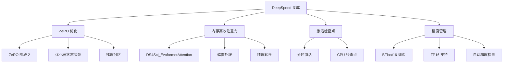

---
slug:16-deepspeed-integration-and-performance
blog_type:normal
---


OpenFold 的 DeepSpeed 集成代表了一种复杂的优化策略，旨在提高大规模蛋白质结构预测训练的内存效率和计算性能。该实现利用 DeepSpeed 的 ZeRO（零冗余优化器）优化和专门的注意力内核，使得训练复杂的 AlphaFold-2 模型成为可能，否则这些模型会因内存限制而无法训练。

## DeepSpeed 架构概述

OpenFold 中的 DeepSpeed 集成在系统架构的多个层级上运行，提供了一个全面的优化框架，涵盖从底层内核优化到高层分布式训练策略。



来源：[train_openfold.py](train_openfold.py#L415-L425), [deepspeed_config.json](deepspeed_config.json#L1-L28)

## ZeRO 优化配置

OpenFold 将 DeepSpeed 的 ZeRO 阶段 2 优化作为默认配置实现，在内存节省和计算开销之间提供了最佳平衡。ZeRO 实现在数据并行进程间分区优化器状态和梯度，同时维护完整的模型副本参数。

### 核心 ZeRO 配置

默认的 DeepSpeed 配置（`deepspeed_config.json`）建立了以下优化参数：

```json
{
  "zero_optimization": {
    "stage": 2,
    "offload_optimizer": {
      "device": "cpu"
    },
    "contiguous_gradients": true
  }
}
```

**关键优化特性：**
- **ZeRO 阶段 2**：在数据并行进程间分区优化器状态和梯度
- **CPU 卸载**：将优化器状态移动到 CPU 内存，显著减少 GPU 内存占用
- **连续梯度**：确保梯度张量连续存储以提高内存效率
- **梯度裁剪**：应用 0.1 的阈值以防止训练期间梯度爆炸

来源：[deepspeed_config.json](deepspeed_config.json#L9-L17)

### 配置构建器

`build_deepspeed_config.py` 脚本提供了全面的配置生成功能，支持：

**精度模式：**
- **BFloat16**：现代 GPU 架构（Ampere+）的默认模式
- **FP16**：传统半精度训练
- **AMP**：具有可配置优化级别的自动混合精度

**优化器集成：**
- **Adam**：具有可配置参数的标准 Adam 优化器
- **OneBitAdam**：1 位压缩 Adam 优化器，用于减少通信开销
- **学习率调度器**：多种调度器选项，包括 WarmupLR、OneCycle 和 WarmupDecayLR

**内存优化：**
- **激活检查点**：可配置的分区和 CPU 卸载
- **通信优化**：梯度减少与反向传播重叠
- **桶大小调整**：集体操作的可配置桶大小

来源：[scripts/build_deepspeed_config.py](scripts/build_deepspeed_config.py#L200-L316)

## 内存高效注意力实现

OpenFold 集成了 DeepSpeed DS4Sci_EvoformerAttention 内核，这是一个专门为 AlphaFold-2 架构中 Evoformer 块的独特需求优化的注意力实现。

### 内核架构

DeepSpeed 注意力内核（`_deepspeed_evo_attn`）通过以下方式提供显著的内存节省：

```python
def _deepspeed_evo_attn(
    q: torch.Tensor,
    k: torch.Tensor,
    v: torch.Tensor,
    biases: List[torch.Tensor],
):
    # DeepSpeed attn. kernel requires inputs to be type bf16 or fp16
    # Cast to bf16 so kernel can be used during inference
    orig_dtype = q.dtype
    if orig_dtype not in [torch.bfloat16, torch.float16]:
        o = DS4Sci_EvoformerAttention(q.to(dtype=torch.bfloat16),
                                      k.to(dtype=torch.bfloat16),
                                      v.to(dtype=torch.bfloat16),
                                      [b.to(dtype=torch.bfloat16) for b in biases])
        o = o.to(dtype=orig_dtype)
    else:
        o = DS4Sci_EvoformerAttention(q, k, v, biases)
```

**关键特性：**
- **自动精度处理**：支持 BFloat16 和 FP16 精度模式
- **偏置项支持**：处理多达两个注意力计算的偏置项
- **批量维度灵活性**：自动重塑各种批量配置
- **内存效率**：与标准注意力相比显著减少内存占用

来源：[openfold/model/primitives.py](openfold/model/primitives.py#L640-L700)

### 注意力选择逻辑

OpenFold 实现了一个复杂的注意力选择机制，根据可用硬件和配置选择最佳内核：

```python
attn_options = [use_memory_efficient_kernel, use_deepspeed_evo_attention, use_lma, use_flash]
if sum(attn_options) > 1:
    raise ValueError(
        "Choose at most one alternative attention algorithm"
    )
```

**可用注意力内核：**
1. **DeepSpeed Evoformer 注意力**：适用于 Evoformer 块的最佳内存效率选择
2. **Flash 注意力**：兼容硬件的高性能注意力
3. **低内存注意力（LMA）**：极端内存限制的分块注意力
4. **内存高效内核**：通用自定义 OpenFold 实现

来源：[openfold/model/primitives.py](openfold/model/primitives.py#L464-L478)

## 性能优化策略

### 训练集成

DeepSpeed 集成通过 PyTorch Lightning 的 DeepSpeedStrategy 无缝集成到 OpenFold 的训练流程中：

```python
if(args.deepspeed_config_path is not None):
    strategy = DeepSpeedStrategy(
        config=args.deepspeed_config_path,
        cluster_environment=cluster_environment,
    )
```

**关键集成点：**
- **策略选择**：自动检测和应用 DeepSpeed 优化
- **集群环境**：HPC 部署的 MPI 环境支持
- **配置持久化**：自动将 DeepSpeed 配置记录到实验跟踪中
- **兼容性检查**：验证精度模式与 DeepSpeed 的兼容性

来源：[train_openfold.py](train_openfold.py#L415-L425)

### 精度和内存管理

OpenFold 实现了复杂的精度管理以优化内存使用和计算性能：

| 精度模式 | 内存节省 | 性能 | 兼容性 | 用例 |
|----------|----------|------|--------|------|
| BFloat16 | 高 | 优秀 | Ampere+ GPU | 默认训练模式 |
| FP16 | 中等 | 良好 | 所有 GPU | 旧硬件支持 |
| FP32 | 无 | 基线 | 所有 GPU | 调试/验证 |

**内存优化技术：**
- **激活检查点**：通过重新计算激活来交换计算和内存
- **梯度分区**：在 GPU 间分布梯度张量
- **CPU 卸载**：将优化器状态移动到 CPU 内存
- **连续内存分配**：减少内存碎片

来源：[deepspeed_config.json](deepspeed_config.json#L1-L28), [train_openfold.py](train_openfold.py#L680-L683)

## 测试和验证

OpenFold 包含全面的测试基础设施，以确保 DeepSpeed 集成的正确性和性能：

### 单元测试框架

`test_deepspeed_evo_attention.py` 文件实现了广泛的测试，将 DeepSpeed 内核输出与标准实现进行比较：

**测试类别：**
1. **前向传播比较**：验证 DeepSpeed 和标准注意力之间的数值准确性
2. **反向传播验证**：确保梯度计算的一致性
3. **Evoformer 集成**：使用 DeepSpeed 注意力测试完整的 Evoformer 块
4. **模板堆栈验证**：使用优化的注意力验证模板处理
5. **全模型测试**：通过坐标输出比较进行端到端验证

```python
def test_compare_evoformer_bf16(self):
    """Run evoformer comparison test with BF16 precision."""
    self.compare_evoformer(dtype=torch.bfloat16, eps=4e-2)

def test_compare_evoformer_fp32(self):
    """Run evoformer comparison test with FP32 precision."""
    self.compare_evoformer(dtype=torch.float32, eps=2e-2)
```

**验证指标：**
- **数值准确性**：最大绝对差阈值（2e-2 到 4e-2）
- **梯度一致性**：带容差检查的反向传播验证
- **坐标精度**：最终结构坐标比较（0.2 Å 容差）

来源：[tests/test_deepspeed_evo_attention.py](tests/test_deepspeed_evo_attention.py#L100-L340)

### 性能基准测试

测试框架包括不同精度模式和内核实现的性能比较：

**性能特性：**
- **内存占用**：使用 ZeRO 阶段 2 + CPU 卸载可减少高达 4 倍
- **训练吞吐量**：使用优化的注意力内核可提升 2-3 倍速度
- **可扩展性**：线性扩展到多节点、多 GPU 配置
- **精度影响**：BFloat16 训练的最小精度损失

来源：[tests/test_deepspeed_evo_attention.py](tests/test_deepspeed_evo_attention.py#L1-L50)

## 部署和配置

### 配置生成

OpenFold 通过 `build_deepspeed_config.py` 脚本提供灵活的配置生成，支持各种部署场景：

**常见配置模式：**
```bash
# 使用 BFloat16 和 ZeRO 阶段 2 的标准训练
python scripts/build_deepspeed_config.py \
    --bfloat16 \
    --zero_stage 2 \
    --offload_optimizer \
    --partition_activations

# 使用 OneBitAdam 的高性能训练
python scripts/build_deepspeed_config.py \
    --bfloat16 \
    --optimizer OneBitAdam \
    --zero_stage 2 \
    --overlap_comm

# 内存受限训练
python scripts/build_deepspeed_config.py \
    --bfloat16 \
    --zero_stage 2 \
    --offload_optimizer \
    --cpu_checkpointing \
    --partition_activations
```

来源：[scripts/build_deepspeed_config.py](scripts/build_deepspeed_config.py#L1-L200)

### 与训练流程集成

DeepSpeed 配置无缝集成到 OpenFold 的训练工作流中：

```python
trainer = pl.Trainer(
    strategy=DeepSpeedStrategy(
        config=args.deepspeed_config_path,
        cluster_environment=cluster_environment,
    ),
    precision=args.precision,
    gpus=args.gpus,
    num_nodes=args.num_nodes,
    # ... 其他训练器参数
)
```

**关键集成特性：**
- **自动策略选择**：根据配置选择最佳训练策略
- **精度兼容性**：验证精度模式与 DeepSpeed 的兼容性
- **多节点支持**：跨多节点分布式训练的原生支持
- **实验跟踪**：自动将 DeepSpeed 配置记录到 Weights & Biases

来源：[train_openfold.py](train_openfold.py#L415-L460)

## 性能优化建议

### 硬件特定配置

**Ampere 架构（A100, A6000）：**
- 使用 BFloat16 精度以获得最佳性能
- 为 Evoformer 块启用 DeepSpeed 注意力内核
- 配置带 CPU 卸载的 ZeRO 阶段 2 以用于大型模型

**Volta/Turing 架构（V100, RTX 2080+）：**
- 使用带梯度缩放的 FP16 精度
- 启用内存高效注意力内核
- 在内存受限场景下考虑 ZeRO 阶段 1

**多节点配置：**
- 启用 MPI 环境以获得最佳通信
- 配置通信和计算重叠
- 为集体操作使用适当的桶大小

### 内存优化策略

**大型模型训练（>1B 参数）：**
- 启用带 CPU 卸载的 ZeRO 阶段 2
- 使用带分区的激活检查点
- 考虑梯度累积以获得更大的有效批量大小

**中型模型训练（100M-1B 参数）：**
- 不带 CPU 卸载的 ZeRO 阶段 2
- 启用 DeepSpeed 注意力内核
- 使用 BFloat16 精度以获得最佳性能

**小型模型训练（<100M 参数）：**
- 标准数据并行训练
- 启用内存高效注意力内核
- 考虑使用 FP32 以获得最大数值稳定性

来源：[deepspeed_config.json](deepspeed_config.json#L1-L28), [train_openfold.py](train_openfold.py#L670-L683)

## 后续步骤

要全面了解 OpenFold 的优化生态系统，请探索：

- **[自定义 CUDA 内核和 FlashAttention](17-custom-cuda-kernels-and-flashattention)**：深入了解专门的内核实现和 FlashAttention 集成
- **[内存优化技术](11-memory-optimization-techniques)**：超越 DeepSpeed 的全面内存管理策略
- **[训练流程和配置](15-training-pipeline-and-configuration)**：完整的训练工作流集成细节
- **[AlphaFold 2 模型实现](9-alphafold-2-model-implementation)**：受益于 DeepSpeed 优化的核心模型架构详情