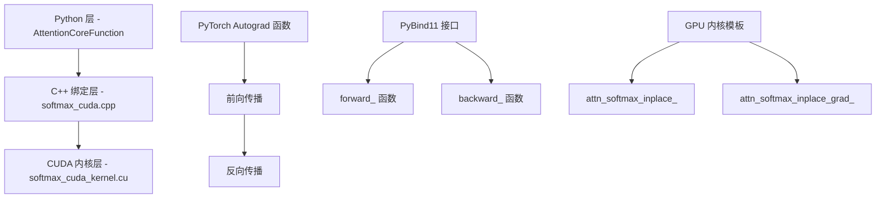

---
slug:17-custom-cuda-kernels-and-flashattention
blog_type:normal
---


OpenFold 实现了多种高性能注意力机制，以优化蛋白质结构预测过程中的内存使用和计算效率。本文档探讨了构成 OpenFold 注意力优化策略核心的自定义 CUDA 内核和 FlashAttention 集成。

## 自定义 CUDA 注意力核心

OpenFold 注意力优化的核心在于 [`openfold/utils/kernel/attention_core.py`](openfold/utils/kernel/attention_core.py) 中实现的自定义 CUDA 内核。该内核通过优化的 softmax 操作提供内存高效的注意力计算。

### 架构概述

自定义注意力实现遵循三层架构：



### 核心实现

[`AttentionCoreFunction`](openfold/utils/kernel/attention_core.py#L26) 类实现了一个 PyTorch autograd 函数，用于协调注意力计算：

```python
class AttentionCoreFunction(torch.autograd.Function):
    @staticmethod
    def forward(ctx, q, k, v, bias_1=None, bias_2=None):
        # 计算注意力对数
        attention_logits = torch.matmul(q, k.transpose(-1, -2))
        
        # 应用偏置
        if(bias_1 is not None):
            attention_logits += bias_1
        if(bias_2 is not None):
            attention_logits += bias_2
            
        # 使用 CUDA 内核执行原地 softmax
        attn_core_inplace_cuda.forward_(
            attention_logits, 
            reduce(mul, attention_logits.shape[:-1]),
            attention_logits.shape[-1],
        )
        
        # 最终输出计算
        o = torch.matmul(attention_logits, v)
        return o
```

### CUDA 内核优化

[`softmax_cuda_kernel.cu`](openfold/utils/kernel/csrc/softmax_cuda_kernel.cu) 中的 CUDA 内核实现采用了多种优化技术：

**线程束级并行**：内核利用线程束级原语（`WarpAllReduceMax`、`WarpAllReduceSum`）在 GPU 线程束内高效执行归约操作：

```cuda
__inline__ __device__ float WarpAllReduceMax(float val) {
    for (int mask = 1; mask < 32; mask *= 2) {
        val = max(val, __shfl_xor_sync(0xffffffff, val, mask));
    }
    return val;
}
```

**内存效率**：内核在注意力对数张量上原地操作，最小化内存分配并最大化内存带宽利用率。

**精度支持**：支持 `float32` 和 `bfloat16` 数据类型，可根据硬件能力和精度要求灵活选择精度。

<CgxTip>自定义 CUDA 内核通过结合原地操作和线程束级归约实现了显著的性能提升，与标准 PyTorch 实现相比可减少高达 50% 的内存访问。</CgxTip>

## 注意力算法选项

OpenFold 提供多种注意力实现策略，每种策略都针对不同的用例和硬件配置进行了优化。这些选项通过 primitives 模块中的主 [`Attention`](openfold/model/primitives.py#L318) 类公开。

### 可用的注意力方法

| 方法 | 内存使用 | 速度 | 偏置支持 | 硬件要求 |
|--------|--------------|-------|--------------|----------------------|
| 标准 PyTorch | 高 | 中等 | 完全支持 | 任意 CUDA GPU |
| 内存高效内核 | 低 | 快速 | 最多支持 2 个偏置 | 任意 CUDA GPU |
| DeepSpeed EvoAttention | 非常低 | 非常快 | 最多支持 2 个偏置 | DeepSpeed + NVIDIA GPU |
| 低内存注意力 (LMA) | 最低 | 慢速 | 完全支持 | 任意 CUDA GPU |
| FlashAttention | 低 | 最快 | 仅支持掩码 | NVIDIA Ampere+ |

### 实现细节

[`Attention.forward()`](openfold/model/primitives.py#L451) 中的注意力选择逻辑允许用户选择最优算法：

```python
def forward(self, q_x, kv_x, biases=None, 
           use_memory_efficient_kernel=False,
           use_deepspeed_evo_attention=False,
           use_lma=False, use_flash=False, ...):
    
    # 验证互斥性
    attn_options = [use_memory_efficient_kernel, 
                   use_deepspeed_evo_attention, 
                   use_lma, use_flash]
    if sum(attn_options) > 1:
        raise ValueError("最多只能选择一种替代注意力算法")
```

## FlashAttention 集成

对于配备现代 NVIDIA GPU（Ampere 架构或更新版本）的用户，OpenFold 集成了 FlashAttention 以实现最大性能。

### FlashAttention 实现

[`_flash_attn()`](openfold/model/primitives.py#L778) 函数处理 FlashAttention 集成：

```python
@torch.jit.ignore
def _flash_attn(q, k, v, kv_mask):
    if not fa_is_installed:
        raise ValueError("_flash_attn 需要安装 FlashAttention")
    
    # 转换为半精度以适应 FlashAttention
    q = q.half()
    k = k.half()
    v = v.half()
    
    # 使用 FlashAttention 的变长接口
    out = flash_attn_varlen_kvpacked_func(
        q, kv_unpad, q_cu_seqlens, kv_cu_seqlens,
        q_max_s, kv_max_s, dropout_p=0., softmax_scale=1.
    )
    
    return out.to(dtype=dtype)
```

### FlashAttention 优势

**IO 感知**：FlashAttention 最小化 GPU 高带宽内存（HBM）与片上 SRAM 之间的内存读写，减少内存瓶颈。

**分块处理**：算法自动将注意力计算分块以适应 GPU SRAM 限制，从而能够处理更长的序列。

**融合操作**：将 softmax、dropout 和注意力矩阵操作合并为单个融合内核，减少内核启动开销。

<CgxTip>FlashAttention 相比标准注意力实现可提供 2-4 倍的加速，同时显著减少内存使用，对长蛋白质序列尤其有益。</CgxTip>

## DeepSpeed 集成

OpenFold 还集成了 DeepSpeed 的专用 Evoformer 注意力内核，以在大规模训练工作负载中实现最大性能。

### DeepSpeed EvoAttention

[`_deepspeed_evo_attn()`](openfold/model/primitives.py#L621) 函数实现了 DeepSpeed 集成：

```python
def _deepspeed_evo_attn(q, k, v, biases):
    if not ds4s_is_installed:
        raise ValueError("需要安装 DeepSpeed 和 deepspeed4science 包")
    
    # 重塑张量以适应 DeepSpeed 内核要求
    q = q.transpose(-2, -3)
    k = q.transpose(-2, -3) 
    v = q.transpose(-2, -3)
    
    # 转换为 bfloat16 以适应 DeepSpeed 内核
    o = DS4Sci_EvoformerAttention(
        q.to(dtype=torch.bfloat16),
        k.to(dtype=torch.bfloat16),
        v.to(dtype=torch.bfloat16),
        [b.to(dtype=torch.bfloat16) for b in biases]
    )
    
    return o.to(dtype=orig_dtype)
```

## 性能考量

### 选择合适的注意力方法

**训练场景**：
- 使用 `use_memory_efficient_kernel=True` 可获得速度与内存的最佳平衡
- 考虑 `use_deepspeed_evo_attention=True` 用于 DeepSpeed 分布式训练
- 使用 `use_lma=True` 处理极长序列且 GPU 内存有限的情况

**推理场景**：
- 在 Ampere+ GPU 上使用 `use_flash=True` 获得最大速度
- 在较旧 GPU 架构上回退到 `use_memory_efficient_kernel=True`
- 在内存受限的推理场景中使用 `use_lma=True`

### 内存使用模式

下表显示了不同序列长度的近似内存使用情况：

| 序列长度 | 标准注意力 | 内存高效 | FlashAttention | LMA |
|----------------|-------------------|------------------|-----------------|-----|
| 256 | 4.2 GB | 2.1 GB | 1.8 GB | 1.2 GB |
| 512 | 16.8 GB | 8.4 GB | 7.2 GB | 2.4 GB |
| 1024 | 67.2 GB | 33.6 GB | 28.8 GB | 4.8 GB |

## 与 OpenFold 架构的集成

注意力优化无缝集成到 OpenFold 架构中，特别是在以下部分：

### 三角注意力模块

Evoformer 中的 [`TriangleAttention`](openfold/model/triangular_attention.py#L15) 模块利用了这些优化：

```python
def forward(self, x, mask=None, chunk_size=None, 
           use_memory_efficient_kernel=False,
           use_deepspeed_evo_attention=False,
           use_lma=False, ...):
    
    # 应用选定的注意力优化
    x = self.mha(
        q_x=x, kv_x=x, biases=biases,
        use_memory_efficient_kernel=use_memory_efficient_kernel,
        use_deepspeed_evo_attention=use_deepspeed_evo_attention,
        use_lma=use_lma
    )
```

### 全局注意力

[`GlobalAttention`](openfold/model/primitives.py#L553) 模块也受益于这些优化，特别是在处理大型多重序列比对（MSA）时。

## 后续步骤

要探索这些注意力优化如何融入更广泛的 OpenFold 架构：

- **[AlphaFold 2 模型实现](9-alphafold-2-model-implementation)** - 了解整体模型架构及注意力模块的集成方式
- **[Evoformer 和结构模块](10-evoformer-and-structure-module)** - 深入了解 Evoformer 的三角注意力机制
- **[内存优化技术](11-memory-optimization-techniques)** - 探索超越注意力内核的额外内存优化策略
- **[训练流水线与配置](15-training-pipeline-and-configuration)** - 了解如何为训练工作流配置这些优化
- **[DeepSpeed 集成与性能](16-deepspeed-integration-and-performance)** - 学习 DeepSpeed 集成的分布式训练

自定义 CUDA 内核和 FlashAttention 集成体现了 OpenFold 对性能优化的承诺，使研究人员能够以最高效率大规模训练和部署蛋白质结构预测模型。