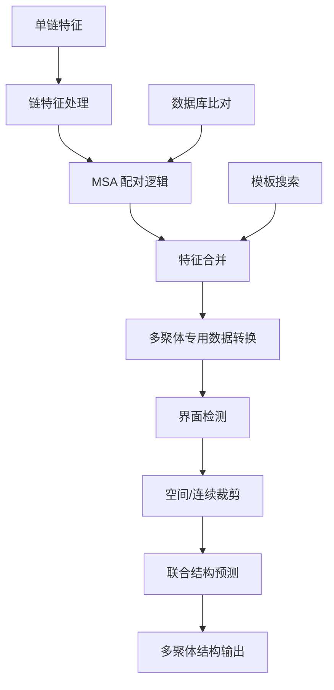
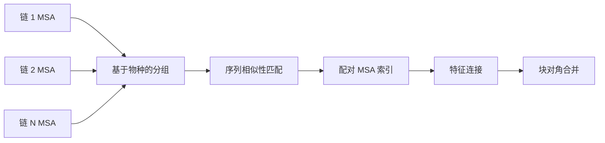

---
slug:18-multimer-protein-structure-prediction
blog_type:normal
---


多聚体蛋白质结构预测扩展了 OpenFold 的功能，使其能够预测包含多条链的蛋白质复合物的三维结构。这种专用架构能够处理链间相互作用的复杂性、对称性考虑以及精确多链蛋白质建模所必需的配对多序列比对问题。

## 架构概述

多聚体系统基于 OpenFold 的核心 AlphaFold 2 实现，并增加了专为多链处理设计的专用组件。该架构采用复杂的流程，将单链数据转换为适合联合结构预测的配对特征。



### 核心架构组件

多聚体架构引入了多个协同工作的专用模块来处理多链复杂性：

**多聚体配置系统** ([config.py#L743-L924](openfold/config.py#L743-L924))
- 设置 `is_multimer: True` 标志以启用多聚体特定行为
- 定义多聚体数据的专用特征形状，包括 `asym_id`、`entity_id`、`sym_id`
- 配置 MSA 处理参数：`max_msa_clusters: 508` 和 `max_extra_msa: 2048`
- 通过 `max_relative_chain: 2` 和 `use_chain_relative: True` 启用链相对嵌入

**特征处理流程** ([feature_processing_multimer.py#L50-L90](openfold/data/feature_processing_multimer.py#L50-L90))
核心 `pair_and_merge()` 函数协调多聚体数据流程：

```python
def pair_and_merge(all_chain_features):
    # 处理每条链的未合并特征
    process_unmerged_features(all_chain_features)
    
    # 确定是否需要 MSA 配对
    pair_msa_sequences = not _is_homomer_or_monomer(np_chains_list)
    
    if pair_msa_sequences:
        # 创建跨链的配对 MSA 特征
        np_chains_list = msa_pairing.create_paired_features(chains=np_chains_list)
        # 移除重复的未配对序列
        np_chains_list = msa_pairing.deduplicate_unpaired_sequences(np_chains_list)
    
    # 使用多聚体特定参数应用裁剪
    np_chains_list = crop_chains(np_chains_list, msa_crop_size=2048, ...)
    
    # 将所有链特征合并为单个样本
    np_example = msa_pairing.merge_chain_features(...)
    
    # 应用最终处理步骤
    return process_final(np_example)
```

## MSA 配对与链整合

### MSA 配对逻辑

多聚体系统最关键的创新是其复杂的 MSA 配对机制 ([msa_pairing.py#L56-L90](openfold/data/msa_pairing.py#L56-L90))，该机制在不同链的序列之间建立具有生物学意义的连接：



配对过程遵循以下关键步骤：

1. **基于物种的组织**：按物种标识符对 MSA 序列进行分组，以实现具有生物学意义的配对
2. **序列相似性匹配**：使用可配置的阈值 (`SEQUENCE_SIMILARITY_CUTOFF = 0.9`) 识别跨链的进化相关序列
3. **基于索引的配对**：创建映射字典，指定哪些序列应该跨链配对
4. **特征连接**：合并配对特征，同时以块对角格式保留未配对序列

### 特征合并策略

`merge_chain_features()` 函数 ([msa_pairing.py#L432-L461](openfold/data/msa_pairing.py#L432-L461)) 实现了复杂的合并策略：

- **配对特征**：被识别为跨链进化相关的序列进行水平连接
- **未配对特征**：单链特有的序列以块对角格式排列
- **模板整合**：为多链场景处理模板特征，使用特殊填充
- **特征校正**：合并后处理确保残基索引和链标识符的一致性

## 多聚体专用数据转换

### 界面感知裁剪

多聚体系统实现了智能裁剪策略，保留生物学上重要的链间相互作用 ([data_transforms_multimer.py#L320-L428](openfold/data/data_transforms_multimer.py#L320-L428))：

**空间裁剪**：聚焦于链间的界面区域
- 使用距离阈值 (`interface_threshold`) 识别界面残基
- 保持相互作用链的空间邻近性
- 围绕界面区域随机选择裁剪中心

**连续裁剪**：保持链内的序列连续性
- 保留局部结构上下文
- 在单链边界内应用
- 使用可配置的 `crop_size` 参数（训练默认值：640）

```python
def get_interface_residues(positions, atom_mask, asym_id, interface_threshold):
    """识别涉及链间界面的残基"""
    
def get_spatial_crop_idx(protein, crop_size, interface_threshold, generator):
    """生成聚焦于界面区域的裁剪索引"""
```

### 多聚体特征工程

系统包含多链上下文的专用特征转换：

- **实体和对称特征**：`entity_id`、`sym_id`、`asym_id` 用于跟踪链关系
- **界面检测**：识别链间接触区域的二进制掩码
- **链相对嵌入**：链之间的相对位置编码
- **多链模板特征**：复杂结构的增强模板处理

## 多聚体结构的全原子操作

### 坐标系转换

`all_atom_multimer.py` 模块 ([all_atom_multimer.py#L35-L58](openfold/utils/all_atom_multimer.py#L35-L58)) 为多链结构提供专用的坐标转换：

```python
def atom14_to_atom37(atom14_data: torch.Tensor, aatype: torch.Tensor):
    """将多聚体结构的 atom14 转换为 atom37 表示"""
    
def atom37_to_atom14(aatype, all_atom_pos, all_atom_mask):
    """将 Atom37 位置转换为具有链感知的 Atom14 位置"""
```

### 框架和刚体变换

多聚体结构需要复杂的框架变换：

- **每链框架**：每条链的独立坐标系
- **全局框架整合**：将链局部框架组合到全局坐标系中
- **界面框架对齐**：确保链界面的正确几何关系
- **扭转角处理**：处理跨链边界的骨架和侧链二面角

## 配置和模型参数

### 多聚体配置文件

多聚体模式使用与单体模式显著不同的专用配置：

| **参数类别** | **单体设置** | **多聚体设置** | **用途** |
|------------------------|---------------------|----------------------|-------------|
| **MSA 聚类** | 512 | 508 | 针对多链 MSA 深度优化 |
| **额外 MSA** | 1024 | 2048 | 增加进化信息容量 |
| **裁剪大小** | 384 | 640 | 更大的裁剪以捕获界面区域 |
| **空间裁剪概率** | 0.0 | 0.5 | 50% 概率进行界面聚焦裁剪 |
| **界面阈值** | N/A | 10.0 | 界面检测的距离阈值 |
| **链相对** | False | True | 启用链感知位置编码 |

### 损失函数调整

多聚体系统包含专用损失组件 ([config.py#L870-L923](openfold/config.py#L870-L923))：

```python
"loss": {
    "fape": {
        "intra_chain_backbone": {"weight": 0.5},
        "interface_backbone": {"weight": 0.5, "clamp_distance": 30.0}
    },
    "tm": {
        "ptm_weight": 0.2,      # 每链 TM 分数
        "iptm_weight": 0.8,     # 界面 TM 分数
        "enabled": True
    },
    "chain_center_of_mass": {
        "weight": 0.05,
        "enabled": True
    }
}
```

## 数据库和模板要求

### 专用数据库设置

多聚体推理需要专为多链蛋白质预测设计的更新数据库：

| **数据库** | **用途** | **下载命令** |
|--------------|-------------|----------------------|
| **UniProt** | 综合蛋白质序列 | `bash scripts/download_uniprot.sh data/` |
| **PDB SeqRes** | 模板序列数据库 | `bash scripts/download_pdb_seqres.sh data/` |
| **PDB MMCIF** | 模板坐标数据库 | `bash scripts/download_pdb_mmcif.sh data/` |
| **UniRef30** | 升级的 MSA 数据库 | `bash scripts/download_uniref30.sh data/` |
| **MGnify** | 增强的宏基因组序列 | `bash scripts/download_mgnify.sh data/` |

### 模板搜索修改

多聚体流程使用与单体模式不同的模板搜索策略：

- **搜索工具**：HMMSearch（替代 HHSearch）
- **数据库**：PDB SeqRes（替代 PDB70）
- **原因**：更好地处理多链模板结构和更全面的序列覆盖

## 运行多聚体推理

### 命令行界面

使用专用配置预设执行多聚体推理：

```bash
python3 run_pretrained_openfold.py \
    fasta_dir \
    data/pdb_mmcif/mmcif_files/ \
    --uniref90_database_path data/uniref90/uniref90.fasta \
    --mgnify_database_path data/mgnify/mgy_clusters_2022_05.fa \
    --pdb_seqres_database_path data/pdb_seqres/pdb_seqres.txt \
    --uniref30_database_path data/uniref30/UniRef30_2021_03 \
    --uniprot_database_path data/uniprot/uniprot.fasta \
    --config_preset "model_1_multimer_v3" \
    --model_device "cuda:0" \
    --output_dir ./
```

### 与单体模式的主要区别

1. **配置预设**：使用 `model_1_multimer_v3` 而非单体预设
2. **数据库要求**：需要 UniProt 和 PDB SeqRes 数据库
3. **模板搜索**：使用 HMMSearch 和 PDB SeqRes 替代 HHSearch 和 PDB70
4. **参数权重**：仅支持 AlphaFold Multimer v2.3 参数
5. **内存要求**：由于 MSA 深度增加和界面处理，内存使用量更高

## 性能考虑

### 内存优化

多聚体系统实现了多种内存优化策略：

- **MSA 裁剪**：将 MSA 深度从 2048 减少到可管理的大小
- **界面聚焦处理**：将计算资源集中在生物学相关区域
- **分块处理**：支持大复合物的内存高效处理

### 计算复杂度

| **组件** | **单体复杂度** | **多聚体复杂度** | **缩放因子** |
|---------------|----------------------|-------------------------|-------------------|
| **MSA 处理** | O(N×L) | O(N×L×C) | C（链数） |
| **模板搜索** | O(T) | O(T×C²) | C²（链对） |
| **结构模块** | O(L²) | O((L×C)²) | C²（链间相互作用） |
| **内存使用** | 基线 | 2-4× 基线 | 界面处理 |

<CgxTip>多聚体系统的 MSA 配对算法计算密集但对于精确预测至关重要。508 个 MSA 聚类限制代表了进化信息捕获与计算可行性之间的谨慎平衡。</CgxTip>

## 与核心 OpenFold 架构的集成

多聚体系统与 OpenFold 的核心组件无缝集成，同时为多链场景扩展了它们：

- **Evoformer**：通过增强的注意力机制处理配对的 MSA 特征
- **结构模块**：使用专用约束处理链间距离和角度
- **模板模块**：集成多链模板信息并进行链感知处理
- **损失函数**：结合链内和链间质量指标

有关核心 AlphaFold 2 实现的详细信息，请参阅 [AlphaFold 2 模型实现](9-alphafold-2-model-implementation)。适用于多聚体场景的内存优化技术，请参考 [内存优化技术](11-memory-optimization-techniques)。

## 后续步骤

掌握多聚体蛋白质结构预测后，建议探索：

- [长序列推理](19-long-sequence-inference) 用于处理非常大的蛋白质复合物
- [单序列模式和嵌入](20-single-sequence-mode-and-embeddings) 了解替代输入策略
- [训练流程和配置](15-training-pipeline-and-configuration) 进行自定义多聚体模型训练