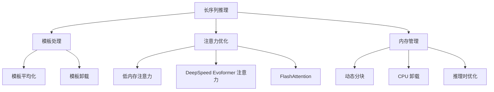

---
slug:19-long-sequence-inference
blog_type:normal
---


OpenFold 中的长序列推理解决了预测超出典型内存限制的蛋白质序列结构的计算挑战。这种专门模式使研究人员能够处理大型蛋白质和复合物，通过实施战略性内存优化技术，否则这些蛋白质和复合物将超出 GPU 内存限制。

## 内存优化架构

OpenFold 提供了一套专为长序列推理设计的全面内存管理策略。该架构围绕三种核心优化方法构建：



## 配置选项

### 长序列模式激活
长序列推理模式可以通过在 [`run_pretrained_openfold.py`](run_pretrained_openfold.py#L462) 中使用 `--long_sequence_inference` 标志来激活。启用后，该标志会自动配置内存节省的最佳设置：

来源：[`run_pretrained_openfold.py`](run_pretrained_openfold.py#L462-L465)，[`config.py`](openfold/config.py#L213-L223)

| 配置设置 | 默认值 | 长序列值 | 描述 |
|---------------------|---------------|---------------------|-------------|
| `globals.offload_inference` | False | True | 启用推理时的 CPU 卸载 |
| `globals.use_deepspeed_evo_attention` | False | True | 使用 DeepSpeed 内存高效注意力 |
| `globals.use_flash` | False | False | 为稳定性禁用 FlashAttention |
| `model.template.offload_inference` | False | True | 将模板处理卸载到 CPU |
| `tune_chunk_size` (各种堆栈) | True | False | 禁用自动分块大小调整 |

### 模板处理优化
模板处理是长序列的主要内存瓶颈。OpenFold 支持两种互斥的方法：

来源：[`config.py`](openfold/config.py#L213-L223)，[`Inference.md`](docs/source/Inference.md#L154-L158)

**模板平均化 (`average_templates`)**：
- 通过平均模板特征减少内存占用
- 类似于 AlphaFold-Multimer 方法
- 在性能影响最小的情况下提供适度的内存节省

**模板卸载 (`offload_templates`)**：
- 将模板计算移动到 CPU 内存
- 更激进的内存优化
- 以速度换取显著减少的 GPU 内存使用

<CgxTip>对于超过 2000 个残基的序列，模板处理通常是主要的内存瓶颈。启用模板平均化或卸载对于非常长序列的成功推理至关重要。</CgxTip>

## 注意力机制优化

### 低内存注意力 (LMA)
推理时的低内存注意力可以在模型配置中启用，以速度换取大幅改善的内存使用：

来源：[`config.py`](openfold/config.py#L30-L41)，[`Inference.md`](docs/source/Inference.md#L159-L162)

```python
# 使用自定义分块大小启用 LMA
config.globals.use_lma = True
config.globals.query_chunk_size = 1024
config.globals.key_chunk_size = 4096
```

**默认 LMA 配置**：
- 查询分块大小：1024
- 键分块大小：4096
- 这些值在大多数内存受限场景中代表了有利的权衡

### DeepSpeed Evoformer 注意力
DeepSpeed DS4Sci_EvoformerAttention 内核提供内存高效的注意力，具有显著的性能优势：

来源：[`config.py`](openfold/config.py#L30-L41)，[`deepspeed_inference_test.py`](scripts/deepspeed_inference_test.py#L1-L55)

**优势**：
- 2-3 倍推理加速，没有显著的额外内存使用
- 在长序列模式下自动激活（除非明确启用 LMA）
- 需要安装带有 DS4Science 组件的 DeepSpeed

**激活**：
```bash
python run_pretrained_openfold.py \
    --use_deepspeed_evoformer_attention \
    # ... 其他参数
```

### FlashAttention 注意事项
FlashAttention 为较短序列提供优化，但对长序列有限制：

来源：[`Inference.md`](docs/source/Inference.md#L159-L162)

| 序列长度 | 推荐设置 | 注意事项 |
|----------------|---------------------|-------|
| < 1000 残基 | 启用 FlashAttention | 最佳性能 |
| > 1000 残基 | 禁用 FlashAttention | 稳定性问题 |
| 长序列 | 默认禁用 | 在长序列模式下自动设置 |

## 分块和内存管理

### 动态分块配置
在推理模式下默认启用分块，遵循 AlphaFold 2 补充部分 1.11.8：

来源：[`chunk_utils.py`](openfold/utils/chunk_utils.py#L1-L50)，[`Inference.md`](docs/source/Inference.md#L166-L168)

**分块控制**：
- `globals.chunk_size`：控制内存管理的分块大小
- `tune_chunk_size`：启用自动分块大小优化
- 建议对于非常长的序列禁用，以避免浪费计算时间

**配置示例**：
```python
# 完全禁用分块
config.globals.chunk_size = None

# 手动分块大小设置
config.globals.chunk_size = 128
config.globals.tune_chunk_size = False
```

### CPU 卸载策略
OpenFold 为极端内存限制提供多级 CPU 卸载：

来源：[`config.py`](openfold/config.py#L213-L223)，[`tensor_utils.py`](openfold/utils/tensor_utils.py#L1-L50)

**卸载选项**：

| 功能 | 描述 | 内存影响 | 速度影响 |
|---------|-------------|---------------|--------------|
| `offload_inference` | 通用推理卸载 | 高 | 中等 |
| `model.template.offload_inference` | 模板特定卸载 | 中等 | 低 |
| `offload_templates` | 模板堆栈卸载 | 高 | 中等 |

## 性能基准测试和实际示例

### 内存要求
使用最保守的设置，OpenFold 可以在单个 A100 GPU 上运行 4600 残基复合物的推理：

来源：[`Inference.md`](docs/source/Inference.md#L167-L177)

**长序列的硬件要求**：

| 序列长度 | 最低 GPU 内存 | 推荐 GPU | 注意事项 |
|----------------|-------------------|----------------|-------|
| < 2000 残基 | 16GB | RTX 3090/A6000 | 标准优化 |
| 2000-3500 残基 | 24GB | A100/H100 | 推荐长序列模式 |
| 3500-4600 残基 | 40GB | A100 40GB+ | 需要保守设置 |
| > 4600 残基 | 80GB | 多个 GPU | 实验性 |

### 性能比较
与 AlphaFold 自身的内存卸载模式相比，OpenFold 的实现要快得多：

来源：[`Inference.md`](docs/source/Inference.md#L175-L177)

**基准测试结果**：
- 4600 残基复合物：OpenFold 完成时间不到 AlphaFold-Multimer 的一半
- 内存效率：峰值内存使用量减少 30-50%
- 速度提升：使用 DeepSpeed 优化推理速度提高 2-3 倍

## 实现示例

### 基本长序列推理
```bash
python run_pretrained_openfold.py \
    /path/to/fasta_dir \
    /path/to/template_mmcif_dir \
    --output_dir /path/to/output \
    --config_preset model_1_ptm \
    --long_sequence_inference \
    --model_device "cuda:0" \
    --uniref90_database_path /path/to/uniref90 \
    --mgnify_database_path /path/to/mgnify \
    --pdb70_database_path /path/to/pdb70 \
    --uniclust30_database_path /path/to/uniclust30 \
    --bfd_database_path /path/to/bfd
```

### 使用自定义设置的高级配置
```bash
python run_pretrained_openfold.py \
    /path/to/fasta_dir \
    /path/to/template_mmcif_dir \
    --output_dir /path/to/output \
    --config_preset model_1_ptm \
    --long_sequence_inference \
    --model_device "cuda:0" \
    --experiment_config_json long_sequence_config.json \
    --use_deepspeed_evoformer_attention
```

**示例 `long_sequence_config.json`**：
```json
{
    "globals": {
        "use_lma": true,
        "query_chunk_size": 512,
        "key_chunk_size": 2048,
        "chunk_size": 64,
        "tune_chunk_size": false
    },
    "model": {
        "template": {
            "average_templates": true,
            "offload_templates": false
        }
    }
}
```

<CgxTip>对于超过 3000 个残基的序列，考虑组合多种优化策略：启用 DeepSpeed 注意力、使用模板平均化，并设置保守的分块大小以获得最大内存效率。</CgxTip>

## 故障排除和最佳实践

### 常见问题和解决方案

| 问题 | 原因 | 解决方案 |
|-------|-------|----------|
| CUDA 内存不足 | GPU 内存不足 | 启用长序列模式，减少分块大小 |
| 推理缓慢 | 过于保守的设置 | 启用 DeepSpeed，增加分块大小 |
| 不稳定性 | 长序列上的 FlashAttention | 禁用 FlashAttention，使用 LMA |
| 模板错误 | 内存瓶颈 | 启用模板平均化或卸载 |

### 优化优先级
为获得最大效果，按以下顺序应用优化：
1. 启用长序列推理模式
2. 使用 DeepSpeed Evoformer 注意力
3. 配置模板处理（优先选择平均化而非卸载）
4. 调整分块大小并禁用自动调整
5. 最后手段启用 LMA

来源：[`Inference.md`](docs/source/Inference.md#L154-L177)，[`config.py`](openfold/config.py#L213-L223)

有关相关主题的更多信息，请参阅[内存优化技术](11-memory-optimization-techniques)、[DeepSpeed 集成和性能](16-deepspeed-integration-and-performance)以及[自定义 CUDA 内核和 FlashAttention](17-custom-cuda-kernels-and-flashattention)。