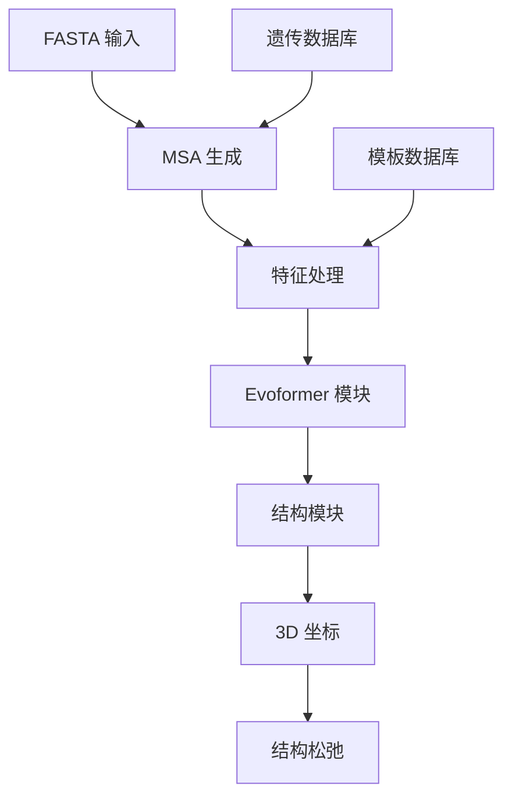

---
slug:2-quick-start
blog_type:normal
---


OpenFold 是 DeepMind AlphaFold 2 的一个忠实但可训练的 PyTorch 重现版本，能够以最先进的精度进行蛋白质结构预测。本指南提供了使用 OpenFold 预训练模型运行首次蛋白质结构预测的最快路径。

## 架构概述
OpenFold 遵循与 AlphaFold 2 相同的架构原则，实现了从序列输入到 3D 结构输出的完整流程：



系统通过多序列比对（MSA）生成、特征提取和神经网络推理处理蛋白质序列，以生成准确的 3D 结构预测。

## 先决条件
在开始之前，请确保你的系统满足以下要求：

| 组件 | 要求 | 说明 |
|------|------|------|
| 操作系统 | Linux | 仅支持 Linux 系统 |
| CUDA | 版本 12 | 需要 GPU 加速 |
| Python | 3.10 | 在环境配置中指定 |
| GPU | NVIDIA Ampere 或更新版本 | 推荐以获得最佳性能 |
| RAM | 32GB+ | 取决于蛋白质序列长度 |

## 安装步骤
按照以下步骤在你的环境中设置 OpenFold：

### 1. 克隆仓库
```bash
git clone https://github.com/aqlaboratory/openfold.git
cd openfold
```

### 2. 创建 Conda 环境
使用 Mamba（推荐用于更快的依赖解析）：
```bash
mamba env create -n openfold_env -f environment.yml
conda activate openfold_env
```

### 3. 安装第三方依赖
```bash
scripts/install_third_party_dependencies.sh
```

### 4. 设置环境变量
```bash
export LIBRARY_PATH=$CONDA_PREFIX/lib:$LIBRARY_PATH
export LD_LIBRARY_PATH=$CONDA_PREFIX/lib:$LD_LIBRARY_PATH
```

### 5. 下载模型参数
选择以下选项之一：

**AlphaFold 2 参数（DeepMind）：**
```bash
./scripts/download_alphafold_params.sh openfold/resources
```

**OpenFold 训练参数：**
```bash
./scripts/download_openfold_params.sh openfold/resources
```

**OpenFold SoloSeq 参数：**
```bash
./scripts/download_openfold_soloseq_params.sh openfold/resources
```

<CgxTip>
默认参数目录 `openfold/resources` 被推理脚本使用。如果你选择不同的位置，请使用 `--jax_param_path` 或 `--openfold_checkpoint_path` 参数指定备用路径。
</CgxTip>

## 运行首次预测
OpenFold 在 `examples/monomer/` 目录中提供了完整的示例工作流程。让我们逐步运行对示例蛋白质的预测。

### 项目结构
```
examples/monomer/
├── alignments/           # 预计算的 MSA
├── fasta_dir/           # 输入序列
├── inference.sh         # 示例推理脚本
└── sample_predictions/  # 输出结构
```

### 示例输入
示例包含蛋白质 6KWC 的 FASTA 文件（[examples/monomer/fasta_dir/6kwc.fasta](examples/monomer/fasta_dir/6kwc.fasta)）：
```fasta
>6KWC_1
GSTIQPGTGYNNGYFYSYWNDGHGGVTYTNGPGGQFSVNWSNSGEFVGGKGWQPGTKNKVINFSGSYNPNGNSYLSVYGWSRNPLIEYYIVENFGTYNPSTGATKLGEVTSDGSVYDIYRTQRVNQPSIIGTATFYQYWSVRRNHRSSGSVNTANHFNAWAQQGLTLGTMDYQIVAVQGYFSSGSASITVS
```

### 运行推理
执行示例推理脚本：

```bash
cd examples/monomer
./inference.sh
```

此脚本运行以下命令：
```bash
python3 ../../run_pretrained_openfold.py ./fasta_dir \
  /mmcifs \
  --output_dir ./ \
  --config_preset model_1_ptm \
  --model_device "cuda:0" \
  --data_random_seed 42 \
  --use_precomputed_alignments ./alignments
```

### 理解命令
| 参数 | 值 | 描述 |
|------|----|------|
| `fasta_dir` | `./fasta_dir` | 包含输入 FASTA 文件的目录 |
| `mmcifs` | `/mmcifs` | 模板的 PDB mmCIF 文件路径 |
| `--output_dir` | `./` | 预测的输出目录 |
| `--config_preset` | `model_1_ptm` | 模型配置（PTM = pTM + pLDDT） |
| `--model_device` | `"cuda:0"` | 用于推理的 GPU 设备 |
| `--use_precomputed_alignments` | `./alignments` | 包含预计算 MSA 的目录 |

### 预期输出
脚本在 `sample_predictions/` 目录中生成两个文件：

| 文件 | 描述 |
|------|------|
| `6KWC_1_model_1_ptm_unrelaxed.pdb` | 原始预测结构 |
| `6KWC_1_model_1_ptm_relaxed.pdb` | Amber 松弛后的结构 |

## 使用你自己的序列
为你自己的蛋白质预测结构：

### 1. 准备输入 FASTA
创建一个包含 FASTA 文件的目录：
```bash
mkdir my_proteins
echo ">MY_PROTEIN_1" > my_proteins/sequence.fasta
echo "MVLSEGEWQLVLHVWAKVEADVAGHGQDILIRLFKSHPETLEKFDRVKHLKTEAEMKASEDLKKHGVTVLTALGAILKKKGHHEAELKPLAQSHATKHKIPIKYLEFISEAIIHVLHSRHPGDFGADAQGAMNKALELFRKDIAAKYKELGYQG" >> my_proteins/sequence.fasta
```

### 2. 生成比对
下载并准备遗传数据库：
```bash
# 下载 AlphaFold 数据库
./scripts/download_alphafold_dbs.sh /path/to/databases

# 为你的序列预计算比对
python3 scripts/precompute_alignments.py \
  --fasta_dir my_proteins \
  --output_dir my_alignments \
  --max_template_date 2023-01-01 \
  --database_dir /path/to/databases
```

### 3. 运行预测
```bash
python3 run_pretrained_openfold.py my_proteins \
  /path/to/mmcifs \
  --output_dir my_results \
  --config_preset model_1_ptm \
  --model_device "cuda:0" \
  --use_precomputed_alignments my_alignments
```

## 可用模型预设
OpenFold 提供了针对不同用例优化的几种模型配置：

| 预设 | 描述 | 用例 |
|------|------|------|
| `model_1` | 基础模型 | 标准单体预测 |
| `model_1_ptm` | 包含 pTM 和 pLDDT 头 | 置信度分数预测 |
| `model_2` | 更大模型 | 更高精度，更多计算 |
| `model_3` | 最大模型 | 最佳精度，最多计算 |
| `model_1_multimer` | 支持多聚体 | 蛋白质复合物预测 |

## 后续步骤
成功运行首次预测后，探索这些高级主题：

- **[系统要求和依赖](3-system-requirements-and-dependencies)**：生产使用的详细硬件和软件要求
- **[数据库设置和配置](4-database-setup-and-configuration)**：设置遗传数据库用于 MSA 生成的完整指南
- **[使用预训练模型运行推理](5-running-inference-with-pretrained-models)**：高级推理选项和批处理

<CgxTip>
对于生产部署，考虑使用单序列模式（`--use_single_seq_mode`），该模式使用预计算的嵌入而非 MSA 生成，在保持许多蛋白质合理精度的同时显著减少运行时间。
</CgxTip>

## 常见问题排查

| 问题 | 解决方案 | 参考 |
|------|----------|------|
| CUDA 内存不足 | 使用较小的模型预设或减少批处理大小 | [内存优化技术](11-memory-optimization-techniques) |
| 数据库下载失败 | 检查网络连接和磁盘空间 | [数据库设置和配置](4-database-setup-and-configuration) |
| 导入错误 | 验证 conda 环境激活和 LD_LIBRARY_PATH | [安装](3-system-requirements-and-dependencies) |
| 推理缓慢 | 启用 GPU 加速并使用 Flash Attention | [DeepSpeed 集成](16-deepspeed-integration-and-performance) |

