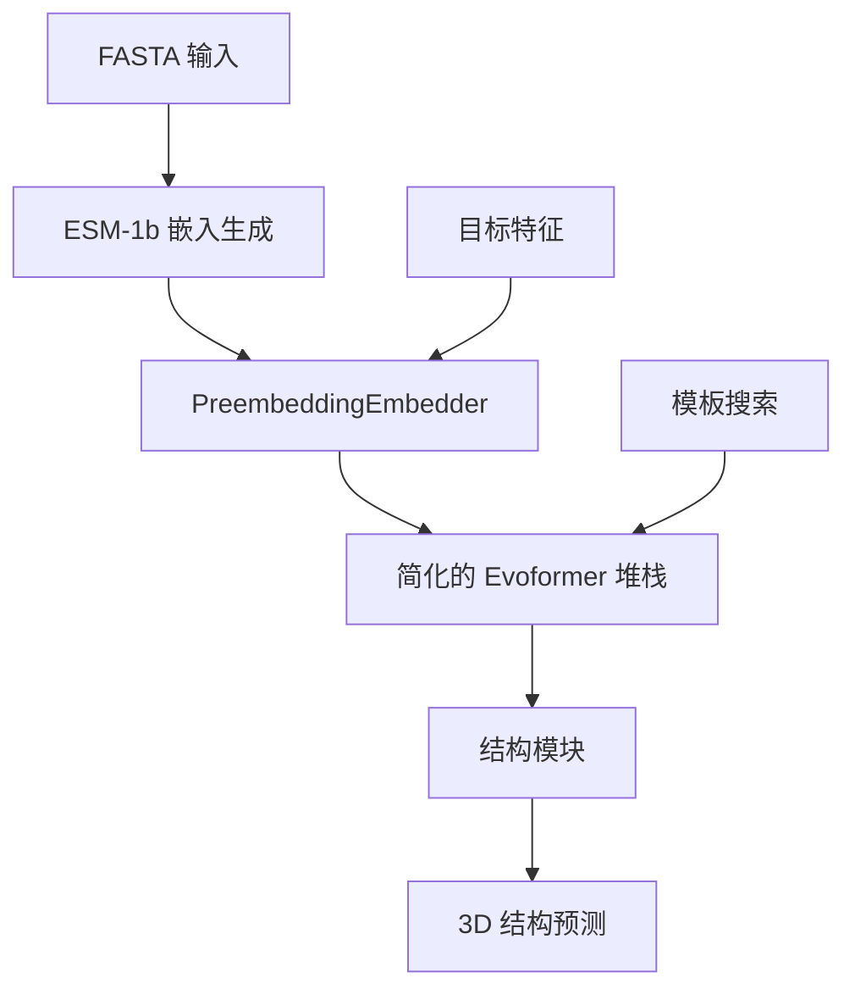
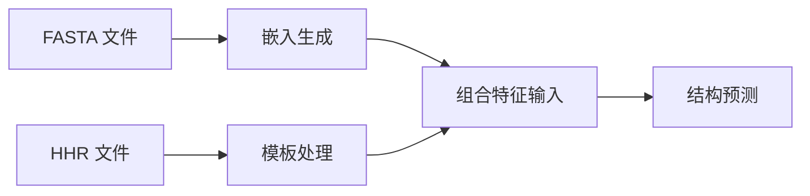

---
slug:20-single-sequence-mode-and-embeddings
blog_type:normal
---


OpenFold 的单序列模式通过利用预计算的蛋白质语言模型嵌入，实现了从传统依赖 MSA 的蛋白质结构预测的范式转变。该方法消除了对多序列比对（MSA）生成的需求，在保持对许多蛋白质家族具有竞争力的准确性的同时，显著降低了计算开销。

## 架构概述

单序列模式架构采用精简的流水线，用 ESM-1b 嵌入替代了传统的 MSA 处理。这一根本性变化实现了更快的推理速度，并减少了对大型序列数据库的依赖。



## 核心组件

### PreembeddingEmbedder

`PreembeddingEmbedder`（[embedders.py#L312-L405](openfold/model/embedders.py#L312-L405)）作为单序列模式中序列嵌入的主要接口。这个专门的嵌入器处理 ESM-1b 嵌入和目标特征：

```python
class PreembeddingEmbedder(nn.Module):
    def __init__(
        self,
        tf_dim: int,              # 目标特征维度
        preembedding_dim: int,   # ESM-1b 嵌入维度 (1280)
        c_z: int,                # 成对嵌入维度
        c_m: int,                # 单序列嵌入维度
        relpos_k: int,           # 相对位置编码窗口
    ):
```

该嵌入器执行三个关键转换：
1. **线性投影**：将目标特征和预嵌入投影到匹配的模型维度
2. **相对位置编码**：使用残基索引信息
3. **成对嵌入构建**：结合序列信息与空间关系

### 模型配置

单序列模式通过专门的配置预设激活。`seq_mode_config`（[config.py#L924-L957](openfold/config.py#L924-L957)）定义了操作参数：

```python
seq_mode_config = mlc.ConfigDict({
    "data": {
        "seqemb_mode": {
            "enabled": True,  # 启用序列嵌入模式
        },
    },
    "globals": {
        "seqemb_mode_enabled": True,
    },
    "model": {
        "preembedding_embedder": {
            "tf_dim": 22,
            "preembedding_dim": 1280,  # ESM-1b 维度
            "c_z": 128,
            "c_m": 256,
            "relpos_k": 32,
        },
        "extra_msa": {
            "enabled": False  # 禁用额外 MSA 堆栈
        },
        "evoformer_stack": {
            "no_column_attention": True  # 禁用列注意力
        },
    }
})
```

<CgxTip>该配置禁用了 MSA 特定组件（额外 MSA 堆栈、列注意力），以优化单序列处理的架构，同时保持核心 Evoformer 结构。</CgxTip>

## 嵌入生成流水线

### 预计算嵌入

OpenFold 提供了专门的脚本来批量生成 ESM-1b 嵌入：

```bash
python scripts/precompute_embeddings.py fasta_dir/ embeddings_output_dir/
```

`EmbeddingGenerator` 类（[precompute_embeddings.py#L62-L150](scripts/precompute_embeddings.py#L62-L150)）处理嵌入过程：

1. **序列加载**：解析 FASTA 文件并创建批处理数据集
2. **ESM-1b 模型加载**：下载并初始化 ESM-1b 模型
3. **批处理**：使用可配置的 token 批处理大小生成嵌入
4. **输出管理**：将嵌入保存为结构化目录中的 `.pt` 文件

### 运行时嵌入生成

或者，可以在推理过程中生成嵌入而无需预计算：

```bash
python run_pretrained_openfold.py \
    fasta_dir \
    data/pdb_mmcif/mmcif_files/ \
    --config_preset "seq_model_esm1b_ptm" \
    --openfold_checkpoint_path openfold/resources/openfold_soloseq_params/seq_model_esm1b_ptm.pt
```

主推理脚本（[run_pretrained_openfold.py#L175-L250](run_pretrained_openfold.py#L175-L250)）根据配置预设自动检测序列模式：

```python
if args.config_preset.startswith("seq"):
    args.use_single_seq_mode = True
```

## 与主模型的集成

`AlphaFold` 模型（[model.py#L1-L100](openfold/model/model.py#L1-L100)）根据模式动态选择适当的嵌入器：

```python
if self.seqemb_mode:
    # 单序列模式使用 PreembeddingEmbedder
    self.input_embedder = PreembeddingEmbedder(
        **self.config["preembedding_embedder"],
    )
else:
    # MSA 模式使用传统 InputEmbedder
    self.input_embedder = InputEmbedder(
        **self.config["input_embedder"],
    )
```

## 性能特征

### 内存和计算效率

| 特性 | 传统 MSA 模式 | 单序列模式 |
|---------|---------------------|---------------------|
| **数据库要求** | 大型（UniRef90、MGnify 等） | 无（可选模板除外） |
| **预处理时间** | 小时到天 | 分钟到小时 |
| **GPU 内存使用** | 高（MSA 张量） | 中等（单个嵌入） |
| **推理速度** | 较慢（MSA 处理） | 更快（直接使用嵌入） |

### 序列限制

<CgxTip>ESM-1b 模型对最大序列长度限制为 1022 个残基。超过此限制的序列会被自动截断，因此没有分段策略的情况下，该方法不适用于非常大的蛋白质。</CgxTip>

## 使用模式

### 模板集成

单序列模式支持通过放置在嵌入输出目录中的 `.hhr` 文件集成模板信息。这实现了结合语言模型嵌入与结构模板的混合方法：



### 配置预设

OpenFold 为单序列模式提供了专门的预设：

- `seq_model_esm1b_ptm`：使用 ESM-1b 嵌入和 pTM 头进行置信度估计
- `seq_model_esm1b`：不带 pTM 置信度分数的基础 ESM-1b 模型

## 后续步骤

要全面了解嵌入生态系统，请探索[特征提取和处理](12-feature-extraction-and-processing)。要了解单序列模式与传统方法的比较，请参见[多序列比对（MSA）处理](13-multiple-sequence-alignment-msa-handling)。有关实际实现细节，请参考[使用预训练模型运行推理](5-running-inference-with-pretrained-models)。