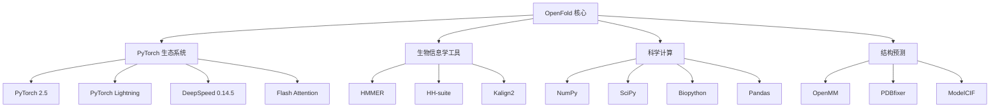

---
slug:3-system-requirements-and-dependencies
blog_type:normal
---


OpenFold 是一个计算密集型的蛋白质结构预测框架，需要特定的硬件和软件配置。本页面概述了成功安装和运行所需的基本系统要求、依赖项和设置注意事项。

## 硬件要求

### GPU 要求
OpenFold 需要 NVIDIA GPU 并支持 CUDA 以实现最佳性能。该框架设计用于通过 CUDA 内核和自定义实现来利用 GPU 加速。

**支持的 GPU 计算能力：**
- **计算能力 5.2**：Titan X 及更早代的 GPU
- **计算能力 6.1**：GeForce 1000 系列 GPU
- **计算能力 7.0**：现代 GPU（默认目标）
- **计算能力 8.0**：Ampere 架构（CUDA 11+）
- **计算能力 9.0**：Hopper 架构

<CgxTip>设置过程会自动检测你的 GPU 计算能力并相应编译 CUDA 内核。如果遇到编译问题，请确保你的 GPU 至少支持计算能力 5.2。</CgxTip>

### 内存要求
- **GPU 内存**：标准蛋白质推理建议至少 16GB VRAM
- **系统内存**：数据库操作和大型蛋白质序列建议 32GB+ RAM
- **存储空间**：数据库、模型和临时文件需要 100GB+ 可用空间

## 软件要求

### 操作系统
**仅支持 Linux**：OpenFold 目前仅在 Linux 系统上受支持。该框架已在以下系统上测试：
- Ubuntu 20.04 LTS 和 22.04 LTS
- CentOS/RHEL 8+
- 其他具有兼容工具链的 Linux 发行版

### 核心软件栈

| 组件 | 版本 | 用途 |
|-----------|---------|---------|
| **Python** | 3.10 | 核心运行时环境 |
| **CUDA** | 12.4 | GPU 加速和计算 |
| **GCC** | 12.4 | CUDA 扩展的 C++ 编译 |
| **PyTorch** | 2.5 | 深度学习框架 |
| **PyTorch CUDA** | 12.4 | PyTorch GPU 加速 |

来源：[environment.yml](environment.yml#L1-L41)、[setup.py](setup.py#L1-L137)

## 依赖架构

OpenFold 依赖栈分为多个层次，每层在蛋白质结构预测流程中承担特定功能：



来源：[environment.yml](environment.yml#L15-L38)、[setup.py](setup.py#L100-L137)

## 详细依赖项

### PyTorch 生态系统
| 包 | 版本 | 用途 |
|---------|---------|---------|
| PyTorch | 2.5 | 深度学习框架基础 |
| PyTorch Lightning | - | 训练编排和可扩展性 |
| DeepSpeed | 0.14.5 | 内存优化和分布式训练 |
| Flash Attention | - | 优化的注意力机制 |

### 生物信息学工具
| 工具 | 用途 | 来源 |
|------|---------|--------|
| HMMER | 序列同源性搜索 | bioconda::hmmer |
| HH-suite | 远程同源性检测 | bioconda::hhsuite |
| Kalign2 | 多序列比对 | bioconda::kalign2 |

### 科学计算库
| 库 | 用途 |
|---------|---------|
| NumPy | 数值计算基础 |
| SciPy | 科学算法 |
| Biopython | 生物数据处理 |
| Pandas | 数据处理和分析 |
| PyYAML | 配置管理 |
| tqdm | 进度指示器 |

### 结构预测组件
| 组件 | 用途 |
|-----------|---------|
| OpenMM | 分子力学模拟 |
| PDBfixer | PDB 结构修复和准备 |
| ModelCIF | 结构格式处理 |

来源：[environment.yml](environment.yml#L1-L41)、[notebooks/environment.yml](notebooks/environment.yml#L1-L18)

## CUDA 扩展和自定义内核

OpenFold 包含用于性能优化的自定义 CUDA 内核：

### 自定义 CUDA 组件
- **注意力核心**：注意力机制的优化 softmax 操作
- **Evoformer 内核**：进化 transformer 层的专用操作
- **内存优化**：减少内存占用的自定义内核

### 编译要求
设置过程使用特定标志编译 CUDA 扩展：
```bash
# CUDA 编译标志
extra_cuda_flags = [
    '-std=c++17',
    '-maxrregcount=50',
    '-U__CUDA_NO_HALF_OPERATORS__',
    '--expt-relaxed-constexpr',
    '--expt-extended-lambda'
]
```

来源：[setup.py](setup.py#L20-L67)

## 环境设置选项

### 选项 1：Conda/Mamba 环境（推荐）
```bash
# 使用 Mamba 创建环境（比 conda 更快）
mamba env create -n openfold_env -f environment.yml
conda activate openfold_env
```

### 选项 2：Docker 容器
提供的 [Dockerfile](Dockerfile) 创建完整环境：
```dockerfile
FROM nvidia/cuda:12.1.1-cudnn8-devel-ubuntu22.04
# 包含所有依赖项和 OpenFold 安装
```

### 选项 3：手动安装
适用于需要自定义配置的高级用户：
- 安装 CUDA 12.4 和 cuDNN 8
- 设置 Python 3.10 环境
- 从 environment.yml 手动安装依赖项
- 使用 setup.py 编译 CUDA 扩展

## 第三方依赖项安装

[`install_third_party_dependencies.sh`](scripts/install_third_party_dependencies.sh) 脚本处理额外设置：

### 必要组件
1. **折叠资源**：结构验证的立体化学属性
2. **CUTLASS**：NVIDIA CUDA 内核开发模板库
3. **测试数据**：验证用的样本特征

### 环境配置
```bash
# 设置环境变量
export LIBRARY_PATH=$CONDA_PREFIX/lib:$LIBRARY_PATH
export LD_LIBRARY_PATH=$CONDA_PREFIX/lib:$LD_LIBRARY_PATH
export CUTLASS_PATH=$PWD/cutlass
export KMP_AFFINITY=none
```

来源：[scripts/install_third_party_dependencies.sh](scripts/install_third_party_dependencies.sh#L1-L25)

## 可选依赖项

### MPI 支持
用于跨多节点的分布式计算：
```bash
pip install mpi4py
```

### 开发依赖项
用于文档和测试：
- **Sphinx**：文档生成（[docs/environment.yml](docs/environment.yml)）
- **单元测试框架**：Python unittest 内置

### 数据库工具
`scripts/` 目录中提供各种数据库下载脚本：
- `download_alphafold_dbs.sh`
- `download_bfd.sh`
- `download_uniref90.sh`
- 以及更多专业数据库

## 常见设置问题和解决方案

### CUDA 兼容性
**问题**：PyTorch 与系统 CUDA 版本不匹配
**解决方案**：确保安装 CUDA 12.4 并使用 PyTorch 的 CUDA 12.4 版本

### 内存问题
**问题**：大型蛋白质的 GPU 内存不足
**解决方案**：使用 DeepSpeed 优化或减少批量大小

### 编译失败
**问题**：CUDA 内核编译错误
**解决方案**：验证 GPU 计算能力和 CUDA 工具包安装

来源：[docs/source/Installation.md](docs/source/Installation.md#L1-L69)

## 后续步骤

确认系统满足这些要求后，继续进行[数据库设置和配置](4-database-setup-and-configuration)以准备蛋白质结构预测所需的生物数据库。如果已配置所需数据库，可直接跳转到[使用预训练模型进行推理](5-running-inference-with-pretrained-models)立即使用。

有关详细安装说明和故障排除，请参考文档中的完整[安装指南](docs/source/Installation.md)。