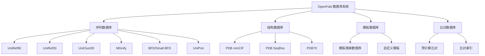
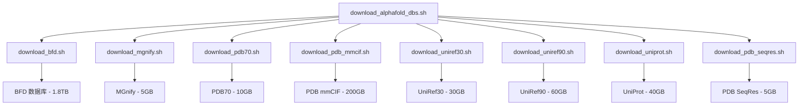

---
slug:4-database-setup-and-configuration
blog_type:normal
---


OpenFold 需要多个蛋白质序列和结构数据库才能有效进行蛋白质结构预测。本指南为希望在生产或研究环境中部署 OpenFold 的中级开发者提供了数据库架构、设置程序和配置选项的全面概述。

## 数据库架构概述

OpenFold 采用多层式数据库系统，旨在支持蛋白质结构预测的各个方面，包括序列比对、模板搜索和特征生成。该架构旨在平衡性能与存储需求，提供完整和精简的数据库配置。



## 核心数据库组件

### 序列数据库

序列数据库是多重序列比对（MSA）生成和进化分析的基础。OpenFold 支持多个主要序列数据库，每个数据库在预测流程中都有特定用途。

| 数据库 | 大小 | 用途 | 下载模式 |
|----------|------|---------|---------------|
| **UniRef90** | ~60GB | 全面的非冗余序列数据库 | 完整/精简 |
| **UniRef30** | ~30GB | 按 30% 相似性聚类 | 完整/精简 |
| **UniClust30** | ~20GB | 替代性的 30% 相似性聚类 | 完整/精简 |
| **MGnify** | ~5GB | 宏基因组序列 | 完整/精简 |
| **BFD** | ~1.8TB | Big Fantastic 数据库（全面） | 仅完整版 |
| **Small BFD** | ~100GB | BFD 的精简版本 | 仅精简版 |
| **UniProt** | ~40GB | 参考蛋白质组数据库 | 完整/精简 |

<CgxTip>选择 BFD 还是 Small BFD 是存储和性能之间最重要的权衡。Small BFD 仅需 5% 的存储空间即可提供 95% 的覆盖率。</CgxTip>

### 结构数据库

结构数据库为基于模板的建模和结构特征提取提供三维坐标信息。

| 数据库 | 内容 | 大小 | 用途 |
|----------|---------|------|-------|
| **PDB mmCIF** | mmCIF 格式的完整 PDB | ~200GB | 模板生成、特征提取 |
| **PDB SeqRes** | 仅 PDB 序列 | ~5GB | 基于序列的模板搜索 |
| **PDB70** | 按 70% 相似性聚类的 PDB | ~10GB | 快速模板搜索 |

## 数据库设置程序

### 完整数据库设置

为获得最高精度的全面蛋白质结构预测，请使用完整数据库配置：

```bash
# 下载所有必需的数据库
bash scripts/download_alphafold_dbs.sh /path/to/databases full_dbs
```

此命令通过各个下载脚本协调下载所有主要数据库：



### 精简数据库设置

用于开发、测试或资源受限的环境：

```bash
# 下载精简数据库集
bash scripts/download_alphafold_dbs.sh /path/to/databases reduced_dbs
```

此配置用 Small BFD 替换 BFD，在保持核心功能的同时将存储需求从约 2.2TB 减少到约 400GB。

### MMseqs2 数据库设置

用于基于 MMseqs2 的比对流程：

```bash
# 下载 MMseqs2 优化数据库
bash scripts/download_mmseqs_dbs.sh /path/to/databases
```

此设置包括：
- 用于序列搜索的 UniRef30
- 用于增强覆盖率的 ColabFold 环境数据库

## 数据库配置

### 路径配置

数据库路径必须在 OpenFold 的数据流程中配置。[`scripts/utils.py`](scripts/utils.py#L15-70) 中的 `add_data_args` 函数定义了所有必需的数据库路径：

```python
def add_data_args(parser: argparse.ArgumentParser):
    parser.add_argument('--uniref90_database_path', type=str, default=None)
    parser.add_argument('--mgnify_database_path', type=str, default=None)
    parser.add_argument('--pdb70_database_path', type=str, default=None)
    parser.add_argument('--pdb_seqres_database_path', type=str, default=None)
    parser.add_argument('--uniref30_database_path', type=str, default=None)
    parser.add_argument('--uniclust30_database_path', type=str, default=None)
    parser.add_argument('--uniprot_database_path', type=str, default=None)
    parser.add_argument('--bfd_database_path', type=str, default=None)
    # ... 其他二进制路径配置
```

### 二进制工具配置

OpenFold 需要多个外部生物信息学工具进行数据库处理：

| 工具 | 用途 | 配置参数 |
|------|---------|-------------------------|
| **jackhmmer** | 序列同源性搜索 | `--jackhmmer_binary_path` |
| **hhblits** | 快速 MSA 生成 | `--hhblits_binary_path` |
| **hhsearch** | 模板搜索 | `--hhsearch_binary_path` |
| **hmmsearch** | 替代性模板搜索 | `--hmmsearch_binary_path` |
| **hmmbuild** | HMM 构建 | `--hmmbuild_binary_path` |
| **kalign** | 序列比对 | `--kalign_binary_path` |

## 数据库预处理

### mmCIF 缓存生成

生成 PDB mmCIF 文件的可搜索缓存，以便高效检索模板：

```bash
python scripts/generate_mmcif_cache.py \
    /path/to/pdb_mmcif_dir \
    /path/to/output_cache.json \
    --no_workers 8 \
    --cluster_file /path/to/pdb_cluster_file
```

[`generate_mmcif_cache.py`](scripts/generate_mmcif_cache.py#L1-108) 脚本并行处理 mmCIF 文件，提取结构元数据和链信息以实现快速模板搜索。

### 比对预计算

预计算蛋白质序列的比对以加速推理：

```bash
python scripts/precompute_alignments.py \
    /path/to/input_sequences \
    /path/to/output_alignments \
    --uniref90_database_path /path/to/uniref90 \
    --mgnify_database_path /path/to/mgnify \
    --bfd_database_path /path/to/bfd \
    --pdb70_database_path /path/to/pdb70 \
    --cpus_per_task 16
```

[`precompute_alignments.py`](scripts/precompute_alignments.py#L1-268) 脚本支持多种输入格式（mmCIF、FASTA、ProteinNet），并使用 `AlignmentRunner` 类创建比对数据库。

### 比对数据库创建

创建紧凑的比对数据库以实现高效存储和检索：

```bash
python scripts/alignment_db_scripts/create_alignment_db.py \
    /path/to/alignment_directory \
    /path/to/output_db_directory \
    alignment_db_name
```

[`create_alignment_db.py`](scripts/alignment_db_scripts/create_alignment_db.py#L1-48) 脚本将比对文件合并到单个数据库文件中，并附带 JSON 索引以实现快速访问。

## 高级配置选项

### 数据库分片

对于大规模部署，比对数据库可以分片到多个文件中：

```bash
python scripts/alignment_db_scripts/create_alignment_db_sharded.py \
    /path/to/alignment_directory \
    /path/to/output_db_directory \
    alignment_db_name \
    --num_shards 8
```

### 数据库索引统一

合并多个比对数据库的索引：

```bash
python scripts/alignment_db_scripts/unify_alignment_db_indices.py \
    /path/to/db_directory \
    /path/to/unified_index.json
```

## 性能优化

### 存储注意事项

**数据库存储需求：**

| 配置 | 总存储 | 推荐 SSD | 可接受 HDD |
|---------------|---------------|-----------------|----------------|
| **完整设置** | ~2.2TB | 对性能至关重要 | 仅适用于存档 |
| **精简设置** | ~400GB | 推荐 | 开发环境可接受 |
| **MMseqs2 设置** | ~100GB | 不需要 | 完全足够 |

### 内存配置

**推荐内存分配：**

| 任务 | 最小 RAM | 推荐 RAM | 说明 |
|------|-------------|-----------------|-------|
| **数据库下载** | 8GB | 16GB | 临时使用 |
| **比对预计算** | 32GB | 64GB | 随序列数量扩展 |
| **模板搜索** | 16GB | 32GB | 取决于 PDB 大小 |
| **完整流程** | 64GB | 128GB | 用于生产工作负载 |

<CgxTip>数据库预处理任务能显著受益于并行处理。使用 `--no_workers` 和 `--cpus_per_task` 参数根据可用 CPU 内核优化性能。</CgxTip>

## 数据库问题排查

### 常见问题及解决方案

| 问题 | 症状 | 解决方案 |
|-------|---------|----------|
| **缺少 aria2c** | 下载脚本失败 | 安装 aria2c：`sudo apt install aria2` |
| **空间不足** | 下载中断 | 验证完整设置有 2.2TB 可用空间 |
| **数据库路径错误** | 流程无法启动 | 验证 `add_data_args` 中的所有路径正确 |
| **二进制路径问题** | 工具执行失败 | 确保已激活 conda 环境 |
| **权限错误** | 缓存生成失败 | 检查输出目录的写入权限 |

### 数据库验证

验证数据库安装：

```bash
# 检查数据库文件是否存在
ls -la /path/to/databases/

# 验证 mmCIF 缓存
python -c "import json; json.load(open('/path/to/cache.json'))"

# 测试比对数据库访问
python scripts/alignment_db_scripts/add_non_unique_to_alignment_db.py \
    /path/to/test_alignments \
    /path/to/db_directory \
    test_db
```

## 后续步骤

完成数据库设置和配置后，请继续：

- **[系统要求和依赖项](3-system-requirements-and-dependencies)** - 确保你的系统满足所有硬件和软件要求
- **[使用预训练模型运行推理](5-running-inference-with-pretrained-models)** - 开始使用配置好数据库的 OpenFold
- **[多重序列比对（MSA）处理](13-multiple-sequence-alignment-msa-handling)** - 深入了解比对处理技术

数据库设置构成了所有 OpenFold 操作的基础。正确的配置可确保蛋白质结构预测任务的最佳性能和准确性。