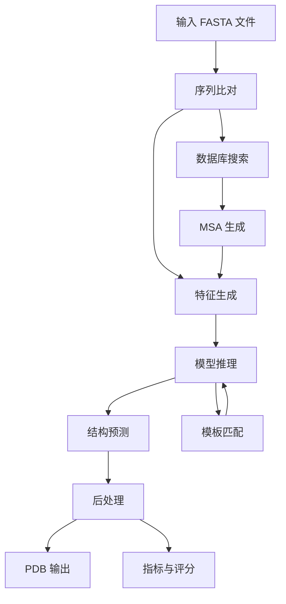
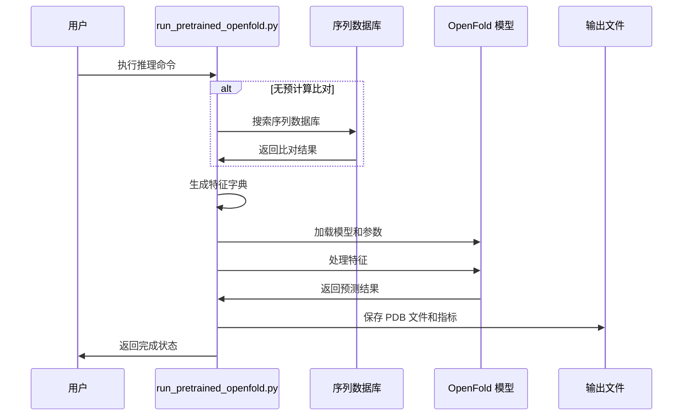

---
slug:5-running-inference-with-pretrained-models
blog_type:normal
---


OpenFold 提供了一个强大且灵活的推理系统，用于使用预训练模型预测蛋白质结构。本指南将引导您完成从设置到执行的完整工作流程，并提供不同用例的实用示例和配置选项。

## 推理架构概述

OpenFold 的推理管道采用模块化架构，通过多个阶段处理输入序列：



推理系统支持三种主要模式：
- **单体**：单条蛋白质链预测
- **多聚体**：多链蛋白质复合物预测  
- **单序列**：基于序列嵌入的无 MSA 预测

本指南重点介绍单体预测，针对专业用例请参考[多聚体蛋白质结构预测](18-multimer-protein-structure-prediction)和[单序列模式与嵌入](20-single-sequence-mode-and-embeddings)。

## 先决条件与设置

运行推理前，请确保已正确配置以下组件：

### 环境要求
- OpenFold Conda 环境（参见[系统要求与依赖项](3-system-requirements-and-dependencies)）
- 用于多序列比对的序列数据库
- 为获得最佳性能，建议使用 GPU 加速

### 数据库设置
使用提供的脚本下载所需的序列数据库：

```bash
bash scripts/download_alphafold_dbs.sh $BASE_DATA_DIR
```

这将下载并配置：
- UniRef90 数据库：用于全面的序列搜索
- MGnify 数据库：用于宏基因组序列  
- BFD 数据库：用于深度序列覆盖
- PDB70：用于模板匹配
- UniClust30：用于额外的序列多样性


## 模型参数选择

OpenFold 支持 AlphaFold 和 OpenFold 预训练参数。根据您的具体需求进行选择：

### 参数下载选项

| 参数类型 | 下载命令 | 用例 |
|---|---|---|
| AlphaFold 参数 | `bash scripts/download_alphafold_params.sh $PARAMS_DIR` | 标准 AlphaFold 兼容性 |
| OpenFold 参数 | `bash scripts/download_openfold_params.sh $PARAMS_DIR` | 增强的 OpenFold 功能 |

### 配置预设

`--config_preset` 参数决定了模型架构和功能：

| 设置 | `config_preset` | AlphaFold 参数 | OpenFold 参数 | 特性 |
|---|---|---|---|---|
| 含模板，无 pTM | `model_1`, `model_2` | `params_model_1.npz`, `params_model_2.npz` | `finetuning_[2-5].pt` | 基于模板的建模 |
| 含模板，有 pTM | `model_1_ptm`, `model_2_ptm` | `params_model_1_ptm.npz`, `params_model_2_ptm.npz` | `finetuning_ptm_[1-2].pt` | 模板 + pTM 评分 |
| 无模板，无 pTM | `model_3`, `model_4`, `model_5` | `params_model_[3-5].npz` | `finetuning_no_templ_[1-2].pt` | 无模板建模 |
| 无模板，有 pTM | `model_3_ptm`, `model_4_ptm`, `model_5_ptm` | `params_model_[3-5]_ptm.npz` | `finetuning_no_templ_ptm_1.pt` | 无模板 + pTM |

<CgxTip>将参数放置在 `openfold/resources` 中以实现自动检测，或使用 `--jax_param_path`/`--openfold_checkpoint_path` 指定自定义位置。</CgxTip>

## 推理工作流程

### 第 1 步：输入准备

将输入序列准备为专用目录中的 FASTA 文件。每个文件应包含一个序列：

```
fasta_dir/
└── 6kwc.fasta
```

FASTA 格式示例：
```fasta
>6KWC_1
GSTIQPGTGYNNGYFYSYWNDGHGGVTYTNGPGGQFSVNWSNSGEFVGGKGWQPGTKNKVINFSGSYNPNGNSYLSVYGWSRNPLIEYYIVENFGTYNPSTGATKLGEVTSDGSVYDIYRTQRVNQPSIIGTATFYQYWSVRRNHRSSGSVNTANHFNAWAQQGLTLGTMDYQIVAVQGYFSSGSASITVS
```

### 第 2 步：选择推理模式

#### 选项 A：无预计算比对的推理

运行包含序列比对的完整管道：

```bash
python3 run_pretrained_openfold.py \
    $INPUT_FASTA_DIR \
    $TEMPLATE_MMCIF_DIR \
    --output_dir $OUTPUT_DIR \
    --config_preset model_1_ptm \
    --uniref90_database_path $BASE_DATA_DIR/uniref90/uniref90.fasta \
    --mgnify_database_path $BASE_DATA_DIR/mgnify/mgy_clusters_2018_12.fa \
    --pdb70_database_path $BASE_DATA_DIR/pdb70 \
    --uniclust30_database_path $BASE_DATA_DIR/uniclust30/uniclust30_2018_08/uniclust30_2018_08 \
    --bfd_database_path $BASE_DATA_DIR/bfd/bfd_metaclust_clu_complete_id30_c90_final_seq.sorted_opt \
    --model_device "cuda:0"
```

**必需参数：**
- `$INPUT_FASTA_DIR`：包含查询 FASTA 文件的目录
- `$TEMPLATE_MMCIF_DIR`：模板 MMCIF 文件目录（即使是无模板推理也需要）
- `--output_dir`：预测结果的输出目录
- `--config_preset`：模型配置预设
- 序列比对的数据库路径
- `--model_device`：计算设备（例如 GPU 使用 "cuda:0"）

#### 选项 B：使用预计算比对的推理

使用现有比对跳过数据库搜索步骤：

```bash
python3 run_pretrained_openfold.py $INPUT_FASTA_DIR \
  $TEMPLATE_MMCIF_DIR \
  --output_dir $OUTPUT_DIR \
  --use_precomputed_alignments $PRECOMPUTED_ALIGNMENTS \
  --config_preset model_1_ptm \
  --model_device "cuda:0"
```

预计算比对目录应具有以下结构：
```
alignments/
└── 6KWC_1/
    ├── bfd_uniref_hits.a3m
    ├── hhsearch_output.hhr
    ├── mgnify_hits.sto
    └── uniref90_hits.sto
```

### 第 3 步：执行流程



## 输出解释

推理过程会生成多个输出文件和目录：

### 输出结构
```
output_dir/
├── alignments/           # 生成的序列比对
│   └── 6KWC_1/
├── predictions/          # 预测的结构
│   ├── 6KWC_1_model_1_ptm_unrelaxed.pdb
│   └── 6KWC_1_model_1_ptm_relaxed.pdb
└── timings.json         # 性能指标
```

### 关键输出文件
- **未松弛 PDB**：未经结构优化的直接模型输出
- **松弛 PDB**：经 Amber 松弛优化后的结构，具有改进的几何构型
- **计时 JSON**：推理和松弛阶段的性能指标
- **比对文件**：用于可重复性的 MSA 和模板搜索结果

<CgxTip>通常建议使用松弛 PDB 文件进行下游分析，因为它们具有改进的立体化学结构和物理合理性。</CgxTip>

## 高级配置选项

### 性能优化

#### DeepSpeed 集成
以最小内存开销实现 2-3 倍加速：

```bash
python3 run_pretrained_openfold.py [...] \
    --use_deepspeed_evoformer_attention
```

#### FlashAttention
适用于 1000 个残基以下的序列：

```bash
python3 run_pretrained_openfold.py [...] \
    --experiment_config_json '{"globals.use_flash": true}'
```

#### 模型追踪
适用于大规模批处理：

```bash
python3 run_pretrained_openfold.py [...] \
    --trace_model
```

### 长序列处理

对于超过典型内存限制的序列：

```bash
python3 run_pretrained_openfold.py [...] \
    --long_sequence_inference \
    --experiment_config_json '{
        "globals.chunk_size": 64,
        "model.evoformer_stack.use_lma": true,
        "globals.tune_chunk_size": false
    }'
```

**长序列优化策略：**
1. 启用低内存注意力（LMA）以减少内存占用
2. 禁用块大小调整以节省计算时间
3. 使用模板平均化减少模板堆栈内存
4. 考虑 CPU 卸载作为最后手段

### 自定义模板

使用特定的结构模板：

```bash
python3 run_pretrained_openfold.py [...] \
    --use_custom_template
```

这将使用 `template_mmcif_dir` 中的所有 `.cif` 文件作为模板，要求链具有标识符 `_A` 并与输入序列长度匹配。

## 故障排除与常见问题

### 内存管理
| 问题 | 解决方案 | 命令示例 |
|---|---|---|
| GPU 内存不足 | 启用长序列模式 | `--long_sequence_inference` |
| 大序列处理 | 减小块大小 | `--experiment_config_json '{"globals.chunk_size": 32}'` |
| 内存优化 | 启用 LMA | `--experiment_config_json '{"model.evoformer_stack.use_lma": true}'` |

### 性能问题
| 问题 | 解决方案 | 命令示例 |
|---|---|---|
| 推理缓慢 | 启用 DeepSpeed | `--use_deepspeed_evoformer_attention` |
| 大批量作业 | 使用模型追踪 | `--trace_model` |
| 数据库搜索速度 | 使用预计算比对 | `--use_precomputed_alignments $ALIGN_DIR` |

### 配置冲突
| 问题 | 解决方案 | 说明 |
|---|---|---|
| 参数不匹配 | 确保配置预设与参数匹配 | 检查 `config_preset` 与参数文件 |
| 模板冲突 | 验证模板文件格式 | 使用具有正确链 ID 的 `.cif` 格式 |
| 数据库路径问题 | 验证所有数据库路径存在 | 检查绝对路径与相对路径 |

## 示例：完整推理工作流程

以下是使用提供的示例数据的完整示例：

```bash
#!/bin/bash
export FASTA_DIR=./fasta_dir
export OUTPUT_DIR=./
export PRECOMPUTED_ALIGNMENT_DIR=./alignments
export MMCIF_DIR=/path/to/mmcifs

python3 run_pretrained_openfold.py $FASTA_DIR \
  $MMCIF_DIR \
  --output_dir $OUTPUT_DIR \
  --config_preset model_1_ptm \
  --model_device "cuda:0" \
  --data_random_seed 42 \
  --use_precomputed_alignments $PRECOMPUTED_ALIGNMENT_DIR
```

此示例展示了 [examples/monomer/](https://github.com/aqlaboratory/openfold/tree/main/examples/monomer) 目录中使用的典型工作流程，其中包含示例输入数据和预期输出。

## 后续步骤

成功运行推理后，您可能想要探索：

- **多聚体预测**：了解用于蛋白质复合物的[多聚体蛋白质结构预测](18-multimer-protein-structure-prediction)
- **训练管道**：探索用于自定义模型训练的[训练管道与配置](15-training-pipeline-and-configuration)
- **性能优化**：深入研究用于大规模部署的[DeepSpeed 集成与性能](16-deepspeed-integration-and-performance)
- **架构详情**：了解 [AlphaFold 2 模型实现](9-alphafold-2-model-implementation) 以获得更深入的技术见解