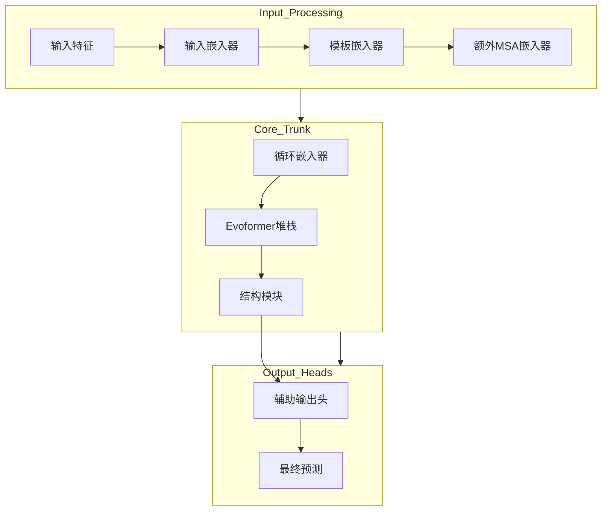

---
slug:9-alphafold-2-model-implementation
blog_type:normal
---

OpenFold 中的 AlphaFold 2 实现是对 DeepMind 突破性蛋白质结构预测模型的全面 PyTorch 重构版本。该架构利用深度学习技术，能够以极高的精度从氨基酸序列预测蛋白质的三维结构。

## 核心架构概述

AlphaFold 2 模型遵循原始 AlphaFold 2 论文中描述的架构设计，将核心算法组件实现为模块化神经网络系统。主要模型类 [`AlphaFold`](openfold/model/model.py#L65) 作为中央协调器，负责协调处理输入特征和生成结构预测的不同功能模块。

## 模型初始化与配置

模型通过分层配置系统进行初始化，该系统定义了架构参数和行为模式。[`__init__`](openfold/model/model.py#L72) 方法展示了关键组件的模块化组装：

- **输入嵌入**：根据用例选择 [`InputEmbedder`](openfold/model/embedders.py#L38)、[`InputEmbedderMultimer`](openfold/model/embedders.py#L157) 或 [`PreembeddingEmbedder`](openfold/model/embedders.py#L312)
- **模板处理**：配置 [`TemplateEmbedder`](openfold/model/embedders.py#L634) 或 [`TemplateEmbedderMultimer`](openfold/model/embedders.py#L873) 用于结构模板集成
- **MSA处理**：设置 [`ExtraMSAEmbedder`](openfold/model/embedders.py#L595) 和 [`ExtraMSAStack`](openfold/model/evoformer.py#L1028) 处理额外序列信息
- **核心处理**：初始化 [`EvoformerStack`](openfold/model/evoformer.py#L748) 和 [`StructureModule`](openfold/model/structure_module.py#L817) 用于特征提取和结构生成

## 输入嵌入流水线

输入嵌入系统将原始蛋白质序列特征转换为适合深度学习处理的丰富数值表示。[`InputEmbedder`](openfold/model/embedders.py#L38) 实现了 AlphaFold 2 论文中的算法 3 和 4，处理：

- **目标序列特征**：独热编码的氨基酸序列
- **MSA特征**：多序列比对表示
- **相对位置**：通过 [`relpos`](openfold/model/embedders.py#L85) 方法进行序列距离编码

对于多聚体预测，[`InputEmbedderMultimer`](openfold/model/embedders.py#L157) 通过链感知相对定位和多链蛋白质复合物的专门处理扩展了此功能。

## 循环机制

AlphaFold 2 的一个关键创新是迭代循环机制，允许模型通过多次传递来优化其预测。[`iteration`](openfold/model/model.py#L209) 方法实现了此优化过程：

1. **特征预处理**：将输入特征转换为适当的数据类型并提取批次维度
2. **嵌入初始化**：创建初始 MSA (`m`) 和配对 (`z`) 表示
3. **循环集成**：通过 [`RecyclingEmbedder`](openfold/model/embedders.py#L406) 将当前迭代输出与先前迭代嵌入相结合
4. **渐进优化**：每次迭代都在先前预测的基础上进行改进，检测到收敛时提前停止

[`forward`](openfold/model/model.py#L493) 方法协调整个循环循环，管理迭代间的梯度计算和内存优化。

## Evoformer 核心处理

[`EvoformerStack`](openfold/model/evoformer.py#L748) 实现算法 6，作为核心特征提取引擎。它通过一系列专门块处理 MSA 和配对表示：

| 组件 | 功能 | 实现 |
|------|------|------|
| **MSA 注意力** | 序列的行方向注意力 | [`EvoformerBlock`](openfold/model/evoformer.py#L377) |
| **外积均值** | MSA 到配对表示的转换 | [`_compute_opm`](openfold/model/evoformer.py#L325) |
| **配对堆栈** | 配对表示处理 | [`PairStack`](openfold/model/evoformer.py#L123) |
| **MSA 转换** | 前馈 MSA 处理 | [`MSATransition`](openfold/model/evoformer.py#L48) |

Evoformer 采用先进的优化技术，包括激活检查点、内存高效的分块处理和专门的注意力实现。

## 结构模块

[`StructureModule`](openfold/model/structure_module.py#L817) 将处理后的特征转换为三维原子坐标。该模块实现了 AlphaFold 2 的几何推理组件：

- **不变点注意力**：[`InvariantPointAttention`](openfold/model/structure_module.py#L209) 在结构框架上执行三维感知注意力
- **主链更新**：[`BackboneUpdate`](openfold/model/structure_module.py#L736) 生成坐标更新
- **角度预测**：[`AngleResnet`](openfold/model/structure_module.py#L78) 预测扭转角
- **框架生成**：使用刚体变换将预测转换为三维坐标

结构模块支持单体和多聚体模式，针对不同用例有专门的实现。

## 辅助预测头

[`AuxiliaryHeads`](openfold/model/heads.py#L28) 组件生成训练期间和置信度评估使用的额外预测：

| 预测头 | 用途 | 输出 |
|--------|------|------|
| **DistogramHead** | 距离预测 | 残基对间距离 |
| **TMScoreHead** | 质量评估 | TM-score 预测 |
| **PerResidueLDDTCaPredictor** | 局部置信度 | 每残基 lDDT 分数 |
| **MaskedMSAHead** | MSA 重建 | 序列保守性 |
| **ExperimentallyResolvedHead** | 分辨率预测 | 实验数据置信度 |

## 配置系统

模型架构通过 [`config.py`](openfold/config.py) 系统高度可配置，该系统定义：

- **通道维度**：不同表示空间的 `c_m` (256)、`c_z` (128)、`c_s` (384)
- **架构参数**：注意力头数、块数和隐藏维度
- **优化设置**：块大小、检查点策略、精度模式
- **功能标志**：模板使用、MSA 处理模式、多聚体支持

<CgxTip>模块化设计允许在不同用例间灵活配置，从标准单体预测到多聚体复合物和单序列嵌入模式。</CgxTip>

## 性能优化

OpenFold 的实现包含多项超越原始 AlphaFold 2 的性能优化：

- **内存效率**：分块处理和激活检查点
- **GPU 加速**：自定义 CUDA 内核和优化的注意力实现
- **混合精度**：支持 FP16 训练和推理
- **分布式训练**：大规模训练的 DeepSpeed 集成

该实现在保持与原始 AlphaFold 2 算法一致性的同时，提供了生产应用和研究所需的灵活性和性能特征。

来源：[model.py](openfold/model/model.py#L65), [evoformer.py](openfold/model/evoformer.py#L748), [embedders.py](openfold/model/embedders.py#L38), [structure_module.py](openfold/model/structure_module.py#L817), [heads.py](openfold/model/heads.py#L28), [config.py](openfold/config.py#L61)

## 后续步骤

要深入了解核心处理组件，请探索 [Evoformer 和结构模块](10-evoformer-and-structure-module) 以了解这些关键架构元素的详细实现。要了解模型如何处理内存限制和大蛋白质，请参阅 [内存优化技术](11-memory-optimization-techniques)。