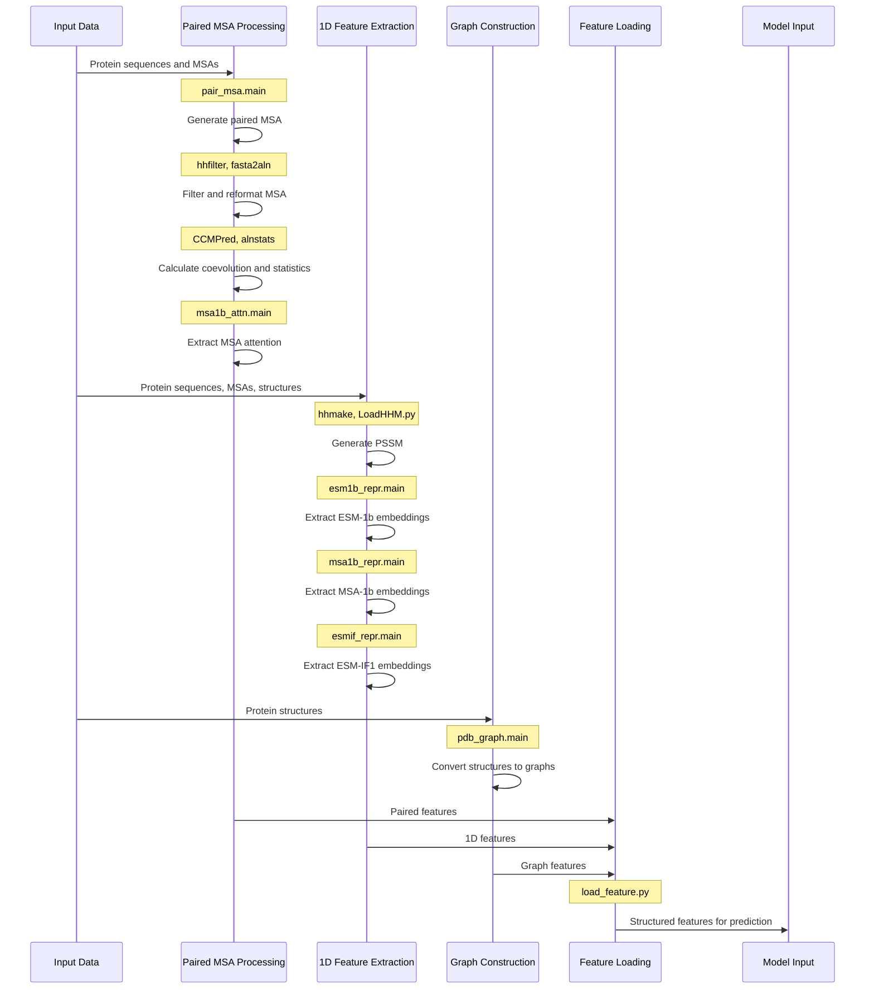
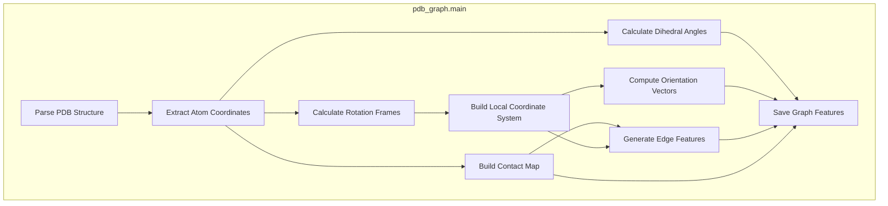

# Feature Extraction

> **Relevant source files**
> * [load_feature.py](https://github.com/ChengfeiYan/PLMGraph-Inter/blob/d1c5ea71/load_feature.py)
> * [pdb_graph.py](https://github.com/ChengfeiYan/PLMGraph-Inter/blob/d1c5ea71/pdb_graph.py)
> * [predict.py](https://github.com/ChengfeiYan/PLMGraph-Inter/blob/d1c5ea71/predict.py)

This page documents the feature extraction process in the PLMGraph-Inter system. Feature extraction is a critical component that transforms raw protein data (sequences, MSAs, and structures) into machine-learning-ready representations used by the prediction model. This page focuses on the specific types of features extracted and how they are processed.

For information about the overall prediction pipeline, see [Prediction Pipeline](/ChengfeiYan/PLMGraph-Inter/4-prediction-pipeline), and for details on model architecture that uses these features, see [Model Architecture](/ChengfeiYan/PLMGraph-Inter/5-model-architecture).

## 1. Feature Extraction Overview

PLMGraph-Inter extracts multiple types of features from protein data to capture diverse aspects of protein-protein interactions:


Sources: [predict.py L47-L156](https://github.com/ChengfeiYan/PLMGraph-Inter/blob/d1c5ea71/predict.py#L47-L156)

## 2. Feature Categories

PLMGraph-Inter extracts and processes three main categories of features:

### 2.1 Paired 2D Features

These features capture evolutionary relationships between pairs of residues from the two interacting proteins:

| Feature Type | Description | Source | Dimensions |
| --- | --- | --- | --- |
| CCMPred | Direct evolutionary coupling scores | External tool | L₁ × L₂ matrix |
| Alignment Statistics | Conservation and covariation | External tool (alnstats) | 3 × L₁ × L₂ tensor |
| MSA-1b Attention | Cross-attention scores from ESM-MSA-1b | ESM model | (L×H) × L₁ × L₂ tensor |

Where L₁ and L₂ are the lengths of proteins A and B, L is the number of layers, and H is the number of attention heads.

Sources: [predict.py L52-L103](https://github.com/ChengfeiYan/PLMGraph-Inter/blob/d1c5ea71/predict.py#L52-L103)

 [load_feature.py L65-L95](https://github.com/ChengfeiYan/PLMGraph-Inter/blob/d1c5ea71/load_feature.py#L65-L95)

### 2.2 1D Features

These features capture residue-level information for each protein:

| Feature Type | Description | Source | Dimensions |
| --- | --- | --- | --- |
| PSSM | Position-Specific Scoring Matrix | HHmake (HHsuite) | 20 × L matrix |
| ESM-1b Representations | Deep contextual embeddings | ESM-1b model | 1280 × L matrix |
| MSA-1b Representations | MSA-based embeddings | ESM-MSA-1b model | 768 × L matrix |
| ESM-IF1 Representations | Structure-aware embeddings | ESM-IF1 model | 512 × L matrix |

Where L is the length of the protein sequence.

Sources: [predict.py L107-L144](https://github.com/ChengfeiYan/PLMGraph-Inter/blob/d1c5ea71/predict.py#L107-L144)

 [load_feature.py L42-L62](https://github.com/ChengfeiYan/PLMGraph-Inter/blob/d1c5ea71/load_feature.py#L42-L62)

### 2.3 Graph Features

These features represent the structural information of each protein in a graph format:

| Feature Type | Description | Dimensions |
| --- | --- | --- |
| Node Scalar | Dihedral angles | 6 × L matrix (sine and cosine of φ, ψ, ω) |
| Node Vector | Local orientation vectors | L × 50 × 3 tensor |
| Edge Scalar | Distance RBF features and positional embeddings | E × (25×16+32) matrix |
| Edge Vector | Relative orientation vectors | E × 25 × 3 tensor |
| Edge Index | Connectivity information | 2 × E matrix |

Where L is the length of the protein and E is the number of edges in the graph.

Sources: [predict.py L148-L155](https://github.com/ChengfeiYan/PLMGraph-Inter/blob/d1c5ea71/predict.py#L148-L155)

 [pdb_graph.py L195-L263](https://github.com/ChengfeiYan/PLMGraph-Inter/blob/d1c5ea71/pdb_graph.py#L195-L263)

## 3. Feature Extraction Process

The feature extraction process is implemented in `predict.py` and follows these steps:



Sources: [predict.py L47-L173](https://github.com/ChengfeiYan/PLMGraph-Inter/blob/d1c5ea71/predict.py#L47-L173)

## 4. Detailed Feature Processing

### 4.1 Graph Feature Construction

The graph features are extracted from protein structures using `pdb_graph.py`, which:

1. Parses PDB files to extract atom coordinates
2. Calculates virtual Cβ atoms for backbone representation
3. Computes local coordinate frames and orientation features
4. Builds a contact map with a cutoff of 18Å
5. Generates edge features including: * Distance-based radial basis function (RBF) features * Positional embeddings * Orientation vectors
6. Computes node features including: * Dihedral angles (φ, ψ, ω) represented as sine and cosine values * Local orientation vectors



Sources: [pdb_graph.py L197-L263](https://github.com/ChengfeiYan/PLMGraph-Inter/blob/d1c5ea71/pdb_graph.py#L197-L263)

### 4.2 Feature Loading

After extraction, features are loaded and processed by the `load_feature.py` module:

1. `graph_feature` function: * Loads PSSM, ESM-1b, MSA-1b, and ESM-IF1 representations * Combines them with graph node features * Returns structured graph data for each protein
2. `paired_feature` function: * Loads CCMPred, alignment statistics, and MSA attention maps * Processes them into 2D feature tensors * Returns two feature tensors for residue-residue interactions: * rt_feature_2d: for A→B orientation * sw_feature_2d: for B→A orientation (transposed)

Sources: [load_feature.py L42-L95](https://github.com/ChengfeiYan/PLMGraph-Inter/blob/d1c5ea71/load_feature.py#L42-L95)

## 5. Feature Integration

The extracted features are integrated for model input through the following steps:

1. Graph features are processed in their native format: * Node features: `(nodes_scat, nodes_vec)` * Edge features: `(edge_scat, edge_vec)` * Edge connectivity: `edge_index`
2. Paired 2D features are loaded as tensors: * rt_p2d: for direct orientation (A→B) * sw_p2d: for swapped orientation (B→A)
3. For model prediction, features from both proteins and their paired information are provided to the model: ``` pred = model(nodeA, edgeA, edge_indexA,               nodeB, edgeB, edge_indexB,               rt_p2d) ```

This allows the model to process both the individual protein features and their interaction patterns.

Sources: [predict.py L162-L196](https://github.com/ChengfeiYan/PLMGraph-Inter/blob/d1c5ea71/predict.py#L162-L196)

 [load_feature.py L16-L27](https://github.com/ChengfeiYan/PLMGraph-Inter/blob/d1c5ea71/load_feature.py#L16-L27)

## 6. External Tools and Dependencies

PLMGraph-Inter relies on several external tools and pre-trained models for feature extraction:

| Tool/Model | Purpose | Source |
| --- | --- | --- |
| CCMPred | Residue coevolution prediction | External tool |
| fasta2aln | MSA format conversion | DeepMSA |
| alnstats | Alignment statistics calculation | Metapsicov |
| hhmake | HHM profile generation | HH-suite |
| hhfilter | MSA filtering | HH-suite |
| ESM-1b | Protein language model | Facebook Research |
| ESM-MSA-1b | MSA-based language model | Facebook Research |
| ESM-IF1 | Structure-aware language model | Facebook Research |

Sources: [predict.py L23-L35](https://github.com/ChengfeiYan/PLMGraph-Inter/blob/d1c5ea71/predict.py#L23-L35)

## 7. Runtime Feature Extraction

During prediction, the feature extraction process is executed sequentially as shown in `predict.py`. This includes:

1. MSA pairing and processing
2. Running external tools (CCMPred, alnstats)
3. Extracting language model representations
4. Constructing graph features
5. Loading and integrating all features for model input

The entire feature extraction pipeline is designed to capture multi-scale information about protein-protein interactions, from sequence and evolutionary information to structural details.

Sources: [predict.py L47-L173](https://github.com/ChengfeiYan/PLMGraph-Inter/blob/d1c5ea71/predict.py#L47-L173)