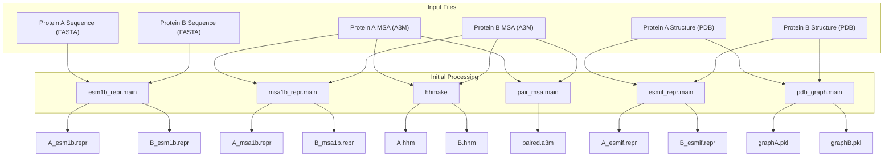

# Input Data Preparation

> **Relevant source files**
> * [LICENSE](https://github.com/ChengfeiYan/PLMGraph-Inter/blob/d1c5ea71/LICENSE)
> * [README.md](https://github.com/ChengfeiYan/PLMGraph-Inter/blob/d1c5ea71/README.md?plain=1)
> * [example/1GL1_A.fasta](https://github.com/ChengfeiYan/PLMGraph-Inter/blob/d1c5ea71/example/1GL1_A.fasta)
> * [example/1GL1_A.pdb](https://github.com/ChengfeiYan/PLMGraph-Inter/blob/d1c5ea71/example/1GL1_A.pdb)
> * [example/1GL1_I.fasta](https://github.com/ChengfeiYan/PLMGraph-Inter/blob/d1c5ea71/example/1GL1_I.fasta)
> * [example/1GL1_I.pdb](https://github.com/ChengfeiYan/PLMGraph-Inter/blob/d1c5ea71/example/1GL1_I.pdb)

This page explains how to prepare the input data required for the PLMGraph-Inter system's prediction pipeline. PLMGraph-Inter requires three types of files for each protein in an interacting pair (six files total) to predict their interface contacts.

For information about how these inputs are processed in the prediction pipeline, see [Prediction Pipeline](/ChengfeiYan/PLMGraph-Inter/4-prediction-pipeline). For detailed information on MSA processing, see [MSA Processing](/ChengfeiYan/PLMGraph-Inter/4.2-msa-processing).

## Required Input Files

PLMGraph-Inter requires the following input files for each protein-protein interaction prediction:

| File Type | Protein A | Protein B | Format | Description |
| --- | --- | --- | --- | --- |
| Sequence | sequenceA.fasta | sequenceB.fasta | FASTA | Amino acid sequence of the protein |
| MSA | msaA.a3m | msaB.a3m | A3M | Multiple sequence alignment derived from Uniref100 database |
| Structure | pdbA.pdb | pdbB.pdb | PDB | 3D structure coordinates of the protein |

These files serve as inputs to the prediction pipeline that extracts various features using protein language models (PLMs) and graph-based methods to predict protein-protein interactions.

### Input Data Flow




Sources: [README.md L28-L42](https://github.com/ChengfeiYan/PLMGraph-Inter/blob/d1c5ea71/README.md?plain=1#L28-L42)

## Sequence Files (FASTA Format)

The FASTA files contain the amino acid sequences of the proteins. They serve as inputs to the ESM-1b protein language model, which extracts sequence-based features.

### FASTA Format Requirements

* Files must be in standard FASTA format
* Each file should contain a single protein sequence
* The header line must start with ">" followed by a sequence identifier
* The sequence should be provided in one or multiple lines below the header

### Example FASTA File

```
>1GL1
CGVPAIQPVLSGLSRIVNGEEAVPGSWPWQVSLQDKTGFHFCGGSLINENWVVTAAHCGVTTSDVVVAGEFDQGSSSEKIQKLKIAKVFKNSKYNSLTINNDITLLKLSTAASFSQTVSAVCLPSASDDFAAGTTCVTTGWGLTRYTNANTPDRLQQASLPLLSNTNCKKYWGTKIKDAMICAGASGVSSCMGDSGGPLVCKKNGAWTLVGIVSWGSSTCSTSTPGVYARVTALVNWVQQTLAAN
```

Sources: [example/1GL1_A.fasta L1-L2](https://github.com/ChengfeiYan/PLMGraph-Inter/blob/d1c5ea71/example/1GL1_A.fasta#L1-L2)

## Multiple Sequence Alignment Files (A3M Format)

Multiple Sequence Alignments (MSAs) capture evolutionary information by showing how protein sequences have varied through evolution. They are used for several purposes in PLMGraph-Inter:

1. ESM-MSA-1b features extraction
2. MSA pairing between proteins A and B
3. Coevolution analysis through CCMpred
4. Position-specific scoring matrix (PSSM) generation

### A3M Format Requirements

* MSAs must be in A3M format
* Should be derived from the Uniref100 database (as specified in the documentation)
* Must contain sufficient sequence diversity for effective feature extraction
* The first sequence in the MSA should match the protein sequence in the FASTA file

### MSA Generation

While PLMGraph-Inter doesn't directly provide tools for MSA generation, you can use standard bioinformatics tools to create them:

1. Search sequences against the Uniref100 database
2. Collect homologous sequences
3. Perform multiple sequence alignment
4. Convert to A3M format

Common tools for MSA generation include:

* HH-suite (hhblits)
* MUSCLE
* Clustal Omega

Sources: [README.md L31-L32](https://github.com/ChengfeiYan/PLMGraph-Inter/blob/d1c5ea71/README.md?plain=1#L31-L32)

 [README.md L38](https://github.com/ChengfeiYan/PLMGraph-Inter/blob/d1c5ea71/README.md?plain=1#L38-L38)

## Protein Structure Files (PDB Format)

The PDB files contain 3D structural information of the proteins. These files are used for:

1. Graph construction using the `pdb_graph.py` module
2. Structure-based feature extraction using ESM-IF1

### PDB Format Requirements

* Files must be in standard PDB format
* Should contain atomic coordinates for all residues in the protein
* Must not have missing residues (see handling missing residues below)
* The sequence in the PDB file should match the FASTA sequence


### Handling Missing Residues

If your PDB structure has missing residues, you need to fill them in before using it with PLMGraph-Inter. As noted in the documentation:

> If you encounter that some residues in the pdb file are missing, you can use [MODELLER](https://salilab.org/modeller/tutorial/iterative.html) to fill in these missing residues.

MODELLER is a software package for homology or comparative modeling of protein structures. The process involves:

1. Identifying missing regions in the PDB file
2. Setting up MODELLER scripts to model the missing regions
3. Running MODELLER to generate a complete structure
4. Validating the modeled structure

Sources: [README.md L38](https://github.com/ChengfeiYan/PLMGraph-Inter/blob/d1c5ea71/README.md?plain=1#L38-L38)

 [example/1GL1_A.pdb L1-L786](https://github.com/ChengfeiYan/PLMGraph-Inter/blob/d1c5ea71/example/1GL1_A.pdb#L1-L786)

 [example/1GL1_I.pdb L1-L262](https://github.com/ChengfeiYan/PLMGraph-Inter/blob/d1c5ea71/example/1GL1_I.pdb#L1-L262)

## Example Files

The PLMGraph-Inter repository includes example files that demonstrate the required formats:

1. Sequence files: * `example/1GL1_A.fasta`: Protein A sequence * `example/1GL1_I.fasta`: Protein B sequence
2. MSA files: * `example/1GL1_A_uniref100.a3m`: Protein A MSA * `example/1GL1_I_uniref100.a3m`: Protein B MSA
3. Structure files: * `example/1GL1_A.pdb`: Protein A structure * `example/1GL1_I.pdb`: Protein B structure

You can use these files as templates when preparing your own data.

### Example Command

Once you have prepared all six required input files, you can run the prediction using:

```
python predict.py sequenceA.fasta msaA.a3m pdbA.pdb sequenceB.fasta msaB.a3m pdbB.pdb result_path device
```

Where `result_path` is the directory for output and `device` is the computing device (e.g., cpu, cuda:0).

Sources: [README.md L28-L42](https://github.com/ChengfeiYan/PLMGraph-Inter/blob/d1c5ea71/README.md?plain=1#L28-L42)

 [README.md L40-L41](https://github.com/ChengfeiYan/PLMGraph-Inter/blob/d1c5ea71/README.md?plain=1#L40-L41)

## File Size and Downsampling Considerations

Note that the repository example includes downsampled MSAs due to file size limitations. As mentioned in the documentation:

> We downsampled the MSAs of the example target due to the file size limitation of github. The real performance of PLMGraph-Inter for the provided example should be better in real practice.

For optimal performance, your MSA files should contain a suitable number of diverse sequences.

Sources: [README.md L47-L49](https://github.com/ChengfeiYan/PLMGraph-Inter/blob/d1c5ea71/README.md?plain=1#L47-L49)