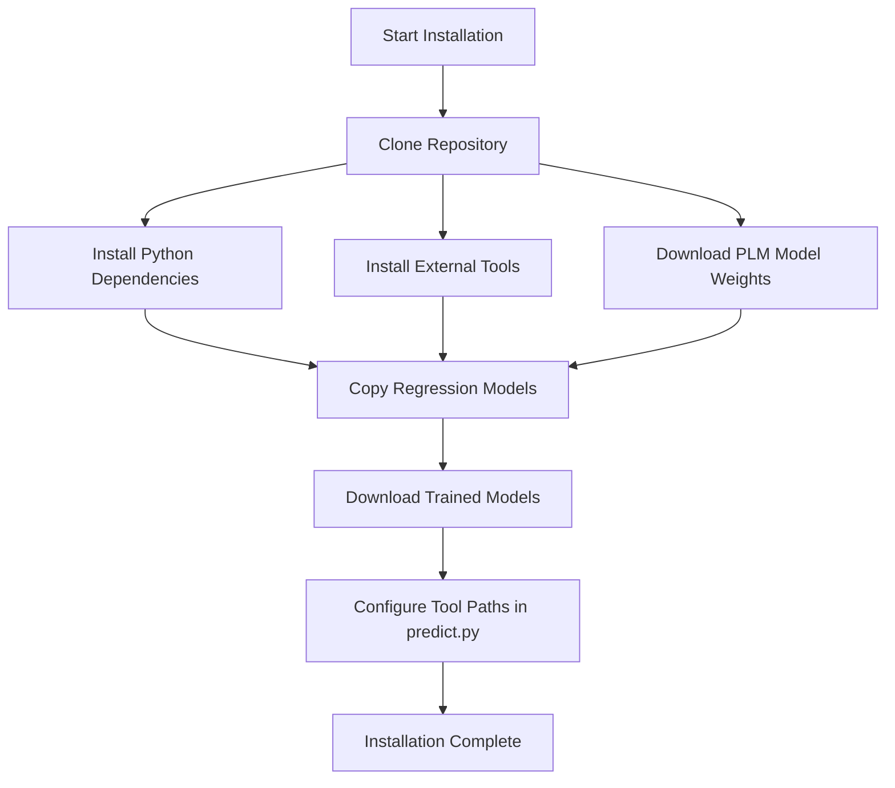

# Installation and Dependencies

> **Relevant source files**
> * [LICENSE](https://github.com/ChengfeiYan/PLMGraph-Inter/blob/d1c5ea71/LICENSE)
> * [README.md](https://github.com/ChengfeiYan/PLMGraph-Inter/blob/d1c5ea71/README.md?plain=1)

This document provides detailed instructions for setting up PLMGraph-Inter and all its required dependencies. It covers system requirements, installation of necessary tools and libraries, and configuration of the environment to run protein-protein interface prediction. For information on how to use the system after installation, see [Usage Examples](/ChengfeiYan/PLMGraph-Inter/7-usage-examples).

## System Requirements

PLMGraph-Inter has the following system requirements:

* Python 3.8
* CUDA-capable GPU (recommended for production use, though CPU is supported)
* Sufficient disk space for model weights (approximately 5GB)

## Dependencies Overview

PLMGraph-Inter requires both Python packages and external tools to function properly.


Sources: [README.md L4-L18](https://github.com/ChengfeiYan/PLMGraph-Inter/blob/d1c5ea71/README.md?plain=1#L4-L18)

### Python Packages

The following Python packages are required:

| Package | Version | Purpose |
| --- | --- | --- |
| PyTorch | 1.9 | Deep learning framework |
| Biopython | Latest | Biological data processing |
| ESM | Latest | Protein language models |
| NumPy | Latest | Numerical computing |
| GVP | Latest | Geometric Vector Perceptrons |
| PyG | Latest | Graph neural networks |

You can install most Python dependencies using pip:

```
pip install torch==1.9.0 biopython numpy
pip install torch-geometric
pip install git+https://github.com/drorlab/gvp-pytorch.git
pip install git+https://github.com/facebookresearch/esm.git
```

Sources: [README.md L5-L12](https://github.com/ChengfeiYan/PLMGraph-Inter/blob/d1c5ea71/README.md?plain=1#L5-L12)

### External Tools

Several command-line tools must be installed separately:

1. **alnstats**: Statistical analysis of multiple sequence alignments * Download from: [https://github.com/psipred/metapsicov/tree/master/src/alnstats](https://github.com/psipred/metapsicov/tree/master/src/alnstats) * Make executable: `chmod +x alnstats`
2. **fasta2aln**: Converts FASTA format to alignment format * Download from: [https://github.com/kad-ecoli/hhsuite2/blob/master/bin/fasta2aln](https://github.com/kad-ecoli/hhsuite2/blob/master/bin/fasta2aln) * Make executable: `chmod +x fasta2aln`
3. **HH-Suite**: Tools for protein sequence analysis * Install from: [https://github.com/soedinglab/hh-suite](https://github.com/soedinglab/hh-suite) * Required executables: `hhmake`, `hhfilter`
4. **CCMpred**: Contact prediction from multiple sequence alignments * Install from: [https://github.com/soedinglab/CCMpred](https://github.com/soedinglab/CCMpred)

Sources: [README.md L14-L18](https://github.com/ChengfeiYan/PLMGraph-Inter/blob/d1c5ea71/README.md?plain=1#L14-L18)

### Downloadable Model Weights

PLMGraph-Inter requires several pre-trained model weights:

1. **Protein Language Model Weights**: * ESM-1b model weights * ESM-MSA-1b model weights * ESM-IF1 model weights These can be downloaded from the "Available Models and Datasets" table on the [ESM GitHub repository](https://github.com/ChengfeiYan/PLMGraph-Inter/blob/d1c5ea71/ESM GitHub repository)
2. **Contact Regression Parameter Files**: * `esm1b_t33_650M_UR50S-contact-regression.pt` * `esm_msa1b_t12_100M_UR50S-contact-regression.pt` These files are provided in the PLMGraph-Inter repository under the `data/regression/` directory.
3. **Trained PLMGraph-Inter Models**: * Download from: [https://drive.google.com/file/d/1Y9eSlIJr-XDG5gREIEeGK4BW_Of0F_UQ/view?usp=sharing](https://drive.google.com/file/d/1Y9eSlIJr-XDG5gREIEeGK4BW_Of0F_UQ/view?usp=sharing)

Sources: [README.md L12-L13](https://github.com/ChengfeiYan/PLMGraph-Inter/blob/d1c5ea71/README.md?plain=1#L12-L13)

 [README.md L24-L26](https://github.com/ChengfeiYan/PLMGraph-Inter/blob/d1c5ea71/README.md?plain=1#L24-L26)

## Installation Process



Follow these steps to install PLMGraph-Inter:

### 1. Clone the Repository

```
git clone https://github.com/ChengfeiYan/PLMGraph-Inter.git
cd PLMGraph-Inter
```

### 2. Install Python Dependencies

Install the required Python packages as listed in the Python Packages section above.

### 3. Install External Tools

Install all the external tools (alnstats, fasta2aln, HH-Suite, and CCMpred) following their respective installation instructions.

### 4. Download Protein Language Model Weights

Download the model weights for:

* ESM-1b
* ESM-MSA-1b
* ESM-IF1

from the ESM GitHub repository.

### 5. Copy Contact Regression Models

Copy the regression model files to the appropriate locations:

```markdown
# Copy ESM-1b regression model
cp data/regression/esm1b_t33_650M_UR50S-contact-regression.pt /path/to/ESM-1b/weights/directory/

# Copy ESM-MSA-1b regression model
cp data/regression/esm_msa1b_t12_100M_UR50S-contact-regression.pt /path/to/ESM-MSA-1b/weights/directory/
```

### 6. Download Trained Models

Download the pre-trained PLMGraph-Inter models from the provided Google Drive link and extract them:

```markdown
# After downloading the zip file
unzip trained_models.zip -d model/
```

### 7. Configure Paths

Modify the paths in `predict.py` to point to your installed tools and model weights:

* Update tool paths around [predict.py L25](https://github.com/ChengfeiYan/PLMGraph-Inter/blob/d1c5ea71/predict.py#L25-L25)
* Update model weight paths around [predict.py L33-L34](https://github.com/ChengfeiYan/PLMGraph-Inter/blob/d1c5ea71/predict.py#L33-L34)

Sources: [README.md L20-L26](https://github.com/ChengfeiYan/PLMGraph-Inter/blob/d1c5ea71/README.md?plain=1#L20-L26)

## Directory Structure

After installation, your system should have the following structure:


Sources: [README.md L22-L26](https://github.com/ChengfeiYan/PLMGraph-Inter/blob/d1c5ea71/README.md?plain=1#L22-L26)

## Verification

To verify your installation, you can run the provided example:

```
python predict.py ./example/1GL1_A.fasta ./example/1GL1_A_uniref100.a3m ./example/1GL1_A.pdb ./example/1GL1_I.fasta ./example/1GL1_I_uniref100.a3m ./example/1GL1_I.pdb ./example/result cpu
```

If the script runs successfully and generates prediction outputs in the `./example/result` directory, your installation is working correctly.

Sources: [README.md L41-L42](https://github.com/ChengfeiYan/PLMGraph-Inter/blob/d1c5ea71/README.md?plain=1#L41-L42)

## Troubleshooting

Here are some common issues that might arise during installation:

1. **Missing dependencies**: Ensure all Python packages and external tools are properly installed.
2. **Path configuration errors**: Double-check all paths in `predict.py` to make sure they point to the correct locations of your installed tools and model weights.
3. **Permission issues with external tools**: Make sure executable files like `alnstats` and `fasta2aln` have execution permissions (`chmod +x filename`).
4. **CUDA-related errors**: If using a GPU, ensure your PyTorch installation matches your CUDA version.

If you encounter any issues not covered here, please contact the authors at the email provided in the README: [chengfeiyan@hust.edu.cn](mailto:chengfeiyan@hust.edu.cn).

Sources: [README.md L62](https://github.com/ChengfeiYan/PLMGraph-Inter/blob/d1c5ea71/README.md?plain=1#L62-L62)