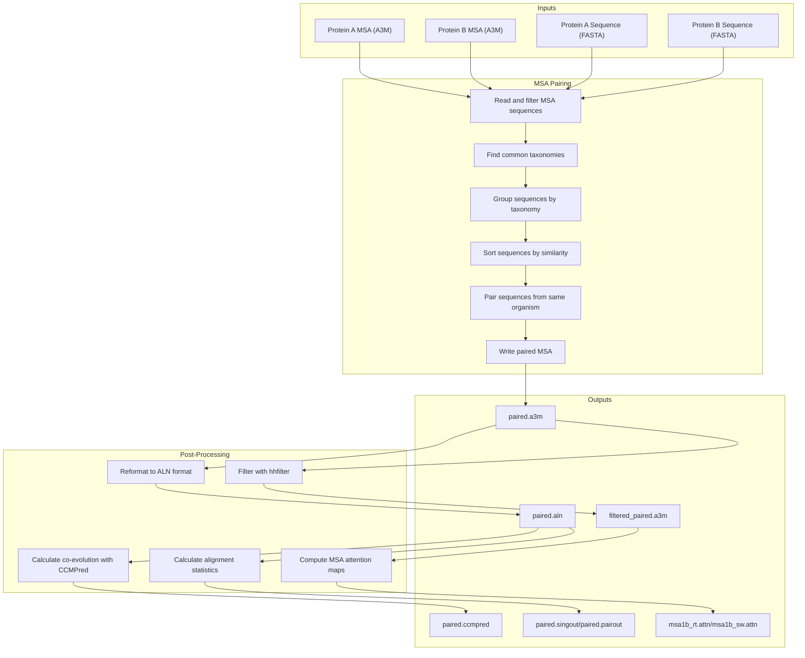
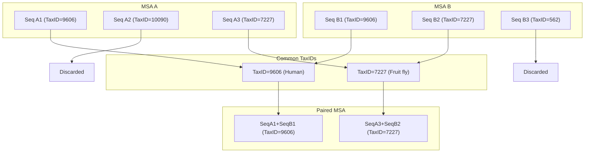
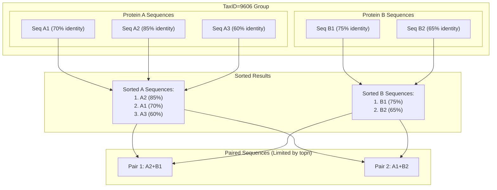
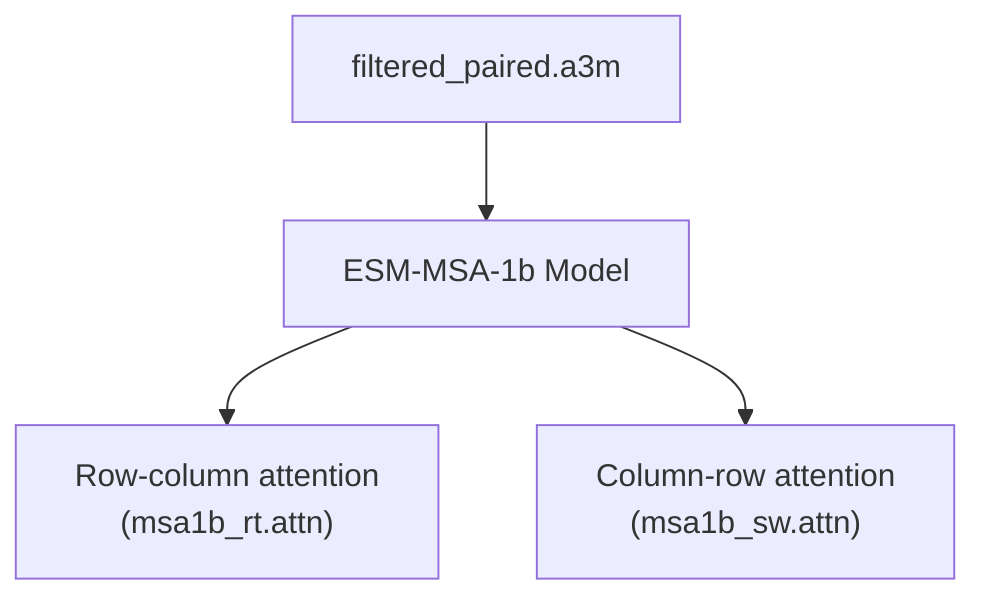
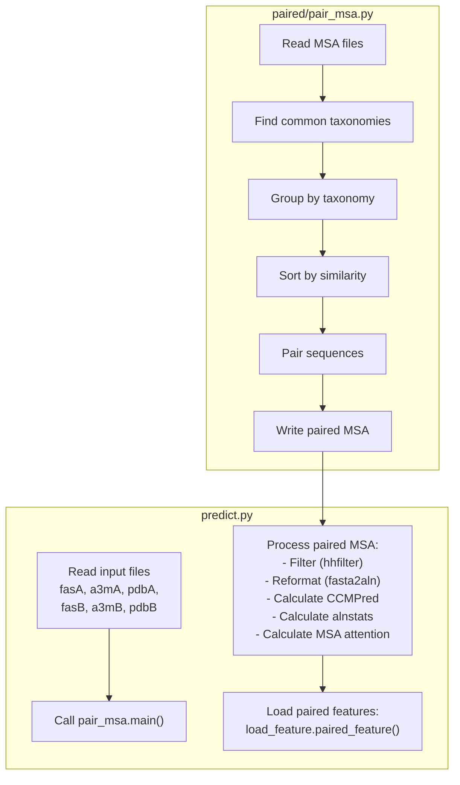

# MSA Processing

> **Relevant source files**
> * [paired/cluster_species.py](https://github.com/ChengfeiYan/PLMGraph-Inter/blob/d1c5ea71/paired/cluster_species.py)
> * [paired/pair_msa.py](https://github.com/ChengfeiYan/PLMGraph-Inter/blob/d1c5ea71/paired/pair_msa.py)
> * [paired/rw_a2m.py](https://github.com/ChengfeiYan/PLMGraph-Inter/blob/d1c5ea71/paired/rw_a2m.py)
> * [predict.py](https://github.com/ChengfeiYan/PLMGraph-Inter/blob/d1c5ea71/predict.py)

## Purpose and Scope

This document describes the Multiple Sequence Alignment (MSA) processing workflow in PLMGraph-Inter. This critical step pairs and processes MSAs for two interacting proteins to extract evolutionary information that informs protein-protein interaction (PPI) contact prediction. For information on how features are extracted from these processed MSAs, see [Feature Extraction](/ChengfeiYan/PLMGraph-Inter/4.3-feature-extraction).

## MSA Processing Overview

MSA processing in PLMGraph-Inter follows a systematic pipeline that transforms individual protein MSAs into paired evolutionary features. This process ensures that evolutionary relationships between potentially interacting proteins from the same organisms are captured.



Sources: [predict.py L50-L102](https://github.com/ChengfeiYan/PLMGraph-Inter/blob/d1c5ea71/predict.py#L50-L102)

 [paired/pair_msa.py L35-L84](https://github.com/ChengfeiYan/PLMGraph-Inter/blob/d1c5ea71/paired/pair_msa.py#L35-L84)

## MSA Pairing Process

The MSA pairing process combines sequences from the same organism found in both protein MSAs to create evolutionarily linked sequence pairs. This is based on the assumption that proteins from the same organism are more likely to interact with each other.

### Taxonomy-Based Pairing

MSA pairing relies on taxonomic identifiers to match sequences from the same organism:



Sources: [paired/pair_msa.py L58-L64](https://github.com/ChengfeiYan/PLMGraph-Inter/blob/d1c5ea71/paired/pair_msa.py#L58-L64)

 [paired/cluster_species.py L13-L59](https://github.com/ChengfeiYan/PLMGraph-Inter/blob/d1c5ea71/paired/cluster_species.py#L13-L59)

The pairing workflow follows these steps:

1. **Read and parse MSAs**: MSAs are read from A3M files and filtered to remove sequences with excessive gaps.
2. **Find common taxonomies**: The system identifies taxonomic IDs present in both MSAs.
3. **Group sequences by taxonomy**: Sequences are grouped by their taxonomy ID.
4. **Sort by similarity**: Within each taxonomic group, sequences are sorted by similarity to the reference sequence.
5. **Pair sequences**: Sequences from the same organism are paired to form concatenated sequences.

### Sequence Similarity Sorting

For organisms with multiple sequences in the MSA, sequences are ranked by similarity to the reference sequence:



Sources: [paired/cluster_species.py L77-L109](https://github.com/ChengfeiYan/PLMGraph-Inter/blob/d1c5ea71/paired/cluster_species.py#L77-L109)

 [paired/pair_msa.py L15-L32](https://github.com/ChengfeiYan/PLMGraph-Inter/blob/d1c5ea71/paired/pair_msa.py#L15-L32)

The sorting is performed by calculating the similarity (identity) between each sequence and the reference sequence, then sorting in descending order to prioritize more similar sequences.

## Post-Pairing Processing

After the initial pairing of MSAs, several post-processing steps extract additional evolutionary information:

### 1. Filtering with hhfilter

The paired MSA is filtered using `hhfilter` to reduce redundancy and complexity. This limits the maximum sequence identity between any pair of sequences to 256 bits of diversity:

```
hhfilter -i paired.a3m -o filtered_paired.a3m -diff 256
```

Sources: [predict.py L64-L73](https://github.com/ChengfeiYan/PLMGraph-Inter/blob/d1c5ea71/predict.py#L64-L73)

### 2. Reformatting to ALN Format

The paired MSA is converted from A3M to ALN format using `fasta2aln` for compatibility with downstream tools:

```
fasta2aln paired.a3m paired.aln
```

Sources: [predict.py L67-L68](https://github.com/ChengfeiYan/PLMGraph-Inter/blob/d1c5ea71/predict.py#L67-L68)

### 3. Computing Co-evolution and Statistics

Two key analyses are performed on the paired alignment:

1. **CCMPred**: Calculates direct evolutionary couplings from the MSA, identifying residue pairs that co-evolve: ``` ccmpred -R paired.aln paired.ccmpred ```
2. **alnstats**: Computes alignment statistics, including both single-column (position-specific) and pair-column (correlated positions) statistics: ``` alnstats paired.aln paired.singout paired.pairout ```

Sources: [predict.py L89-L95](https://github.com/ChengfeiYan/PLMGraph-Inter/blob/d1c5ea71/predict.py#L89-L95)

### 4. Computing Attention Maps

The filtered paired MSA is processed through ESM-MSA-1b to extract row-wise and column-wise attention maps:



Sources: [predict.py L99-L103](https://github.com/ChengfeiYan/PLMGraph-Inter/blob/d1c5ea71/predict.py#L99-L103)

 [plm/msa1b_attn.py](https://github.com/ChengfeiYan/PLMGraph-Inter/blob/d1c5ea71/plm/msa1b_attn.py)

## Integration with Prediction Pipeline

The processed MSA files serve as inputs for the feature extraction phase of the prediction pipeline:

### MSA Feature Files and Their Roles

| File | Description | Role in Prediction |
| --- | --- | --- |
| paired.a3m | Paired MSA sequences | Basic evolutionary information |
| filtered_paired.a3m | Filtered paired MSA | Input for attention calculations |
| paired.aln | Reformatted alignment | Input for co-evolution analysis |
| paired.ccmpred | Co-evolution scores | Direct coupling information |
| paired.singout | Single-column statistics | Position-specific conservation |
| paired.pairout | Column-pair statistics | Correlated positions |
| msa1b_rt.attn | Row-to-column attention | Positional relationship scores |
| msa1b_sw.attn | Column-to-row attention | Reversed positional relationship scores |

Sources: [predict.py L158-L172](https://github.com/ChengfeiYan/PLMGraph-Inter/blob/d1c5ea71/predict.py#L158-L172)

 [load_feature.py](https://github.com/ChengfeiYan/PLMGraph-Inter/blob/d1c5ea71/load_feature.py)

All these features are loaded by the `paired_feature` function in `load_feature.py` and combined into a comprehensive representation of the potential inter-protein contacts, which is then fed into the neural network model for prediction.

## Code Integration

The MSA processing workflow is primarily orchestrated in the prediction script:



Sources: [predict.py L50-L103](https://github.com/ChengfeiYan/PLMGraph-Inter/blob/d1c5ea71/predict.py#L50-L103)

 [predict.py L158-L172](https://github.com/ChengfeiYan/PLMGraph-Inter/blob/d1c5ea71/predict.py#L158-L172)

 [paired/pair_msa.py L35-L84](https://github.com/ChengfeiYan/PLMGraph-Inter/blob/d1c5ea71/paired/pair_msa.py#L35-L84)