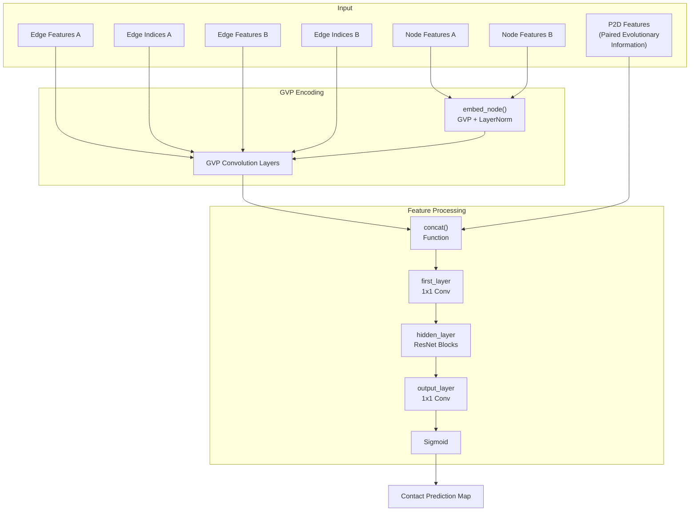
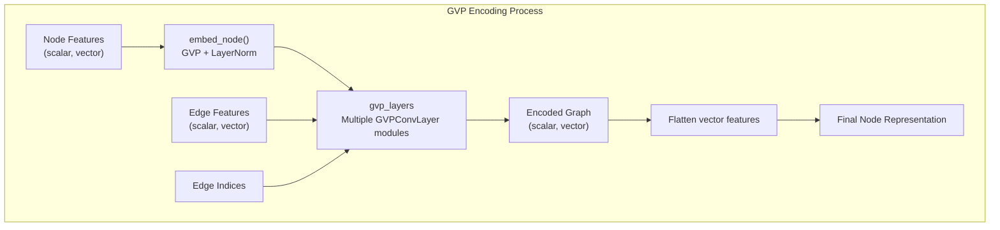
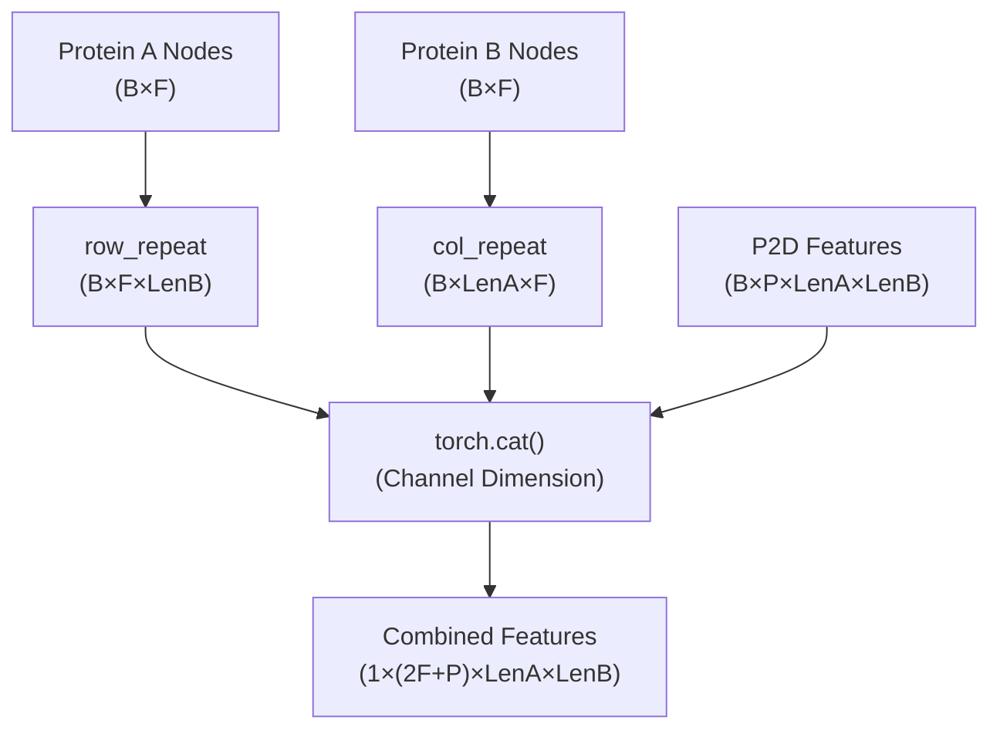
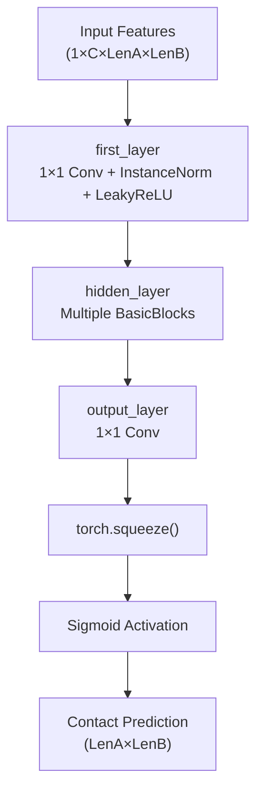
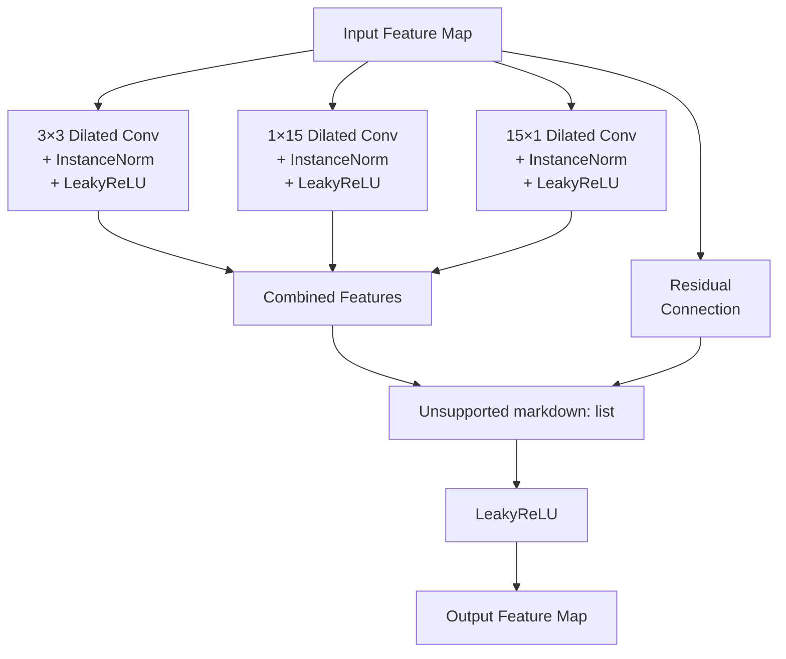

# Model Architecture

> **Relevant source files**
> * [data/plmg.jpg](https://github.com/ChengfeiYan/PLMGraph-Inter/blob/d1c5ea71/data/plmg.jpg)
> * [data/regression/esm1b_t33_650M_UR50S-contact-regression.pt](https://github.com/ChengfeiYan/PLMGraph-Inter/blob/d1c5ea71/data/regression/esm1b_t33_650M_UR50S-contact-regression.pt)
> * [data/regression/esm_msa1b_t12_100M_UR50S-contact-regression.pt](https://github.com/ChengfeiYan/PLMGraph-Inter/blob/d1c5ea71/data/regression/esm_msa1b_t12_100M_UR50S-contact-regression.pt)
> * [model.py](https://github.com/ChengfeiYan/PLMGraph-Inter/blob/d1c5ea71/model.py)

This page documents the neural network architecture used in PLMGraph-Inter for protein-protein interaction (PPI) contact prediction. The system employs a hybrid model that combines Graph Vector Perceptron (GVP) networks for encoding protein structure with a ResNet-based convolutional neural network for predicting inter-protein contacts.

For information about the prediction pipeline that uses this model, see [Prediction Pipeline](/ChengfeiYan/PLMGraph-Inter/4-prediction-pipeline).

## Overview of the Architecture

The PLMGraph-Inter model architecture combines graph neural networks with 2D convolutional networks to process protein structures and predict protein-protein interfaces. The model can be conceptually divided into three main components:

1. **GVP-based Graph Encoder**: Processes the structural and feature information of each protein using Graph Vector Perceptron layers
2. **Feature Concatenation**: Combines the encoded protein features with paired evolutionary information
3. **ResNet Convolutional Network**: Processes the combined features to predict inter-protein contacts



Sources: [model.py L155-L254](https://github.com/ChengfeiYan/PLMGraph-Inter/blob/d1c5ea71/model.py#L155-L254)

 [model.py L225-L254](https://github.com/ChengfeiYan/PLMGraph-Inter/blob/d1c5ea71/model.py#L225-L254)

## Model Components in Detail

### 1. Input Features

The model processes three types of input:

1. **Node Features**: Per-residue features for both proteins (A and B)
2. **Edge Features**: Edge information within each protein's structure
3. **P2D Features**: Paired evolutionary information between the two proteins

Node features have dimensions of (2586, 50), where 2586 is the scalar feature dimension and 50 is the vector feature dimension. Similarly, edge features have dimensions of (432, 25).

Sources: [model.py L160-L164](https://github.com/ChengfeiYan/PLMGraph-Inter/blob/d1c5ea71/model.py#L160-L164)

### 2. GVP Encoding Module

The Graph Vector Perceptron (GVP) module processes the protein structure as a graph, where nodes represent amino acid residues and edges represent connections between residues in 3D space.



The GVP encoding consists of:

1. **Node Embedding**: Initial transformation of node features through a GVP layer followed by LayerNorm ``` self.embed_node = nn.Sequential(     gvp.GVP(node_input_dim, node_hidden_dim, activations=(None, None), vector_gate=True),     gvp.LayerNorm(node_hidden_dim)) ```
2. **GVP Convolution Layers**: Multiple layers that process the graph structure ``` self.gvp_layers = self._make_gvpconv_layer(node_hidden_dim, edge_hidden_dim, gvp_num) ```
3. **Node Feature Extraction**: After processing, the scalar and vector features are combined

Sources: [model.py L192-L195](https://github.com/ChengfeiYan/PLMGraph-Inter/blob/d1c5ea71/model.py#L192-L195)

 [model.py L213-L222](https://github.com/ChengfeiYan/PLMGraph-Inter/blob/d1c5ea71/model.py#L213-L222)

 [model.py L229-L241](https://github.com/ChengfeiYan/PLMGraph-Inter/blob/d1c5ea71/model.py#L229-L241)

### 3. Feature Concatenation

After both proteins are processed through the GVP encoder, their features are concatenated with the paired evolutionary information (P2D) using the `concat` function. This function creates a 2D representation suitable for the subsequent convolutional layers.



Where:

* B: Batch size
* F: Feature dimension
* LenA/LenB: Sequence length of proteins A and B
* P: Number of P2D feature channels

The concatenation process creates a tensor where each "pixel" at position (i,j) contains features related to the interaction between residue i from protein A and residue j from protein B.

Sources: [model.py L14-L26](https://github.com/ChengfeiYan/PLMGraph-Inter/blob/d1c5ea71/model.py#L14-L26)

 [model.py L242](https://github.com/ChengfeiYan/PLMGraph-Inter/blob/d1c5ea71/model.py#L242-L242)

### 4. ResNet Convolutional Network

The concatenated features are processed through a ResNet-like convolutional neural network consisting of:

1. **First Layer**: A 1×1 convolutional layer that maps the input channels to a fixed number of channels (96)
2. **Hidden Layers**: Multiple BasicBlocks that perform the main feature processing
3. **Output Layer**: A final 1×1 convolutional layer that maps to a single output channel
4. **Sigmoid Activation**: Converts the output to probability values between 0 and 1



Sources: [model.py L170-L187](https://github.com/ChengfeiYan/PLMGraph-Inter/blob/d1c5ea71/model.py#L170-L187)

 [model.py L244-L252](https://github.com/ChengfeiYan/PLMGraph-Inter/blob/d1c5ea71/model.py#L244-L252)

### 5. BasicBlock Structure

The core component of the ResNet architecture is the BasicBlock, which uses different types of convolutional operations and residual connections:



The BasicBlock includes:

1. **Standard 3×3 Convolution**: A dilated convolution with kernel size 3×3
2. **Specialized Convolutions**: For certain dilation rates, additional 1×15 and 15×1 convolutions are used * These capture long-range dependencies in both dimensions
3. **Residual Connection**: The input is added to the processed features
4. **Non-linearity**: LeakyReLU activation is applied to the final output

The threshold dilation rates that trigger the specialized convolutions are [1, 20, 40].

Sources: [model.py L79-L152](https://github.com/ChengfeiYan/PLMGraph-Inter/blob/d1c5ea71/model.py#L79-L152)

 [model.py L86-L92](https://github.com/ChengfeiYan/PLMGraph-Inter/blob/d1c5ea71/model.py#L86-L92)

## Model Configuration and Instantiation

The model used in PLMGraph-Inter is instantiated as ResNet18, which consists of:

* 9 BasicBlocks in the hidden layer
* 3 GVP convolution layers
* 96 channels in the hidden layers
* Input dimensions: * Node features: (2586, 50) scalar and vector * Edge features: (432, 25) scalar and vector

```python
def resnet18():    return ResNet(9, 3)
```

Sources: [model.py L258-L259](https://github.com/ChengfeiYan/PLMGraph-Inter/blob/d1c5ea71/model.py#L258-L259)

## Forward Pass

The forward pass through the model follows these steps:

1. **Node Embedding**: * Apply GVP embedding to node features of both proteins
2. **Graph Convolution**: * Process embedded nodes through GVP convolution layers * This incorporates structural information from the graph edges
3. **Feature Concatenation**: * Combine the processed node features with paired evolutionary features
4. **Convolutional Processing**: * Apply first layer (1×1 convolution) * Process through multiple BasicBlocks * Apply output layer (1×1 convolution)
5. **Output Processing**: * Squeeze the output tensor * Apply sigmoid activation * Return the final contact prediction map

Sources: [model.py L225-L254](https://github.com/ChengfeiYan/PLMGraph-Inter/blob/d1c5ea71/model.py#L225-L254)

## Connection to Prediction Pipeline

The model architecture described here is utilized in the prediction pipeline (see [Prediction Pipeline](/ChengfeiYan/PLMGraph-Inter/4-prediction-pipeline)) where it takes the following inputs:

1. **Protein Structure Graphs**: Constructed from PDB structures
2. **Node Features**: Including ESM-1b, ESM-MSA-1b, ESM-IF1 representations, and position-specific scoring matrices
3. **Paired Evolutionary Features**: Including co-evolution scores and MSA statistics

The output is a contact probability map between the two proteins, which can be used to predict the interface between them.