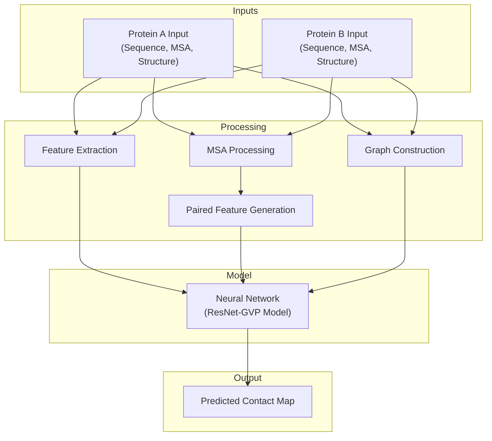
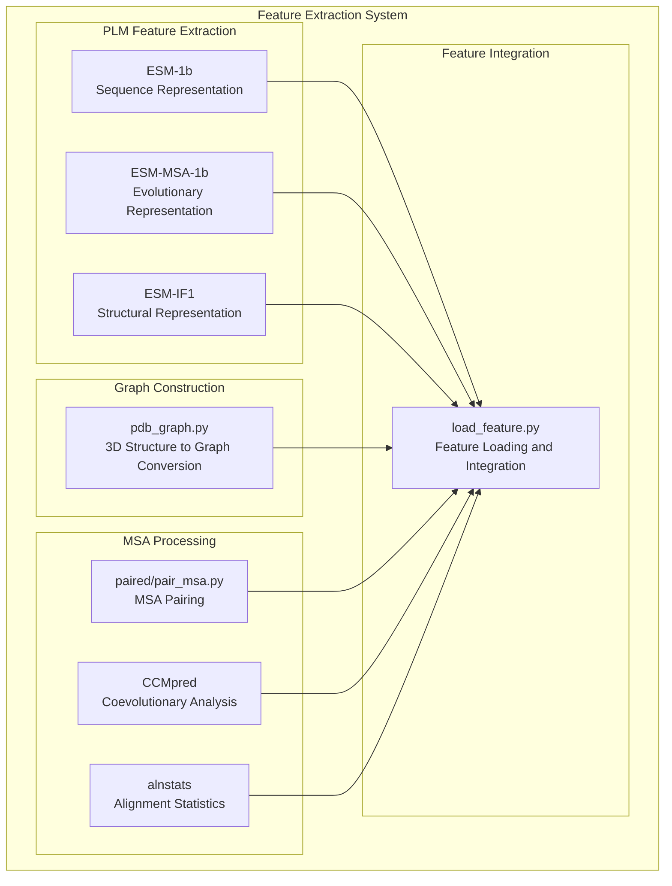
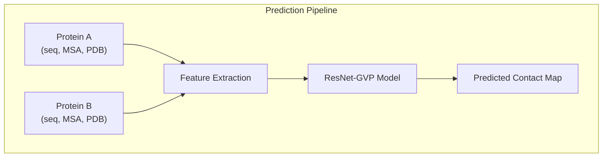

# Overview

> **Relevant source files**
> * [LICENSE](https://github.com/ChengfeiYan/PLMGraph-Inter/blob/d1c5ea71/LICENSE)
> * [README.md](https://github.com/ChengfeiYan/PLMGraph-Inter/blob/d1c5ea71/README.md?plain=1)

## Purpose and Scope

PLMGraph-Inter is a computational system for predicting inter-protein contact maps from the structures of interacting proteins. It integrates protein language models (PLMs) with geometric graph neural networks to achieve accurate predictions of residue-residue contacts between protein pairs. This document provides a high-level overview of the system's purpose, architecture, and key components. For installation instructions, see [Installation and Dependencies](/ChengfeiYan/PLMGraph-Inter/3-installation-and-dependencies), and for usage details, see [Prediction Pipeline](/ChengfeiYan/PLMGraph-Inter/4-prediction-pipeline).

## System Description

PLMGraph-Inter combines the power of protein language models (ESM-1b, ESM-MSA-1b, ESM-IF1) with geometric graph neural networks to predict inter-protein contacts. The system takes as input the sequences, multiple sequence alignments (MSAs), and 3D structures of two interacting proteins and outputs a predicted contact map indicating the likelihood of residue-residue interactions between them.



Sources: [README.md L1-L3](https://github.com/ChengfeiYan/PLMGraph-Inter/blob/d1c5ea71/README.md?plain=1#L1-L3)

 [README.md L28-L38](https://github.com/ChengfeiYan/PLMGraph-Inter/blob/d1c5ea71/README.md?plain=1#L28-L38)

## Key Components

PLMGraph-Inter consists of several interconnected components that work together to predict protein-protein interactions:

### Feature Extraction Components

1. **Protein Language Models** * **ESM-1b**: Single-sequence transformer model for residue-level embeddings * **ESM-MSA-1b**: MSA transformer model for evolutionary information * **ESM-IF1**: Structure-based model for 3D information
2. **Graph Construction** * Converts 3D protein structures into geometric graphs * Captures spatial relationships between residues
3. **MSA Processing** * Pairs and processes MSAs from interacting proteins * Generates coevolutionary features



Sources: [README.md L4-L19](https://github.com/ChengfeiYan/PLMGraph-Inter/blob/d1c5ea71/README.md?plain=1#L4-L19)

 [predict.py](https://github.com/ChengfeiYan/PLMGraph-Inter/blob/d1c5ea71/predict.py)

### Core Prediction System

The core prediction system integrates all extracted features and processes them through a neural network model:

1. **Model Architecture** * **GVP (Geometric Vector Perceptron)**: Processes 3D structural information * **ResNet-18**: Processes the contact map with dilated convolutions
2. **Prediction Pipeline** * Takes protein inputs and processes them through feature extraction * Feeds features into the neural network model * Outputs a contact probability map



Sources: [README.md L28-L38](https://github.com/ChengfeiYan/PLMGraph-Inter/blob/d1c5ea71/README.md?plain=1#L28-L38)

 [predict.py](https://github.com/ChengfeiYan/PLMGraph-Inter/blob/d1c5ea71/predict.py)

## System Requirements

PLMGraph-Inter requires the following software and dependencies:

| Component | Details |
| --- | --- |
| **Python** | Python 3.8 |
| **Core Libraries** | PyTorch 1.9, Biopython, ESM, NumPy, GVP, PyG |
| **External Tools** | alnstats, fasta2aln, hh-suite, CCMpred |
| **Model Weights** | ESM-1b, ESM-MSA-1b, ESM-IF1 weights |
| **Regression Files** | esm1b_t33_650M_UR50S-contact-regression.pt, esm_msa1b_t12_100M_UR50S-contact-regression.pt |

Sources: [README.md L4-L19](https://github.com/ChengfeiYan/PLMGraph-Inter/blob/d1c5ea71/README.md?plain=1#L4-L19)

## Basic Usage

The system is used through a command-line interface:

```
python predict.py sequenceA msaA pdbA sequenceB msaB pdbB result_path device
```

Where:

* `sequenceA/B`: FASTA files for proteins A and B
* `msaA/B`: Multiple sequence alignment files (A3M format)
* `pdbA/B`: 3D structure files in PDB format
* `result_path`: Directory for output files
* `device`: Computing device (CPU or GPU)

Example:

```
python predict.py ./example/1GL1_A.fasta ./example/1GL1_A_uniref100.a3m ./example/1GL1_A.pdb ./example/1GL1_I.fasta ./example/1GL1_I_uniref100.a3m ./example/1GL1_I.pdb ./example/result cpu
```

Sources: [README.md L28-L41](https://github.com/ChengfeiYan/PLMGraph-Inter/blob/d1c5ea71/README.md?plain=1#L28-L41)

## Reference and License

PLMGraph-Inter is published in:

* Yunda Si, Chengfei Yan. Protein language model-embedded geometric graphs power inter-protein contact prediction, eLife 12:RP92184, 2024.

The software is available under the MIT License.

Sources: [README.md L59-L62](https://github.com/ChengfeiYan/PLMGraph-Inter/blob/d1c5ea71/README.md?plain=1#L59-L62)

 [LICENSE L1-L21](https://github.com/ChengfeiYan/PLMGraph-Inter/blob/d1c5ea71/LICENSE#L1-L21)