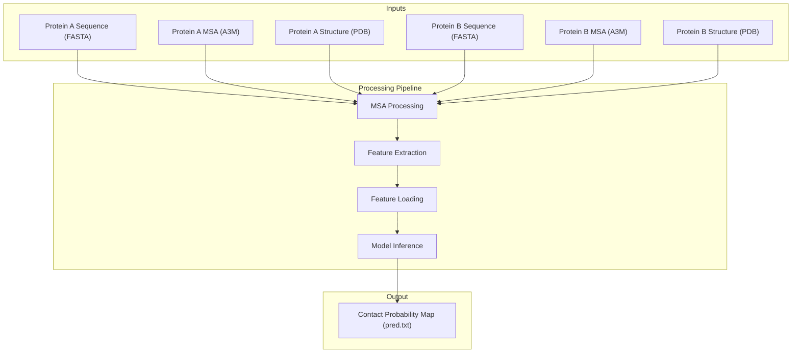
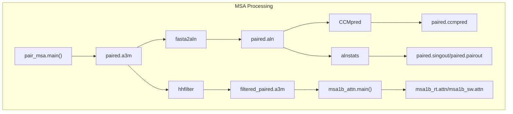
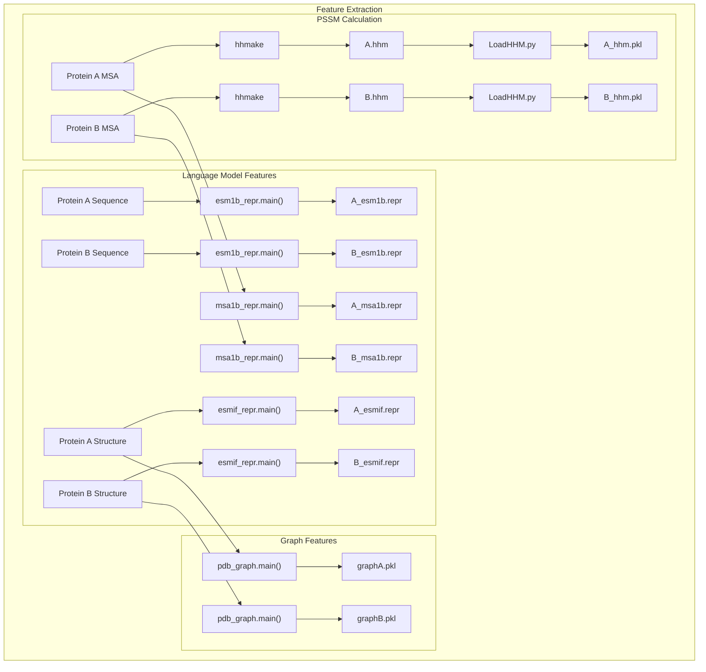
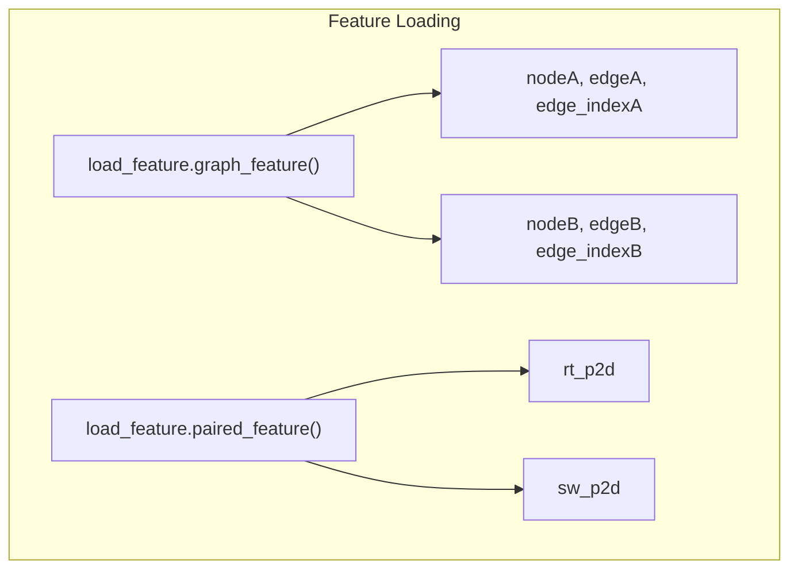
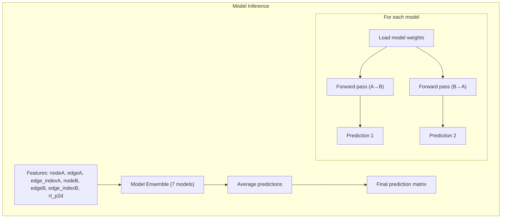

# Prediction Pipeline

> **Relevant source files**
> * [LICENSE](https://github.com/ChengfeiYan/PLMGraph-Inter/blob/d1c5ea71/LICENSE)
> * [README.md](https://github.com/ChengfeiYan/PLMGraph-Inter/blob/d1c5ea71/README.md?plain=1)
> * [predict.py](https://github.com/ChengfeiYan/PLMGraph-Inter/blob/d1c5ea71/predict.py)

## Purpose and Scope

The Prediction Pipeline is the core process of PLMGraph-Inter that generates inter-protein contact predictions from protein structures and sequences. This page describes the end-to-end pipeline, including input requirements, feature extraction steps, model inference, and output generation. For information about the underlying model architecture, see [Model Architecture](/ChengfeiYan/PLMGraph-Inter/5-model-architecture).

## Pipeline Overview

The prediction pipeline transforms protein sequences, multiple sequence alignments (MSAs), and structures into contact probability maps between two proteins. It processes inputs through several stages: MSA processing, feature extraction, feature loading, and model inference.



Sources: [predict.py L38-L201](https://github.com/ChengfeiYan/PLMGraph-Inter/blob/d1c5ea71/predict.py#L38-L201)

## Input Requirements

The pipeline requires six input files for a prediction:

1. **Protein A sequence file** (FASTA format)
2. **Protein A MSA file** (A3M format) - derived from UniRef100 database
3. **Protein A structure file** (PDB format)
4. **Protein B sequence file** (FASTA format)
5. **Protein B MSA file** (A3M format) - derived from UniRef100 database
6. **Protein B structure file** (PDB format)

The pipeline is invoked with:

```
python predict.py sequenceA msaA pdbA sequenceB msaB pdbB result_path device
```

Where:

* `result_path` is the output directory
* `device` specifies computation device (e.g., "cpu", "cuda:0")

Sources: [predict.py L40](https://github.com/ChengfeiYan/PLMGraph-Inter/blob/d1c5ea71/predict.py#L40-L40)

 [README.md L28-L37](https://github.com/ChengfeiYan/PLMGraph-Inter/blob/d1c5ea71/README.md?plain=1#L28-L37)

## Pipeline Components

### 1. MSA Processing

The MSA processing step combines and analyzes multiple sequence alignments from both proteins to capture evolutionary couplings between them.



Key steps:

1. **MSA Pairing**: Combines MSAs from both proteins using `pair_msa.main()` [predict.py L59](https://github.com/ChengfeiYan/PLMGraph-Inter/blob/d1c5ea71/predict.py#L59-L59)
2. **MSA Filtering**: Filters the paired MSA with `hhfilter` to remove redundancy [predict.py L65](https://github.com/ChengfeiYan/PLMGraph-Inter/blob/d1c5ea71/predict.py#L65-L65)
3. **MSA Reformatting**: Converts A3M to ALN format with `fasta2aln` [predict.py L68](https://github.com/ChengfeiYan/PLMGraph-Inter/blob/d1c5ea71/predict.py#L68-L68)
4. **Co-evolution Analysis**: Computes residue coupling scores with `CCMpred` [predict.py L90](https://github.com/ChengfeiYan/PLMGraph-Inter/blob/d1c5ea71/predict.py#L90-L90)
5. **Alignment Statistics**: Generates alignment statistics with `alnstats` [predict.py L95](https://github.com/ChengfeiYan/PLMGraph-Inter/blob/d1c5ea71/predict.py#L95-L95)
6. **Attention Calculation**: Computes MSA-based attention features with `msa1b_attn.main()` [predict.py L102](https://github.com/ChengfeiYan/PLMGraph-Inter/blob/d1c5ea71/predict.py#L102-L102)

Sources: [predict.py L50-L103](https://github.com/ChengfeiYan/PLMGraph-Inter/blob/d1c5ea71/predict.py#L50-L103)

### 2. Feature Extraction

This stage extracts various features from each protein structure and sequence independently, as well as from their evolutionary information.



Feature extraction includes:

1. **PSSM Features**: * Calculates position-specific scoring matrices with `hhmake` [predict.py L115-L118](https://github.com/ChengfeiYan/PLMGraph-Inter/blob/d1c5ea71/predict.py#L115-L118) * Processes HHM files into PSSM features with `LoadHHM.py` [predict.py L115-L118](https://github.com/ChengfeiYan/PLMGraph-Inter/blob/d1c5ea71/predict.py#L115-L118)
2. **Language Model Features**: * **ESM-1b**: Extracts sequence-based features [predict.py L125-L126](https://github.com/ChengfeiYan/PLMGraph-Inter/blob/d1c5ea71/predict.py#L125-L126) * **MSA-1b**: Extracts MSA-based features [predict.py L134-L135](https://github.com/ChengfeiYan/PLMGraph-Inter/blob/d1c5ea71/predict.py#L134-L135) * **ESM-IF1**: Extracts structure-based features [predict.py L143-L144](https://github.com/ChengfeiYan/PLMGraph-Inter/blob/d1c5ea71/predict.py#L143-L144)
3. **Graph Features**: * Constructs protein graph representations with `pdb_graph.main()` [predict.py L154-L155](https://github.com/ChengfeiYan/PLMGraph-Inter/blob/d1c5ea71/predict.py#L154-L155)

Sources: [predict.py L107-L155](https://github.com/ChengfeiYan/PLMGraph-Inter/blob/d1c5ea71/predict.py#L107-L155)

### 3. Feature Loading

This stage loads all generated features and prepares them for input to the prediction model.



The process includes:

1. **Graph Feature Loading**: Loads node features, edge features, and edge indices for both proteins [predict.py L160](https://github.com/ChengfeiYan/PLMGraph-Inter/blob/d1c5ea71/predict.py#L160-L160)
2. **Paired Feature Loading**: Loads paired features including row-to-column and column-to-row attention maps [predict.py L161](https://github.com/ChengfeiYan/PLMGraph-Inter/blob/d1c5ea71/predict.py#L161-L161)
3. **Feature Formatting**: Converts features to appropriate tensor formats and moves them to the specified device [predict.py L163-L172](https://github.com/ChengfeiYan/PLMGraph-Inter/blob/d1c5ea71/predict.py#L163-L172)

Sources: [predict.py L159-L172](https://github.com/ChengfeiYan/PLMGraph-Inter/blob/d1c5ea71/predict.py#L159-L172)

### 4. Model Inference

The final stage uses an ensemble of models to make predictions and combines their outputs.



Key aspects:

1. **Model Ensemble**: Uses 7 independently trained models [predict.py L176](https://github.com/ChengfeiYan/PLMGraph-Inter/blob/d1c5ea71/predict.py#L176-L176)
2. **Bidirectional Prediction**: Each model makes predictions in both directions (A→B and B→A) [predict.py L188-L198](https://github.com/ChengfeiYan/PLMGraph-Inter/blob/d1c5ea71/predict.py#L188-L198)
3. **Prediction Aggregation**: Averages 14 predictions (7 models × 2 directions) [predict.py L201](https://github.com/ChengfeiYan/PLMGraph-Inter/blob/d1c5ea71/predict.py#L201-L201)

Sources: [predict.py L175-L201](https://github.com/ChengfeiYan/PLMGraph-Inter/blob/d1c5ea71/predict.py#L175-L201)

## Output Format

The prediction pipeline generates a contact probability map saved as `pred.txt` in the specified output directory. This file contains a 2D matrix where:

* Each cell [i,j] represents the predicted probability of contact between residue i in protein A and residue j in protein B
* Values range from 0 to 1, with higher values indicating higher contact probability
* The matrix dimensions are (length of protein A) × (length of protein B)

```markdown
# Example of output matrix format (pred.txt)
0.001 0.002 0.005 0.001 ...
0.003 0.751 0.120 0.005 ...
0.002 0.148 0.682 0.012 ...
...
```

Sources: [predict.py L201](https://github.com/ChengfeiYan/PLMGraph-Inter/blob/d1c5ea71/predict.py#L201-L201)

 [README.md L46-L49](https://github.com/ChengfeiYan/PLMGraph-Inter/blob/d1c5ea71/README.md?plain=1#L46-L49)

## Dependencies and Requirements

The prediction pipeline relies on several external tools and protein language models:

1. **External Tools**: * CCMpred: For coevolution analysis * alnstats: For alignment statistics * fasta2aln: For MSA reformatting * hhmake: For HMM profile generation * hhfilter: For MSA filtering
2. **Protein Language Models**: * ESM-1b: For sequence representation * ESM-MSA-1b: For MSA representation * ESM-IF1: For structure representation

These dependencies must be properly installed and their paths set in the `predict.py` file [predict.py L25-L35](https://github.com/ChengfeiYan/PLMGraph-Inter/blob/d1c5ea71/predict.py#L25-L35)

Sources: [predict.py L25-L35](https://github.com/ChengfeiYan/PLMGraph-Inter/blob/d1c5ea71/predict.py#L25-L35)

 [README.md L4-L19](https://github.com/ChengfeiYan/PLMGraph-Inter/blob/d1c5ea71/README.md?plain=1#L4-L19)

## Example Usage

A complete example of running the prediction pipeline:

```
python predict.py ./example/1GL1_A.fasta ./example/1GL1_A_uniref100.a3m ./example/1GL1_A.pdb ./example/1GL1_I.fasta ./example/1GL1_I_uniref100.a3m ./example/1GL1_I.pdb ./example/result cpu
```

This predicts contacts between the A and I chains of protein 1GL1. For more examples and detailed information about input preparation, see [Input Data Preparation](/ChengfeiYan/PLMGraph-Inter/4.1-input-data-preparation).

Sources: [README.md L40-L41](https://github.com/ChengfeiYan/PLMGraph-Inter/blob/d1c5ea71/README.md?plain=1#L40-L41)