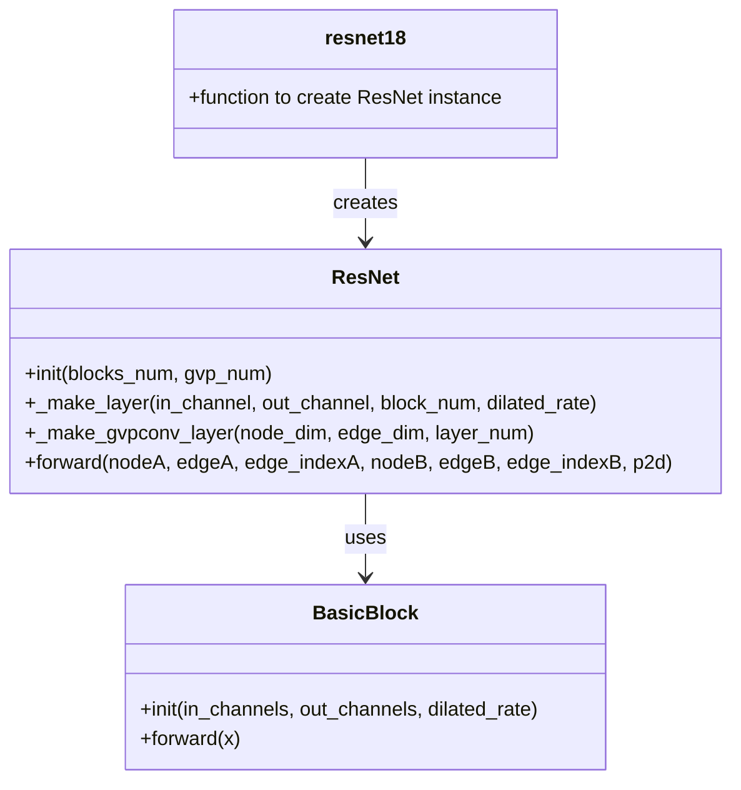
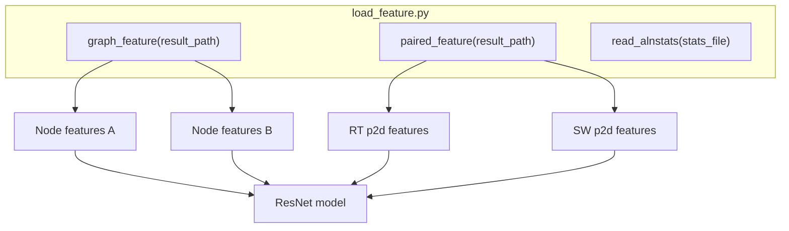
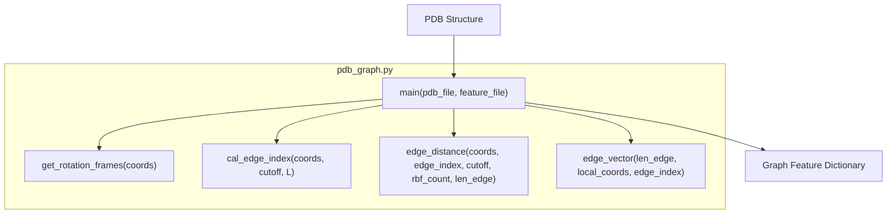
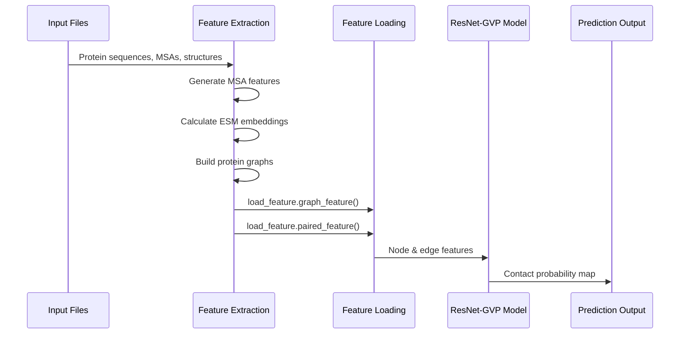
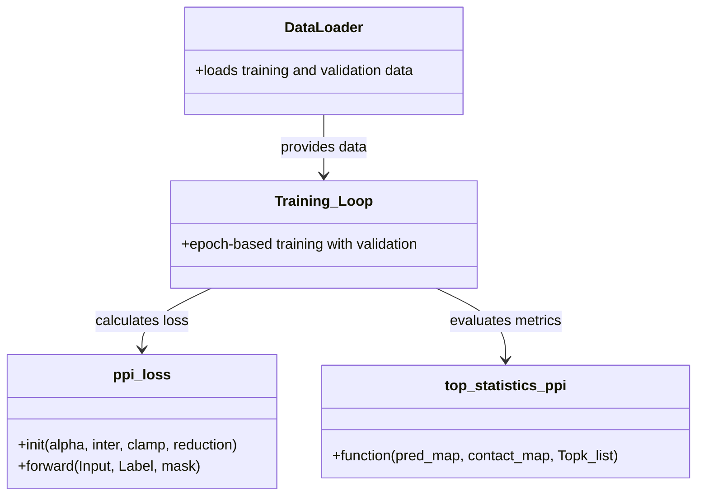

# Python API Reference

> **Relevant source files**
> * [load_feature.py](https://github.com/ChengfeiYan/PLMGraph-Inter/blob/d1c5ea71/load_feature.py)
> * [model.py](https://github.com/ChengfeiYan/PLMGraph-Inter/blob/d1c5ea71/model.py)
> * [pdb_graph.py](https://github.com/ChengfeiYan/PLMGraph-Inter/blob/d1c5ea71/pdb_graph.py)
> * [predict.py](https://github.com/ChengfeiYan/PLMGraph-Inter/blob/d1c5ea71/predict.py)
> * [train.py](https://github.com/ChengfeiYan/PLMGraph-Inter/blob/d1c5ea71/train.py)

This page provides detailed documentation of the Python functions and classes in the PLMGraph-Inter codebase. It is intended for developers who want to use the system programmatically or extend its functionality. The reference covers the core model architecture, data processing utilities, and prediction pipeline components.

For information about the overall system architecture, see [System Architecture](/ChengfeiYan/PLMGraph-Inter/2-system-architecture). For details on how to use the prediction pipeline, see [Prediction Pipeline](/ChengfeiYan/PLMGraph-Inter/4-prediction-pipeline).

## Core Model API

### ResNet Model

The core model in PLMGraph-Inter is a ResNet-18 architecture combined with Graph Vector Perceptron (GVP) layers.



Sources: [model.py L155-L259](https://github.com/ChengfeiYan/PLMGraph-Inter/blob/d1c5ea71/model.py#L155-L259)

#### ResNet Class

The `ResNet` class is the main neural network model used for predicting protein-protein interactions.

**Constructor Parameters:**

* `blocks_num`: Number of BasicBlocks in the hidden layer
* `gvp_num`: Number of GVP convolution layers

**Methods:**

* `forward(nodeA, edgeA, edge_indexA, nodeB, edgeB, edge_indexB, p2d)`: Forward pass of the model * `nodeA/nodeB`: Tuple of (scalar features, vector features) for each protein * `edgeA/edgeB`: Tuple of (scalar features, vector features) for the edges * `edge_indexA/edge_indexB`: Edge indices for graph connectivity * `p2d`: 2D pairwise features between proteins * Returns: Contact probability map

Sources: [model.py L155-L254](https://github.com/ChengfeiYan/PLMGraph-Inter/blob/d1c5ea71/model.py#L155-L254)

#### BasicBlock Class

The `BasicBlock` class is the building block for the ResNet architecture, implementing dilated convolutions.

**Constructor Parameters:**

* `in_channels`: Number of input channels
* `out_channels`: Number of output channels
* `dilated_rate`: Dilation rate for convolutions

**Methods:**

* `forward(x)`: Forward pass of the block * `x`: Input feature map * Returns: Processed feature map

Sources: [model.py L79-L152](https://github.com/ChengfeiYan/PLMGraph-Inter/blob/d1c5ea71/model.py#L79-L152)

#### Helper Functions

* `resnet18()`: Creates a ResNet model with 9 BasicBlocks and 3 GVP layers
* `concat(A_f1d, B_f1d, p2d)`: Concatenates 1D features from two proteins with 2D pairwise features

Sources: [model.py L14-L26](https://github.com/ChengfeiYan/PLMGraph-Inter/blob/d1c5ea71/model.py#L14-L26)

 [model.py L258-L259](https://github.com/ChengfeiYan/PLMGraph-Inter/blob/d1c5ea71/model.py#L258-L259)

## Data Processing API

### Feature Loading

Functions for loading and processing features for model input.



Sources: [load_feature.py L10-L95](https://github.com/ChengfeiYan/PLMGraph-Inter/blob/d1c5ea71/load_feature.py#L10-L95)

#### Graph Feature Loading

* `graph_feature(result_path)`: Loads node features for proteins A and B * `result_path`: Path to the directory containing feature files * Returns: List of two dictionaries containing node and edge features for both proteins

Sources: [load_feature.py L42-L62](https://github.com/ChengfeiYan/PLMGraph-Inter/blob/d1c5ea71/load_feature.py#L42-L62)

#### Paired Feature Loading

* `paired_feature(result_path)`: Loads pairwise features between proteins * `result_path`: Path to the directory containing feature files * Returns: Tuple of (rt_p2d, sw_p2d) tensors containing right-to-left and swap features

Sources: [load_feature.py L65-L95](https://github.com/ChengfeiYan/PLMGraph-Inter/blob/d1c5ea71/load_feature.py#L65-L95)

#### Helper Functions

* `read_alnstats(stats_file)`: Reads alignment statistics file * `stats_file`: Path to the alignment statistics file * Returns: Numpy array of shape (3, length, length) containing alignment statistics

Sources: [load_feature.py L31-L38](https://github.com/ChengfeiYan/PLMGraph-Inter/blob/d1c5ea71/load_feature.py#L31-L38)

### Graph Generation

Functions for generating graph representations from protein structures.



Sources: [pdb_graph.py L9-L264](https://github.com/ChengfeiYan/PLMGraph-Inter/blob/d1c5ea71/pdb_graph.py#L9-L264)

#### Main Graph Generation

* `main(pdb_file, feature_file)`: Generates graph features from a PDB structure * `pdb_file`: Path to the PDB file * `feature_file`: Output path for saving features * Generates a pickle file containing graph features

Sources: [pdb_graph.py L197-L264](https://github.com/ChengfeiYan/PLMGraph-Inter/blob/d1c5ea71/pdb_graph.py#L197-L264)

#### Geometric Functions

* `get_rotation_frames(coords)`: Computes local coordinate frames for residues
* `cal_edge_index(coords, contact_cutoff, L)`: Calculates edge indices based on distance cutoff
* `edge_distance(coords, edge_index, contact_cutoff, rbf_count, len_edge)`: Computes RBF-encoded edge distances
* `edge_vector(len_edge, local_coords, edge_index)`: Computes edge vectors in local coordinate frames

Sources: [pdb_graph.py L41-L157](https://github.com/ChengfeiYan/PLMGraph-Inter/blob/d1c5ea71/pdb_graph.py#L41-L157)

#### Helper Functions

* `normalize(tensor, dim=-1)`: Normalizes a tensor along a dimension
* `rbf(tensor, D_min=2, D_max=12, D_count=16)`: Applies radial basis function encoding
* `dihedrals(X, eps=1e-7)`: Calculates dihedral angles from coordinates
* `virtualCb(coords)`: Constructs virtual Cβ atom coordinates

Sources: [pdb_graph.py L17-L193](https://github.com/ChengfeiYan/PLMGraph-Inter/blob/d1c5ea71/pdb_graph.py#L17-L193)

## Prediction API

The prediction pipeline combines multiple steps for predicting protein-protein interactions.



Sources: [predict.py L9-L201](https://github.com/ChengfeiYan/PLMGraph-Inter/blob/d1c5ea71/predict.py#L9-L201)

### Prediction Process

The main prediction script (`predict.py`) performs the following steps:

1. MSA pairing and processing
2. Feature extraction (PSSM, ESM-1b, ESM-MSA-1b, ESM-IF1)
3. Graph construction
4. Feature loading
5. Model prediction

Since `predict.py` is primarily a script rather than an API, it does not expose reusable functions but demonstrates the prediction workflow.

Sources: [predict.py L39-L201](https://github.com/ChengfeiYan/PLMGraph-Inter/blob/d1c5ea71/predict.py#L39-L201)

## Training API

The training pipeline includes functions for model training and evaluation.



Sources: [train.py L9-L260](https://github.com/ChengfeiYan/PLMGraph-Inter/blob/d1c5ea71/train.py#L9-L260)

### Loss Function

* `ppi_loss`: Custom loss function for protein-protein interaction prediction * **Constructor Parameters:** * `alpha`: Weighting factor (default: None) * `inter`: Inter-protein parameter (default: 24) * `clamp`: Whether to clamp values (default: False) * `reduction`: Reduction method ('sum' or 'mean', default: 'sum') * **Methods:** * `forward(Input, Label, mask)`: Calculates the loss * `Input`: Predicted contact probabilities * `Label`: Ground truth contact map * `mask`: Mask for valid positions * Returns: Loss value

Sources: [train.py L46-L79](https://github.com/ChengfeiYan/PLMGraph-Inter/blob/d1c5ea71/train.py#L46-L79)

### Evaluation Metrics

* `top_statistics_ppi(pred_map, contact_map, Topk_list)`: Calculates top-k precision metrics * `pred_map`: Predicted contact probability map * `contact_map`: Ground truth contact map * `Topk_list`: List of k values for evaluation * Returns: Array of precision values for each k

Sources: [train.py L20-L43](https://github.com/ChengfeiYan/PLMGraph-Inter/blob/d1c5ea71/train.py#L20-L43)

## Usage Example

Below is a simplified example demonstrating how to use the API for prediction:

```sql
# Load featuresfeatureA, featureB = load_feature.graph_feature(result_path)rt_p2d, sw_p2d = load_feature.paired_feature(result_path) # Prepare inputs for modelnodeA = (featureA['nodes_scat'].to(device), featureA['nodes_vec'].to(device))edgeA = (featureA['edge_scat'].to(device), featureA['edge_vec'].to(device))edge_indexA = featureA['edge_index'].to(device) nodeB = (featureB['nodes_scat'].to(device), featureB['nodes_vec'].to(device))edgeB = (featureB['edge_scat'].to(device), featureB['edge_vec'].to(device))edge_indexB = featureB['edge_index'].to(device) rt_p2d = rt_p2d.to(device).float() # Create modelmodel = resnet18()model.load_state_dict(torch.load(weight_file, map_location=device))model.eval() # Run predictionwith torch.no_grad():    pred = model(nodeA, edgeA, edge_indexA,                  nodeB, edgeB, edge_indexB,                  rt_p2d).detach().cpu()
```

Sources: [predict.py L159-L198](https://github.com/ChengfeiYan/PLMGraph-Inter/blob/d1c5ea71/predict.py#L159-L198)

## API Dependencies

The PLMGraph-Inter Python API relies on the following key external libraries:

| Library | Purpose |
| --- | --- |
| PyTorch | Core deep learning framework |
| PyTorch Geometric | Graph neural network operations |
| NumPy | Numerical operations |
| BioPython | PDB file parsing |
| ESM | Protein language models |

Sources: [model.py L8-L12](https://github.com/ChengfeiYan/PLMGraph-Inter/blob/d1c5ea71/model.py#L8-L12)

 [pdb_graph.py L9-L14](https://github.com/ChengfeiYan/PLMGraph-Inter/blob/d1c5ea71/pdb_graph.py#L9-L14)