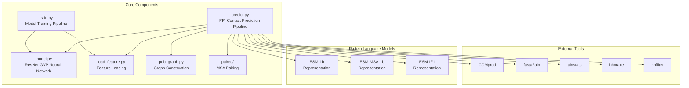
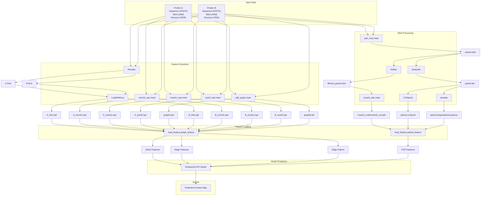
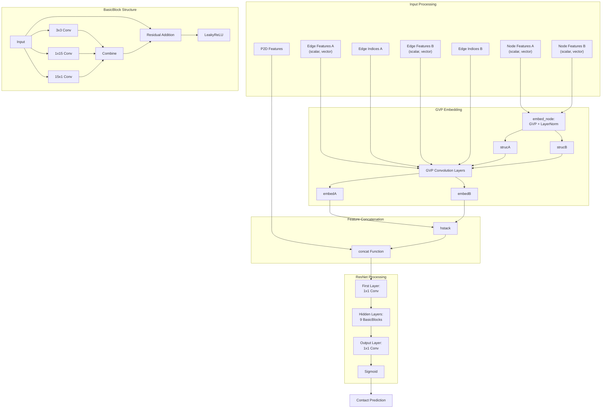
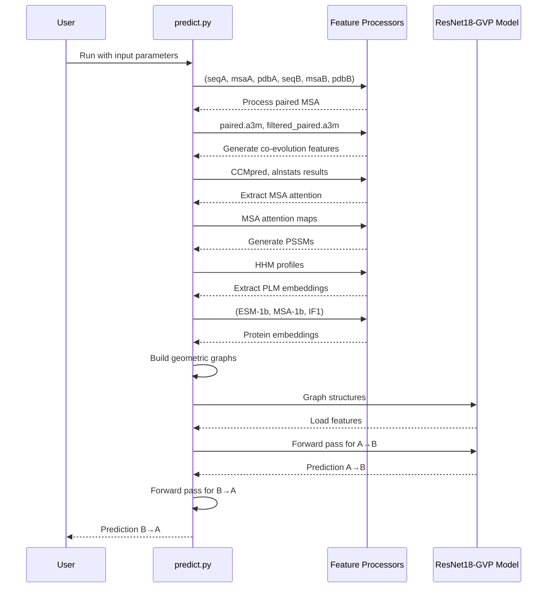

# System Architecture

> **Relevant source files**
> * [LICENSE](https://github.com/ChengfeiYan/PLMGraph-Inter/blob/d1c5ea71/LICENSE)
> * [README.md](https://github.com/ChengfeiYan/PLMGraph-Inter/blob/d1c5ea71/README.md?plain=1)
> * [main_fig.jpg](https://github.com/ChengfeiYan/PLMGraph-Inter/blob/d1c5ea71/main_fig.jpg)
> * [model.py](https://github.com/ChengfeiYan/PLMGraph-Inter/blob/d1c5ea71/model.py)
> * [predict.py](https://github.com/ChengfeiYan/PLMGraph-Inter/blob/d1c5ea71/predict.py)

## Introduction

This document provides a detailed overview of the system architecture of PLMGraph-Inter, a framework for inter-protein contact prediction that combines protein language models (PLMs) with geometric graph-based representations. The architecture section covers the high-level components, data flow, and interactions between different modules of the system. For installation instructions, see [Installation and Dependencies](/ChengfeiYan/PLMGraph-Inter/3-installation-and-dependencies), and for usage details, see [Prediction Pipeline](/ChengfeiYan/PLMGraph-Inter/4-prediction-pipeline).

## Core Components

PLMGraph-Inter consists of several interconnected components that work together to predict inter-protein contacts from protein structures and sequences. The major components are outlined below:



Sources: [README.md L1-L64](https://github.com/ChengfeiYan/PLMGraph-Inter/blob/d1c5ea71/README.md?plain=1#L1-L64)

 [predict.py L1-L41](https://github.com/ChengfeiYan/PLMGraph-Inter/blob/d1c5ea71/predict.py#L1-L41)

The system is organized around two main pipelines:

1. **Prediction Pipeline** (`predict.py`): Orchestrates the entire prediction process from input proteins to predicted contacts
2. **Training Pipeline** (`train.py`): Handles model training and evaluation

These pipelines rely on several supporting modules:

* **Model** (`model.py`): Implements the neural network architecture (ResNet18-GVP)
* **Graph Construction** (`pdb_graph.py`): Converts protein structures into geometric graphs
* **Feature Loading** (`load_feature.py`): Loads and processes various features for the model
* **MSA Pairing** (`paired/`): Handles multiple sequence alignment pairing

## Data Flow Architecture

The following diagram illustrates the data flow in the prediction pipeline, showing how inputs are processed through various stages to generate the final contact prediction:



Sources: [predict.py L39-L201](https://github.com/ChengfeiYan/PLMGraph-Inter/blob/d1c5ea71/predict.py#L39-L201)

The prediction pipeline follows these key steps:

1. **Input Processing**: Takes protein sequences (FASTA), multiple sequence alignments (A3M), and structures (PDB) for two proteins
2. **MSA Processing**: Pairs MSAs and processes them using external tools (hhfilter, CCMpred, etc.)
3. **Feature Extraction**: Extracts features from protein sequences and structures using various methods: * Position-specific scoring matrices (PSSMs) using hhmake * Embeddings from protein language models (ESM-1b, ESM-MSA-1b, ESM-IF1) * Geometric graph representations from PDB structures
4. **Feature Loading**: Loads processed features into a format suitable for the model
5. **Model Prediction**: Passes the features through the ResNet18-GVP model
6. **Output Generation**: Produces a predicted contact map

## Neural Network Architecture

The core model of PLMGraph-Inter is a ResNet18 architecture combined with Geometric Vector Perceptron (GVP) components for processing protein structure graphs:



Sources: [model.py L1-L260](https://github.com/ChengfeiYan/PLMGraph-Inter/blob/d1c5ea71/model.py#L1-L260)

The model consists of the following key components:

1. **GVP Embedding**: * Processes node features using GVP and LayerNorm * Applies GVP convolution layers to node and edge features
2. **Feature Concatenation**: * Flattens and concatenates node features * Combines with paired features (P2D)
3. **ResNet Processing**: * Initial 1×1 convolutional layer * 9 BasicBlocks for feature processing * Output 1×1 convolutional layer * Sigmoid activation for final prediction
4. **BasicBlock Structure**: * 3×3 convolutional path * 1×15 and 15×1 convolutional paths for long-range dependencies * Residual connection * LeakyReLU activation

The detailed implementation of the model architecture can be found in [model.py L78-L254](https://github.com/ChengfeiYan/PLMGraph-Inter/blob/d1c5ea71/model.py#L78-L254)

## Feature Processing System

PLMGraph-Inter integrates various features derived from protein sequences, structures, and evolutionary information:

```

```

Sources: [predict.py L39-L173](https://github.com/ChengfeiYan/PLMGraph-Inter/blob/d1c5ea71/predict.py#L39-L173)

The feature processing system integrates:

1. **Sequence-based Features**: * ESM-1b embeddings from protein language models * Position-specific scoring matrices from HHM profiles
2. **MSA-based Features**: * ESM-MSA-1b embeddings from MSA language models * Co-evolution information from CCMpred * Alignment statistics from alnstats * MSA attention maps from ESM-MSA-1b
3. **Structure-based Features**: * ESM-IF1 embeddings from structure language models * Geometric graph features from PDB structures
4. **Feature Integration**: * Graph features: Node and edge representations for each protein * P2D features: Paired features between the two proteins

## System Execution Flow

The following diagram illustrates the complete execution flow of the prediction system, from model loading to final output generation:



Sources: [predict.py L174-L201](https://github.com/ChengfeiYan/PLMGraph-Inter/blob/d1c5ea71/predict.py#L174-L201)

The execution flow follows these steps:

1. User provides input parameters (protein sequences, MSAs, and structures)
2. The system processes these inputs to generate various features
3. Features are loaded into appropriate formats
4. The model makes predictions in both directions (A→B and B→A)
5. Predictions are averaged to produce the final contact map
6. The result is saved to the specified output path

## Integration with External Tools

PLMGraph-Inter relies on several external tools for processing protein sequences and multiple sequence alignments:

| Tool | Purpose | Integration Point |
| --- | --- | --- |
| CCMpred | Co-evolution analysis | Used to generate contact predictions from paired MSAs |
| hhfilter | MSA filtering | Filters paired MSAs to reduce redundancy |
| fasta2aln | Format conversion | Converts A3M to ALN format for other tools |
| alnstats | Alignment statistics | Calculates statistical features from aligned sequences |
| hhmake | HMM profile creation | Generates HMM profiles from MSAs |

These external tools are integrated into the prediction pipeline in [predict.py L23-L35](https://github.com/ChengfeiYan/PLMGraph-Inter/blob/d1c5ea71/predict.py#L23-L35)

 where their paths are defined and later used in various processing steps.

## Summary

PLMGraph-Inter's system architecture is designed to integrate multiple sources of information (sequence, evolution, and structure) through a combination of protein language models and geometric graph neural networks. The system processes protein pairs through a series of feature extraction and transformation steps before feeding them into the ResNet18-GVP model for contact prediction. The modular design allows for flexibility in feature generation and model architecture while maintaining a streamlined prediction pipeline.

This page provides an overview of the system architecture. For installation instructions, see [Installation and Dependencies](/ChengfeiYan/PLMGraph-Inter/3-installation-and-dependencies), and for detailed usage, see the [Prediction Pipeline](/ChengfeiYan/PLMGraph-Inter/4-prediction-pipeline) and [Usage Examples](/ChengfeiYan/PLMGraph-Inter/7-usage-examples) pages.