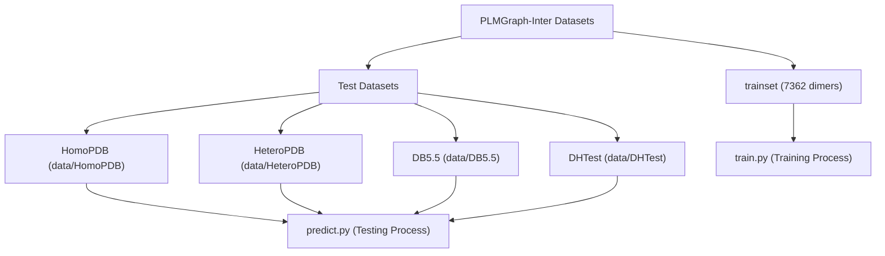
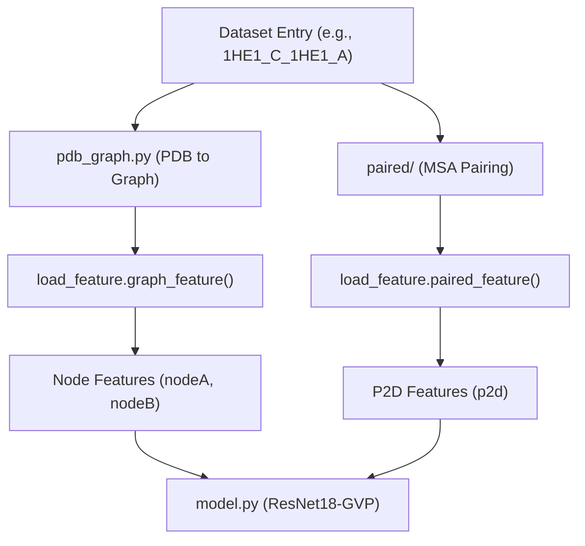
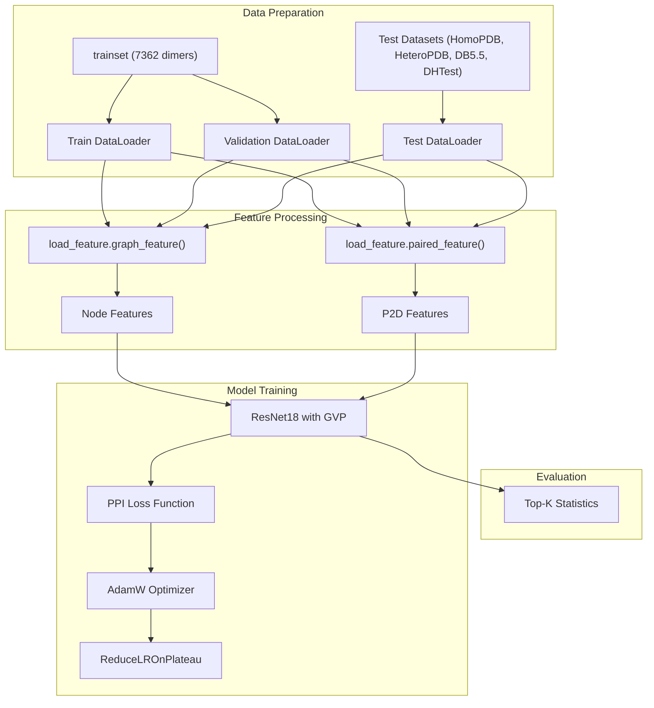

# Training Datasets

> **Relevant source files**
> * [data/DB5.5](https://github.com/ChengfeiYan/PLMGraph-Inter/blob/d1c5ea71/data/DB5.5)
> * [data/DHTest](https://github.com/ChengfeiYan/PLMGraph-Inter/blob/d1c5ea71/data/DHTest)
> * [data/HeteroPDB](https://github.com/ChengfeiYan/PLMGraph-Inter/blob/d1c5ea71/data/HeteroPDB)
> * [data/HomoPDB](https://github.com/ChengfeiYan/PLMGraph-Inter/blob/d1c5ea71/data/HomoPDB)
> * [data/README.md](https://github.com/ChengfeiYan/PLMGraph-Inter/blob/d1c5ea71/data/README.md?plain=1)
> * [data/trainset](https://github.com/ChengfeiYan/PLMGraph-Inter/blob/d1c5ea71/data/trainset)

## Purpose and Overview

This document describes the datasets used for training and evaluating the PLMGraph-Inter model for protein-protein interaction (PPI) contact prediction. These datasets are crucial for developing a model that can accurately predict inter-protein contacts. For information about how these datasets are used in the training process itself, see [Training Pipeline](/ChengfeiYan/PLMGraph-Inter/6-training-pipeline).

Sources: [data/README.md L1-L9](https://github.com/ChengfeiYan/PLMGraph-Inter/blob/d1c5ea71/data/README.md?plain=1#L1-L9)

## Dataset Composition

The PLMGraph-Inter system utilizes several datasets for training and evaluation purposes.

### Training Dataset

The primary dataset consists of 7362 protein dimers that are used for both training and validation of the model. This dataset includes a mix of homodimers (complexes of identical protein chains) and heterodimers (complexes of different protein chains).

### Test Datasets

Four separate test datasets are used to evaluate the model's performance:

| Dataset | Type | Size | Source | Purpose |
| --- | --- | --- | --- | --- |
| HomoPDB | Homodimers | 400 | Curated PDB structures | Test homodimers |
| HeteroPDB | Heterodimers | 200 | Curated PDB structures | Test heterodimers |
| DB5.5 | Heterodimers | 59 | Docking Benchmark 5.5 | Test heterodimers |
| DHTest | Heterodimers | 130 | DeepHomo's test set | Test heterodimers |

All test datasets have been carefully curated to remove proteins that are redundant with the training set, ensuring a fair evaluation of the model's generalization capabilities.

Sources: [data/README.md L3-L9](https://github.com/ChengfeiYan/PLMGraph-Inter/blob/d1c5ea71/data/README.md?plain=1#L3-L9)

 [data/HomoPDB L1-L400](https://github.com/ChengfeiYan/PLMGraph-Inter/blob/d1c5ea71/data/HomoPDB#L1-L400)

 [data/HeteroPDB L1-L200](https://github.com/ChengfeiYan/PLMGraph-Inter/blob/d1c5ea71/data/HeteroPDB#L1-L200)

 [data/DB5.5 L1-L59](https://github.com/ChengfeiYan/PLMGraph-Inter/blob/d1c5ea71/data/DB5.5#L1-L59)

 [data/DHTest L1-L130](https://github.com/ChengfeiYan/PLMGraph-Inter/blob/d1c5ea71/data/DHTest#L1-L130)

## Dataset Structure and Format

### Dataset Organization

The following diagram illustrates the organization of the datasets in the PLMGraph-Inter system and how they connect to the main code components:

Sources: [data/README.md L1-L9](https://github.com/ChengfeiYan/PLMGraph-Inter/blob/d1c5ea71/data/README.md?plain=1#L1-L9)

 [data/HomoPDB L1](https://github.com/ChengfeiYan/PLMGraph-Inter/blob/d1c5ea71/data/HomoPDB#L1-L1)

 [data/HeteroPDB L1](https://github.com/ChengfeiYan/PLMGraph-Inter/blob/d1c5ea71/data/HeteroPDB#L1-L1)

 [data/DB5.5 L1](https://github.com/ChengfeiYan/PLMGraph-Inter/blob/d1c5ea71/data/DB5.5#L1-L1)

 [data/DHTest L1](https://github.com/ChengfeiYan/PLMGraph-Inter/blob/d1c5ea71/data/DHTest#L1-L1)

### Entry Format and Processing Flow

Each dataset entry represents a protein dimer and follows a consistent format: `PDB_ID_Chain1_PDB_ID_Chain2`. The diagram below illustrates how these entries are processed through the system:

In this format:

* `PDB_ID` is the Protein Data Bank identifier for the structure
* `Chain1` and `Chain2` are the chain identifiers within the PDB structure

Examples:

* Homodimer: `1U1X_A_1U1X_B` (same PDB ID, different chains)
* Heterodimer: `1HE1_C_1HE1_A` (can have same PDB ID but different chains)

Sources: [data/HomoPDB L1](https://github.com/ChengfeiYan/PLMGraph-Inter/blob/d1c5ea71/data/HomoPDB#L1-L1)

 [data/HeteroPDB L1](https://github.com/ChengfeiYan/PLMGraph-Inter/blob/d1c5ea71/data/HeteroPDB#L1-L1)

 [data/DB5.5 L1](https://github.com/ChengfeiYan/PLMGraph-Inter/blob/d1c5ea71/data/DB5.5#L1-L1)

 [data/DHTest L1](https://github.com/ChengfeiYan/PLMGraph-Inter/blob/d1c5ea71/data/DHTest#L1-L1)

## Integration with Training Pipeline

The datasets are integrated into the PLMGraph-Inter training and evaluation pipeline as illustrated below:

This diagram illustrates the complete data flow from the original dataset files through the feature extraction process and into the model training and evaluation components.

Sources: [data/README.md L1-L9](https://github.com/ChengfeiYan/PLMGraph-Inter/blob/d1c5ea71/data/README.md?plain=1#L1-L9)

## Dataset Redundancy Control

An important aspect of the PLMGraph-Inter datasets is the careful removal of redundancy between training and testing sets. This is particularly evident in the creation of the DB5.5 and DHTest datasets, which were derived from existing benchmark datasets with redundant entries removed.

This redundancy control ensures that:

1. The model is evaluated on truly unseen data
2. Performance metrics reflect genuine generalization ability
3. There is no data leakage between training and testing

Sources: [data/README.md L7-L9](https://github.com/ChengfeiYan/PLMGraph-Inter/blob/d1c5ea71/data/README.md?plain=1#L7-L9)