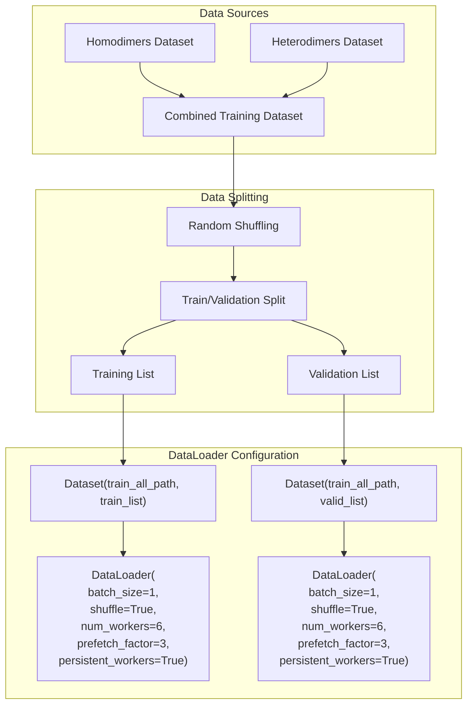
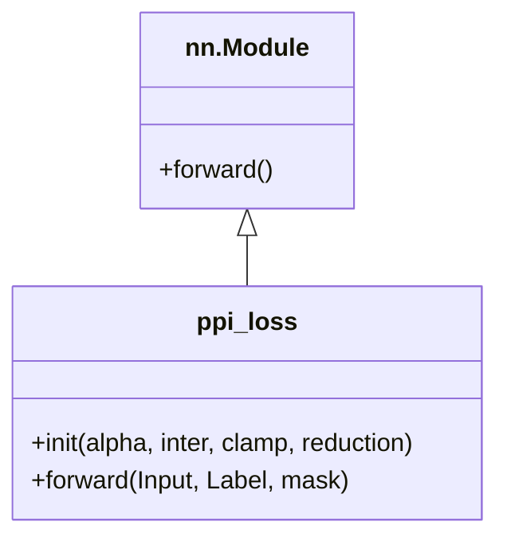
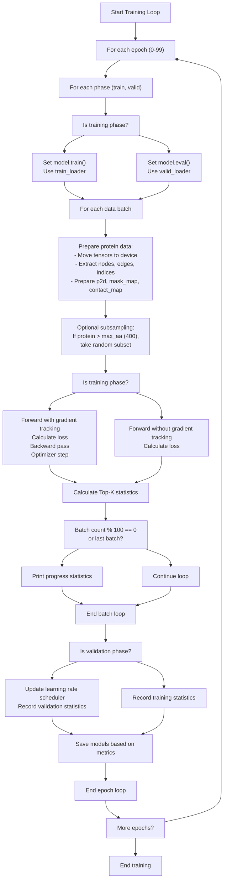
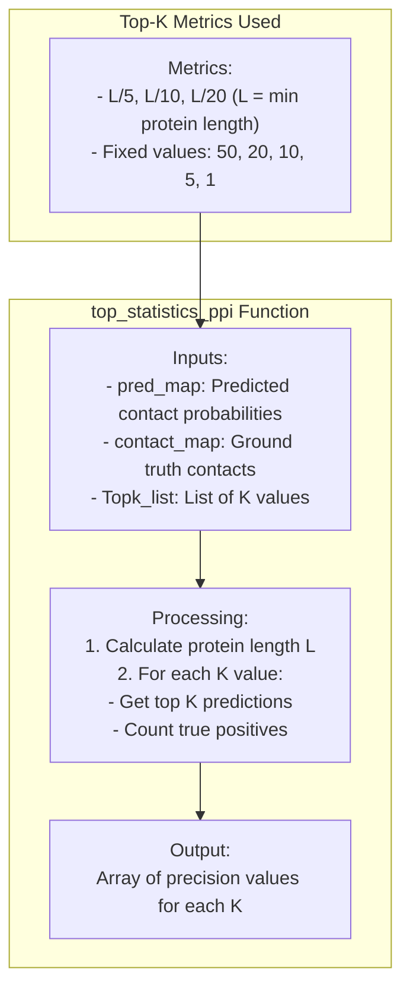
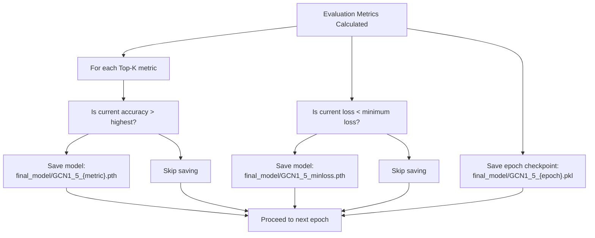

# Training Pipeline

> **Relevant source files**
> * [model.py](https://github.com/ChengfeiYan/PLMGraph-Inter/blob/d1c5ea71/model.py)
> * [train.py](https://github.com/ChengfeiYan/PLMGraph-Inter/blob/d1c5ea71/train.py)

The Training Pipeline in PLMGraph-Inter is responsible for training the ResNet-GVP neural network model that predicts protein-protein interactions (PPIs). This page details the complete training process, including data preparation, the loss function, optimization methods, evaluation metrics, and model saving strategy. For details about the model architecture itself, see [Model Architecture](/ChengfeiYan/PLMGraph-Inter/5-model-architecture).

## Training Pipeline Overview

The training pipeline integrates graph-based protein structure representations with a specialized residue contact prediction framework. It processes paired protein data, extracts geometric and sequential features, and trains a model to predict inter-protein residue contacts.


Sources: [train.py L149-L247](https://github.com/ChengfeiYan/PLMGraph-Inter/blob/d1c5ea71/train.py#L149-L247)

## Training Data Preparation

The training pipeline uses datasets of protein pairs, including both homodimers and heterodimers. The data is split into training and validation sets, with approximately 1050 samples for validation and the rest for training.



Sources: [train.py L83-L107](https://github.com/ChengfeiYan/PLMGraph-Inter/blob/d1c5ea71/train.py#L83-L107)

### Dataset Structure

The dataset contains paired protein feature data including:

* Protein graph data (nodes, edges, edge indices)
* Paired 2D features (p2d)
* Contact maps and masking maps

Sources: [train.py L165-L180](https://github.com/ChengfeiYan/PLMGraph-Inter/blob/d1c5ea71/train.py#L165-L180)

## Loss Function

The training pipeline uses a specialized loss function called `ppi_loss` designed specifically for protein-protein interaction prediction. This loss function combines aspects of binary cross-entropy with customizable weighting.



The loss function accepts:

* `Input`: The predicted probability map (values between 0 and 1)
* `Label`: The ground truth contact map
* `mask`: A mask to focus the loss computation on relevant residue pairs

When alpha is specified, the loss introduces weights that emphasize different regions of the prediction space:

* For positive examples (Label=1): `-alpha * (2-Input)² * Label * log(Input)`
* For negative examples (Label=0): `-(1-alpha) * (1+Input)³ * (1-Label) * log(1-Input)`

This weighting scheme encourages the model to be more confident in its predictions.

Sources: [train.py L46-L79](https://github.com/ChengfeiYan/PLMGraph-Inter/blob/d1c5ea71/train.py#L46-L79)

## Training Process

The training process runs for a specified number of epochs (default: 100), alternating between training and validation phases in each epoch.

### Model Initialization

The model is initialized as a ResNet18 with GVP components:

```
model = resnet18().to(device)criterion_ppi = ppi_loss(alpha=None, reduction='sum')optimizer = optim.AdamW(model.parameters(), lr=0.001, betas=(0.9, 0.999), weight_decay=0.1)scheduler = torch.optim.lr_scheduler.ReduceLROnPlateau(optimizer, mode='min', eps=1e-6, patience=3, factor=0.1)
```

Sources: [train.py L112-L121](https://github.com/ChengfeiYan/PLMGraph-Inter/blob/d1c5ea71/train.py#L112-L121)

### Training Loop Structure



Sources: [train.py L149-L201](https://github.com/ChengfeiYan/PLMGraph-Inter/blob/d1c5ea71/train.py#L149-L201)

### Data Processing in Training Loop

For each batch, the following processing occurs:

1. Protein data (nodeA, edgeA, edge_indexA, nodeB, edgeB, edge_indexB) is prepared and moved to the GPU
2. Paired 2D features (p2d), mask map, and contact map are processed
3. For large proteins (>400 residues), a random subset of positions is sampled to manage memory usage
4. Forward pass through the model produces predicted contact probabilities
5. Loss is calculated using the ppi_loss function
6. For training phase only: * Backward pass computes gradients * Optimizer updates model parameters

Sources: [train.py L165-L201](https://github.com/ChengfeiYan/PLMGraph-Inter/blob/d1c5ea71/train.py#L165-L201)

## Evaluation Metrics

The model is evaluated using Top-K statistics, which measure the accuracy of contact prediction by looking at the top K predicted contacts.



The top_statistics_ppi function calculates:

* Precision at various K values (where K can be fixed numbers or relative to protein length)
* For relative thresholds (e.g., L/5), K is calculated as a fraction of the minimum protein length

Sources: [train.py L20-L43](https://github.com/ChengfeiYan/PLMGraph-Inter/blob/d1c5ea71/train.py#L20-L43)

 [train.py L127-L131](https://github.com/ChengfeiYan/PLMGraph-Inter/blob/d1c5ea71/train.py#L127-L131)

## Model Saving Strategy

The training pipeline implements a comprehensive model saving strategy that preserves:

1. The best performing model for each Top-K metric
2. The model with the lowest validation loss
3. Checkpoints at each epoch



The saved models include:

* Models with best performance for each Top-K metric (L/5, L/10, L/20, 50, 20, 10, 5, 1)
* Model with minimum validation loss
* Checkpoint at each epoch

Sources: [train.py L230-L247](https://github.com/ChengfeiYan/PLMGraph-Inter/blob/d1c5ea71/train.py#L230-L247)

## Code References

The primary code files for the training pipeline are:

* `train.py`: Contains the main training loop, loss function, and evaluation metrics
* `model.py`: Contains the ResNet-GVP model architecture used in training

The training pipeline integrates with the model architecture defined in the ResNet and GVP components, which are documented in the [Model Architecture](/ChengfeiYan/PLMGraph-Inter/5-model-architecture) page.