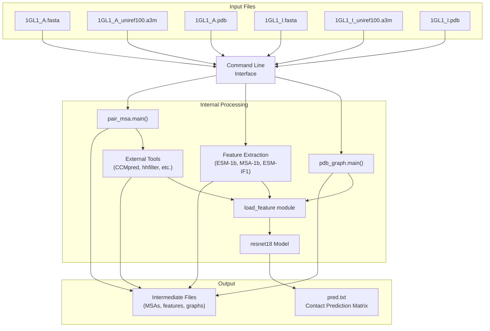
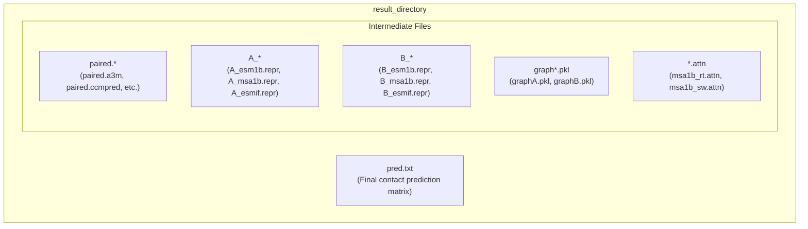
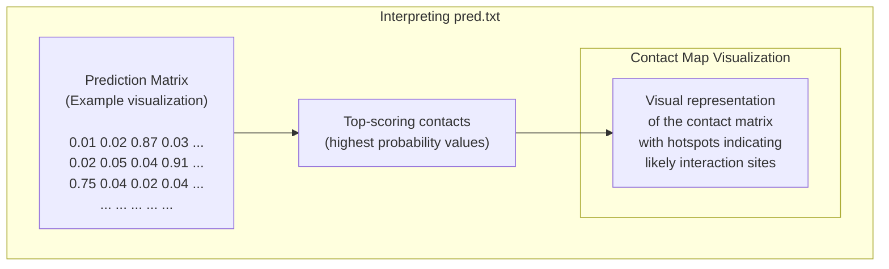
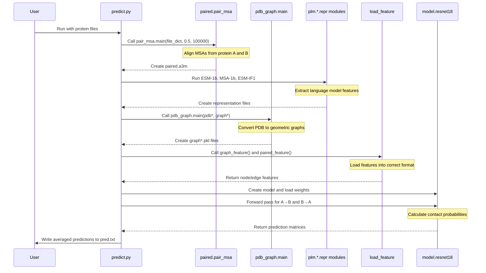
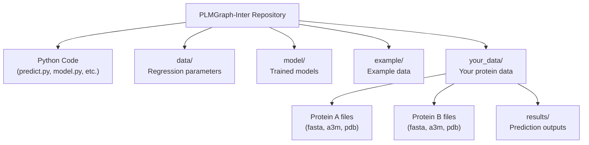

# Usage Examples

> **Relevant source files**
> * [LICENSE](https://github.com/ChengfeiYan/PLMGraph-Inter/blob/d1c5ea71/LICENSE)
> * [README.md](https://github.com/ChengfeiYan/PLMGraph-Inter/blob/d1c5ea71/README.md?plain=1)
> * [example/1GL1_A.fasta](https://github.com/ChengfeiYan/PLMGraph-Inter/blob/d1c5ea71/example/1GL1_A.fasta)
> * [example/1GL1_A_uniref100.a3m](https://github.com/ChengfeiYan/PLMGraph-Inter/blob/d1c5ea71/example/1GL1_A_uniref100.a3m)
> * [example/1GL1_I.fasta](https://github.com/ChengfeiYan/PLMGraph-Inter/blob/d1c5ea71/example/1GL1_I.fasta)
> * [example/1GL1_I_uniref100.a3m](https://github.com/ChengfeiYan/PLMGraph-Inter/blob/d1c5ea71/example/1GL1_I_uniref100.a3m)
> * [predict.py](https://github.com/ChengfeiYan/PLMGraph-Inter/blob/d1c5ea71/predict.py)

This page provides practical examples of how to use PLMGraph-Inter for predicting inter-protein contacts between two protein structures. It covers the basic usage pattern, explains the example provided in the repository, and demonstrates how to interpret the results. For information about the system architecture, see [System Architecture](/ChengfeiYan/PLMGraph-Inter/2-system-architecture), and for details on the prediction pipeline, see [Prediction Pipeline](/ChengfeiYan/PLMGraph-Inter/4-prediction-pipeline).

## Basic Usage Pattern

PLMGraph-Inter is executed through a command-line interface, with the following general syntax:

```
python predict.py sequenceA msaA pdbA sequenceB msaB pdbB result_path device
```

Where the parameters are:

| Parameter | Description | Required Format |
| --- | --- | --- |
| sequenceA | FASTA file containing the sequence of protein A | .fasta or .fa file |
| msaA | Multiple sequence alignment for protein A | .a3m file |
| pdbA | Structure file for protein A | .pdb file |
| sequenceB | FASTA file containing the sequence of protein B | .fasta or .fa file |
| msaB | Multiple sequence alignment for protein B | .a3m file |
| pdbB | Structure file for protein B | .pdb file |
| result_path | Directory where results will be stored | Existing directory path |
| device | Computing device to use (CPU or CUDA GPU) | "cpu", "cuda:0", "cuda:1", etc. |

Sources: [README.md L28-L38](https://github.com/ChengfeiYan/PLMGraph-Inter/blob/d1c5ea71/README.md?plain=1#L28-L38)

 [predict.py L40-L41](https://github.com/ChengfeiYan/PLMGraph-Inter/blob/d1c5ea71/predict.py#L40-L41)

## Example Walkthrough

The repository includes a complete example for the protein complex 1GL1, which consists of two chains: chain A (trypsin) and chain I (trypsin inhibitor).

### Running the Example

To run the provided example, execute:

```
python predict.py ./example/1GL1_A.fasta ./example/1GL1_A_uniref100.a3m ./example/1GL1_A.pdb ./example/1GL1_I.fasta ./example/1GL1_I_uniref100.a3m ./example/1GL1_I.pdb ./example/result cpu
```

This runs the prediction on CPU and stores results in the `./example/result` directory.

Sources: [README.md L40-L41](https://github.com/ChengfeiYan/PLMGraph-Inter/blob/d1c5ea71/README.md?plain=1#L40-L41)

 [example/1GL1_A.fasta L1-L2](https://github.com/ChengfeiYan/PLMGraph-Inter/blob/d1c5ea71/example/1GL1_A.fasta#L1-L2)

 [example/1GL1_I.fasta L1-L2](https://github.com/ChengfeiYan/PLMGraph-Inter/blob/d1c5ea71/example/1GL1_I.fasta#L1-L2)

### Prediction Flow Diagram

The diagram below illustrates the flow of data when running the example:



Sources: [predict.py L59-L62](https://github.com/ChengfeiYan/PLMGraph-Inter/blob/d1c5ea71/predict.py#L59-L62)

 [predict.py L100-L103](https://github.com/ChengfeiYan/PLMGraph-Inter/blob/d1c5ea71/predict.py#L100-L103)

 [predict.py L125-L144](https://github.com/ChengfeiYan/PLMGraph-Inter/blob/d1c5ea71/predict.py#L125-L144)

 [predict.py L153-L155](https://github.com/ChengfeiYan/PLMGraph-Inter/blob/d1c5ea71/predict.py#L153-L155)

 [predict.py L176-L201](https://github.com/ChengfeiYan/PLMGraph-Inter/blob/d1c5ea71/predict.py#L176-L201)

## Understanding Inputs and Outputs

### Input Requirements

For successful prediction, you need to prepare the following files for each protein:

1. **FASTA file (.fasta)**: Contains the amino acid sequence of the protein
2. **Multiple Sequence Alignment (.a3m)**: MSA derived from the UniRef100 database
3. **Structure file (.pdb)**: 3D structure coordinates of the protein

The MSA files should be in A3M format and derived from the UniRef100 database. If there are missing residues in the PDB files, you can use MODELLER to fill in these missing residues.

Sources: [README.md L37-L38](https://github.com/ChengfeiYan/PLMGraph-Inter/blob/d1c5ea71/README.md?plain=1#L37-L38)

 [predict.py L40-L41](https://github.com/ChengfeiYan/PLMGraph-Inter/blob/d1c5ea71/predict.py#L40-L41)

### Output Files and Structure

When you run a prediction, the system generates several types of files:



The final prediction result is stored in `pred.txt`, which contains a contact probability matrix. Each value in the matrix (ranging from 0 to 1) represents the predicted probability of contact between residue pairs of protein A and protein B.

Sources: [predict.py L200-L201](https://github.com/ChengfeiYan/PLMGraph-Inter/blob/d1c5ea71/predict.py#L200-L201)

 [predict.py L49-L103](https://github.com/ChengfeiYan/PLMGraph-Inter/blob/d1c5ea71/predict.py#L49-L103)

 [predict.py L125-L155](https://github.com/ChengfeiYan/PLMGraph-Inter/blob/d1c5ea71/predict.py#L125-L155)

## Interpreting Results

The output file `pred.txt` contains a 2D matrix where:

* Rows correspond to residues in protein A
* Columns correspond to residues in protein B
* Values represent the probability (from 0 to 1) of contact between residue pairs

Higher values indicate stronger predicted contacts. A typical visualization of the prediction matrix would look like:



In practice, you would typically:

1. Sort the matrix to find pairs with the highest scores (closest to 1.0)
2. Consider pairs with scores above a certain threshold (e.g., 0.5) as predicted contacts
3. Visualize these contacts on the 3D structures using molecular visualization software

The README shows an example visualization for the 1GL1 complex where brighter regions indicate higher probability contacts.

Sources: [README.md L46-L49](https://github.com/ChengfeiYan/PLMGraph-Inter/blob/d1c5ea71/README.md?plain=1#L46-L49)

 [predict.py L200-L201](https://github.com/ChengfeiYan/PLMGraph-Inter/blob/d1c5ea71/predict.py#L200-L201)

## Technical Execution Flow

The following diagram illustrates the technical execution flow and how the code components interact:



Sources: [predict.py L59-L95](https://github.com/ChengfeiYan/PLMGraph-Inter/blob/d1c5ea71/predict.py#L59-L95)

 [predict.py L107-L144](https://github.com/ChengfeiYan/PLMGraph-Inter/blob/d1c5ea71/predict.py#L107-L144)

 [predict.py L153-L155](https://github.com/ChengfeiYan/PLMGraph-Inter/blob/d1c5ea71/predict.py#L153-L155)

 [predict.py L160-L201](https://github.com/ChengfeiYan/PLMGraph-Inter/blob/d1c5ea71/predict.py#L160-L201)

## Advanced Usage

### Using GPU Acceleration

To use GPU acceleration for faster prediction, specify a CUDA device:

```
python predict.py sequenceA msaA pdbA sequenceB msaB pdbB result_path cuda:0
```

The device parameter can be:

* `cpu` for CPU computation
* `cuda:0` for the first GPU
* `cuda:1` for the second GPU (if available)
* etc.

Sources: [README.md L37](https://github.com/ChengfeiYan/PLMGraph-Inter/blob/d1c5ea71/README.md?plain=1#L37-L37)

 [predict.py L40-L41](https://github.com/ChengfeiYan/PLMGraph-Inter/blob/d1c5ea71/predict.py#L40-L41)

 [predict.py L171-L172](https://github.com/ChengfeiYan/PLMGraph-Inter/blob/d1c5ea71/predict.py#L171-L172)

### Understanding the Prediction Process

The PLMGraph-Inter pipeline performs:

1. MSA pairing - combines multiple sequence alignments of the two proteins
2. Feature extraction - computes language model representations from: * ESM-1b (sequence-based features) * ESM-MSA-1b (MSA-based features) * ESM-IF1 (structure-based features)
3. Graph construction - converts protein structures to geometric graphs
4. Contact prediction - using a ResNet model with GVP embeddings

The prediction is the average of 14 separate predictions (7 cross-validation models, each applied in both A-B and B-A directions).

Sources: [predict.py L176-L198](https://github.com/ChengfeiYan/PLMGraph-Inter/blob/d1c5ea71/predict.py#L176-L198)

 [README.md L55-L57](https://github.com/ChengfeiYan/PLMGraph-Inter/blob/d1c5ea71/README.md?plain=1#L55-L57)

## Troubleshooting and Common Issues

1. **Missing residues in PDB files**: Use MODELLER to fill in missing residues in the input PDB files before running prediction.
2. **MSA quality**: The quality of predictions strongly depends on MSA quality. Ensure MSAs are derived from the UniRef100 database and have sufficient sequence diversity.
3. **Memory requirements**: For large proteins, the system may require substantial memory. Consider running on a machine with at least 16GB RAM.
4. **Path configuration**: Ensure you've properly set the paths of external tools and model weights in [predict.py L25-L35](https://github.com/ChengfeiYan/PLMGraph-Inter/blob/d1c5ea71/predict.py#L25-L35)

Sources: [README.md L37-L38](https://github.com/ChengfeiYan/PLMGraph-Inter/blob/d1c5ea71/README.md?plain=1#L37-L38)

 [predict.py L25-L35](https://github.com/ChengfeiYan/PLMGraph-Inter/blob/d1c5ea71/predict.py#L25-L35)

 [README.md L21-L24](https://github.com/ChengfeiYan/PLMGraph-Inter/blob/d1c5ea71/README.md?plain=1#L21-L24)

## Summary of File Organization

This diagram shows the expected file organization when working with PLMGraph-Inter:



Sources: [README.md L20-L26](https://github.com/ChengfeiYan/PLMGraph-Inter/blob/d1c5ea71/README.md?plain=1#L20-L26)

 [predict.py L176](https://github.com/ChengfeiYan/PLMGraph-Inter/blob/d1c5ea71/predict.py#L176-L176)

Remember to:

1. Download all required model weights and place them in the correct location
2. Set the correct paths for external tools in predict.py
3. Create separate directories for each prediction job to avoid file conflicts

For any issues during installation or execution, contact the developers as indicated in the README.

Sources: [README.md L62](https://github.com/ChengfeiYan/PLMGraph-Inter/blob/d1c5ea71/README.md?plain=1#L62-L62)