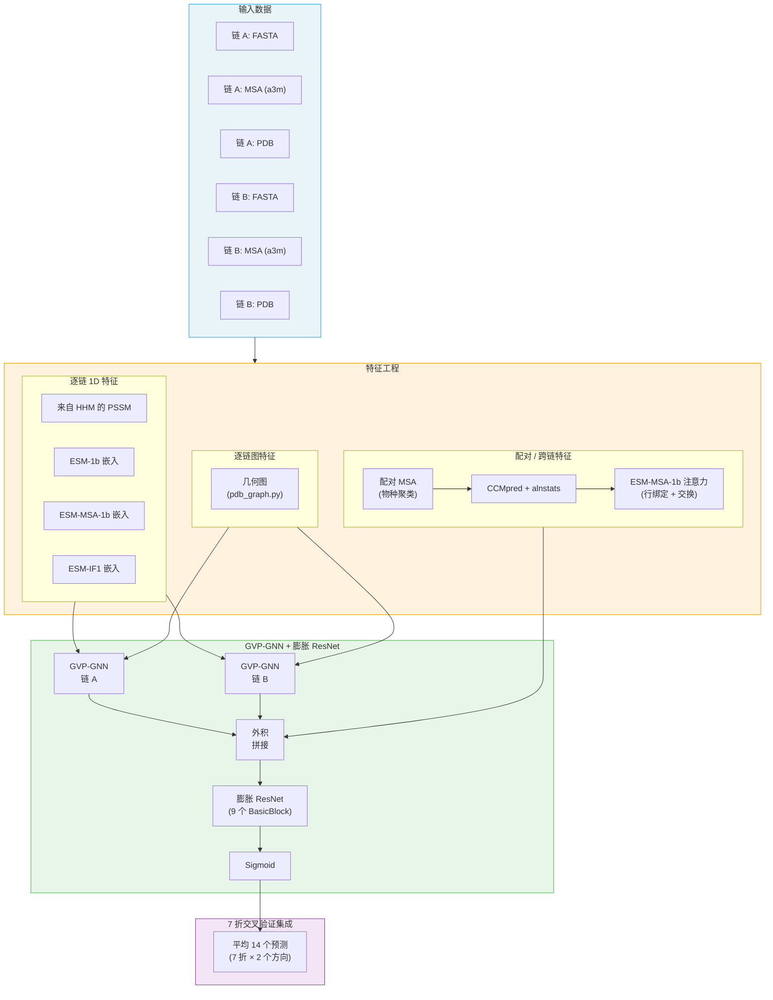

---
slug:1-overview
blog_type:normal
---


**PLMGraph-Inter** 是一个深度学习系统，它通过统一三大强大的范式：**蛋白质语言模型 (PLM) 嵌入**、**等变几何图神经网络 (GVP-GNN)** 以及**来自配对多序列比对 (MSA) 的共进化信号**，来预测**蛋白质间残基接触**——即两条蛋白质链之间氨基酸特定的成对相互作用。该研究发表于 *eLife*（2024年），它代表了针对蛋白质对接、复合物结构建模以及原子分辨率下理解蛋白质-蛋白质相互作用等关键问题的一种前沿方法。


来源: [README.md](/README.md#L1-L5), [model.py](/model.py#L1-L20)

## 它解决了什么问题？

当两种蛋白质发生相互作用时，实际上只有一小部分残基在界面处产生物理接触。准确预测这些**蛋白质间接触**——即链 A 中的哪个残基与链 B 中的哪个残基接触——类似于求解拼图游戏，你必须从两个独立的盒子中找出能够相互扣合的拼块。该接触图是一个 **LenA × LenB** 的二值矩阵，它作为一种几何约束，可以大幅缩小蛋白质对接的搜索空间。PLMGraph-Inter 将两条相互作用链的**序列**、**MSA** 和**单体结构**作为输入，输出一个概率矩阵，其中每个元素 (i, j) 表示链 A 中的残基 i 与链 B 中的残基 j 接触的可能性。

来源: [README.md](/README.md#L1-L5), [predict.py](/predict.py#L27-L35)

## 核心设计哲学

该系统建立在一个深刻认知之上：**没有任何单一的特征来源足以**完成蛋白质间接触预测。进化共进化（来自配对 MSA）能够捕捉跨物种相互作用残基之间的统计耦合，但数据稀疏且充满噪声。蛋白质语言模型从序列中捕捉丰富的上下文语义，但缺乏结构几何信息。3D 结构提供几何约束，但仅凭自身无法预测跨链接触。PLMGraph-Inter 通过精心设计的架构**融合了这三种信号**：几何图通过等变 GNN 独立处理每个单体的结构，PLM 嵌入通过进化和结构上下文丰富每个残基的表征，而配对的共进化特征则提供跨链耦合，在二维接触图空间中架起两条链的桥梁。

来源: [model.py](/model.py#L153-L195), [load_feature.py](/load_feature.py#L51-L76)

## 系统架构

下图展示了完整的预测流水线，从原始输入到特征提取、模型推理以及集成输出：



来源: [predict.py](/predict.py#L27-L142), [model.py](/model.py#L153-L195), [load_feature.py](/load_feature.py#L51-L100)

## 特征来源一览

系统从五个不同的特征类别中提取信息，每个类别提供不同模态的生物学信息。下表总结了每个特征来源提供的内容及其进入模型的入口：

| 特征来源 | 模态 | 维度 | 所需输入 | 模型入口点 |
|---|---|---|---|---|
| **PSSM (HHM)** | 进化谱 | 每个残基 20 | MSA (a3m) | 1D 节点特征 |
| **ESM-1b** | 序列语义 | 每个残基 1280 | FASTA | 1D 节点特征 |
| **ESM-MSA-1b** | MSA 上下文语义 | 每个残基 768 | MSA (a3m) | 1D 节点特征 |
| **ESM-IF1** | 结构上下文语义 | 每个残基 512 | PDB | 1D 节点特征 |
| **几何图** | 3D 结构几何 | 节点: (标量, 50×3 向量); 边: (标量, 25×3 向量) | PDB | GVP-GNN 输入 |
| **CCMpred + alnstats** | 共进化耦合 | 4 通道 | 配对 MSA | 2D 配对特征 |
| **ESM-MSA-1b 注意力** | 跨链注意力 | 可变通道 | 配对 MSA | 2D 配对特征 |

来源: [load_feature.py](/load_feature.py#L51-L100), [pdb_graph.py](/pdb_graph.py#L200-L265), [plm/esm1b_repr.py](/plm/esm1b_repr.py#L45-L61), [plm/esmif_repr.py](/plm/esmif_repr.py#L10-L30)

## 项目结构

仓库按四个功能模块进行组织，每个模块对应流水线的一个独立阶段：

```
PLMGraph-Inter/
├── predict.py              ← 入口点：端到端预测流水线
├── train.py                ← 带有自定义损失和交叉验证逻辑的训练循环
├── model.py                ← 神经网络：GVP-GNN + 膨胀 ResNet
├── load_feature.py         ← 特征加载与拼接逻辑
├── pdb_graph.py            ← 从 PDB 构建几何图
├── plm/                    ← 蛋白质语言模型特征提取器
│   ├── esm1b_repr.py       ← ESM-1b 逐残基嵌入
│   ├── esm1b_attn.py       ← ESM-1b 注意力（预测中未使用）
│   ├── msa1b_repr.py       ← ESM-MSA-1b 逐残基嵌入
│   ├── msa1b_attn.py       ← ESM-MSA-1b 跨链注意力图
│   ├── esmif_repr.py       ← ESM-IF1 结构条件化嵌入
│   └── LoadHHM.py          ← 从 HH-suite .hhm 文件提取 PSSM
├── paired/                 ← 用于共进化的配对 MSA 构建
│   ├── pair_msa.py         ← 协调器：物种聚类 → 配对
│   ├── cluster_species.py  ← 基于分类 ID 的分组与相似度排序
│   └── rw_a2m.py           ← MSA I/O：读取、解析、编码 a2m 格式
├── data/                   ← 基准数据集与回归权重
│   ├── trainset/           ← 用于训练/验证的 7362 个二聚体
│   ├── HomoPDB/            ← 400 个同源二聚体（测试）
│   ├── HeteroPDB/          ← 200 个异源二聚体（测试）
│   ├── DB5.5/              ← 来自对接基准 5.5 的 59 个异源二聚体
│   ├── DHTest/             ← 来自 DeepHomo 测试集的 130 个异源二聚体
│   └── regression/         ← ESM 接触回归模型权重
├── example/                ← 测试运行的样本输入（1GL1 复合物）
└── model/                  ← （已下载）7 个训练好的交叉验证折权重
```

来源: [README.md](/README.md#L1-L64), [data/README.md](/data/README.md#L1-L10)

## 关键设计决策

**等变图处理。** 模型使用 **GVP（群向量积）GNN** 层来处理每个单体的几何图。与将节点特征视为标量向量的标准 GNN 不同，GVP-GNN 在**旋转不变标量**和**旋转等变向量**之间保持了清晰的分离，确保学习到的表征遵循蛋白质结构的 3D 旋转对称性。每条链独立经过 3 个 GVP 卷积层处理，节点隐藏维度为 (256, 64)——即 256 个标量通道和 64 个向量通道。

**各向异性核的膨胀卷积。** 处理拼接接触图特征的 2D ResNet 采用了新颖的 **BasicBlock** 设计：在膨胀率 1、20 和 40 下，每个块应用三个并行卷积——一个标准的 3×3 膨胀卷积、一个 1×15 膨胀卷积和一个 15×1 膨胀卷积。各向异性的 1×N 和 N×1 核能够捕捉沿蛋白质序列延伸的接触模式，而膨胀扩大了感受野且未导致参数激增。这三个分支进行求和（带有恒等捷径连接）而非拼接，从而将通道数固定保持在 96。

**对称集成预测。** 由于链 A 和链 B 之间的接触图不一定是对称的（A→B 和 B→A 视角会产生不同的配对特征矩阵），系统对 **7 个交叉验证折**中的每一折都预测**两个方向**，最终平均所有 14 个预测结果。这不仅利用了来自 ESM-MSA-1b 的“行绑定”和“交换”注意力图，同时强制实现了近似的对称性。

来源: [model.py](/model.py#L60-L195), [predict.py](/predict.py#L144-L175), [train.py](/train.py#L75-L100)

## 依赖与外部工具

该系统依赖于 Python 深度学习库和外部生物信息学工具的组合。Python 技术栈以 **PyTorch 1.9**、用于等变图层的 **GVP-PyTorch**、用于图数据结构的 **PyTorch Geometric** 以及用于蛋白质语言模型推理的 **Facebook ESM** 为核心。外部工具包括 **HH-suite**（用于 HMM 构建和 MSA 过滤）、**CCMpred**（用于直接耦合分析）、**alnstats**（用于成对统计势）以及 **fasta2aln**（用于格式转换）。ESM-1b、ESM-MSA-1b 和 ESM-IF1 的模型权重必须从 ESM 仓库单独下载。

来源: [README.md](/README.md#L7-L23), [predict.py](/predict.py#L25-L33)

## 可复现性

提供了一个 **Code Ocean 计算胶囊**用于可复现执行。请注意一个归一化差异：Code Ocean 输出的是对 14 个集成预测求和（范围 0–14），而 GitHub 实现则是对其求平均（范围 0–1）。两种情况下的残基对**排名**完全一致。

<CgxTip>运行预测时，请确保 MSA 派生自 **UniRef100** 数据库——这对于基于物种聚类的配对策略至关重要。PDB 文件中的缺失残基应在运行流水线前使用 MODELLER 进行填充。</CgxTip>

来源: [README.md](/README.md#L49-L57)

## 接下来去哪

如需实践入门，请从[快速入门](2-quick-start)开始运行你的首次预测，然后查阅[输入数据要求](3-input-data-requirements)以了解预期的文件格式。若要深入探索该系统，建议的阅读顺序遵循数据流：

1. **特征工程**：[蛋白质语言模型嵌入](5-protein-language-model-embeddings) → [几何图构建](6-geometric-graph-construction) → [配对 MSA 与共进化](7-paired-msa-and-coevolution)
2. **模型设计**：[GVP 图神经网络](8-gvp-graph-neural-network) → [用于接触图的膨胀 ResNet](9-dilated-resnet-for-contact-maps) → [特征拼接策略](10-feature-concatenation-strategy)
3. **训练与预测**：[预测流水线](11-prediction-pipeline) → [训练与损失设计](12-training-and-loss-design) → [交叉验证集成](13-cross-validation-ensemble)