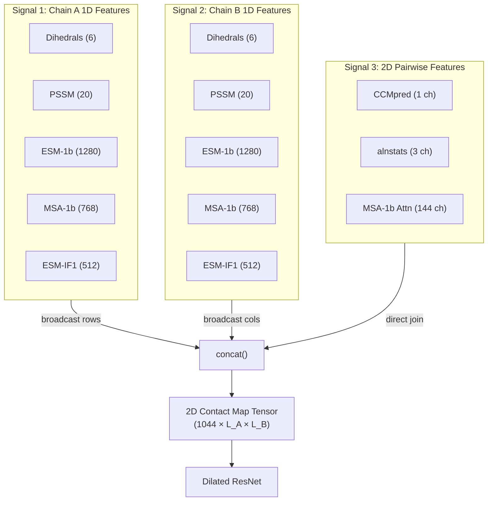
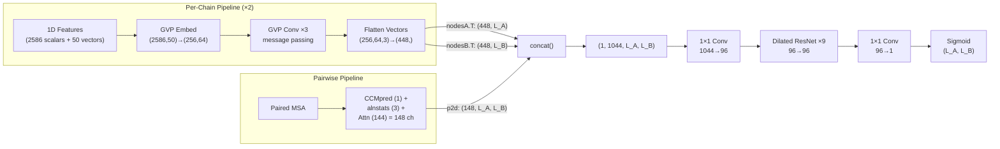

---
slug:10-feature-concatenation-strategy
blog_type:normal
---


PLMGraph-Inter 的预测能力源于一种原则性的特征拼接策略，该策略将三种根本不同的信号类别——**来自 Chain A 的逐残基结构嵌入**、**来自 Chain B 的逐残基结构嵌入**以及**链间成对共进化特征**——融合为一个统一的 2D 接触图张量。其核心机制是 `concat()` 函数，该函数执行半外积运算：通过轴重复将 1D 逐残基特征广播至 2D，然后沿通道维度将它们与原生的 2D 成对特征进行堆叠。生成的张量被直接馈入 [Dilated ResNet](9-dilated-resnet-for-contact-maps) 以进行逐位置接触预测。本页将剖析拼接流水线的每个阶段，追踪精确的维度算术，并解释生成最终预测的对称性强制机制。

来源: [model.py](model.py#L1-L20), [load_feature.py](load_feature.py#L1-L60)

## 三信号架构

拼接策略统一了来自三个互补来源的信号，每个来源捕捉蛋白质间相互作用的一个独特方面：



**信号 1 和 2** 是逐残基 (1D) 特征：它们描述了每条链内的单个氨基酸，但不携带跨链信息。**信号 3** 是真正的成对 (2D) 特征：它编码了两条链残基位置之间的统计耦合和基于注意力的关系。该拼接策略的精妙之处在于，它通过广播将 1D 特征提升到 2D 空间，使后续的 ResNet 卷积能够学习那些*没有直接成对信号*的残基间的相互作用模式——例如，Chain A 中残基 *i* 的疏水性与 Chain B 中残基 *j* 的结构可及性如何相关。

来源: [model.py](model.py#L225-L250), [load_feature.py](load_feature.py#L44-L60)

## 阶段 1 — 1D 特征组装

对于每条链独立地，五个特征来源被水平堆叠为一个逐残基向量。该组装发生在 `graph_feature()` 中，它从磁盘加载预计算的特征并通过 `np.hstack()` 将它们拼接起来：

| 特征来源 | 维度 | 来源 | 捕获的信息 |
|---|---|---|---|
| `nodes_sact` (二面角) | 6 | PDB 骨架 (N, CA, C 原子) | 局部骨架几何：φ, ψ, ω 角的 cos/sin 值 |
| PSSM | 20 | HHM 特征谱 (HHblits) | 进化保守性：位置特异性评分 |
| ESM-1b repr | 1280 | ESM-1b (第 33 层) | 序列级语义嵌入 |
| MSA-1b repr | 768 | ESM-MSA-1b (第 12 层) | MSA 感知的上下文嵌入 |
| ESM-IF1 repr | 512 | ESM-IF1 逆折叠 | 结构级编码器嵌入 |
| **标量总计** | **2586** | | |

此外，每个残基携带 **50 个方向向量**（每个 3 维），源自几何图中的局部旋转框架。这些构成了 GVP 输入的向量分量：形状为 `(L, 50, 3)` 的 `nodes_vec`。

`graph_feature()` 中组装标量 1D 特征的关键代码行是：

```python
feature_1d = np.hstack((graph['nodes_sact'], PSSM, esm1b_repr, msa1b_repr, esmif_repr))
```

这个堆叠后的数组随后替换图的标量节点特征 (`nodes_scat`)，产生一个节点维度为 `(2586, 50)` 的图对象——恰好与模型构造函数中的 `node_input_dim` 相匹配。

来源: [load_feature.py](load_feature.py#L44-L60), [pdb_graph.py](pdb_graph.py#L230-L265), [model.py](model.py#L138-L141)

## 阶段 2 — GVP 图神经网络细化

原始的 1D 特征不会直接输入到拼接过程中。相反，它们通过一个 **GVP (Geometric Vector Perceptron)** 网络，该网络利用来自几何图的 3D 结构上下文对其进行细化。这是一个关键的设计选择：如果没有 GVP 处理，1D 特征将缺乏对空间邻域的感知，广播到 2D 时将仅携带孤立的逐残基信息。

GVP 流水线按如下方式运行：

1. **节点嵌入**：`embed_node` 将 `(2586, 50) → (256, 64)` 映射——将 2586 个标量特征和 50 个向量特征压缩为 256 个标量和 64 个向量隐藏维度。
2. **消息传递**：3 个 `GVPConvLayer` 实例沿着维度为 `(432, 25)` 的图边传播信息，在空间邻居之间混合标量和向量信号。
3. **展平**：在最后一个 GVP 层之后，向量输出 `(L, 64, 3)` 通过 `.flatten(-2, -1)` 展平为 `(L, 192)`，然后与标量输出 `(L, 256)` 拼接。

生成的逐节点特征维度为：

```
node_dim = scalar_dim + vector_dim × 3
         = 256 + 64 × 3
         = 448
```

每个残基的这个 448 维向量即是进入 `concat()` 函数的内容——一种具备结构感知和邻域感知的表示，编码了局部几何与进化信号。

来源: [model.py](model.py#L143-L168), [model.py](model.py#L225-L245)

## 阶段 3 — `concat()` 函数：半外积构造

`concat()` 函数是特征拼接策略的架构枢纽。它将三个输入——两个 1D 特征矩阵（每条链一个）和一个 2D 成对特征张量——转换为一个适合 2D 卷积的单个 4D 张量：

```python
def concat(A_f1d, B_f1d, p2d):
    def rep_new_axis(mat, rep_num, axis):
        return torch.repeat_interleave(torch.unsqueeze(mat, axis=axis), rep_num, axis=axis)
    
    len_channel, lenA = A_f1d.shape
    len_channel, lenB = B_f1d.shape        
    
    row_repeat = rep_new_axis(A_f1d, lenB, 2)   # (C, lenA) → (C, lenA, lenB)
    col_repeat = rep_new_axis(B_f1d, lenA, 1)   # (C, lenB) → (C, lenA, lenB)
    
    return torch.unsqueeze(torch.cat((row_repeat, col_repeat, p2d), axis=0), 0)
    # → (1, 2C + C_p2d, lenA, lenB)
```

该操作分三步进行：

**步骤 1 — 行广播**：`A_f1d` 的形状为 `(448, L_A)`。沿轴 2 进行 unsqueeze 并重复 `L_B` 次，生成形状为 `(448, L_A, L_B)` 的 `row_repeat`。在位置 `(i, j)` 处，值为 `A_f1d[:, i]`——即 Chain A 中残基 *i* 的特征，在所有 Chain B 位置上完全相同。

**步骤 2 — 列广播**：`B_f1d` 的形状为 `(448, L_B)`。沿轴 1 进行 unsqueeze 并重复 `L_A` 次，生成形状为 `(448, L_A, L_B)` 的 `col_repeat`。在位置 `(i, j)` 处，值为 `B_f1d[:, j]`——即 Chain B 中残基 *j* 的特征，在所有 Chain A 位置上完全相同。

**步骤 3 — 沿通道拼接**：三个张量沿通道（轴 0）维度进行拼接，然后增加一个外部批次维度。最终形状为 `(1, 1044, L_A, L_B)`。

<CgxTip>半外积并非矩阵乘法。它不计算特定残基对之间的跨链相互作用——这是 ResNet 的工作。相反，它使所有 1D 信息在每个 (i, j) 位置都*可用*，从而允许 ResNet 的感受野学习哪些特征组合可以预测接触。</CgxTip>

来源: [model.py](model.py#L12-L21), [load_feature.py](load_feature.py#L14-L26)

## 阶段 4 — 2D 成对特征构造

成对特征 (`p2d`) 编码了两条链残基位置之间的直接统计耦合。它们由 `paired_feature()` 从三个来源组装而成：

| 特征 | 通道数 | 形状 | 描述 |
|---|---|---|---|
| CCMpred | 1 | `(1, L_A, L_B)` | 来自配对 MSA 上伪似然最大化的直接共进化耦合 |
| alnstats | 3 | `(3, L_A, L_B)` | 来自 metapsicov 的比对统计量（原始值、apc 校正值等） |
| MSA-1b 行注意力 | 144 | `(144, L_A, L_B)` | 来自 ESM-MSA-1b 的跨链注意力 (12 层 × 12 头) |
| **总计** | **148** | | |

注意力特征值得特别关注。ESM-MSA-1b 产生形状为 `(layers, heads, L_paired, L_paired)` 的 `row_attentions`。代码提取 A→B 象限 `(layers, heads, L_A, L_B)` 并将其重塑为 `(layers × heads, L_A, L_B) = (144, L_A, L_B)`。这些注意力图提供了一种经学习且具备 MSA 感知的度量，衡量跨链残基对共变的程度——这比单纯的原始共进化信号更为丰富。

**方向变体**：生成两个版本的成对特征张量——`rt_feature_2d`（正向，用于 A→B 预测）和 `sw_feature_2d`（交换，用于 B→A 预测）。交换版本转置对称特征 (CCMpred, alnstats)，并使用来自 ESM-MSA-1b 的*交换*注意力象限。这种方向对偶性对于对称性强制至关重要。

```python
rt_feature_2d = torch.cat([ccmpred, alnstats, rtattn_msa1b], axis=0)
sw_feature_2d = torch.cat([ccmpred.swapaxes(-2,-1), alnstats.swapaxes(-2,-1), swattn_msa1b], axis=0)
```

来源: [load_feature.py](load_feature.py#L62-L120), [plm/msa1b_attn.py](plm/msa1b_attn.py#L57-L71)

## 维度算术 — 完整通道预算

输入到 ResNet 的总通道维度在模型构造函数中以声明式计算：

```python
input_channel = 0 * (node_input_dim[0] + 0 * node_input_dim[1])   \
              + 2 * (node_hidden_dim[0] + 3 * node_hidden_dim[1])   \
              + 1 * (144 + 4)
```

| 项 | 计算 | 值 | 用途 |
|---|---|---|---|
| 原始节点跳跃 | 0 × (2586 + 0) | 0 | 未使用：原始 1D 特征绕过 GVP → 不拼接 |
| GVP 节点广播 | 2 × (256 + 3 × 64) | 896 | 两条链：每条 448 个通道 |
| 成对特征 | 1 × (144 + 4) | 148 | 144 个注意力 + 4 个共进化 |
| **总计** | | **1044** | ResNet 输入通道 |

系数 **2** 表示 Chain A（行广播）和 Chain B（列广播）两者。`3 × node_hidden_dim[1]` 中的系数 **3** 表示每个向量特征在展平时包含的三个空间分量。常量 **4** 分解为 `1 (CCMpred) + 3 (alnstats)`。

这个 1044 通道的张量通过一个 `1×1` 卷积 (`first_layer`)，在进入膨胀 ResNet 块之前将其投影降维至 96 个通道，作为可学习的通道混合/降维步骤。

来源: [model.py](model.py#L138-L155)

## 通过双向预测强制对称性

蛋白质间接触预测应当是对称的：Chain A 中残基 *i* 接触 Chain B 中残基 *j* 的概率，等于 Chain B 中残基 *j* 接触 Chain A 中残基 *i* 的概率。然而，`concat()` 函数本质上是不对称的——Chain A 特征被行广播，Chain B 特征被列广播，且成对注意力特征是有方向的。

PLMGraph-Inter 通过**带转置的双向预测**来强制对称性，在推理循环中执行：

```python
for weight_file in weight_list:  # 7 个交叉验证模型
    model.load_state_dict(torch.load(weight_file, map_location=device))
    
    # 正向方向: A → B
    pred = model(nodeA, edgeA, edge_indexA, nodeB, edgeB, edge_indexB, rt_p2d)
    all_preds += pred

    # 反向方向: B → A (转置)
    pred = model(nodeB, edgeB, edge_indexB, nodeA, edgeA, edge_indexA, sw_p2d)
    all_preds += pred.T
```

7 个集成模型中的每一个都贡献两个预测：一个在 A→B 方向，一个在 B→A 方向（输出经转置）。最终预测是所有 14 个预测的平均值 (`all_preds / 14`)。这种双向平均有效地消除了注意力特征中的方向偏差以及行/列广播的不对称性。

<CgxTip>对反向方向预测执行 `.T` 转置至关重要：当模型处理 (B, A) 时，其输出形状为 (L_B, L_A)，必须在累加前转置为 (L_A, L_B)。若无此转置，预测将发生错位。</CgxTip>

来源: [predict.py](predict.py#L163-L196)

## 端到端数据流总结



完整流水线通过几何图细化转换逐残基表示，将它们与共进化信号一起广播至 2D 空间，并通过一个深度膨胀卷积网络处理统一后的张量。特征拼接策略确保 ResNet 在*每个 (i, j) 位置接收到所有可用信息*：Chain A 的结构上下文、Chain B 的结构上下文，以及残基 *i* 和 *j* 之间的直接统计耦合。

来源: [model.py](model.py#L225-L259), [predict.py](predict.py#L150-L196)

## 相关页面

拼接策略是生成 1D 特征的 [Geometric Graph Construction](6-geometric-graph-construction) 和 [GVP Graph Neural Network](8-gvp-graph-neural-network)、生成 2D 特征的 [Paired MSA and Coevolution](7-paired-msa-and-coevolution)，以及消费拼接张量的 [Dilated ResNet for Contact Maps](9-dilated-resnet-for-contact-maps) 之间的桥梁。有关包括集成平均在内的完整推理流，请参阅 [Prediction Pipeline](11-prediction-pipeline)。