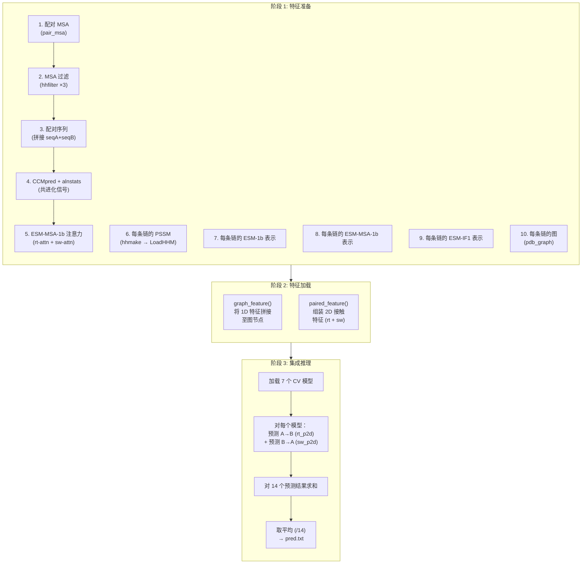

---
slug:11-prediction-pipeline
blog_type:normal
---


预测管线是 PLMGraph-Inter 的运行核心 —— 一个确定性的三阶段编排器，它将原始蛋白质输入（序列、MSA、结构）转换为完整的蛋白质间接触概率图。该管线通过 `predict.py` 执行，依次经历**特征准备**、**特征加载**和**集成推理**三个阶段，最终生成一个 `pred.txt` 文件，其中每一项代表链 A 与链 B 之间一个残基对的预测接触概率。该管线被有意设计为顺序执行：每个特征模块都会将中间产物写入磁盘，从而既能支持调试，也允许在不重新计算昂贵的 PLM 嵌入的情况下进行部分重新运行。

来源: [predict.py](/predict.py#L1-L202)

## 调用与输入约定

该管线通过命令行调用，需要确切提供八个位置参数。它没有配置文件 —— 所有的控制流均通过参数位置和脚本内的硬编码常量来实现。

```
python predict.py sequenceA msaA pdbA sequenceB msaB pdbB result_path device
```

| 参数 | 类型 | 描述 |
|---|---|---|
| `sequenceA` | 路径 | 链 A 的 FASTA 文件（单链序列） |
| `msaA` | 路径 | 链 A 的 A3M 多序列比对（基于 UniRef100 生成） |
| `pdbA` | 路径 | 链 A 的 PDB 结构文件（链标记为 `A`） |
| `sequenceB` | 路径 | 链 B 的 FASTA 文件 |
| `msaB` | 路径 | 链 B 的 A3M 多序列比对 |
| `pdbB` | 路径 | 链 B 的 PDB 结构文件 |
| `result_path` | 路径 | 所有中间产物及最终产物的输出目录 |
| `device` | 字符串 | PyTorch 设备：`cpu`、`cuda:0`、`cuda:1` 等 |

脚本通过 `sys.argv[1:]` 解析这些参数，并在输出目录不存在时创建它。MSA 必须来源于 UniRef100 数据库；如果 PDB 文件包含缺失的残基，应事先使用 MODELLER 对其进行填充。

来源: [predict.py](/predict.py#L40-L44), [README.md](/README.md#L29-L41)

## 管线架构概览

该管线可分解为三个宏观阶段，每个阶段都包含明确划分的子步骤。下面的流程图展示了从原始输入到最终接触图的完整数据转换路径：



<CgxTip>由于 PLM 推理（ESM-1b、ESM-MSA-1b、ESM-IF1）和共进化计算（CCMpred），阶段 1 占据了主要的运行时间。每个子步骤都会将结果写入 `result_path`，因此若运行失败，可以通过注释掉已完成的步骤来恢复执行。</CgxTip>

来源: [predict.py](/predict.py#L47-L156)

## 阶段 1: 特征准备

特征准备是计算量最大的阶段，分为三个逻辑组：**配对特征**（捕捉链间共进化）、**逐链 1D 特征**（序列级嵌入）和**图特征**（几何结构表示）。

### 配对特征计算（第 1–5 步）

**第 1 步 —— 配对 MSA 构建。** `pair_msa.main()` 函数接收两条链的 FASTA 和 MSA 文件，按分类学 ID 对序列进行聚类，并将属于同一生物体的序列进行配对。覆盖度阈值为 `0.5`，最大配对序列数为 `100,000`。此步骤生成 `paired.a3m` —— 一个拼接的比对结果，其中每行包含来自链 A 的序列与来自链 B 同物种序列的拼接。

**第 2 步 —— MSA 过滤与格式重整。** 三次 `hhfilter` 调用强制保留最多 256 条多样化序列（`-diff 256`）：分别针对配对 MSA、链 A 的 MSA 和链 B 的 MSA。配对的 A3M 文件还会通过 `fasta2aln` 额外转换为 ALN 格式，以供下游共进化工具使用。

**第 3 步 —— 配对序列文件。** 创建一个简单的 FASTA 文件，包含两条链拼接后的参考序列（`seqA + seqB`），写为 `paired.fasta`。

**第 4 步 —— 共进化信号。** CCMpred 从配对比对中计算精度矩阵（偏相关性），生成 `paired.ccmpred` —— 即精度矩阵的链间块。`alnstats` 工具计算三个额外的成对统计量（互信息、APC 校正后的互信息和直接信息），存储为 `paired.singout` 和 `paired.pairout`。

**第 5 步 —— ESM-MSA-1b 交叉注意力。** 将配对 MSA 输入 ESM-MSA-1b Transformer，提取**行注意力**（`msa1b_rt.attn`）和**交换注意力**（`msa1b_sw.attn`）矩阵。行注意力捕捉链 A 中位置对链 B 中位置的关注度；交换注意力则捕捉转置方向的关注度。它们构成了链间耦合的两个非对称视图。

来源: [predict.py](/predict.py#L49-L103), [paired/pair_msa.py](/paired/pair_msa.py#L35-L83), [plm/msa1b_attn.py](/plm/msa1b_attn.py#L40-L64)

### 逐链 1D 特征计算（第 6–9 步）

每条链独立计算各个特征。下表总结了全部四种 1D 特征类型：

| 步骤 | 特征 | 模块 | 输入 | 输出 | 每残基维度 |
|---|---|---|---|---|---|
| 6 | PSSM | `hhmake` → `LoadHHM` | A3M → HHM → PSSM | `{chain}_hhm.pkl` | 20 |
| 7 | ESM-1b 表示 | `esm1b_repr` | FASTA | `{chain}_esm1b.repr.npy` | 1280 |
| 8 | ESM-MSA-1b 表示 | `msa1b_repr` | 过滤后的 A3M | `{chain}_msa1b.repr.npy` | 768 |
| 9 | ESM-IF1 表示 | `esmif_repr` | PDB | `{chain}_esmif.repr.npy` | 512 |

PSSM 的提取方式是：首先运行 `hhmake` 将 A3M 转换为轮廓 HMM（`.hhm` 格式），然后 `LoadHHM.py` 解析该 HMM 文件以计算带有伪计数正则化的位置特异性得分矩阵。ESM-1b 从单链序列中提取第 33 层的表示。ESM-MSA-1b 从过滤后比对的第一行（参考序列）中提取第 12 层的 MSA 表示。ESM-IF1 使用逆向折叠编码器直接从 3D 坐标中提取结构条件化嵌入。

来源: [predict.py](/predict.py#L107-L144), [plm/esm1b_repr.py](/plm/esm1b_repr.py#L39-L54), [plm/msa1b_repr.py](/plm/msa1b_repr.py#L41-L58), [plm/esmif_repr.py](/plm/esmif_repr.py#L13-L31), [plm/LoadHHM.py](/plm/LoadHHM.py#L1-L15)

### 图特征计算（第 10 步）

`pdb_graph.main()` 函数根据每条链的 PDB 结构构建几何图。它提取骨架坐标（N, CA, C, O），计算虚拟 Cβ 位置，然后通过相对于 CA 中心旋转/平移所有相邻坐标，在每个残基处构建一个局部坐标系。该图包含：

- **节点标量特征** (`nodes_sact`)：提升为正弦/余弦表示的骨架二面角 (φ, ψ, ω) —— 6 个通道
- **节点向量特征** (`nodes_vec`)：局部坐标系中的前向/后向方向向量 —— 50 × 3 个通道
- **边索引**：由 18Å 的 Cα 距离截断值确定的稀疏邻接关系
- **边标量特征** (`edge_scat`)：经 RBF 编码的原子间距离 + 正弦位置嵌入
- **边向量特征** (`edge_vec`)：相连残基间的相对方向向量 —— 25 × 3 个通道

结果被序列化为 `graphA.pkl` / `graphB.pkl`。

来源: [predict.py](/predict.py#L150-L155), [pdb_graph.py](/pdb_graph.py#L197-L264)

## 阶段 2: 特征加载与组装

来自 `load_feature.py` 的两个加载器函数将原始产物组装为模型可用的张量。

### `graph_feature()` —— 1D 到节点注入

对于每条链，该函数加载图 pickle 文件及四个 1D 特征文件（PSSM、ESM-1b、ESM-MSA-1b、ESM-IF1），然后将它们水平拼接为一个单一的逐残基向量：

```
nodes_scat = [graph.nodes_sact | PSSM | ESM-1b_repr | ESM-MSA-1b_repr | ESM-IF1_repr]
```

此拼接向量替换了图原有的 `nodes_scat` 字段，将序列级的进化与结构信息融合到图的节点表示中。每个节点的标量总维度为 **6 + 20 + 1280 + 768 + 512 = 2586**，这与模型中定义的 `node_input_dim = (2586, 50)` 相匹配。

### `paired_feature()` —— 2D 接触图组装

该函数从三种配对信号源组装**正向** (`rt_p2d`) 和**交换向** (`sw_p2d`) 的 2D 特征图：

| 通道组 | 来源 | rt_p2d 通道 | sw_p2d 通道 |
|---|---|---|---|
| CCMpred | `paired.ccmpred` | 1 | 1 (转置) |
| alnstats | `paired.pairout` | 3 | 3 (转置) |
| ESM-MSA-1b attn | `msa1b_rt.attn` / `msa1b_sw.attn` | L×H | L×H |

对于 `rt_p2d`，CCMpred 的链间块和 alnstats 按原样使用；对于 `sw_p2d`，它们沿最后两个轴进行转置。注意力通道从 `(L, H, L_A, L_B)` 重塑为 `(L×H, L_A, L_B)`，其中 L 是 MSA 深度，H 是头数。2D 通道总维度为 `1 + 3 + (12 × 12) = 148`，这为模型的 `input_channel` 计算贡献了 `144 + 4 = 148` 个通道。

来源: [load_feature.py](/load_feature.py#L42-L95), [model.py](/model.py#L157-L168)

## 阶段 3: 集成推理

### 模型前向传播

`ResNet` 模型（通过 `resnet18()` 实例化为 `ResNet(blocks_num=9, gvp_num=3)`）通过三个阶段处理输入：

1. **GVP 嵌入**：节点特征经过一个 `GVP` 映射层 `(2586, 50) → (256, 64)` 和 `LayerNorm`，然后通过 3 轮 `GVPConvLayer` 消息传递，沿蛋白质图的边传播几何信息。
2. **特征拼接**：经 GVP 处理的标量（256 维）和展平的向量（64×3=192 维）特征在每个节点上进行拼接（得到 448 维），随后通过 `concat()` 外积操作广播至 2D 接触图网格中，与 `p2d` 合并。
3. **膨胀 ResNet**：一个 1×1 投影层将拼接后的输入映射到 96 个通道，接着是 9 个带膨胀卷积的 `BasicBlock` 残差层，最后是一个 1×1 输出层 + sigmoid，生成逐像素的接触概率。

来源: [model.py](/model.py#L225-L254), [model.py](/model.py#L155-L198)

### 具有对称性增强的交叉验证集成

集成策略是该管线最独特的推理模式。七个模型权重文件（`model/1` 至 `model/7`）被依次加载。对于**每个**模型，会进行两次预测：

```python
# 方向 A→B：链 A 节点 + 链 B 节点 + 正向 2D 特征
pred_ab = model(nodeA, edgeA, edge_indexA, nodeB, edgeB, edge_indexB, rt_p2d)

# 方向 B→A：链 B 节点 + 链 A 节点 + 交换向 2D 特征  
pred_ba = model(nodeB, edgeB, edge_indexB, nodeA, edgeA, edge_indexA, sw_p2d)
```

B→A 预测在累加前会被转置（`.T`），因为模型输出的是 `L_A × L_B` 的图，但当 B 作为第一个参数提供时，输出形状为 `L_B × L_A`。所有 14 个预测（7 个模型 × 2 个方向）被累加至 `all_preds` 中，然后除以 14，得到最终的平均概率图：

```
pred.txt = all_preds / 14
```

<CgxTip>对称性增强（A→B + B→A）不仅是集成的技巧 —— 它利用了链交换下界面的物理等价性，在零额外标注成本的情况下有效地将训练信号翻倍。`.T` 转置至关重要：它将 B→A 的输出映射回 A×B 坐标系。</CgxTip>

来源: [predict.py](/predict.py#L176-L201)

## 输出格式

最终输出是保存在 `{result_path}/pred.txt` 的纯文本矩阵，形状为 `L_A × L_B`，其中 `L_A` 和 `L_B` 分别是链 A 和链 B 的残基数。每个值是 [0, 1] 范围内的浮点数，代表相应残基对形成蛋白质间接触的预测概率。值越高表示预测的接触越强；用户通常会对这些概率进行阈值处理或排序，以用于下游的对接或界面分析。

来源: [predict.py](/predict.py#L200-L202)

## 中间产物参考

管线在 `result_path` 中生成 19 个以上的中间文件。下表列出了每个产物，以供调试和部分重新运行参考：

| 文件 | 生产者 | 消费者 | 描述 |
|---|---|---|---|
| `paired.a3m` | pair_msa | hhfilter, fasta2aln | 按分类学配对的 MSA |
| `filtered_paired.a3m` | hhfilter | msa1b_attn | 经多样性过滤的配对 MSA (256 条序列) |
| `paired.aln` | fasta2aln | CCMpred, alnstats | ALN 格式的配对比对 |
| `paired.fasta` | script | — | 拼接的参考序列 |
| `paired.ccmpred` | CCMpred | paired_feature | 链间精度矩阵 |
| `paired.singout` / `pairout` | alnstats | paired_feature | 成对比对统计量 |
| `msa1b_rt.attn.npy` | msa1b_attn | paired_feature | 正向交叉注意力 |
| `msa1b_sw.attn.npy` | msa1b_attn | paired_feature | 交换向交叉注意力 |
| `filteredA/B.a3m` | hhfilter | msa1b_repr | 过滤后的逐链 MSA |
| `A/B.hhm` | hhmake | LoadHHM | 轮廓 HMM 文件 |
| `A/B_hhm.pkl` | LoadHHM | graph_feature | PSSM 字典 |
| `A/B_esm1b.repr.npy` | esm1b_repr | graph_feature | ESM-1b 残基嵌入 |
| `A/B_msa1b.repr.npy` | msa1b_repr | graph_feature | ESM-MSA-1b 残基嵌入 |
| `A/B_esmif.repr.npy` | esmif_repr | graph_feature | ESM-IF1 残基嵌入 |
| `graphA/B.pkl` | pdb_graph | graph_feature | 几何图结构 |
| `pred.txt` | 最终输出 | — | 平均接触概率图 |

来源: [predict.py](/predict.py#L52-L201)

## 相关页面

- 此处调用的特征模块有详细文档：[蛋白质语言模型嵌入](5-protein-language-model-embeddings)、[几何图构建](6-geometric-graph-construction) 和 [配对 MSA 与共进化](7-paired-msa-and-coevolution)
- 处理这些特征的模型架构：[GVP 图神经网络](8-gvp-graph-neural-network)、[用于接触图的膨胀 ResNet](9-dilated-resnet-for-contact-maps)、[特征拼接策略](10-feature-concatenation-strategy)
- 集成的来源：[交叉验证集成](13-cross-validation-ensemble)
- 生成这 7 个模型权重的训练流程：[训练与损失设计](12-training-and-loss-design)