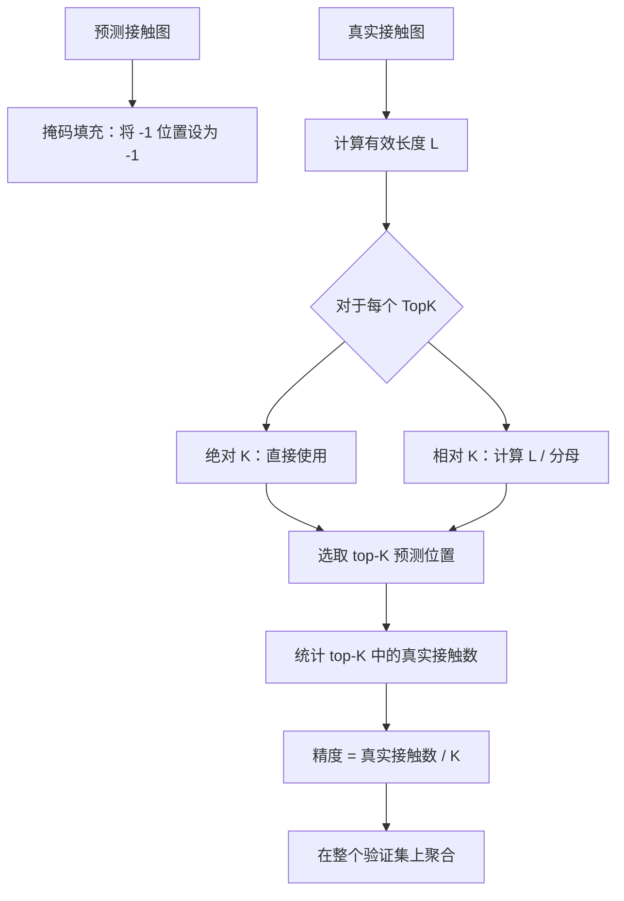
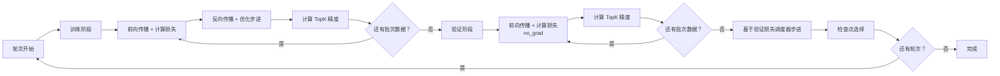

---
slug:12-training-and-loss-design
blog_type:normal
---

PLMGraph-Inter 的训练流程围绕三大核心组件构建：**自定义加权二元交叉熵损失**、适配蛋白质间接触图的 **TopK 精度评估协议**，以及处理变长蛋白质对的**随机裁剪策略**。这些组件协同作用，共同应对蛋白质-蛋白质界面预测中固有的极端类别不平衡问题——即与两个蛋白质表面的完整笛卡尔积相比，相互作用的残基对极为稀疏——同时保持可微性与计算上的易处理性。

## 损失函数：非对称重加权二元交叉熵

核心损失实现为 `ppi_loss`，这是一个 `nn.Module` 子类，它通过**依赖于预测值的非对称重加权**扩展了标准的二元交叉熵。该设计编码了一个关键的结构性洞察：在界面预测场景中，假阴性（漏报真实的蛋白质间接触）的代价远高于假阳性，且惩罚力度应根据模型当前的置信度水平进行自适应调整。

当提供加权参数 `alpha` 时，每个像素的损失变为：

$$\mathcal{L} = -y \cdot \log(\hat{y}) \cdot \alpha(2-\hat{y})^2 - (1-y) \cdot \log(1-\hat{y}) \cdot (1-\alpha)(1+\hat{y})^3$$

其中 $y$ 为真实的接触标签，$\hat{y}$ 为经 sigmoid 激活的预测值。**正项**由 $\alpha(2-\hat{y})^2$ 缩放，当模型预测偏低（$\hat{y} \to 0$）时，该系数随之*增大*，从而放大难以检测接触的梯度。**负项**由 $(1-\alpha)(1+\hat{y})^3$ 缩放，当模型正确拒绝非接触（$\hat{y} \to 0$）时，该系数随之*减小*，从而抑制来自占绝对多数的负类的过度梯度流。当 `alpha=None`（默认训练配置）时，该损失退化为标准的无加权二元交叉熵——这是一项审慎的选择，在初始收敛阶段优先保障训练稳定性，而非采用激进的重加权。

在归约之前，会逐元素应用二元 `mask`，将填充位置（在接触图中编码为 `-1`）的损失贡献置零。`reduction` 参数支持 `'sum'` 和 `'mean'` 两种模式，实践中采用 `'sum'` 以在变长输入间保留绝对的梯度幅度。

来源：[train.py](train.py#L46-L79)

## 训练配置与优化器

训练框架采用 **AdamW** 优化器，权重衰减为 0.1，学习率为 0.001，默认 β₁=0.9、β₂=0.999。此配置非常契合混合 GVP-ResNet 架构：解耦的权重衰减防止了对 GVP 向量门控参数的过度正则化，而相对较高的基础学习率之所以可行，是因为 ResNet 输入端的 1×1 通道投影层充当了深层特征拼接的隐式学习率衰减器（参见[特征拼接策略](10-feature-concatenation-strategy)）。

学习率调度遵循 `min` 模式下的 `ReduceLROnPlateau`，耐心值为 3、衰减因子为 0.1、下限 ε=1e-6。这意味着调度器会等待连续 3 次验证损失无改善后，再将学习率衰减 10 倍，仅在优化确实进入平台期后才提供激进衰减。驱动调度器的验证损失是整个验证集上的*总和*（而非平均值）损失。

| 超参数 | 值 | 依据 |
|---|---|---|
| 优化器 | AdamW | 针对混合架构的解耦衰减 |
| 学习率 | 0.001 | 为 96 通道 ResNet 主干网络平衡 |
| 权重衰减 | 0.1 | Transformer 衍生特征的标准配置 |
| β₁, β₂ | 0.9, 0.999 | 默认动量估计 |
| 学习率调度器 | ReduceLROnPlateau | 自适应损失平台期 |
| 耐心值 | 3 个 epoch | 保守的衰减触发条件 |
| 衰减因子 | 0.1 | 激进的单步衰减 |
| 学习率下限 | 1e-6 | 防止停滞 |
| 训练轮次 | 100 | 上限；通过最佳检查点提前停止 |
| 批大小 | 1 | 每个样本均为完整的蛋白质对（大小可变） |

来源：[train.py](train.py#L109-L123)

## 大型蛋白质对的随机裁剪

在训练期间，沿任一轴超过 400 个残基的蛋白质对会被**随机裁剪**为固定的 400×400 子图。每次前向传播都会均匀随机采样裁剪起点：`starta ~ U(0, L_A - 400)` 和 `startb ~ U(0, L_B - 400)`。此举具有双重目的：将 GPU 显存消耗限制在可预测的上限内；作为一种隐式的**数据增强**，使模型在不同 epoch 中能观察到接触图的不同空间窗口。对于短于 400 个残基的蛋白质，不应用裁剪——直接使用完整的图。

此裁剪策略与 `mask_map` 和 `contact_map` 张量交互，这些张量以相同方式切片以保持对齐。二维配对特征（`p2d`）同样在模型的前向传播中，使用相同的 `starta`、`startb` 和 `max_aa` 参数进行窗口化裁剪。

来源：[train.py](train.py#L183-L188)

## TopK 精度评估协议

`top_statistics_ppi` 函数实现了蛋白质-蛋白质界面预测的标准评估指标：**TopK 精度**。给定预测的接触概率图和真实的二元接触图，该函数计算 K 个最高置信度预测中真实接触所占的比例。

该协议同时支持**绝对** K 值（如 K=5, 10, 20, 50, 1）和**长度相关** K 值（如 L/5, L/10, L/20），其中 L 是排除填充位置后（接触图行/列和等于 `-L` 的残基，表明为完全填充）两个有效蛋白质长度的最小值。长度相关指标是该领域的标准，因为它们对蛋白质大小进行了归一化——固定的 K=10 对于 500 个残基的蛋白质而言轻而易举，但对于 30 个残基的蛋白质却几乎不可能完成。

评估流程同时跟踪八个 TopK 指标：`['L/5', 'L/10', 'L/20', 50, 20, 10, 5, 1]`。这些指标从最宽松（L/5）到最严格（top-1）不等，全面刻画了模型在多个工作点上的排序质量。

来源：[train.py](train.py#L20-L43), [train.py](train.py#L127-L131)

## 训练循环架构

训练循环遵循经典的**轮次-阶段**模式，训练和验证过程交替执行。在每个轮次内，两个阶段各自遍历相应的数据加载器，但梯度计算由 `torch.set_grad_enabled(phase == 'train')` 门控。一个值得注意的实现细节：优化器步进和梯度清零在**每个样本之后**执行（等效批大小 = 1），`optimizer.zero_grad()` 在循环之前以及 `optimizer.step()` 之后立即调用。这确保了变长输入之间不会发生梯度累积。

每个轮次会记录每个 TopK 指标的验证精度，运行损失驱动学习率调度器。训练精度同样被跟踪，但不影响任何调度或检查点决策——它纯粹作为检测过拟合的诊断依据。

来源：[train.py](train.py#L149-L228)

## 多准则模型检查点保存

检查点保存策略是**多准则**的：每当八个 TopK 指标中的任意一个达到新的最高验证精度时，就会为该指标单独保存模型权重；此外，还会为全局最小验证损失额外保存一个检查点。这导致每次训练运行最多生成 9 个最佳性能快照，每个快照针对不同的精度工作点进行了优化。

当某个 TopK 指标发现新的最佳值时，会在保存新检查点之前删除该指标对应的旧检查点，以防存储膨胀。此外，每个轮次都会保存一个完整检查点（`{savepath}_{epoch}.pkl`），从而支持回滚至任意中间状态。交叉验证集成（参见[交叉验证集成](13-cross-validation-ensemble)）中使用的最终模型权重，是根据下游评估性能从这些按指标划分的最佳检查点中选出的。

| 检查点类型 | 触发条件 | 文件模式 | 数量 |
|---|---|---|---|
| 按 TopK 最佳 | 该 K 值出现新的最高验证精度 | `GCN1_5_{K}.pth` | 最多 8 |
| 最小损失 | 出现新的全局最小验证损失 | `GCN1_5_minloss.pth` | 1 |
| 按轮次 | 每个轮次完成时 | `GCN1_5_{epoch}.pkl` | 最多 100 |

<CgxTip>多准则检查点保存反映了 PPI 预测中的一个现实情况：“最佳”模型取决于下游应用。针对 top-1 精度优化的模型可能会遗漏 top-L/5 模型所能捕获的中等置信度接触，反之亦然。选择最能服务目标工作点的检查点是一种显式的设计选择，而非缺陷。</CgxTip>

来源：[train.py](train.py#L134-L147), [train.py](train.py#L230-L247)

## 推理时的对称性增强

在预测阶段（与训练不同），模型利用**特征拼接的非对称性**为每个集成成员生成两个互补预测。前向传播 `model(A, B, p2d_rt)` 生成“A 行、B 列”的预测图，而转置传播 `model(B, A, p2d_sw)` 生成“B 行、A 列”的预测图。将两者平均为 `pred_A→B + pred_B→A.T`，这利用了二维配对特征在两个方向上均已预计算（`rt_p2d` 和 `sw_p2d`）的特性。跨 7 个集成成员，这会产生 14 个总预测，对其求平均以生成最终的接触概率图。这种对称性增强以极低的计算成本有效实现了集成规模翻倍。

来源：[predict.py](predict.py#L176-L201)

## 数据划分与洗牌协议

训练/验证集划分通过简单的基于索引的分区执行：打乱后前 1050 个样本留作验证集，其余构成训练集。洗牌过程使用 `random.seed(42)` 并对文件列表执行 10 轮 `random.shuffle()`，确保可复现分区的同时打破源数据中的任何系统性排序（例如，按复合物类型或序列长度分组的蛋白质）。两个数据加载器均设置 `shuffle=True`、`num_workers=6`、`prefetch_factor=3` 和 `persistent_workers=True`，以在训练期间实现高效的 I/O 重叠。