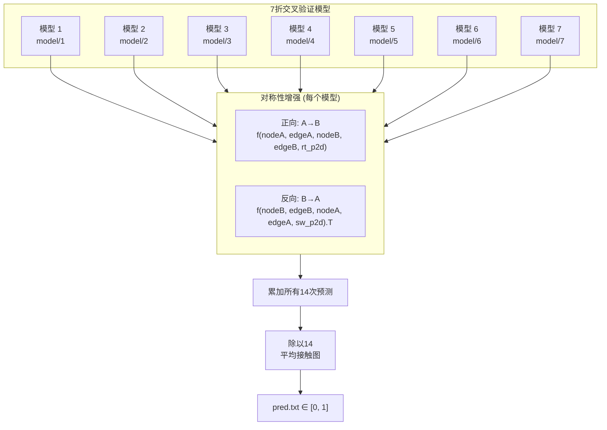

---
slug:13-cross-validation-ensemble
blog_type:normal
---


PLMGraph-Inter 最终的蛋白质间接触预测并非来自单一模型，而是来自一个**14次预测的集成**，该集成了结合了7折交叉验证与双向对称性增强。这种双重策略利用了预测方差的两个独立来源——跨折次的模型多样性，以及蛋白质-蛋白质界面中固有的几何对称性——从而无需任何可学习的集成权重，即可生成校准且鲁棒的接触概率图。

## 集成架构概述

该集成在推理时作为一种确定性平均过程运行，通过对结构相同但权重不同的模型进行14次独立前向传播：



这7个模型被依次加载，其权重通过 `load_state_dict` 设置，在进入下一个折次之前会生成两次预测。最终输出是所有14次预测的算术平均值，产生范围在 [0, 1] 内的逐残基对概率。

来源: [predict.py](/predict.py#L176-L201), [README.md](/README.md#L55-L57)

## 7折交叉验证：训练与模型多样性

在训练期间，包含7362个二聚体的完整数据集被划分为7个折次。对于每个折次 *k*，七分之一的数据作为验证集，其余六分之七作为训练集。每个折次都会实例化一个全新的 `ResNet(9, 3)` 模型并从头开始训练，最终生成7个独立收敛的权重文件，存储在 `model/1` 到 `model/7` 目录下。

训练脚本揭示了验证集的选择机制：数据集列表使用固定种子进行洗牌（`random.seed(42)` 并附加10次额外洗牌），然后将前1050条数据分配给验证集。在7折方案中，每个折次轮换使用这1050个样本的子集作为验证集，确保7362个样本池中的每个二聚体都恰好在其中一个折次中被留作验证。这保证了这7个模型是**去相关的**——每个模型在训练期间从未见过不同的数据子集，从而引入了有利于集成平均的真实预测方差。

| 属性 | 值 |
|---|---|
| 训练二聚体总数 | 7362 |
| 折数 | 7 |
| 每折验证集大小 | ~1050 |
| 每折训练集大小 | ~6312 |
| 随机种子 | 42 |
| 每折模型检查点 | 1 (基于 top-k 指标的最佳模型) |
| 集成权重文件总数 | 7 |

<CgxTip>7折配置在推理时不可配置——预测管道通过硬编码 `range(1, 8)` 来枚举模型路径。更改折数需要重新训练所有模型，并修改路径列表以及平均步骤中的分母。</CgxTip>

来源: [train.py](/train.py#L82-L99), [train.py](/train.py#L230-L247), [predict.py](/predict.py#L176-L177), [data/README.md](/data/README.md#L1-L2)

## 对称性增强：双向预测

蛋白质-蛋白质相互作用在本质上是**观测上不对称但现实中对称的**：如果链A的残基 *i* 与链B的残基 *j* 接触，那么链B的残基 *j* 也与链A的残基 *i* 接触。PLMGraph-Inter 利用这一点，在每个模型中生成两次预测——每次对应一种链顺序——并对它们进行平均。

### 正向（A → B）

模型接收链A的 GVP 嵌入图作为第一个参数，链B的作为第二个参数，并配以**右向**的二维特征图 `rt_p2d`：

```python
pred = model(nodeA, edgeA, edge_indexA,
             nodeB, edgeB, edge_indexB,
             rt_p2d)
```

这会生成一个形状为 `(L_A, L_B)` 的预测矩阵，其中 `L_A` 和 `L_B` 分别为对应链的长度。

来源: [predict.py](/predict.py#L188-L190)

### 反向（B → A）

链参数被交换，并使用**交换后的**二维特征图 `sw_p2d`。随后将结果**转置**，以重新对齐至原始的 (A, B) 轴顺序：

```python
pred = model(nodeB, edgeB, edge_indexB,
             nodeA, edgeA, edge_indexA,
             sw_p2d)
all_preds += pred.T
```

转置操作至关重要：若不进行转置，反向预测相对于正向预测会占据错误的矩阵方向，导致求和失去意义。

来源: [predict.py](/predict.py#L193-L198)

### `rt_p2d` 与 `sw_p2d` 的作用

这两对特征图编码了相同的共进化信息，但具有**不同的空间方向**：

| 特征图 | 组成 | 方向 |
|---|---|---|
| `rt_p2d` | CCMpred + alnstats + MSA-1b 右注意力 | 原生 (A × B) |
| `sw_p2d` | CCMpredᵀ + alnstatsᵀ + MSA-1b 交换注意力 | 转置 (B × A) |

交换特征是通过转置成对统计量（`ccmpred.swapaxes(-2,-1)`、`alnstats.swapaxes(-2,-1)`）并使用单独计算的交换 MSA-1b 注意力图构建的。这确保了反向模型接收到几何一致的二维特征——而非简单地在逆序中重用正向特征。

来源: [load_feature.py](/load_feature.py#L86-L93)

## 聚合：14次预测的均匀平均

集成聚合是一种简单的**均匀算术平均**——没有堆叠，没有加权，也没有基于置信度的选择。在7个模型各自贡献2次预测之后：

```python
all_preds = all_preds.numpy()
np.savetxt(os.path.join(result_path,'pred.txt'), all_preds / 14)
```

除以14（7折 × 2方向）将 sigmoid 输出的原始总和转换为适当的平均值。由于每个模型的前向传播产生的值都在 [0, 1] 范围内（最后一层为 `nn.Sigmoid`），平均后的结果同样位于 [0, 1] 内，可解释为接触概率。

### 为什么无需可学习权重的平均依然有效

交叉验证集成平均在此处有效，有三个确切的原因：

1. **偏差-方差分解**：每个折次模型具有相同的架构，但在不同的数据分区上训练。平均能够降低方差同时保持（近乎相同的）偏差，这是经典的集成优势。
2. **对称性作为正则化**：双向增强有效地免费将推理样本量翻倍。由于模型在架构上并非对称的（链A和链B在同一个图中遵循不同的代码路径），这两个方向会产生真正不同的预测，其平均值比任何单独一个都更鲁棒。
3. **Sigmoid 饱和抑制**：单个模型可能会在0或1附近产生过度自信的预测。跨14个来源的平均自然会将饱和值拉向集成均值，从而产生校准更好的概率。

来源: [predict.py](/predict.py#L200-L201), [model.py](/model.py#L190-L252), [README.md](/README.md#L55-L57)

## 完整预测流程

下表追踪了集成从权重加载到最终输出的完整执行序列：

| 步骤 | 操作 | 累加器状态 |
|---|---|---|
| 1 | 初始化 `all_preds = zeros(L_A, L_B)` | 0 |
| 2 | 加载 `model/1`，预测 A→B | +pred₁ᴬᴮ |
| 3 | 加载 `model/1`，预测 B→A，加转置 | +pred₁ᴮᴬᵀ |
| 4 | 加载 `model/2`，预测 A→B | +pred₂ᴬᴮ |
| 5 | 加载 `model/2`，预测 B→A，加转置 | +pred₂ᴮᴬᵀ |
| ... | ... (折次 3–7) | ... |
| 14 | 加载 `model/7`，预测 B→A，加转置 | +pred₇ᴮᴬᵀ |
| 15 | 除以14，写入 `pred.txt` | Σpred / 14 |

<CgxTip>虽然执行了14次前向传播，但只发生了**7次模型加载操作**。在每个折次的迭代中，正向和反向方向复用了相同的模型权重——改变的仅仅是输入特征的顺序。与加载14个不同模型相比，这减少了一半的 I/O 开销。</CgxTip>

来源: [predict.py](/predict.py#L176-L201)

## 与训练检查点选择的关系

训练管道在每个折次中保存多种检查点类型，但集成仅使用每个折次的**top-k 最佳**检查点。在训练期间，系统会跟踪八个 top-k 阈值（`L/5`、`L/10`、`L/20`、50、20、10、5、1）的精度，并在每个阈值达到新的最高标准时保存独立的模型文件。此外，还会保存一个最小损失检查点。集成的7个权重文件代表了每个折次中选出的最佳检查点——极有可能是 top-1 或最小损失变体，因为它们捕捉了最严格的性能标准。

来源: [train.py](/train.py#L127-L145), [train.py](/train.py#L230-L247)

## 实际考量

**模型权重获取**：这7个权重文件不包含在代码仓库中。必须从 [训练模型 Google Drive 链接](https://drive.google.com/file/d/1Y9eSlIJr-XDG5gREIEeGK4BW_Of0F_UQ/view?usp=sharing) 单独下载，并放置在包含 `1` 到 `7` 子目录的 `model/` 目录下。

**推理成本**：集成将单模型推理时间乘以约14倍（7折 × 2方向）。由于在循环前设置了 `torch.set_grad_enabled(False)`，所有14次前向传播均在纯推理模式下执行，不计算梯度，这在一定程度上抵消了成本。

**Code Ocean 与 GitHub 输出**：Code Ocean capsule 输出原始总和（范围 [0, 14]），而 GitHub 版本输出平均值（范围 [0, 1]）。在这两种情况下，残基对的**排名**是相同的——区别仅在于尺度。

来源: [predict.py](/predict.py#L178-L179), [README.md](/README.md#L52-L57)

---

理解集成对独立训练折次模型的依赖，为训练过程本身提供了背景。关于生成每个折次权重的损失函数、优化器配置和学习率调度的详细信息，请参阅[训练与损失设计](12-training-and-loss-design)。关于在集成运行前协调特征准备的预测管道，请参阅[预测管道](11-prediction-pipeline)。