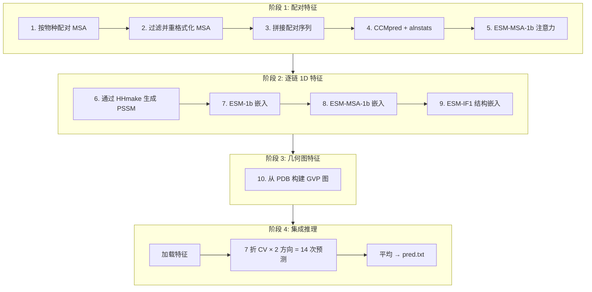

---
slug:2-quick-start
blog_type:normal
---


本指南将引导你安装 PLMGraph-Inter，并在 30 分钟内运行你的首次蛋白质间接触预测。PLMGraph-Inter 通过将**蛋白质语言模型嵌入**、**几何图特征**和**共进化信号**融合到 Dilated ResNet 架构中，来预测两个相互作用蛋白质之间的残基水平接触。


来源: [README.md](/README.md#L1-L64), [predict.py](/predict.py#L1-L202)

## 前置条件

PLMGraph-Inter 依赖两类软件：**Python 包**和**外部生物信息学工具**。在运行预测之前，必须确保这两类软件可用。

### Python 环境

| 包 | 版本 / 备注 | 用途 |
|---------|---------------|---------|
| Python | 3.8 | 运行时 |
| PyTorch | 1.9 | 深度学习框架 |
| Biopython | — | FASTA/PDB 解析 |
| esm | Facebook Research | ESM-1b, ESM-MSA-1b, ESM-IF1 嵌入 |
| numpy | — | 数值运算 |
| GVP | drorlab/gvp-pytorch | 几何向量感知机图网络层 |
| PyG | PyTorch Geometric | 图构建工具 |

<CgxTip>在运行之前，必须从 [esm 仓库](https://github.com/facebookresearch/esm)的 "Available Models and Datasets" 表中**手动下载** ESM 模型权重 (ESM-1b, ESM-MSA-1b, ESM-IF1)。这些权重不会通过 `pip install esm` 安装。</CgxTip>

### 外部生物信息学工具

这些命令行工具会在特征准备阶段被 `predict.py` 调用。请逐一安装并记录其绝对路径——你需要在 `predict.py` 中配置这些路径。

| 工具 | 来源 | 在流程中的作用 |
|------|--------|-----------------|
| **CCMpred** | [soedinglab/CCMpred](https://github.com/soedinglab/CCMpred) | 在配对 MSA 上进行伪似然接触预测 |
| **alnstats** | [metapsicov/alnstats](https://github.com/psipred/metapsicov/tree/master/src/alnstats) | 从 MSA 提取共进化统计信息 |
| **fasta2aln** | [hhsuite2/fasta2aln](https://github.com/kad-ecoli/hhsuite2/blob/master/bin/fasta2aln) | MSA 格式转换 |
| **hh-suite** | [soedinglab/hh-suite](https://github.com/soedinglab/hh-suite) | HMM 构建 (`hhmake`, `hhfilter`) |

<CgxTip>下载 `alnstats` 和 `fasta2aln` 后，请使用 `chmod +x <binary>` 为其添加可执行权限。它们是预编译的可执行文件，而非 Python 包。</CgxTip>

来源: [README.md](/README.md#L4-L19), [predict.py](/predict.py#L23-L35)

## 安装

安装过程包含四个连续步骤：克隆仓库、配置工具路径、设置 ESM 模型权重和下载训练好的模型。


### 步骤 1 — 克隆仓库

```bash
git clone https://github.com/ChengfeiYan/PLMGraph-Inter.git
cd PLMGraph-Inter
```

来源: [README.md](/README.md#L21-L22)

### 步骤 2 — 配置工具和模型路径

打开 [predict.py](/predict.py#L23-L35) 并修改文件顶部的路径变量，使其与你的系统相匹配。需要更新**两组**路径：

**外部工具路径**（第 25–30 行）：

```python
CCMPred = '/your/path/to/CCMpred/bin/ccmpred'
reformat = '/your/path/to/fasta2aln'
alnstats = '/your/path/to/metapsicov/bin/alnstats'
hhmake   = '/your/path/to/hh-suite/build/bin/hhmake'
hhfilter = '/your/path/to/hh-suite/build/bin/hhfilter'
LoadHHM  = '/your/path/to/PLMGraph-Inter/plm/LoadHHM.py'
```

**ESM 模型权重路径**（第 33–35 行）：

```python
esm1b_location     = "/your/path/to/esm1b_t33_650M_UR50S.pt"
esm_msa1b_location = "/your/path/to/esm_msa1b_t12_100M_UR50S.pt"
esm_if1_location   = "/your/path/to/esm_if1_gvp4_t16_142M_UR50.pt"
```

来源: [predict.py](/predict.py#L23-L35), [README.md](/README.md#L23)

### 步骤 3 — 复制 ESM 回归权重

ESM-1b 模型需要一个**接触回归检查点**用于注意力计算。将附带的回归权重复制到你的 ESM-1b 模型权重所在目录：

```bash
cp data/regression/esm1b_t33_650M_UR50S-contact-regression.pt <esm1b_weights_directory>/
```

来源: [README.md](/README.md#L24), [data/regression](/data/regression)

### 步骤 4 — 下载训练模型

从 [Google Drive](https://drive.google.com/file/d/1Y9eSlIJr-XDG5gREIEeGK4BW_Of0F_UQ/view?usp=sharing) 下载预训练的 PLMGraph-Inter 模型，并将其解压到项目根目录的 `model/` 文件夹中。流程预期在 `model/1` 到 `model/7` 路径下存在 7 个模型文件，对应 7 个交叉验证折：

```
model/
├── 1
├── 2
├── 3
├── 4
├── 5
├── 6
└── 7
```

来源: [README.md](/README.md#L25-L26), [predict.py](/predict.py#L176)

## 输入数据准备

PLMGraph-Inter 每次预测需要**六个输入文件**——每条蛋白质链各三个。下表描述了每个输入项及其作用：

| 参数 | 描述 | 格式 | 示例 |
|----------|-------------|--------|---------|
| `sequenceA` | 蛋白质 A 的 FASTA 文件 | `.fasta` | `1GL1_A.fasta` |
| `msaA` | 蛋白质 A 的多序列比对 | `.a3m` (UniRef100) | `1GL1_A_uniref100.a3m` |
| `pdbA` | 蛋白质 A 的 3D 结构 | `.pdb` (链 A) | `1GL1_A.pdb` |
| `sequenceB` | 蛋白质 B 的 FASTA 文件 | `.fasta` | `1GL1_I.fasta` |
| `msaB` | 蛋白质 B 的多序列比对 | `.a3m` (UniRef100) | `1GL1_I_uniref100.a3m` |
| `pdbB` | 蛋白质 B 的 3D 结构 | `.pdb` (链 A) | `1GL1_I.pdb` |

`example/` 目录为 **1GL1** 蛋白质复合体（胰凝乳蛋白酶-抑制剂）提供了即用型样本输入：

```
example/
├── 1GL1_A.fasta              ← 链 A 序列 (245 个残基)
├── 1GL1_A_uniref100.a3m      ← 链 A MSA (131,782 行)
├── 1GL1_I.fasta              ← 链 I 序列 (36 个残基)
└── 1GL1_I_uniref100.a3m      ← 链 I MSA
```

<CgxTip>MSA 必须源自 **UniRef100** 数据库。如果你的 PDB 文件存在残基缺失，请在运行预测前使用 [MODELLER](https://salilab.org/modeller/tutorial/iterative.html) 进行补全。PDB 文件必须包含链 **A**，且每个残基均具有 N, CA, C, O 原子。</CgxTip>

有关输入格式的详细规范，请参见[输入数据要求](3-input-data-requirements)。

来源: [README.md](/README.md#L28-L38), [example/1GL1_A.fasta](/example/1GL1_A.fasta#L1-L2), [example/1GL1_I.fasta](/example/1GL1_I.fasta#L1-L2), [pdb_graph.py](/pdb_graph.py#L206-L211)

## 运行你的首次预测

### 命令语法

```bash
python predict.py sequenceA msaA pdbA sequenceB msaB pdbB result_path device
```

| 参数 | 描述 |
|-----------|-------------|
| `result_path` | 中间特征和最终预测结果的输出目录 |
| `device` | 计算设备：`cpu`, `cuda:0`, `cuda:1` 等 |

### 示例：预测 1GL1 蛋白质间接触

运行内置示例（注意：你需要将 `1GL1_A.pdb` 和 `1GL1_I.pdb` 放置在 `example/` 目录中，因为 PDB 文件因体积原因未包含在仓库中）：

```bash
python predict.py \
  ./example/1GL1_A.fasta \
  ./example/1GL1_A_uniref100.a3m \
  ./example/1GL1_A.pdb \
  ./example/1GL1_I.fasta \
  ./example/1GL1_I_uniref100.a3m \
  ./example/1GL1_I.pdb \
  ./example/result \
  cuda:0
```

来源: [README.md](/README.md#L40-L41), [predict.py](/predict.py#L40-L41)

## 理解预测流程

当你运行 `predict.py` 时，它会在推理之前执行一个多阶段的特征工程流程。理解这些阶段有助于你诊断问题并估算运行时间。



### 阶段详情

| 阶段 | 步骤 | 核心操作 | 输出文件 |
|-------|-------|----------------|--------------|
| **配对特征** | 1–5 | 感知物种的 MSA 配对，CCMpred 共进化，ESM-MSA-1b 交叉注意力 | `paired.a3m`, `paired.ccmpred`, `msa1b_rt.attn.npy` |
| **1D 特征** | 6–9 | PSSM, ESM-1b 表征, ESM-MSA-1b 表征, ESM-IF1 表征 (逐链) | `A_hhm.pkl`, `A_esm1b.repr.npy`, `A_msa1b.repr.npy`, `A_esmif.repr.npy` |
| **图特征** | 10 | GVP 图：旋转坐标系，局部朝向，RBF 边距离，位置嵌入 | `graphA.pkl`, `graphB.pkl` |
| **推理** | 11 | 7 折模型 × 2 链顺序 (A→B 和 B→A)，取平均 | `pred.txt` |

### 推理详情

集成预测会以**两种方向顺序**（A→B 和 B→A）运行 7 个交叉验证模型，共产生 14 次预测并取平均，以生成最终的接触概率图。每次预测都是 Dilated ResNet 经过 Sigmoid 激活后的输出：

```python
# 简化自 predict.py 第 183-198 行
for weight_file in ['model/1', ..., 'model/7']:
    model.load_state_dict(torch.load(weight_file))
    pred_AB = model(nodeA, edgeA, edge_indexA, nodeB, edgeB, edge_indexB, rt_p2d)
    pred_BA = model(nodeB, edgeB, edge_indexB, nodeA, edgeA, edge_indexA, sw_p2d)
    all_preds += pred_AB + pred_BA.T
all_preds /= 14  # 对 14 次预测取平均
```

来源: [predict.py](/predict.py#L47-L201), [load_feature.py](/load_feature.py#L42-L95), [pdb_graph.py](/pdb_graph.py#L197-L263)

## 输出解读

最终输出保存在你指定的 `result_path` 下的 `pred.txt` 中。该文件包含一个形状为 (L_A × L_B) 的**接触概率矩阵**，其中 L_A 和 L_B 分别是蛋白质 A 和 B 的序列长度。每个元素的取值范围从 **0 到 1**，表示对应的残基对形成蛋白质间接触的预测概率。

```
# 预测后 result_path 目录内容:
pred.txt              ← 最终平均接触概率矩阵
paired.a3m            ← 配对 MSA (中间文件)
paired.ccmpred        ← CCMpred 输出 (中间文件)
A_hhm.pkl             ← 链 A 的 PSSM (中间文件)
A_esm1b.repr.npy      ← ESM-1b 嵌入 (中间文件)
A_msa1b.repr.npy      ← ESM-MSA-1b 嵌入 (中间文件)
A_esmif.repr.npy      ← ESM-IF1 嵌入 (中间文件)
graphA.pkl            ← 链 A 的几何图 (中间文件)
... (以及相应的 B 链文件)
```

1GL1 的示例输出如下所示。注意：由于 GitHub 文件大小限制，内置示例的 MSA 经过**下采样**，因此使用完整 MSA 的实际性能将显著优于示例。


来源: [predict.py](/predict.py#L200-L201), [README.md](/README.md#L46-L49)

## 故障排除

| 问题 | 原因 | 解决方案 |
|---------|-------|----------|
| 工具二进制文件出现 `FileNotFoundError` | `predict.py` 中的路径未更新 | 验证 [predict.py:25-30](/predict.py#L25-L30) 处的所有 6 个工具路径 |
| ESM 权重出现 `FileNotFoundError` | 模型权重未下载或路径错误 | 从 esm 仓库下载；更新 [predict.py:33-35](/predict.py#L33-L35) 处的路径 |
| `model/1` 出现 `FileNotFoundError` | 训练模型未正确放置 | 从 [Google Drive](https://drive.google.com/file/d/1Y9eSlIJr-XDG5gREIEeGK4BW_Of0F_UQ/view?usp=sharing) 下载，解压至 `model/` 目录 |
| PDB 解析时出现 `KeyError: 'A'` | PDB 链未命名为 'A' | 将你的 PDB 文件中的链重命名为 'A' ([pdb_graph.py:210](/pdb_graph.py#L210) 的要求) |
| 残基缺失错误 | PDB 存在间隔 | 使用 [MODELLER](https://salilab.org/modeller/tutorial/iterative.html) 补全缺失残基 |
| GPU 显存溢出 (OOM) | 大蛋白质 + 完整 MSA | 使用 `cpu` 设备或通过 `hhfilter -diff` 降低 MSA 深度 |
| alnstats/fasta2aln 提示 `permission denied` | 未标记为可执行文件 | 运行 `chmod +x <binary>` |

来源: [predict.py](/predict.py#L23-L35), [pdb_graph.py](/pdb_graph.py#L206-L211), [README.md](/README.md#L38)

## 后续步骤

现在你已经能够运行预测，接下来可以深入探索其架构与特征工程：

- **[输入数据要求](3-input-data-requirements)** — FASTA, MSA 和 PDB 文件格式的详细规范
- **[架构概览](4-architecture-overview)** — 端到端系统设计与数据流
- **[蛋白质语言模型嵌入](5-protein-language-model-embeddings)** — 如何提取 ESM-1b, ESM-MSA-1b 和 ESM-IF1
- **[几何图构建](6-geometric-graph-construction)** — 从 3D 结构构建 GVP 图
- **[预测流程](11-prediction-pipeline)** — 深入解析推理工作流与集成策略

若需无需手动配置的完全可复现环境，请使用 [Code Ocean Capsule](https://codeocean.com/capsule/4368186/tree/v1)。请注意，Code Ocean 输出的是 14 次预测的**总和**（范围 0–14），而 GitHub 代码输出的是**平均值**（范围 0–1）；两者的残基对排名完全一致。