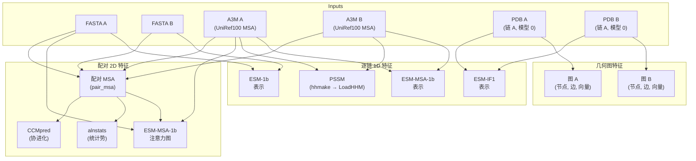

---
slug:3-input-data-requirements
blog_type:normal
---


PLMGraph-Inter 需要为**每条蛋白质链提供三个输入文件**——一个 FASTA 序列文件、一个 A3M 多序列比对文件和一个 PDB 结构文件——以预测蛋白质二聚体（目标 A + 目标 B）的链间接触。本页面详细说明了每种文件类型的具体格式、内容约束和来源要求，确保你在调用 [predict.py](predict.py#L50) 之前，输入数据已符合流程处理标准。

## 必需的输入文件

预测流程恰好接受**八个位置参数**，其中六个是两条相互作用链的文件路径：

```
python predict.py sequenceA msaA pdbA sequenceB msaB pdbB result_path device
```

| 参数 | 描述 | 文件类型 | 每条链必需 |
|---|---|---|---|
| `sequenceA` / `sequenceB` | 氨基酸序列 | `.fasta` | 1 |
| `msaA` / `msaB` | 来自 UniRef100 的多序列比对 | `.a3m` | 1 |
| `pdbA` / `pdbB` | 3D 原子坐标 | `.pdb` | 1 |
| `result_path` | 中间和最终结果的输出目录 | directory | — |
| `device` | 计算设备（`cpu`、`cuda:0` 等） | string | — |

来源: [predict.py](predict.py#L50-L57), [README.md](README.md#L34-L42)

## FASTA 文件格式

FASTA 文件提供了一条相互作用蛋白质的**单链氨基酸序列**。PLMGraph-Inter 通过 Biopython 的 `SeqIO.parse` 读取该文件，并提取最后一行作为原始序列字符串。该序列会被三个不同的特征提取器使用：**ESM-1b**（逐残基表示）、配对 MSA 构造器（用于形成拼接的配对序列）以及 **ESM-MSA-1b 注意力**（用于确定配对 MSA 中链 A 和链 B 之间的边界索引）。

**格式规范：**

```
>1GL1
CGVPAIQPVLSGLSRIVNGEEAVPGSWPWQVSLQDKTGFHFCGGSLINENWVVTAAHCGVTTSD...
```

- **第 1 行**：以 `>` 开头的头部行，后跟一个标识符（例如 PDB ID）。流程不解析该标识符，但为了清晰起见，它应与 PDB 链相匹配。
- **第 2 行**：单行包含使用标准单字母代码（20 种规范残基）的氨基酸序列。无空格，无内部换行符。

**关键约束**：序列长度必须与相应 PDB 文件链 A 中的残基数**完全相同**。不匹配会导致特征比对时出现隐匿的索引错误。流程通过 `open(fasA).readlines()[-1].strip()` 读取序列，这意味着它提取的是文件的**最后一行**——请确保文件末尾没有多余的空行。

来源: [example/1GL1_A.fasta](example/1GL1_A.fasta#L1-L2), [example/1GL1_I.fasta](example/1GL1_I.fasta#L1-L2), [predict.py](predict.py#L79-L84), [plm/esm1b_repr.py](plm/esm1b_repr.py#L26-L30)

## A3M (MSA) 文件格式

A3M 文件提供了一条链的**多序列比对（MSA）**，数据来源于 **UniRef100** 数据库。这是数据量最大的输入，对三个特征通道至关重要：**PSSM**（通过 HH-suite 的 `hhmake`）、**ESM-MSA-1b 表示**（来自 MSA transformer 的逐残基嵌入）和**配对 MSA 协进化**（链间进化耦合信号）。

**格式规范：**

```
>UniRef100_UPI00187CB339/1-199 [subseq from] ... TaxID=8177 RepID=UPI00187CB339
----------------------------------------------------MSAAHCFSSPSTQISLGRQNLQ...
>UniRef100_A0A6J2VG70/32-270 [subseq from] ... TaxID=29144 RepID=A0A6J2VG70_CHACN
-----------LNNRIVGGQDAPAGSWPWQASLHK-FGGHVCGGSLINKEWVLSAAHCFSSFSTTVYLG...
```

- 每个条目由一个**头部行**（以 `>` 开头）和一个**序列行**组成，序列行包含大写残基、小写插入字符以及缺口符号（`-`）。
- **第一条序列**必须是查询序列（与 FASTA 内容相同，可能带有缺口填充）。
- **小写字符**表示相对于查询比对的插入——它们在输入到 ESM-MSA-1b 之前，会被流程的 `remove_insertions()` 函数自动剥离。
- **缺口符号**（`-`）表示该同源序列中缺失的比对位置。

**来源要求**：如 README 中所述，MSA **必须来源于 UniRef100 数据库**。使用 UniRef90 或 UniRef30 的 MSA 会降低预测质量，因为配对算法依赖于 UniRef100 簇头部中特有的物种级别分类注释。流程在 MSA 配对期间会解析 A3M 头部中的 `Tax=` 和 `TaxID=` 字段。

**MSA 深度处理**：流程对每个单独和配对的 MSA 应用 `hhfilter -diff 256`，最多保留 **256 条多样化序列**。ESM-MSA-1b 模型也通过带有 `max_msa = 256` 的 `read_msa(msa_file, max_msa)` 最多读取 256 条序列。更深的 MSA 会被自动二次采样，而较浅的 MSA（同源序列较少）则会直接削弱协进化和基于注意力的特征。

来源: [README.md](README.md#L42-L43), [plm/msa1b_repr.py](plm/msa1b_repr.py#L25-L30), [plm/msa1b_repr.py](plm/msa1b_repr.py#L40-L41), [plm/esm1b_repr.py](plm/esm1b_repr.py#L28-L30), [predict.py](predict.py#L68-L76)

## PDB 文件格式

PDB 文件提供了一条相互作用链的 **3D 原子坐标**。它被两个特征提取器使用：**ESM-IF1**（从结构中提取的逆折叠模型表示）和**几何图构造器**（GVP-GNN 节点和边特征）。

**格式规范：**

- 标准 PDB 格式，包含主干原子 **N, CA, C, O** 的 `ATOM` 记录。
- 流程通过 `structure[0]['A']` 显式读取**模型 0** 的**链 A**，并按确切顺序提取原子 `['N', 'CA', 'C', 'O']` 的坐标。
- **虚拟 Cβ 原子**由 N, CA, C 的位置解析计算得出——PDB 文件无需包含 Cβ 记录。

**关键约束：**

| 约束 | 详情 | 失败模式 |
|---|---|---|
| 链 ID 必须为 `A` | `pdb_graph.py` 硬编码了 `chain = model['A']` | 运行时出现 `KeyError` |
| 模型索引必须为 `0` | `model = structure[0]` 仅选择第一个模型 | 若为多模型 PDB 则会静默使用错误的模型 |
| 无缺失残基 | 所有残基必须具有 N, CA, C, O 原子 | 缺失原子时出现 `KeyError` |
| 连续的残基编号 | 残基编号中的缺口会导致与 FASTA/MSA 的索引不一致 | 隐匿的特征错位 |

**缺失残基**：如果实验测定的 PDB 存在缺失残基（在环区中很常见），README 建议在运行流程之前使用 [MODELLER](https://salilab.org/modeller/tutorial/iterative.html) 将其补全。这可确保 PDB 中的残基数与 FASTA 序列长度完全匹配。

**重置链提示**：如果你的目标链具有不同的 ID（例如链 `B` 或 `I`），则必须在将其传递给流程之前，在 PDB 文件中将其重命名为链 `A`。示例目标 1GL1 在生物组装体中使用链 A 和 I，但每条链的 PDB 文件必须将链呈现为 `A`。

来源: [pdb_graph.py](pdb_graph.py#L207-L213), [plm/esmif_repr.py](plm/esmif_repr.py#L14-L18), [README.md](README.md#L42-L43)

## 输入数据流

下图展示了每个输入文件如何馈入特定的特征提取阶段，并最终汇聚到模型的图和成对特征张量中：



来源: [predict.py](predict.py#L59-L143), [load_feature.py](load_feature.py#L46-L72), [load_feature.py](load_feature.py#L75-L108)

## 从每个输入中提取特征

每个输入文件都会激活特定的下游特征计算。下表将每个输入映射到其派生特征以及在 `result_path` 中生成的中间文件：

| 输入文件 | 派生特征 | 中间输出 | 消费者 |
|---|---|---|---|
| `fastaA/B` | ESM-1b 逐残基嵌入 (1280 维) | `{A/B}_esm1b.repr.npy` | `load_feature.graph_feature` |
| `fastaA/B` | 配对序列头部 | `paired.fasta` | `pair_msa.main` |
| `a3mA/B` | 来自 HMM 的 PSSM (30 维) | `{A/B}_hhm.pkl` | `load_feature.graph_feature` |
| `a3mA/B` | ESM-MSA-1b 逐残基嵌入 (768 维) | `{A/B}_msa1b.repr.npy` | `load_feature.graph_feature` |
| `a3mA/B` | 配对 MSA (协进化源) | `paired.a3m` → `filtered_paired.a3m` | CCMpred, alnstats, ESM-MSA-1b attn |
| `a3mA/B` | CCMpred 接触分数 | `paired.ccmpred` | `load_feature.paired_feature` |
| `a3mA/B` | alnstats 统计势 | `paired.pairout` | `load_feature.paired_feature` |
| `a3mA/B` | ESM-MSA-1b 跨链注意力 | `msa1b_rt.attn.npy`, `msa1b_sw.attn.npy` | `load_feature.paired_feature` |
| `pdbA/B` | ESM-IF1 结构嵌入 (512 维) | `{A/B}_esmif.repr.npy` | `load_feature.graph_feature` |
| `pdbA/B` | GVP 图 (标量/向量节点与边) | `graph{A/B}.pkl` | `load_feature.graph_feature` |

来源: [predict.py](predict.py#L59-L143), [load_feature.py](load_feature.py#L46-L108)

## 示例输入文件

`example/` 目录为 **1GL1** 二聚体（胰凝乳蛋白酶-抑制剂复合物）提供了一组可用的输入。链 A（胰凝乳蛋白酶，199 个残基）和链 I（抑制剂，36 个残基）各有一个 FASTA 和 A3M 文件。PDB 文件必须单独获取（由于大小限制，它们未包含在仓库中）。

**链 A** —— 胰凝乳蛋白酶（199 个残基）：

```
>1GL1
CGVPAIQPVLSGLSRIVNGEEAVPGSWPWQVSLQDKTGFHFCGGSLINENWVVTAAHCGVTTSDVVVAGEFDQGSSSEKIQKLKIAKVFKNSKYNSLTINNDITLLKLSTAASFSQTVSAVCLPSASDDFAAGTTCVTTGWGLTRYTNANTPDRLQQASLPLLSNTNCKKYWGTKIKDAMICAGASGVSSCMGDSGGPLVCKKNGAWTLVGIVSWGSSTCSTSTPGVYARVTALVNWVQQTLAAN
```

**链 I** —— 抑制剂（36 个残基）：

```
>1GL1
EISCEPGKTFKDKCNTCRCGADGKSAACTLKACPNQ
```

<CgxTip>仓库中的示例 A3M 文件因 GitHub 文件大小限制而进行了**下采样**。实际运行时应使用全深度的 UniRef100 MSA，以获得最佳的协进化信号质量。</CgxTip>

来源: [example/1GL1_A.fasta](example/1GL1_A.fasta#L1-L2), [example/1GL1_I.fasta](example/1GL1_I.fasta#L1-L2), [README.md](README.md#L47-L48)

## 准备你自己的输入

要在新的目标二聚体上运行 PLMGraph-Inter，你必须按照以下步骤准备六个文件：

**1. 获取每条链的 FASTA 序列**。确保仅使用单字母氨基酸代码，单行格式，无尾部空格。

**2. 使用 HH-suite 的 `hhblits` 针对 UniRef100 数据库生成 UniRef100 MSA**：

```bash
hhblits -i target_A.fasta -d uniref100_2022_02/uniref100_2022_02 -oa3m target_A_uniref100.a3m -n 3
```

**3. 获取或建模每条链的 PDB 结构**。如果使用实验测定的结构，请确保链 ID 为 `A` 且模型索引为 `0`。使用 MODELLER 补全缺失残基。如果仅有预测结构可用（例如来自 AlphaFold2），则提取单体预测并重新格式化为链为 `A` 的标准 PDB。

<CgxTip>在运行完整流程之前，请验证 `len(fasta_sequence) == number_of_residues_in_pdb`。此处的不匹配是导致隐匿预测错误的最常见原因。</CgxTip>

**4. 调用流程：**

```bash
python predict.py ./target_A.fasta ./target_A_uniref100.a3m ./target_A.pdb \
                   ./target_B.fasta ./target_B_uniref100.a3m ./target_B.pdb \
                   ./result_output cuda:0
```

来源: [README.md](README.md#L34-L43), [predict.py](predict.py#L50-L57)

## 接下来去哪

既然你已经了解了输入要求，合乎逻辑的下一步是探索这些输入如何转换为特征并输入到模型中：

- **[蛋白质语言模型嵌入](5-protein-language-model-embeddings)** —— 深入了解 ESM-1b、ESM-MSA-1b 和 ESM-IF1 如何从你的 FASTA、MSA 和 PDB 输入中提取表示。
- **[几何图构建](6-geometric-graph-construction)** —— `pdb_graph.py` 如何将 PDB 坐标转换为等变标量/向量节点和边特征。
- **[配对 MSA 与协进化](7-paired-msa-and-coevolution)** —— 各个 MSA 如何在链间进行配对并处理为协进化 2D 特征。